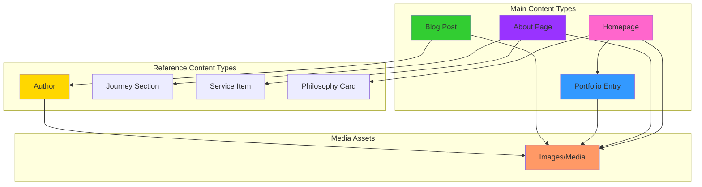
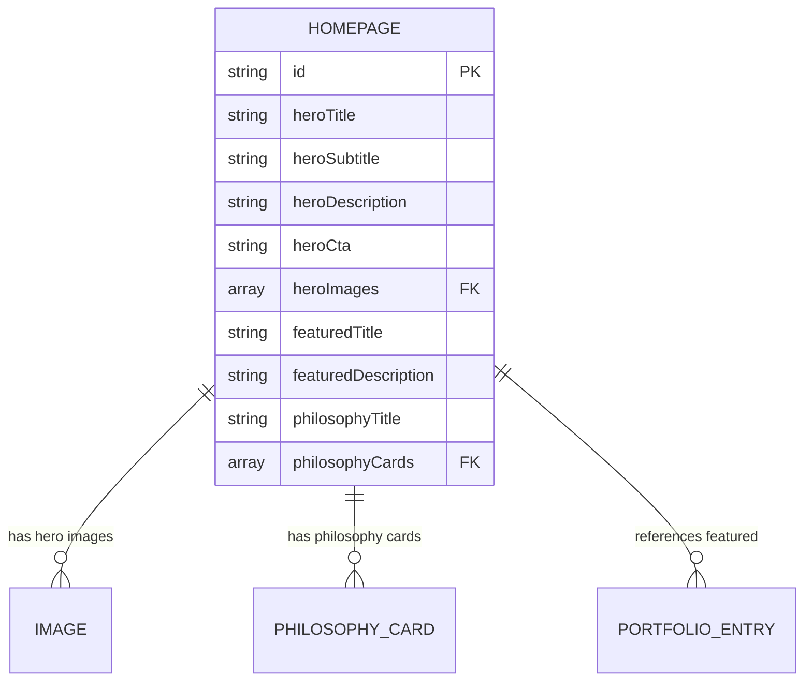
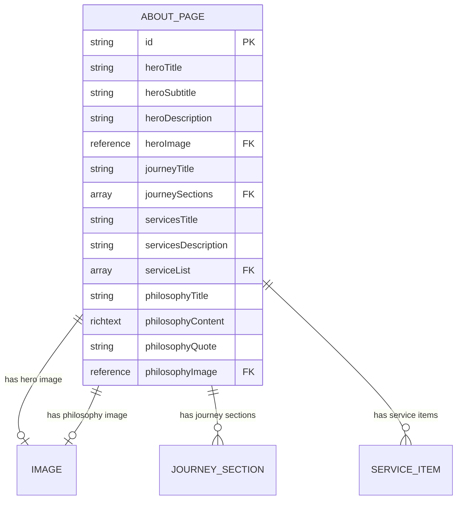
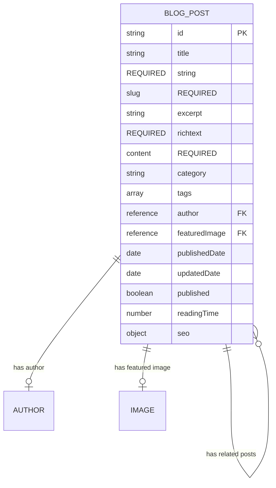
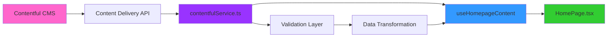
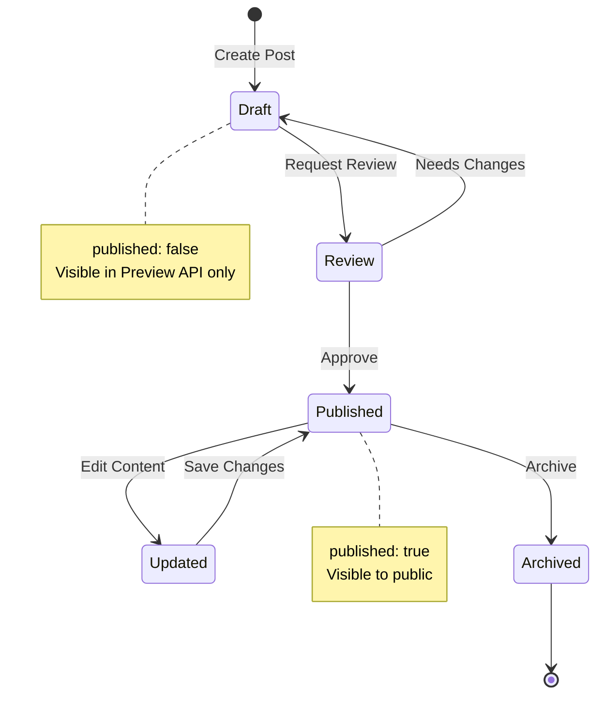
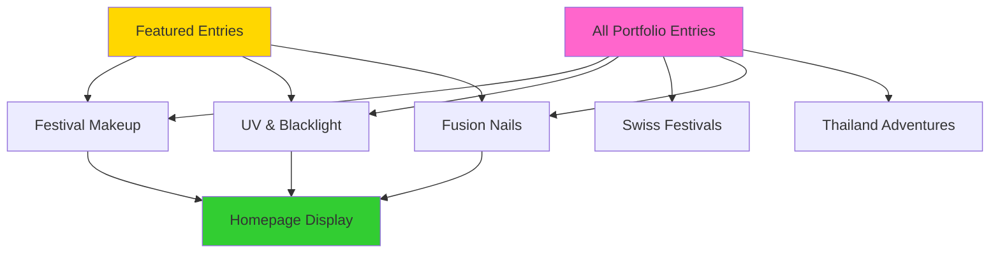
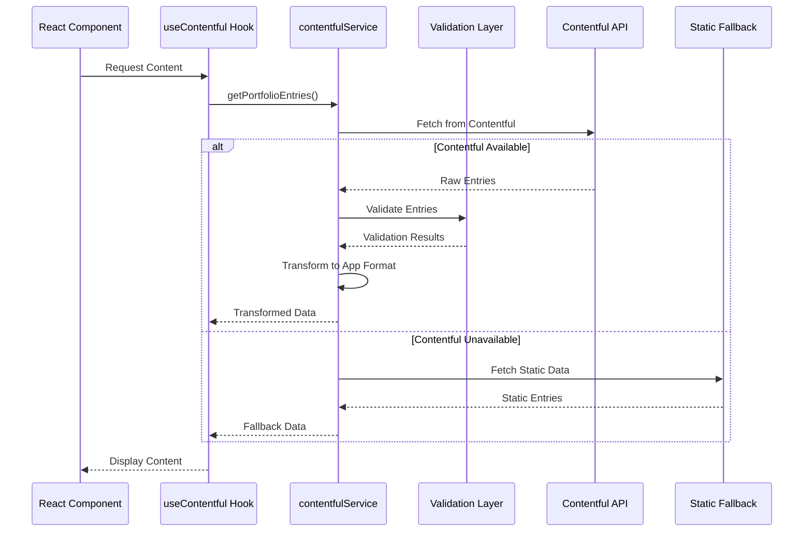
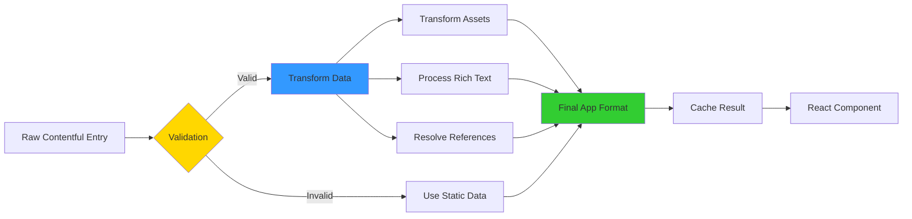

# 📊 Contentful Content Model - Visual Documentation

## Overview

Complete visual documentation of the Contentful CMS content model for Ash Shaw Makeup Portfolio, including content type relationships, field specifications, and data flow diagrams.

**Last Updated:** January 25, 2025  
**Version:** 1.0.0  
**Content Types:** 4 Main + 3 Reference Types

---

## 🎯 Content Model Architecture

### **High-Level Overview**



---

## 📋 Main Content Types

### **1. Homepage (`homepage`)**

Central content type for homepage dynamic content management.



#### **Field Specifications**

| Field | Type | Required | Default | Description |
|-------|------|----------|---------|-------------|
| `heroTitle` | Text | ❌ | "Hi, I'm Ash Shaw" | Main hero heading |
| `heroSubtitle` | Text | ❌ | "makeup artist" | Hero subheading |
| `heroDescription` | Text | ❌ | "" | Hero description text |
| `heroCta` | Text | ❌ | "Explore My Portfolio" | Call-to-action button text |
| `heroImages` | Media (Array) | ❌ | [] | Background hero images |
| `featuredTitle` | Text | ❌ | "Featured Work" | Featured section heading |
| `featuredDescription` | Text | ❌ | "" | Featured section description |
| `philosophyTitle` | Text | ❌ | "Why I Do Makeup" | Philosophy section heading |
| `philosophyCards` | Reference (Array) | ❌ | [] | Philosophy card entries |

#### **Validation Rules**
- All fields optional with sensible defaults
- `heroImages` should be array of Contentful media assets
- `philosophyCards` references separate content entries

#### **Usage in Application**
```typescript
const homepage = await getHomepageContent();
// Used in: HomePage.tsx, HeroLayout.tsx, WhySection.tsx
```

---

### **2. About Page (`aboutPage`)**

Content type for About page sections and journey information.



#### **Field Specifications**

**Hero Section:**
| Field | Type | Required | Default | Description |
|-------|------|----------|---------|-------------|
| `heroTitle` | Text | ❌ | "About Ash Shaw" | Page main heading |
| `heroSubtitle` | Text | ❌ | "makeup artist" | Page subheading |
| `heroDescription` | Text | ❌ | "" | Introduction text |
| `heroImage` | Media | ❌ | null | Hero section image |

**Journey Section:**
| Field | Type | Required | Default | Description |
|-------|------|----------|---------|-------------|
| `journeyTitle` | Text | ❌ | "My Journey" | Journey section heading |
| `journeySections` | Reference (Array) | ❌ | [] | Timeline sections |

**Services Section:**
| Field | Type | Required | Default | Description |
|-------|------|----------|---------|-------------|
| `servicesTitle` | Text | ❌ | "What I Do" | Services heading |
| `servicesDescription` | Text | ❌ | "" | Services description |
| `serviceList` | Reference (Array) | ❌ | [] | Service items |

**Philosophy Section:**
| Field | Type | Required | Default | Description |
|-------|------|----------|---------|-------------|
| `philosophyTitle` | Text | ❌ | "My Approach" | Philosophy heading |
| `philosophyContent` | Rich Text | ❌ | "" | Philosophy content |
| `philosophyQuote` | Text | ❌ | "" | Inspirational quote |
| `philosophyImage` | Media | ❌ | null | Philosophy section image |

#### **Validation Rules**
- All fields optional with defaults
- `journeySections` and `serviceList` should reference separate entries
- `philosophyContent` supports rich text formatting

#### **Usage in Application**
```typescript
const aboutContent = await getAboutPageContent();
// Used in: AboutPage.tsx
```

---

### **3. Portfolio Entry (`portfolioEntry`)**

Content type for individual portfolio pieces with image galleries.

```mermaid
erDiagram
    PORTFOLIO_ENTRY {
        string id PK
        string title REQUIRED
        string description REQUIRED
        string category REQUIRED
        richtext detailedDescription
        array images FK
        reference featuredImage FK
        array tags
        date createdDate
        boolean featured
        number displayOrder
        object seo
    }
    
    PORTFOLIO_ENTRY ||--o{ IMAGE : "has gallery images"
    PORTFOLIO_ENTRY ||--o| IMAGE : "has featured image"
```

#### **Field Specifications**

| Field | Type | Required | Default | Validation |
|-------|------|----------|---------|------------|
| `title` | Text | ✅ | - | Non-empty string |
| `description` | Text | ✅ | - | Brief description |
| `category` | Text | ✅ | - | Must be valid category |
| `detailedDescription` | Rich Text | ❌ | "" | Extended content |
| `images` | Media (Array) | ❌ | [] | Gallery images (warns if empty) |
| `featuredImage` | Media | ❌ | null | Card preview image |
| `tags` | Text (Array) | ❌ | [] | Searchable tags |
| `createdDate` | Date | ❌ | sys.createdAt | Work creation date |
| `featured` | Boolean | ❌ | false | Show on homepage |
| `displayOrder` | Number | ❌ | 0 | Sort order |
| `seo` | Object | ❌ | null | SEO metadata |

#### **Valid Categories**
```typescript
const VALID_CATEGORIES = [
  'Festival Makeup',
  'UV Makeup',
  'Swiss Festivals',
  'Fusion Nails',
  'Thailand Adventures',
];
```

#### **SEO Object Structure**
```typescript
{
  metaTitle?: string;
  metaDescription?: string;
  keywords?: string[];
}
```

#### **Validation Rules**
- `title`, `description`, `category` are required
- Warns if `images` array is empty
- `featured` entries appear on homepage
- `displayOrder` controls sort sequence

#### **Usage in Application**
```typescript
const entries = await getPortfolioEntries({ category: 'Festival Makeup' });
// Used in: PortfolioMainPage.tsx, PortfolioDetailPage.tsx, FeaturedSection.tsx
```

---

### **4. Blog Post (`blogPost`)**

Content type for blog articles with rich content and metadata.



#### **Field Specifications**

| Field | Type | Required | Default | Validation |
|-------|------|----------|---------|------------|
| `title` | Text | ✅ | - | Non-empty string |
| `slug` | Symbol | ✅ | - | Unique URL identifier |
| `excerpt` | Text | ✅ | - | Brief summary |
| `content` | Rich Text | ✅ | - | Full article content |
| `category` | Text | ❌ | "general" | Content category |
| `tags` | Text (Array) | ❌ | [] | Topic tags |
| `author` | Reference | ❌ | null | Author entry |
| `featuredImage` | Media | ❌ | null | Social share image |
| `publishedDate` | Date | ❌ | sys.createdAt | Publication date |
| `updatedDate` | Date | ❌ | sys.updatedAt | Last modified date |
| `published` | Boolean | ❌ | false | Published/draft state |
| `readingTime` | Number | ❌ | auto-calculated | Minutes to read |
| `seo` | Object | ❌ | null | SEO metadata |

#### **SEO Object Structure**
```typescript
{
  metaTitle?: string;
  metaDescription?: string;
  keywords?: string[];
  socialImage?: ContentfulImage;
}
```

#### **Validation Rules**
- `title`, `slug`, `excerpt`, `content` are required
- `slug` must be unique across all posts
- `published: true` required for public visibility
- `readingTime` auto-calculated if not provided

#### **Usage in Application**
```typescript
const blogData = await getBlogPosts({ 
  category: 'tutorials', 
  page: 1, 
  limit: 6 
});
// Used in: BlogPage.tsx, BlogPostPage.tsx, BlogPreviewSection.tsx
```

---

## 🔗 Reference Content Types

### **Author (`author`)**

Referenced by blog posts for author information.

```mermaid
erDiagram
    AUTHOR {
        string id PK
        string name REQUIRED
        string bio
        reference avatar FK
        string email
        array socialLinks
    }
    
    AUTHOR ||--o| IMAGE : "has avatar"
```

| Field | Type | Required | Default |
|-------|------|----------|---------|
| `name` | Text | ✅ | - |
| `bio` | Text | ❌ | "" |
| `avatar` | Media | ❌ | null |
| `email` | Text | ❌ | "" |
| `socialLinks` | Text (Array) | ❌ | [] |

---

### **Journey Section (`journeySection`)**

Referenced by About Page for timeline sections.

```mermaid
erDiagram
    JOURNEY_SECTION {
        string id PK
        string year REQUIRED
        string title REQUIRED
        text description REQUIRED
        reference image FK
    }
    
    JOURNEY_SECTION ||--o| IMAGE : "has section image"
```

| Field | Type | Required | Default |
|-------|------|----------|---------|
| `year` | Text | ✅ | - |
| `title` | Text | ✅ | - |
| `description` | Text | ✅ | - |
| `image` | Media | ❌ | null |

---

### **Service Item (`serviceItem`)**

Referenced by About Page for service offerings.

| Field | Type | Required | Default |
|-------|------|----------|---------|
| `name` | Text | ✅ | - |
| `description` | Text | ✅ | - |
| `icon` | Text | ❌ | "" |

---

### **Philosophy Card (`philosophyCard`)**

Referenced by Homepage for "Why I Do Makeup" section.

| Field | Type | Required | Default |
|-------|------|----------|---------|
| `title` | Text | ✅ | - |
| `description` | Text | ✅ | - |
| `icon` | Text | ❌ | "" |

---

## 🔄 Content Flow & Relationships

### **Homepage Content Flow**



### **Blog Post Lifecycle**



### **Portfolio Entry Organization**



---

## 📊 Data Transformation Pipeline

### **Content Fetch → Display Pipeline**



### **Content Type Transformation**



---

## 🎨 Field Type Reference

### **Text Fields**

```typescript
// Short Text (Symbol)
slug: string; // 256 character limit, URL-safe

// Long Text
description: string; // Multi-line, plain text

// Rich Text
content: Document; // Formatted content with embedded assets
```

### **Media Fields**

```typescript
// Single Media
featuredImage: Asset; // Image, video, or file

// Media Array
images: Asset[]; // Gallery of media assets
```

### **Reference Fields**

```typescript
// Single Reference
author: Entry<Author>; // Links to another content entry

// Reference Array
journeySections: Entry<JourneySection>[]; // Multiple linked entries
```

### **Boolean & Number Fields**

```typescript
// Boolean
published: boolean; // true/false state
featured: boolean; // Display toggle

// Number
displayOrder: number; // Sort sequence
readingTime: number; // Calculated minutes
```

### **Date Fields**

```typescript
// Date/Time
publishedDate: string; // ISO 8601 format
createdDate: string; // Timestamp

// Example: "2024-03-15T10:00:00Z"
```

---

## 🔍 Content Model Best Practices

### **1. Content Organization**

✅ **DO:**
- Use clear, descriptive field names
- Group related fields logically
- Set appropriate field requirements
- Provide helpful field descriptions

❌ **DON'T:**
- Create deeply nested structures
- Use ambiguous field names
- Make everything required
- Skip field validation

### **2. Media Management**

✅ **DO:**
- Use descriptive asset titles
- Add alt text for accessibility
- Optimize images before upload
- Use appropriate image formats

❌ **DON'T:**
- Upload huge unoptimized images
- Skip alt text descriptions
- Use generic filenames
- Forget image dimensions

### **3. Content Relationships**

✅ **DO:**
- Use references for reusable content
- Limit circular references
- Document relationship purposes
- Plan for content reuse

❌ **DON'T:**
- Duplicate content across entries
- Create overly complex relationships
- Reference deleted entries
- Ignore relationship limits

### **4. SEO Optimization**

✅ **DO:**
- Provide unique meta titles
- Write compelling descriptions
- Use relevant keywords
- Add social sharing images

❌ **DON'T:**
- Duplicate meta descriptions
- Stuff keywords
- Exceed character limits
- Use generic placeholders

---

## 📈 Content Model Statistics

### **Current Implementation**

| Metric | Count | Notes |
|--------|-------|-------|
| **Main Content Types** | 4 | Homepage, About, Portfolio, Blog |
| **Reference Types** | 4 | Author, Journey, Service, Philosophy |
| **Total Fields** | 60+ | Across all content types |
| **Required Fields** | 8 | Critical validation points |
| **Optional Fields** | 52+ | Flexibility with defaults |
| **Media Fields** | 12 | Images and assets |
| **Rich Text Fields** | 4 | Formatted content |
| **Reference Fields** | 8 | Content relationships |

### **Validation Coverage**

```
✅ Blog Posts:        100% validated (4 required, 8 optional)
✅ Portfolio Entries: 100% validated (3 required, 9 optional)
✅ About Page:        100% validated (0 required, 15+ optional)
✅ Homepage:          100% validated (0 required, 10+ optional)
```

---

## 🚀 Migration Guide

### **Creating Content Types in Contentful**

1. **Navigate to Content Model** in Contentful web app
2. **Create Content Type** for each main type
3. **Add Fields** according to specifications above
4. **Configure Validation** rules for required fields
5. **Set Appearance** options for better UX
6. **Test with Sample Content** before going live

### **Content Type Creation Order**

```
1. Author (no dependencies)
2. Journey Section (no dependencies)
3. Service Item (no dependencies)
4. Philosophy Card (no dependencies)
5. Portfolio Entry (references images)
6. Blog Post (references Author + images)
7. About Page (references Journey + Service)
8. Homepage (references Philosophy Cards + Portfolio)
```

---

## 📚 Additional Resources

- **Contentful Documentation:** https://www.contentful.com/developers/docs/
- **Content Modeling Guide:** https://www.contentful.com/developers/docs/concepts/data-model/
- **API Reference:** https://www.contentful.com/developers/docs/references/content-delivery-api/
- **Migration Tools:** https://github.com/contentful/contentful-migration

---

## ✨ Summary

This content model provides:

✅ **4 main content types** for complete site management  
✅ **4 reference types** for modular content reuse  
✅ **Flexible field structure** with sensible defaults  
✅ **Rich media support** with optimization  
✅ **SEO optimization** built-in  
✅ **Validation rules** for data integrity  
✅ **Clear relationships** between content types  
✅ **Static fallbacks** for development  

The content model is designed for flexibility, scalability, and ease of use while maintaining data integrity through comprehensive validation.

---

**Last Updated:** January 25, 2025  
**Maintained by:** Ash Shaw Portfolio Team  
**Version:** 1.0.0
