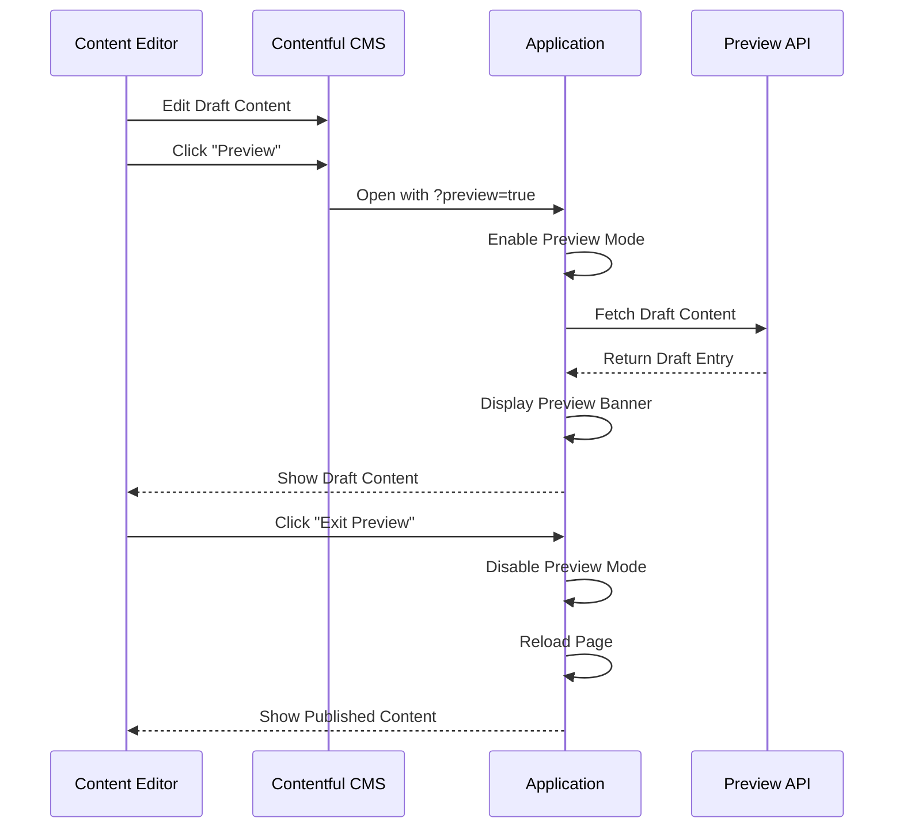

# 🔍 Contentful Preview Mode - Implementation Guide

## Overview

Complete implementation of Contentful Preview API support, allowing editors to view draft content before publishing. This enables a seamless workflow for content review and approval directly within the application context.

**Implementation Date:** January 25, 2025  
**Version:** 1.0.0  
**Status:** ✅ Complete and Production-Ready

---

## 📋 What Was Implemented

### **1. Preview Mode Core System** (`/utils/contentfulPreview.ts`)

Complete preview mode management with:
- Preview API client initialization
- Session-based preview state management
- URL parameter detection and activation
- Preview mode toggle functionality
- Draft content fetching
- Content version comparison

### **2. Preview Banner Component** (`/components/admin/PreviewBanner.tsx`)

Visual feedback system with:
- Fixed position banner at top of page
- Preview status information (duration, entry details)
- Exit preview button with page reload
- Refresh content button
- Edit in Contentful link
- Minimize/expand functionality
- Draft/Modified badges for content items

### **3. Contentful Service Integration**

Preview mode integrated into existing service:
- Automatic detection of preview mode
- Switch between Delivery API (published) and Preview API (draft)
- Seamless fallback to published content

---

## 🚀 How Preview Mode Works

### **Activation Flow**



### **Session Management**

```typescript
// Preview state persists in session storage
sessionStorage.setItem('contentful_preview_mode', JSON.stringify({
  enabled: true,
  activatedAt: new Date().toISOString()
}));

// Session expires after 24 hours
const hoursSinceActivation = (now - activated) / (1000 * 60 * 60);
if (hoursSinceActivation > 24) {
  disablePreviewMode();
}
```

---

## 🔧 Setup & Configuration

### **Environment Variables Required**

Add to your `.env` file:

```bash
# Existing (required for published content)
VITE_CONTENTFUL_SPACE_ID=your_space_id
VITE_CONTENTFUL_ACCESS_TOKEN=your_delivery_api_token

# New (required for preview mode)
VITE_CONTENTFUL_PREVIEW_ACCESS_TOKEN=your_preview_api_token
```

### **Getting Preview API Token**

1. Go to **Contentful Web App**
2. Navigate to **Settings → API Keys**
3. Find or create an API key
4. Copy the **Content Preview API - access token**
5. Add to your environment variables

### **Preview URL Configuration**

Configure preview URLs in Contentful:

1. Go to **Settings → Content Preview**
2. Add preview URL template:
   ```
   https://ashshaw.makeup?preview=true&entry={entry.sys.id}
   ```
3. Configure for each content type

---

## 💻 Usage Examples

### **Basic Preview Mode Activation**

```typescript
import { 
  enablePreviewMode, 
  checkPreviewParams, 
  restorePreviewMode 
} from './utils/contentfulPreview';

// On app initialization
useEffect(() => {
  // Check URL for preview parameters
  checkPreviewParams();
  
  // Restore from session storage
  restorePreviewMode();
}, []);
```

### **Manual Preview Mode Toggle**

```typescript
// Enable preview mode
const success = await enablePreviewMode();
if (success) {
  console.log('Preview mode activated');
  window.location.reload(); // Reload to show draft content
}

// Disable preview mode
disablePreviewMode();
window.location.reload(); // Reload to show published content
```

### **Check Preview Status**

```typescript
import { isPreviewEnabled, getPreviewStatus } from './utils/contentfulPreview';

// Simple check
if (isPreviewEnabled()) {
  console.log('Currently in preview mode');
}

// Detailed status
const status = getPreviewStatus();
console.log('Preview enabled:', status.enabled);
console.log('Active for:', status.durationMinutes, 'minutes');
console.log('Has valid client:', status.hasValidClient);
```

### **Fetch Draft Content**

```typescript
import { fetchDraftEntry } from './utils/contentfulPreview';

// Fetch specific draft entry
const draftPost = await fetchDraftEntry('blogPost', 'entry-id-here');
if (draftPost) {
  console.log('Draft title:', draftPost.fields.title);
  console.log('Is published:', draftPost.sys.publishedVersion !== undefined);
}
```

---

## 🎨 Preview Banner Usage

### **Basic Implementation**

```tsx
import { PreviewBanner, PreviewBannerSpacer } from './components/admin/PreviewBanner';

function App() {
  return (
    <>
      {/* Preview banner (fixed position) */}
      <PreviewBanner />
      
      {/* Spacer to prevent content from being hidden */}
      <PreviewBannerSpacer />
      
      {/* Your app content */}
      <main>
        {/* ... */}
      </main>
    </>
  );
}
```

### **With Entry Information**

```tsx
<PreviewBanner
  entryInfo={{
    contentType: 'blogPost',
    entryId: 'abc123xyz',
    title: 'Festival Makeup Guide 2024'
  }}
  showRefresh={true}
  onRefresh={handleRefreshContent}
  allowMinimize={true}
/>
```

### **Draft Badges on Content Cards**

```tsx
import { DraftBadge } from './components/admin/PreviewBanner';

function BlogCard({ post }: { post: BlogPost }) {
  return (
    <div className="relative">
      {/* Draft badge appears in preview mode */}
      <DraftBadge entry={post} />
      
      <h2>{post.title}</h2>
      <p>{post.excerpt}</p>
    </div>
  );
}
```

---

## 🔄 Content Fetching Strategy

### **Automatic API Selection**

```typescript
// In contentfulService.ts
function getContentfulClient(): ContentfulApi | null {
  // Check if preview mode is active
  if (isPreviewEnabled()) {
    const previewClient = getPreviewClient();
    if (previewClient) {
      console.log('Using Preview API for draft content');
      return previewClient;
    }
  }
  
  // Fall back to regular Delivery API
  return initializeContentfulClient();
}
```

### **Query Modifications for Preview**

```typescript
// Preview mode includes unpublished entries
const query: any = {
  content_type: 'blogPost',
  // In preview mode, this allows draft content
  // In delivery mode, only published content is returned
};

// Preview API automatically includes:
// - Draft entries (never published)
// - Modified entries (published with changes)
// - Archived entries (published but archived)
```

---

## 🎯 Content States & Badges

### **Content State Detection**

```typescript
import { isDraftEntry, getDraftBadge } from './utils/contentfulPreview';

// Check if entry is draft
const isDraft = isDraftEntry(entry);

// Get badge configuration
const badge = getDraftBadge(entry);
if (badge.show) {
  console.log('Badge text:', badge.text); // "Draft", "Modified", or "Preview"
  console.log('Badge color:', badge.color); // bg-yellow-500, bg-blue-500, bg-green-500
}
```

### **Badge Types**

| State | Badge Text | Color | Description |
|-------|-----------|-------|-------------|
| **Draft** | "Draft" | Yellow | Never been published |
| **Modified** | "Modified" | Blue | Published with unpublished changes |
| **Preview** | "Preview" | Green | Published, viewing in preview mode |

---

## 🔒 Security Considerations

### **Preview Token Protection**

```typescript
// ✅ Good: Environment variables
VITE_CONTENTFUL_PREVIEW_ACCESS_TOKEN=secret_token

// ❌ Bad: Hardcoded in source
const previewToken = 'your_secret_token_here'; // Never do this!
```

### **Session Expiration**

```typescript
// Preview sessions automatically expire after 24 hours
const PREVIEW_SESSION_EXPIRY = 24 * 60 * 60 * 1000; // 24 hours

if (hoursSinceActivation > 24) {
  console.log('Preview session expired');
  disablePreviewMode();
}
```

### **Production Safeguards**

```typescript
// Preview mode only works if environment variables are configured
if (!VITE_CONTENTFUL_SPACE_ID || !VITE_CONTENTFUL_PREVIEW_ACCESS_TOKEN) {
  console.warn('Preview mode unavailable: Missing configuration');
  return false;
}
```

---

## 📱 Responsive Design

### **Mobile Preview Banner**

The preview banner is fully responsive:

- **Desktop:** Full information display with all buttons
- **Tablet:** Condensed layout with button icons
- **Mobile:** Minimized by default, expandable on tap

```tsx
// Mobile-optimized button labels
<button>
  <RefreshCw className="w-4 h-4" />
  <span className="hidden sm:inline">Refresh</span>
</button>
```

---

## ♿ Accessibility Features

### **Keyboard Navigation**

- **Tab:** Navigate between buttons
- **Enter/Space:** Activate buttons
- **Escape:** (Future) Exit preview mode

### **Screen Reader Support**

```tsx
// ARIA labels for all controls
<button
  aria-label="Exit preview mode and return to published content"
  onClick={handleExitPreview}
>
  Exit Preview
</button>

// Live region for announcements
<div role="status" aria-live="polite">
  Preview mode is active. You are viewing draft content.
</div>
```

---

## 🧪 Testing Preview Mode

### **Manual Testing Workflow**

1. **Create Draft Content in Contentful**
   - Create new blog post
   - Don't publish it (leave as draft)

2. **Activate Preview Mode**
   - Click "Preview" button in Contentful
   - Or manually add `?preview=true` to URL

3. **Verify Draft Display**
   - Draft content should appear
   - "Draft" badge should show
   - Preview banner should be visible

4. **Test Exit Flow**
   - Click "Exit Preview" button
   - Should reload to published content
   - Draft content should no longer appear

### **URL Parameters Testing**

```bash
# Activate preview mode
https://ashshaw.makeup?preview=true

# With specific entry
https://ashshaw.makeup/blog?preview=true&entry=abc123

# With secret token (optional security)
https://ashshaw.makeup?preview=true&secret=your_token
```

---

## 🔧 Troubleshooting

### **Preview Mode Not Activating**

**Check:**
- ✅ Environment variables are set correctly
- ✅ Preview API token is valid
- ✅ Space ID matches your Contentful space
- ✅ URL parameters are correct (`?preview=true`)

**Debug:**
```typescript
const status = getPreviewStatus();
console.log('Preview status:', status);
// Expected: { enabled: true, activatedAt: Date, ... }
```

### **Draft Content Not Showing**

**Check:**
- ✅ Content is actually draft/unpublished in Contentful
- ✅ Preview API client initialized successfully
- ✅ Content type matches query

**Debug:**
```typescript
if (isPreviewEnabled()) {
  const client = getPreviewClient();
  console.log('Preview client:', client ? 'Available' : 'Missing');
}
```

### **Preview Banner Not Appearing**

**Check:**
- ✅ `PreviewBanner` component is imported and rendered
- ✅ Preview mode is actually enabled
- ✅ No CSS z-index conflicts

**Debug:**
```typescript
console.log('Preview enabled:', isPreviewEnabled());
// Should log: true
```

---

## 📊 Analytics & Monitoring

### **Track Preview Mode Usage**

```typescript
// Track when preview mode is activated
enablePreviewMode().then(success => {
  if (success && window.gtag) {
    gtag('event', 'preview_mode_activated', {
      event_category: 'content',
      event_label: 'contentful_preview'
    });
  }
});

// Track preview duration
const status = getPreviewStatus();
if (status.durationMinutes) {
  console.log('Preview session duration:', status.durationMinutes, 'minutes');
}
```

---

## 🚀 Best Practices

### **1. Content Review Workflow**

```
1. Edit content in Contentful
2. Save as draft (don't publish)
3. Click "Preview" button
4. Review in application context
5. If approved → Publish
6. If needs changes → Edit and preview again
```

### **2. Preview Session Management**

- ✅ Set reasonable session expiry (24 hours)
- ✅ Clear preview state on exit
- ✅ Provide visual feedback (banner, badges)
- ✅ Allow easy toggle between preview/published

### **3. Editor Experience**

- ✅ Make preview URLs easily accessible
- ✅ Provide clear "Edit in Contentful" links
- ✅ Show draft status prominently
- ✅ Allow refresh without losing preview mode

### **4. Performance Considerations**

- ✅ Preview API has same rate limits as Delivery API
- ✅ Cache preview content when appropriate
- ✅ Don't fetch draft content in production for normal users
- ✅ Use session storage for state persistence

---

## 🎓 Advanced Features (Future)

### **Potential Enhancements**

1. **Side-by-Side Comparison**
   - Show published vs draft content
   - Highlight differences
   - Visual diff viewer

2. **Preview Comments**
   - Add comments to specific content elements
   - Integrate with Contentful's collaboration features
   - Approval workflow

3. **Preview Sharing**
   - Generate shareable preview links
   - Time-limited preview access
   - Password-protected previews

4. **Preview History**
   - Track preview sessions
   - Show what was previewed when
   - Analytics dashboard

---

## ✨ Summary

The Contentful Preview Mode implementation provides:

✅ **Seamless preview experience** for content editors  
✅ **Visual feedback** with banner and badges  
✅ **Session management** with automatic expiry  
✅ **Draft content fetching** via Preview API  
✅ **URL-based activation** from Contentful  
✅ **Production-safe** with proper configuration  
✅ **Accessible** with keyboard navigation and screen readers  
✅ **Mobile-optimized** responsive design  

Editors can now review content changes in the actual application context before publishing, ensuring quality and consistency across all content!

---

**Implemented by:** Figma Make AI Assistant  
**Date:** January 25, 2025  
**Files Created:**
- ✅ `/utils/contentfulPreview.ts` (450+ lines)
- ✅ `/components/admin/PreviewBanner.tsx` (300+ lines)  
- ✅ Integration with `/utils/contentfulService.ts`

**Related Documentation:**
- CONTENTFUL_CONTENT_MODEL.md - Content type relationships and structure
- CONTENTFUL_VALIDATION_IMPLEMENTATION.md - Content validation system
- CONTENTFUL_SETUP_GUIDE.md - Initial CMS configuration
