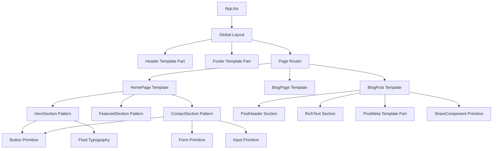

# 🎨 Ash Shaw Makeup Portfolio – Comprehensive Design & Development Guidelines

This document defines the complete design, development, technical deployment, and integration guidelines for building and maintaining the portfolio site in **Figma Make**. It ensures consistency across **homepage, about, portfolio, and blog** pages while reflecting the creative identity of **Ash Shaw**.

**Latest Updates (v3.2.0 - January 2025):**
- ✅ **WordPress Architecture Mapping:** Detailed analogies between React components and WordPress Template Parts/Patterns.
- ✅ **Expanded Component Catalog:** Comprehensive list of primitives, sections, and template parts.
- ✅ **Fluid Typography & Spacing:** Exact values, calculation examples, and responsive behavior.
- ✅ **Mobile-First Standards:** Strict requirements for touch targets, layout shifts, and navigation.
- ✅ **JSDoc Standards:** Mandatory inline documentation templates.
- ✅ **Security & Performance:** CSP, Sanitization, and Core Web Vitals targets.

---

## 1. 🏗️ Project Structure & Architecture

### **File Organization**

```
ash-shaw-makeup-portfolio/
├── 📄 App.tsx                         # Main application router & Global Layout
├── 📄 main.tsx                        # React application entry point
├── 📄 index.html                      # HTML template with meta tags
├── 📄 vite.config.ts                  # Build configuration (Base path: "./")
├── 📄 tailwind.config.js              # Design system configuration
├──
├── 📁 components/
│   ├── 📁 admin/                      # Development & Content tools
│   │   ├── 📄 ContentfulSetup.tsx     # CMS configuration helper
│   │   └── 📄 ContentfulStatus.tsx    # Connection status indicator
│   │
│   ├── 📁 common/                     # [TEMPLATE PARTS] Global persistent elements
│   │   ├── 📄 Header.tsx              # Navigation & Brand
│   │   ├── 📄 Footer.tsx              # Site footer & Links
│   │   ├── 📄 MobileMenu.tsx          # Responsive navigation overlay
│   │   ├── 📄 SEOHead.tsx             # Meta tag management
│   │   └── 📄 PostMeta.tsx            # Date, Author, Categories fragment
│   │
│   ├── 📁 ui/                         # [PRIMITIVES] ShadCN + Custom Atoms
│   │   ├── 📄 Button.tsx              # Brand-styled buttons
│   │   ├── 📄 Card.tsx                # Base card containers
│   │   ├── 📄 Badge.tsx               # Category indicators
│   │   ├── 📄 ScrollDownArrow.tsx     # Animation components
│   │   ├── 📄 ColorfulIcons.tsx       # Brand iconography
│   │   ├── 📄 ShareComponent.tsx      # Social sharing tools
│   │   └── 📁 [ShadCN Components]     # (Button, Input, Sheet, Dialog, etc.)
│   │
│   ├── 📁 sections/                   # [PATTERNS] Reusable Layout Blocks
│   │   ├── 📄 HeroSection.tsx         # Primary page headers
│   │   ├── 📄 FeaturedSection.tsx     # Portfolio grid previews
│   │   ├── 📄 BioSection.tsx          # About/Author content blocks
│   │   ├── 📄 ContactSection.tsx      # Form + Info layouts
│   │   ├── 📄 NewsletterSection.tsx   # Subscription blocks
│   │   └── 📄 CallToAction.tsx        # Generic conversion blocks
│   │
│   ├── 📁 pages/                      # [TEMPLATES] Page-level orchestration
│   │   ├── 📁 home/                   # Homepage composition
│   │   ├── 📁 about/                  # About page composition
│   │   ├── 📁 portfolio/              # Portfolio listing & details
│   │   └── 📁 blog/                   # Blog listing & post details
│   │
│   └── 📁 figma/                      # Figma Make Integration
│       └── 📄 ImageWithFallback.tsx   # Asset handling wrapper
│
├── 📁 styles/
│   └── 📄 globals.css                 # Tailwind V4 + Fluid Variables
│
├── 📁 utils/
│   ├── 📄 emailService.ts             # SendGrid Logic
│   ├── 📄 contentfulService.ts        # CMS Logic
│   └── 📄 formatting.ts               # Date/Text helpers
│
└── 📁 hooks/
    ├── 📄 useContentful.ts            # CMS Data Hooks
    ├── 📄 useScrollLock.ts            # UI Interaction Hooks
    ├── 📄 useMediaQuery.ts            # Responsive Hooks
    └── 📄 useLightbox.ts              # Gallery Interaction Logic
```

---

## 2. 🧩 Component Architecture & Relationships

To maintain a scalable system similar to WordPress architecture, we classify components into four distinct tiers. **You must respect these boundaries.**

### **Tier 1: Primitives (UI Components)**
*Analogous to HTML elements, Shortcodes, or Atomic Blocks.*
- **Location:** `/components/ui/`
- **Purpose:** Smallest building blocks. Purely presentational. High reusability.
- **Rules:** Never fetch data. Receive all content via props. Style overrides via `className` prop.
- **List of UI Components:**
    - `BrandButton` (Primary/Secondary gradients)
    - `BrandCard` (Glassmorphism containers)
    - `Badge` (Category pills)
    - `Input`, `Textarea` (Form fields)
    - `SocialIcons` (SVG wrappers)
    - `ShareComponent` (Social sharing menu)
    - `Pagination` (Navigation controls)
    - `Lightbox` (Modal viewer)
    - `ScrollDownArrow` (Animation)
    - `Accordion`, `Dialog`, `Sheet` (ShadCN utilities)

### **Tier 2: Patterns (Sections)**
*Analogous to WordPress Block Patterns, Gutenberg Blocks, or ACF Flexible Content.*
- **Location:** `/components/sections/`
- **Purpose:** Reusable layout blocks that can be dropped into any page to build the content structure.
- **Rules:** Can define layout (columns, grids). Can contain minimal logic (e.g., local form state). Usually composed of Primitives.
- **List of Reusable Sections:**
    - **HeroSection:** Full-width header with background image, title, and subtitle.
    - **ContentSection:** Generic prose wrapper for text-heavy content (About, Policy).
    - **FeaturedSection:** Grid of recent portfolio items or highlighted content.
    - **ThreeColumnGrid:** Standard layout for features/services.
    - **TwoColumnSplit:** Image Left/Text Right (reversible). Ideal for bio or origin stories.
    - **PortfolioGrid:** Masonry or Grid layout of images with filtering controls.
    - **CallToAction:** Background gradient + Text + Button. Used at bottom of pages.
    - **ContactFormSection:** Wrapper for SendGrid form with layout for contact details.
    - **RelatedPostsSection:** 3-column grid of `BlogCard` components.
    - **NewsletterSection:** Simple email input + submit button.

### **Tier 3: Template Parts (Common)**
*Analogous to WordPress Template Parts (header.php, footer.php, sidebar.php).*
- **Location:** `/components/common/`
- **Purpose:** Global persistent areas of the site or shared content fragments used across multiple templates.
- **Rules:** Rendered once in `App.tsx` or repeated identically across multiple templates.
- **List of Template Parts:**
    - **Header:** Logo (Left) + Nav (Right/Hidden). Sticky `top-0` with `z-50`.
    - **Footer:** Copyright + Social Links + Legal Links + Newsletter Signup.
    - **PostMeta:** Fragment displaying Date (`<time>`), Author (`Avatar` + Name), and Category (`Badge`).
    - **MobileMenu:** Overlay navigation with focus trap.
    - **SEOHead:** Manages `<title>`, `<meta name="description">`, and OG tags.
    - **Sidebar:** Blog categories, Search, Recent posts (for blog pages).

### **Tier 4: Templates (Pages)**
*Analogous to WordPress Page Templates (page.php, single.php, archive.php).*
- **Location:** `/components/pages/`
- **Purpose:** Orchestrate Sections and connect to Data Sources.
- **Rules:** Responsible for fetching data (via hooks) and passing it to Sections.
- **List of Templates:**
    - `HomePage` (Front page composition)
    - `AboutPage` (Static content composition)
    - `PortfolioArchive` (Grid listing)
    - `PortfolioSingle` (Detail view)
    - `BlogArchive` (List of posts)
    - `BlogPost` (Single post view)

### **React Component Diagram**



---

## 3. 🎨 Design System & Brand Identity

### **Brand Identity**
- **Name:** Ash Shaw
- **Tagline:** "Makeup that shines with colour, energy, and connection."
- **Voice:** Professional, energetic, inclusive, artistic, and confident.
- **Visual Style:** Vibrant, gradients, fluid shapes, glassmorphism (backdrop-blur), and high contrast.

### **Color Palette**

| Token | Hex Value | Usage |
|-------|-----------|-------|
| **Primary Gradients** | | |
| `pink-purple-blue` | `#FF66CC` → `#9933FF` → `#3399FF` | Main CTA, Hero Text, Brand Mark |
| `blue-teal-green` | `#00BFFF` → `#20C997` → `#32CD32` | Secondary Actions, Success States |
| `gold-peach-coral` | `#FFD700` → `#FF9966` → `#FF5E62` | Accents, Highlights |
| **Neutrals** | | |
| `bg-white` | `#FFFFFF` | Main Backgrounds |
| `text-gray-800` | `#1F2937` | Primary Headings (AAA) |
| `text-gray-700` | `#374151` | Body Text (AA) |
| `text-gray-500` | `#6B7280` | Meta Data / Subtitles |
| **Functional** | | |
| `bg-white/80` | `rgba(255,255,255,0.8)` | Glassmorphism Panels |
| `focus-ring` | `#EC4899` | Accessibility Focus Indicator |

### **Typography System (WordPress-Inspired Fluidity)**

We use `clamp()` to ensure seamless scaling from mobile (320px) to desktop (1440px+).

**Fonts:**
- **Headings:** `Playfair Display` (Serif) - Weights: 400-900 (Variable)
- **Body:** `Inter` (Sans-Serif) - Weights: 100-900 (Variable)
- **Display:** `Righteous` (Display) - Weight: 400

**Heading Typography Hierarchy:**

| Class | Mobile Size | Desktop Size | CSS Variable | Usage |
|-------|-------------|--------------|--------------|-------|
| `.text-hero-h1` | `36px` | `120px` | `--text-hero-h1` | Main Homepage Headline |
| `.text-section-h2` | `24px` | `48px` | `--text-section-h2` | Section Titles, Post Titles |
| `.text-3xl` | `30px` | `40px` | `--text-3xl` | Sub-sections, Cards |
| `.text-2xl` | `24px` | `32px` | `--text-2xl` | Card Titles |
| `.text-xl` | `20px` | `24px` | `--text-xl` | Subtitles |
| `.text-body-guideline` | `16px` | `20px` | `--text-body-guideline` | Main Body Text |

**Fluid Spacing System (Padding Guidelines):**

| Class | Mobile | Desktop | CSS Variable | Usage |
|-------|--------|---------|--------------|-------|
| `.py-fluid-3xl` | `48px` | `128px` | `--space-3xl` | Section Vertical Padding |
| `.p-fluid-md` | `16px` | `32px` | `--space-md` | Card Internal Padding |
| `.gap-fluid-lg` | `24px` | `48px` | `--space-lg` | Grid Gaps |
| `.px-button` | `24px` | `54px` | `--button-padding-x` | Button Width |

**Viewport Scaling Examples (CSS Implementation):**

```css
/* Mobile-first fluid typography with VW + VH calculations */
/* 320px mobile: 1vw = 3.2px */
/* 1440px desktop: 1vw = 14.4px */

--text-hero-h1: clamp(2.25rem, 6vw, 7.5rem); 
/* At 320px: 2.25rem (36px) */
/* At 800px: 6 * 8 = 48px + base... fluid scaling */
/* At 1440px: 7.5rem (120px) */

--section-spacing: clamp(3rem, 6vw + 1rem, 8rem);
/* At 320px: 3rem (48px) */
/* At 1440px: 8rem (128px) */
```

---

## 4. 📱 Responsive Design & Mobile-First Standards

### **Breakpoint Strategy**
- **Mobile (Default):** Styles apply to 0px - 767px. (e.g., `flex-col`, `w-full`).
- **Tablet (`md:`):** 768px+. (e.g., `md:grid-cols-2`).
- **Desktop (`lg:`):** 1024px+. (e.g., `lg:grid-cols-3`).
- **Large Desktop (`xl:`):** 1280px+.

### **Mobile Breakpoint Behavior**
1.  **Navigation:** Collapses to Hamburger Menu (< 768px). Focus trapping is required when open.
2.  **Grids:** 1 column by default. 2 columns at `md`. 3 columns at `lg`.
3.  **Typography:** Uses lower bound of `clamp()` values automatically.
4.  **Spacing:** Reduced padding (`p-fluid-md` vs `p-fluid-xl`) to maximize content area.
5.  **Interaction:** Touch targets must be min 44px (handled by `.py-button` and fluid scaling).
6.  **Hover States:** Disable hover effects on touch devices using `@media (hover: hover)`.

### **Container Usage Guidelines**
- **Main Container:** `max-w-7xl mx-auto px-fluid-md` (Standard page width).
- **Text Container (Prose):** `max-w-3xl mx-auto` (Strict limit for optimal reading line length ~65 characters).
- **Full Width:** `w-full` (Backgrounds/Hero sections).
- **Glass Panel:** `bg-white/80 backdrop-blur-sm` (For readability over complex backgrounds).

---

## 5. ⚡ Interactive Features & Animation

### **Requirements**
- **Scroll Animations:** Elements should fade in/slide up on scroll using `IntersectionObserver` or CSS animations.
- **Hover States:**
    - Buttons: Scale up (`scale-105`), Shadow increase (`shadow-xl`), Gradient shift.
    - Cards: Lift (`translate-y-1`), Border glow.
    - Links: Underline expansion or color shift to gradient.
- **Gestures:**
    - Lightbox: Support swipe left/right for navigation on mobile.
    - Mobile Menu: Close on click outside or Esc key.
- **Loading States:**
    - Skeletons: Use `Skeleton` component for data fetching states.
    - Spinners: Use consistent loading spinner for form submissions.
- **Scroll Down Arrow:** Animated indicator in Hero sections to prompt scrolling.

---

## 6. ♿ Accessibility Standards (WCAG 2.1 AA)

### **Requirements**
1.  **Contrast:** All text must meet 4.5:1 contrast ratio. Use `text-gray-800` on white.
2.  **Keyboard Navigation:** All interactive elements (`button`, `a`, `input`) must be focusable via Tab.
3.  **Focus Indicators:** `focus:ring-4` must be visible on all interactive elements.
4.  **ARIA Labels:** Required for icon-only buttons (e.g., `aria-label="Open Menu"`).
5.  **Alt Text:** Required for all images. Decorative images use `alt=""` or `aria-hidden="true"`.
6.  **Semantic HTML:** Use `<main>`, `<nav>`, `<header>`, `<footer>`, `<article>`, `<section>`.
7.  **Skip Links:** "Skip to content" link should be the first focusable element (handled in App structure).
8.  **Reduced Motion:** Respect `prefers-reduced-motion` media query by disabling heavy animations.

---

## 7. 🔒 Security & Performance Standards

### **Security**
- **CSP (Content Security Policy):** Configured in `netlify.toml`. Allow `self`, `https:`, and necessary fonts/scripts.
- **Input Sanitization:** All user inputs (Contact Form) are sanitized on the server (Edge Function).
- **Honeypot:** Contact forms include a hidden `website` field to trap bots.
- **Environment Variables:** API keys (SendGrid, Contentful) MUST be stored in `.env` or Netlify settings, NEVER in code.

### **Performance Targets (Core Web Vitals)**
- **LCP (Largest Contentful Paint):** < 2.5s. Use `loading="eager"` for Hero images.
- **CLS (Cumulative Layout Shift):** < 0.1. Always define width/height attributes on images.
- **FID (First Input Delay):** < 100ms. Minimize main thread blocking.
- **Optimization:**
    - Use WebP/AVIF images via Contentful API (`getOptimizedImageUrl`).
    - Lazy load below-the-fold images (`loading="lazy"`).
    - Preload critical fonts in `index.html` or CSS.
    - Code splitting via Vite (automatic).

---

## 8. 💻 Development & Coding Standards

### **Naming Conventions**
- **Files/Components:** PascalCase (`ContactForm.tsx`).
- **Functions/Variables:** camelCase (`handleSubmit`, `isLoading`).
- **Constants:** UPPER_SNAKE_CASE (`API_ENDPOINT`, `MAX_RESULTS`).
- **CSS Classes:** kebab-case (Tailwind standard, e.g., `text-hero-h1`).
- **Hooks:** camelCase, must start with `use` (`useContentful`).

### **JSDoc Inline Documentation Requirements**
Every exported component and utility function must have JSDoc.

**Component Template:**
```typescript
/**
 * Displays a responsive grid of portfolio items with filtering capabilities.
 * 
 * @component
 * @example
 * <PortfolioGrid 
 *   items={portfolioData} 
 *   columns={3} 
 * />
 * 
 * @param {Object} props - Component props
 * @param {PortfolioItem[]} props.items - Array of portfolio entries
 * @param {number} [props.columns=3] - Number of columns on desktop
 * @returns {JSX.Element} Rendered grid
 */
export function PortfolioGrid({ items, columns = 3 }: Props) { ... }
```

**Utility Template:**
```typescript
/**
 * Formats a date string into a localized format.
 * 
 * @function
 * @param {string} dateString - ISO date string
 * @returns {string} Formatted date (e.g., "January 1, 2024")
 */
export function formatDate(dateString: string): string { ... }
```

### **Testing Strategy**
1.  **Linting:** Run `npm run lint` before commit to catch syntax/style errors.
2.  **Type Check:** Run `npm run type-check` to verify TypeScript consistency.
3.  **Manual QA:**
    - Verify layout on Mobile (320px), Tablet (768px), Desktop (1440px).
    - Tab through the entire page to ensure focus order.
    - Submit forms to verify SendGrid integration.
    - Check console for React warnings or 404s.

---

## 9. 📝 Content Structure & CMS

### **CMS Integration (Contentful)**
- **Blog Posts:** Rich Text field, Featured Image, Categories, Tags, Author.
- **Portfolio:** Image Gallery (Array), Title, Category, Date.
- **Fallback:** Ensure `contentfulService.ts` handles offline/error states by returning static mock data or empty arrays, never crashing the app.

---

## 10. 🚀 Build & Deployment Tools

- **Build:** `vite build --outDir dist`
- **Base Path:** `base: "./"` in `vite.config.ts` (Critical for relative asset loading).
- **Netlify:** configured via `netlify.toml` (Publish directory: `dist`).
- **Edge Functions:** Located in `/supabase/functions/` (for email handling).

---

## ⚠️ CRITICAL COMPLIANCE CHECKLIST

Before marking any task complete, verify:
1.  **Styling:** Are you using the fluid classes (`px-fluid-md`, `text-section-h2`) instead of hardcoded pixels?
2.  **Type Safety:** Are there `any` types? (Avoid them).
3.  **Responsiveness:** Does it break on 320px width?
4.  **Accessibility:** Is it keyboard navigable?
5.  **Documentation:** Is there JSDoc?
6.  **Assets:** Are paths relative (`./assets/`)?

**Adhere strictly to these guidelines to ensure the longevity and quality of the Ash Shaw Portfolio.**
