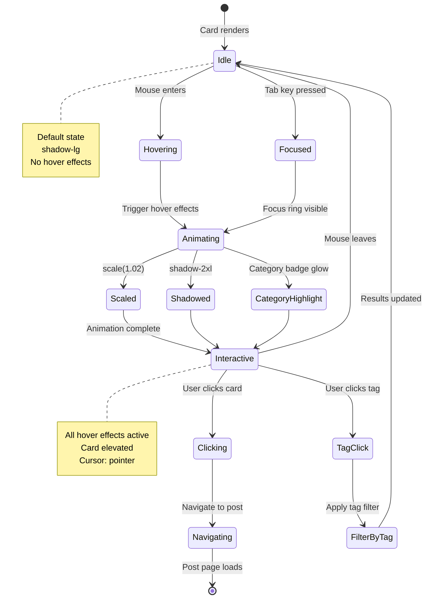
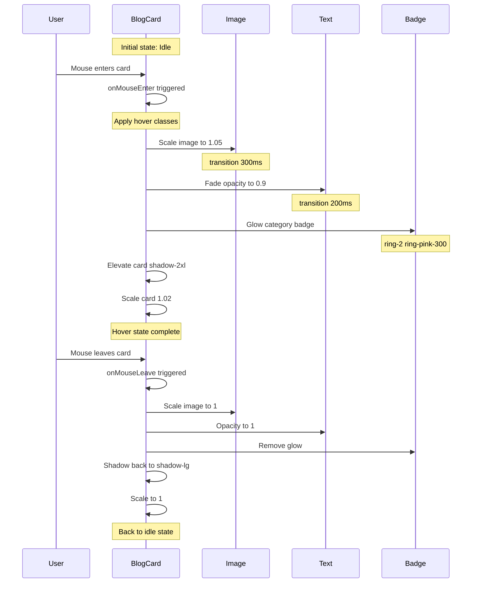

# BlogCard Component

**Version:** 4.0.0  
**Last Updated:** January 2025

Blog post preview card with featured image, excerpt, metadata, and read more functionality.

## Purpose

Display blog post previews with:
- Featured image with aspect ratio
- Post title and excerpt
- Author, date, and reading time metadata
- Category tags
- "Read More" CTA
- Hover animations
- Responsive layout (grid and list variants)
- Accessibility compliance

---

## 🔗 CMS Integration

This component displays blog posts from **Contentful CMS** with automatic fallback to **mock data**.

### Data Flow

```
Component Request
    ↓
useBlogPosts() hook
    ↓
contentfulService.getBlogPosts()
    ↓
Contentful API (with 5s timeout)
    ↓
Success → CMS Data
Timeout/Error → Mock Data (fallback)
    ↓
BlogCard renders with data
```

### Complete Documentation

For complete setup and configuration:

- **[Contentful Integration Guide](../contentful-integration.md)** - Complete CMS setup
- **[Mock Data Guide](../mock-data.md)** - Fallback data system
- **[Guidelines.md](../Guidelines.md)** - Main project guidelines

### Usage Pattern with CMS

```typescript
import { blogPosts } from '@/data/mock/blog';
import { useBlogPosts } from '@/hooks/useContentful';
import { BlogCard } from '@/components/ui/BlogCard';

export function BlogPage() {
  // Fetch CMS data with automatic fallback
  const { data: cmsPosts, loading, error } = useBlogPosts();
  
  // Use CMS data if available, otherwise fallback to mock
  const posts = cmsPosts || blogPosts;
  
  if (loading) {
    return <LoadingSpinner />;
  }
  
  return (
    <div className="grid grid-cols-1 md:grid-cols-2 lg:grid-cols-3 gap-fluid-md">
      {posts.map((post) => (
        <BlogCard 
          key={post.id} 
          post={post}
          onClick={() => navigate(`/blog/${post.slug}`)}
        />
      ))}
    </div>
  );
}
```

### Blog Data Sources

**Mock Data (Development/Fallback):**
- ✅ **5 complete blog posts** (~15,000 words total)
- ✅ **6 blog categories** with descriptions and colors
- ✅ **50+ tags** organized by type
- ✅ **Rich text content** with formatting
- ✅ **Reading time calculations** included
- ✅ **Located in:** `/data/mock/blog/`

**Contentful CMS (Production):**
- ✅ **Dynamic content updates** without code changes
- ✅ **Rich text editor** with markdown support
- ✅ **Image optimization** with automatic WebP conversion
- ✅ **SEO metadata** (titles, descriptions, OG tags)
- ✅ **Draft/published workflow** for content staging
- ✅ **Scheduled publishing** for future posts

### Data Structure

```typescript
export interface BlogPost {
  id: string;
  slug: string;           // URL-friendly identifier
  title: string;          // Post title
  excerpt: string;        // Short preview (150-200 chars)
  content: string;        // Full rich text content
  featuredImage: string;  // Hero image URL
  category: BlogCategory; // Single primary category
  tags: string[];         // Multiple tags for filtering
  author: {
    name: string;         // Author display name
    avatar?: string;      // Optional author image
  };
  publishedAt: string;    // ISO date string
  readTime: number;       // Minutes to read (auto-calculated)
}

export interface BlogCategory {
  id: string;
  name: string;           // Display name
  slug: string;           // URL-friendly
  description: string;    // Category description
  color: string;          // Theme color (for badges)
}
```

**Type location:** `/data/types/blog.ts`

### Import Patterns

```typescript
// Mock data (always available)
import { blogPosts, blogCategories, blogTags } from '@/data/mock/blog';

// Utility functions
import { searchPosts, filterByCategory, getRelatedPosts } from '@/data/mock/blog';

// CMS hook (with automatic fallback)
import { useBlogPosts, useBlogPost } from '@/hooks/useContentful';

// Types
import type { BlogPost, BlogCategory } from '@/data/types/blog';
```

### Benefits

✅ **Works Offline** - Uses mock data when CMS unavailable  
✅ **Fast Development** - No CMS setup required  
✅ **Production Ready** - Seamless CMS integration  
✅ **Type Safe** - Full TypeScript support  
✅ **SEO Optimized** - Meta tags and structured data  
✅ **Search & Filter** - Built-in utility functions

### Blog Features

**Search:**
```typescript
import { searchPosts } from '@/data/mock/blog';

// Search across title, excerpt, content, tags
const results = searchPosts('makeup tips');
```

**Filtering:**
```typescript
import { filterByCategory, filterByTags } from '@/data/mock/blog';

// Filter by category
const tutorialPosts = filterByCategory('tutorials');

// Filter by tags
const festivalPosts = filterByTags(['festival', 'glitter']);
```

**Pagination:**
```typescript
import { paginatePosts } from '@/data/mock/blog';

// Paginate results
const page1 = paginatePosts(posts, 1, 9); // 9 posts per page
```

**Related Posts:**
```typescript
import { getRelatedPosts } from '@/data/mock/blog';

// Get posts in same category
const related = getRelatedPosts(currentPost, 3); // Get 3 related
```

**See [Contentful Integration Guide](../contentful-integration.md) for complete setup.**

---

## Usage

### Basic Usage

```tsx
import { BlogCard } from './components/ui/BlogCard';

<BlogCard 
  post={blogPost}
  onClick={handleReadPost}
/>
```

### In Grid Layout

```tsx
<div className="grid grid-cols-1 md:grid-cols-2 lg:grid-cols-3 gap-fluid-md">
  {posts.map(post => (
    <BlogCard
      key={post.id}
      post={post}
      onClick={() => navigate(`/blog/${post.slug}`)}
    />
  ))}
</div>
```

### List Variant

```tsx
<div className="space-y-fluid-md">
  {posts.map(post => (
    <BlogCard
      key={post.id}
      post={post}
      layout="list"
      onClick={() => navigate(`/blog/${post.slug}`)}
    />
  ))}
</div>
```

---

## Props

```typescript
interface BlogCardProps {
  /**
   * Blog post data
   * @required
   */
  post: BlogPost;
  
  /**
   * Click handler for card
   * @required
   */
  onClick: () => void;
  
  /**
   * Layout variant
   * @default "grid"
   */
  layout?: 'grid' | 'list';
  
  /**
   * Show featured image
   * @default true
   */
  showImage?: boolean;
  
  /**
   * Show author info
   * @default true
   */
  showAuthor?: boolean;
  
  /**
   * Show reading time
   * @default true
   */
  showReadingTime?: boolean;
  
  /**
   * Additional CSS classes
   * @default ""
   */
  className?: string;
}

interface BlogPost {
  id: string;
  title: string;
  excerpt: string;
  content?: string;
  featuredImage: string;
  category: string;
  tags?: string[];
  author: {
    name: string;
    avatar?: string;
  };
  publishedDate: string;
  readingTime?: number; // in minutes
  slug: string;
}
```

---

## Features

### Reading Time Calculation

```typescript
const calculateReadingTime = (content: string): number => {
  const wordsPerMinute = 200;
  const wordCount = content.trim().split(/\s+/).length;
  return Math.ceil(wordCount / wordsPerMinute);
};
```

### Date Formatting

```typescript
const formatDate = (dateString: string): string => {
  const date = new Date(dateString);
  return date.toLocaleDateString('en-US', {
    year: 'numeric',
    month: 'long',
    day: 'numeric'
  });
};
```

### Excerpt Truncation

```typescript
const truncateExcerpt = (text: string, maxLength: number = 150): string => {
  if (text.length <= maxLength) return text;
  return text.slice(0, maxLength).trim() + '...';
};
```

---

## Implementation Example

Complete blog card implementation:

```tsx
import React from 'react';
import { Clock, Calendar, User, ArrowRight } from 'lucide-react';

interface BlogCardProps {
  post: BlogPost;
  onClick: () => void;
  layout?: 'grid' | 'list';
  showImage?: boolean;
  showAuthor?: boolean;
  showReadingTime?: boolean;
  className?: string;
}

export function BlogCard({ 
  post,
  onClick,
  layout = 'grid',
  showImage = true,
  showAuthor = true,
  showReadingTime = true,
  className = ''
}: BlogCardProps) {
  const formatDate = (dateString: string) => {
    return new Date(dateString).toLocaleDateString('en-US', {
      year: 'numeric',
      month: 'long',
      day: 'numeric'
    });
  };

  const isGridLayout = layout === 'grid';

  return (
    <article
      className={`
        bg-white/80 backdrop-blur-sm rounded-2xl overflow-hidden
        border border-white/50 shadow-lg hover:shadow-2xl
        transition-all duration-300
        cursor-pointer group
        ${isGridLayout ? 'flex flex-col' : 'flex flex-col sm:flex-row gap-fluid-md'}
        ${className}
      `}
      onClick={onClick}
    >
      {/* Featured Image */}
      {showImage && post.featuredImage && (
        <div className={`
          relative overflow-hidden
          ${isGridLayout ? 'aspect-[16/10]' : 'sm:w-1/3 aspect-[16/10] sm:aspect-auto'}
        `}>
          
          
          {/* Category Badge */}
          <div className="absolute top-4 left-4">
            <span className="inline-flex items-center px-3 py-1 rounded-full bg-pink-100 text-pink-700 text-fluid-xs font-body font-medium backdrop-blur-sm">
              {post.category}
            </span>
          </div>
        </div>
      )}
      
      {/* Content */}
      <div className={`
        p-fluid-md flex flex-col
        ${isGridLayout ? '' : 'sm:flex-1'}
      `}>
        {/* Metadata */}
        <div className="flex flex-wrap items-center gap-3 text-fluid-xs text-gray-600 mb-fluid-sm">
          {showAuthor && (
            <div className="flex items-center gap-2">
              {post.author.avatar ? (
                
              ) : (
                <User className="w-4 h-4" />
              )}
              <span className="font-body font-medium">
                {post.author.name}
              </span>
            </div>
          )}
          
          <div className="flex items-center gap-1">
            <Calendar className="w-4 h-4" />
            <span className="font-body">
              {formatDate(post.publishedDate)}
            </span>
          </div>
          
          {showReadingTime && post.readingTime && (
            <div className="flex items-center gap-1">
              <Clock className="w-4 h-4" />
              <span className="font-body">
                {post.readingTime} min read
              </span>
            </div>
          )}
        </div>
        
        {/* Title */}
        <h3 className="text-fluid-xl font-heading font-semibold text-gray-800 mb-fluid-sm group-hover:text-gradient-pink-purple-blue transition-colors line-clamp-2">
          {post.title}
        </h3>
        
        {/* Excerpt */}
        <p className="text-body-guideline font-body text-gray-700 mb-fluid-md line-clamp-3 flex-1">
          {post.excerpt}
        </p>
        
        {/* Tags */}
        {post.tags && post.tags.length > 0 && (
          <div className="flex flex-wrap gap-2 mb-fluid-md">
            {post.tags.slice(0, 3).map(tag => (
              <span 
                key={tag}
                className="px-2 py-1 bg-gray-100 text-gray-600 rounded text-fluid-xs font-body"
              >
                #{tag}
              </span>
            ))}
          </div>
        )}
        
        {/* Read More CTA */}
        <div className="flex items-center gap-2 text-pink-600 hover:text-pink-700 font-body font-medium text-fluid-sm group/cta">
          <span>Read More</span>
          <ArrowRight className="w-4 h-4 transition-transform group-hover/cta:translate-x-1" />
        </div>
      </div>
    </article>
  );
}
```

---

## Usage Patterns

### Blog Page Grid

```tsx
function BlogPage() {
  const [posts, setPosts] = useState<BlogPost[]>([]);
  
  return (
    <section className="py-section px-6">
      <div className="max-w-7xl mx-auto">
        <h1 className="text-section-h2 font-heading font-semibold text-center mb-fluid-xl">
          Blog
        </h1>
        
        <div className="grid grid-cols-1 md:grid-cols-2 lg:grid-cols-3 gap-fluid-md">
          {posts.map(post => (
            <BlogCard
              key={post.id}
              post={post}
              onClick={() => navigate(`/blog/${post.slug}`)}
            />
          ))}
        </div>
      </div>
    </section>
  );
}
```

### Featured Posts Section

```tsx
function FeaturedPosts({ posts }: Props) {
  return (
    <section className="py-section bg-gray-50">
      <div className="max-w-7xl mx-auto px-6">
        <h2 className="text-section-h2 font-heading font-semibold text-center mb-fluid-lg">
          Latest from the Blog
        </h2>
        
        <div className="grid grid-cols-1 md:grid-cols-3 gap-fluid-md">
          {posts.slice(0, 3).map(post => (
            <BlogCard
              key={post.id}
              post={post}
              onClick={() => navigate(`/blog/${post.slug}`)}
            />
          ))}
        </div>
        
        <div className="text-center mt-fluid-lg">
          <button 
            onClick={() => navigate('/blog')}
            className="bg-gradient-pink-purple-blue text-white px-button py-button rounded-lg font-body font-medium hover:shadow-xl transition-shadow"
          >
            View All Posts
          </button>
        </div>
      </div>
    </section>
  );
}
```

### Related Posts

```tsx
function RelatedPosts({ currentPost, allPosts }: Props) {
  const relatedPosts = allPosts
    .filter(post => 
      post.id !== currentPost.id && 
      post.category === currentPost.category
    )
    .slice(0, 3);
  
  return (
    <section className="py-section border-t border-gray-200">
      <h2 className="text-fluid-xl font-heading font-semibold mb-fluid-lg">
        Related Posts
      </h2>
      
      <div className="grid grid-cols-1 md:grid-cols-3 gap-fluid-md">
        {relatedPosts.map(post => (
          <BlogCard
            key={post.id}
            post={post}
            onClick={() => navigate(`/blog/${post.slug}`)}
            showAuthor={false}
          />
        ))}
      </div>
    </section>
  );
}
```

### Minimal Card Variant

```tsx
<BlogCard
  post={post}
  onClick={handleClick}
  showImage={false}
  showAuthor={false}
  showReadingTime={false}
  className="bg-transparent border-none shadow-none hover:bg-gray-50"
/>
```

---

## Advanced Features

### With Bookmark Button

```tsx
const [isBookmarked, setIsBookmarked] = useState(false);

<div className="absolute top-4 right-4">
  <button
    onClick={(e) => {
      e.stopPropagation();
      setIsBookmarked(!isBookmarked);
    }}
    className="w-10 h-10 rounded-full bg-white/90 backdrop-blur-sm flex items-center justify-center hover:bg-white transition-colors"
  >
    <Bookmark 
      className={`w-5 h-5 ${isBookmarked ? 'fill-pink-500 text-pink-500' : 'text-gray-600'}`}
    />
  </button>
</div>
```

### With Share Button

```tsx
import { ShareComponent } from './ShareComponent';

<div className="flex items-center justify-between mt-fluid-md">
  <button className="text-pink-600 font-body font-medium">
    Read More →
  </button>
  
  <ShareComponent 
    variant="compact"
    title={post.title}
    url={`/blog/${post.slug}`}
  />
</div>
```

### With View Count

```tsx
<div className="flex items-center gap-1 text-fluid-xs text-gray-600">
  <Eye className="w-4 h-4" />
  <span>{post.viewCount} views</span>
</div>
```

---

## Accessibility

### Semantic HTML

```tsx
<article>
  <a href={`/blog/${post.slug}`}>
    
    <h3>{post.title}</h3>
    <p>{post.excerpt}</p>
  </a>
  
  <time dateTime={post.publishedDate}>
    {formatDate(post.publishedDate)}
  </time>
</article>
```

### Keyboard Navigation

```tsx
<article
  tabIndex={0}
  onClick={onClick}
  onKeyDown={(e) => {
    if (e.key === 'Enter' || e.key === ' ') {
      e.preventDefault();
      onClick();
    }
  }}
  className="focus:outline-none focus:ring-4 focus:ring-pink-200 focus:ring-opacity-50 rounded-2xl"
>
  {/* Card content */}
</article>
```

---

## Common Mistakes

### ❌ Mistake 1: Long Excerpts

```tsx
// ❌ WRONG - No truncation
<p>{post.excerpt}</p>
```

**Solution:**
```tsx
// ✅ CORRECT - Line clamping
<p className="line-clamp-3">{post.excerpt}</p>
```

### ❌ Mistake 2: No Loading State

```tsx
// ❌ WRONG - No skeleton while loading
{posts.map(post => <BlogCard post={post} />)}
```

**Solution:**
```tsx
// ✅ CORRECT - Loading skeleton
{isLoading ? (
  <BlogCardSkeleton count={6} />
) : (
  posts.map(post => <BlogCard post={post} />)
)}
```

### ❌ Mistake 3: Missing Date Formatting

```tsx
// ❌ WRONG - Raw date string
<span>{post.publishedDate}</span>
```

**Solution:**
```tsx
// ✅ CORRECT - Formatted date
<time dateTime={post.publishedDate}>
  {new Date(post.publishedDate).toLocaleDateString('en-US', {
    year: 'numeric',
    month: 'long',
    day: 'numeric'
  })}
</time>
```

---

## 🎨 Interactive Mermaid Diagrams

### Mermaid State Diagram (Card Interaction States)



### Mermaid Flowchart (Card Click Logic)

```mermaid
flowchart TD
    A[User Clicks Card] --> B{Click Target?}
    
    B -->|Card Body| C[Navigate to Post]
    B -->|Category Badge| D[Filter by Category]
    B -->|Tag Chip| E[Filter by Tag]
    B -->|Read More Button| C
    
    C --> F[Update URL]
    F --> G[/blog/:slug]
    G --> H[Load BlogPostPage]
    H --> I[Render Full Post]
    
    D --> J[Update Filter State]
    J --> K[setActiveCategory]
    K --> L[Apply Filter]
    L --> M[Re-render Card List]
    
    E --> N[Update Tag State]
    N --> O[toggleSelectedTag]
    O --> P[Apply Tag Filter]
    P --> M
    
    M --> Q[Show Filtered Results]
    
    style C fill:#e1f5ff,stroke:#01c3cc,stroke-width:2px
    style D fill:#dcfce7,stroke:#22c55e,stroke-width:2px
    style E fill:#fef3c7,stroke:#f59e0b,stroke-width:2px
    style I fill:#ddd6fe,stroke:#8b5cf6,stroke-width:2px
    style Q fill:#dcfce7,stroke:#22c55e,stroke-width:2px
```

### Mermaid Sequence Diagram (Card Hover Interaction)



---

## Related Components

- **[PortfolioCard](./PortfolioCard.md)** - Portfolio items (similar pattern)
- **[CategoryFilter](./CategoryFilter.md)** - Category filtering
- **[SearchBar](./SearchBar.md)** - Search functionality
- **[ShareComponent](./ShareComponent.md)** - Social sharing
- **[Pagination](./Pagination.md)** - Blog pagination

---

## Related Documentation

- **[Guidelines.md](../Guidelines.md)** - Main project guidelines
- **[Contentful Integration Guide](../contentful-integration.md)** - CMS setup
- **[Mock Data Guide](../mock-data.md)** - Mock data system
- **[overview-components.md](../overview-components.md)** - Component architecture
- **[design-tokens/spacing.md](../design-tokens/spacing.md)** - Spacing system
- **[design-tokens/typography.md](../design-tokens/typography.md)** - Typography scale
- **[FILE_STRUCTURE.md](../FILE_STRUCTURE.md)** - File organization

---

**Last Updated:** January 2025  
**Version:** 4.0.0