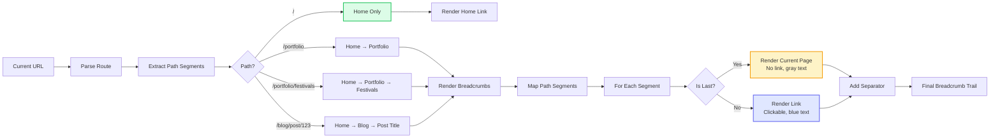
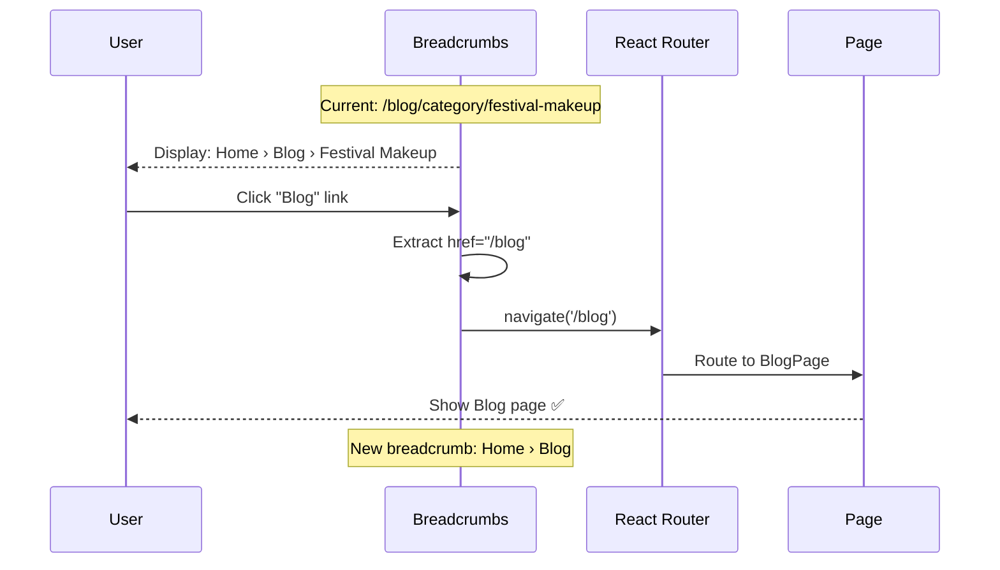

# Breadcrumbs Component

**Version:** 4.0.0  
**Last Updated:** January 2025

Navigation breadcrumb trail showing current page location in site hierarchy.

## Purpose

Provide hierarchical navigation with:
- Current location indicator
- Clickable parent page links
- Home icon or text
- Accessibility compliance
- SEO-friendly structured data

---

## Component Architecture

### Breadcrumb Navigation Flow (Mermaid)



### Breadcrumb Click Navigation (Mermaid)



### Structured Data for SEO (Mermaid)

```mermaid
flowchart TD
    A[Breadcrumbs Component] --> B[Generate JSON-LD]
    
    B --> C[Create BreadcrumbList schema]
    
    C --> D[Add itemListElement array]
    
    D --> E[For Each Crumb]
    
    E --> F[Create ListItem]
    
    F --> F1[@type: ListItem]
    F --> F2[position: index + 1]
    F --> F3[name: crumb.label]
    F --> F4[item: full URL]
    
    F1 --> G[Add to array]
    F2 --> G
    F3 --> G
    F4 --> G
    
    G --> H{More crumbs?}
    
    H -->|Yes| E
    H -->|No| I[Complete Schema]
    
    I --> J[Inject into <head>]
    
    J --> K[Google Search Indexing]
    
    K --> L[Rich Snippets in Search Results]
    
    style C fill:#e0e7ff,stroke:#6366f1,stroke-width:2px
    style I fill:#dcfce7,stroke:#22c55e,stroke-width:2px
    style L fill:#fef3c7,stroke:#f59e0b,stroke-width:2px
```

---

## Usage

### Basic Usage

```tsx
import { Breadcrumbs } from './components/ui/Breadcrumbs';

<Breadcrumbs />
```

### With Custom Path

```tsx
<Breadcrumbs 
  items={[
    { label: 'Home', href: '/' },
    { label: 'Portfolio', href: '/portfolio' },
    { label: 'Festival Makeup' }
  ]}
/>
```

### Auto-Generated from Route

```tsx
function BlogPostPage() {
  const location = useLocation();
  
  return (
    <>
      <Breadcrumbs path={location.pathname} />
      <article>...</article>
    </>
  );
}
```

---

## Props

```typescript
interface BreadcrumbsProps {
  /**
   * Breadcrumb items
   * @optional - Auto-generated from current route if not provided
   */
  items?: BreadcrumbItem[];
  
  /**
   * Current path (for auto-generation)
   * @optional
   */
  path?: string;
  
  /**
   * Show home icon instead of text
   * @default true
   */
  showHomeIcon?: boolean;
  
  /**
   * Separator character
   * @default "›"
   */
  separator?: string | React.ReactNode;
  
  /**
   * Additional CSS classes
   * @default ""
   */
  className?: string;
}

interface BreadcrumbItem {
  label: string;
  href?: string;
}
```

---

## Implementation Example

```tsx
import React from 'react';
import { Link, useLocation } from 'react-router-dom';
import { Home, ChevronRight } from 'lucide-react';

interface BreadcrumbsProps {
  items?: BreadcrumbItem[];
  path?: string;
  showHomeIcon?: boolean;
  separator?: string | React.ReactNode;
  className?: string;
}

interface BreadcrumbItem {
  label: string;
  href?: string;
}

export function Breadcrumbs({
  items,
  path,
  showHomeIcon = true,
  separator = <ChevronRight className="w-4 h-4 text-gray-400" />,
  className = ''
}: BreadcrumbsProps) {
  const location = useLocation();
  const currentPath = path || location.pathname;
  
  // Auto-generate breadcrumbs from path if items not provided
  const breadcrumbs = items || generateBreadcrumbs(currentPath);
  
  return (
    <nav aria-label="Breadcrumb" className={`flex items-center gap-2 ${className}`}>
      <ol className="flex items-center gap-2 text-fluid-sm font-body">
        {/* Home */}
        <li>
          <Link 
            to="/"
            className="text-gray-600 hover:text-pink-600 transition-colors flex items-center"
            aria-label="Home"
          >
            {showHomeIcon ? (
              <Home className="w-4 h-4" />
            ) : (
              'Home'
            )}
          </Link>
        </li>
        
        {/* Breadcrumb items */}
        {breadcrumbs.map((crumb, index) => {
          const isLast = index === breadcrumbs.length - 1;
          
          return (
            <React.Fragment key={index}>
              <li className="flex items-center" aria-hidden="true">
                {separator}
              </li>
              
              <li>
                {isLast ? (
                  <span 
                    className="text-gray-400"
                    aria-current="page"
                  >
                    {crumb.label}
                  </span>
                ) : (
                  <Link 
                    to={crumb.href || '#'}
                    className="text-gray-600 hover:text-pink-600 transition-colors"
                  >
                    {crumb.label}
                  </Link>
                )}
              </li>
            </React.Fragment>
          );
        })}
      </ol>
    </nav>
  );
}

// Helper function to generate breadcrumbs from path
function generateBreadcrumbs(path: string): BreadcrumbItem[] {
  const segments = path.split('/').filter(Boolean);
  
  return segments.map((segment, index) => {
    const href = '/' + segments.slice(0, index + 1).join('/');
    const label = segment
      .split('-')
      .map(word => word.charAt(0).toUpperCase() + word.slice(1))
      .join(' ');
    
    return { label, href };
  });
}
```

---

## Usage Patterns

### Blog Post Page

```tsx
function BlogPostPage({ post }: Props) {
  return (
    <article className="max-w-4xl mx-auto px-6 py-section">
      <Breadcrumbs 
        items={[
          { label: 'Blog', href: '/blog' },
          { label: post.category, href: `/blog/category/${post.category}` },
          { label: post.title }
        ]}
      />
      
      <h1>{post.title}</h1>
      {/* Post content */}
    </article>
  );
}
```

### Portfolio Entry

```tsx
function PortfolioEntryPage({ entry }: Props) {
  return (
    <div className="max-w-7xl mx-auto px-6 py-section">
      <Breadcrumbs 
        items={[
          { label: 'Portfolio', href: '/portfolio' },
          { label: entry.category, href: `/portfolio?category=${entry.category}` },
          { label: entry.title }
        ]}
      />
      
      {/* Entry content */}
    </div>
  );
}
```

---

## SEO Structured Data

```tsx
function BreadcrumbsWithSchema({ items }: Props) {
  const schema = {
    "@context": "https://schema.org",
    "@type": "BreadcrumbList",
    "itemListElement": items.map((item, index) => ({
      "@type": "ListItem",
      "position": index + 1,
      "name": item.label,
      "item": `https://ashshaw.makeup${item.href || ''}`
    }))
  };
  
  return (
    <>
      <script 
        type="application/ld+json"
        dangerouslySetInnerHTML={{ __html: JSON.stringify(schema) }}
      />
      
      <Breadcrumbs items={items} />
    </>
  );
}
```

---

## Related Documentation

- **[Guidelines.md](../Guidelines.md)** - Main guidelines
- **[overview-components.md](../overview-components.md)** - Component system
- **[SITEMAP.md](../SITEMAP.md)** - Site navigation structure
- **[design-tokens/colors.md](../design-tokens/colors.md)** - Color system
- **[design-tokens/typography.md](../design-tokens/typography.md)** - Typography scale

---

**Last Updated:** January 2025  
**Version:** 4.0.0
