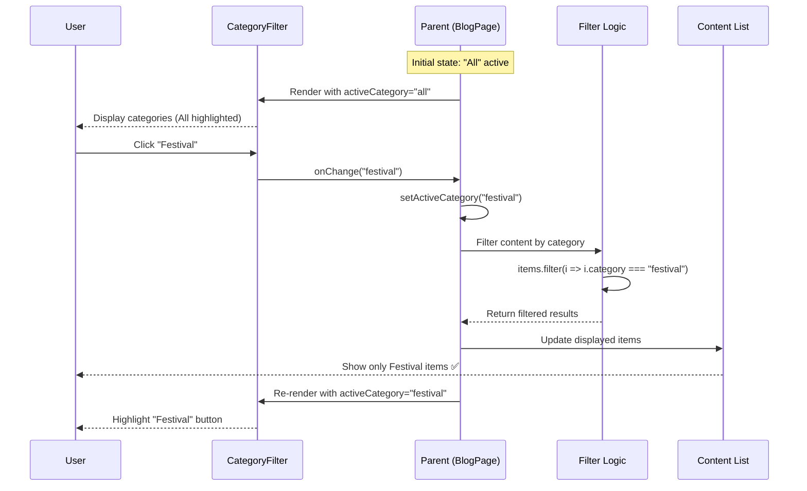
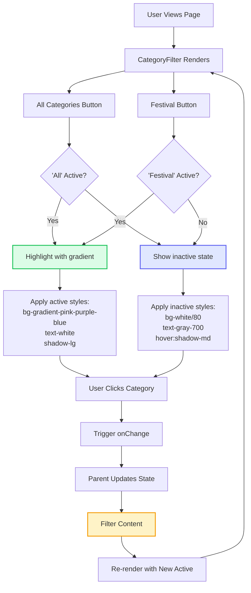

# CategoryFilter Component

**Version:** 4.0.0  
**Last Updated:** January 2025

Category filtering component for portfolio and blog content with active state indication.

## Purpose

Provide content filtering by category with:
- Multiple category options (Festival, Editorial, Special Event, Nails, All)
- Active state visual indication
- Smooth transitions
- Keyboard navigation support
- Responsive layout (horizontal scroll on mobile)
- Accessibility compliance

---

## Component Architecture

### Category Filter Interaction (Mermaid)



### Category Selection Flow (Mermaid)



---

## Usage

### Basic Usage

```tsx
import { CategoryFilter } from './components/ui/CategoryFilter';

<CategoryFilter 
  categories={categories}
  activeCategory={activeCategory}
  onCategoryChange={setActiveCategory}
/>
```

### Portfolio Categories

```tsx
const portfolioCategories = [
  { id: 'all', label: 'All Work', count: 45 },
  { id: 'festival', label: 'Festival', count: 12 },
  { id: 'editorial', label: 'Editorial', count: 18 },
  { id: 'special-event', label: 'Special Event', count: 10 },
  { id: 'nails', label: 'Nail Art', count: 5 }
];

<CategoryFilter 
  categories={portfolioCategories}
  activeCategory={activeCategory}
  onCategoryChange={setActiveCategory}
  showCount={true}
/>
```

### Blog Categories

```tsx
const blogCategories = [
  { id: 'all', label: 'All Posts' },
  { id: 'tutorials', label: 'Tutorials' },
  { id: 'tips', label: 'Tips & Tricks' },
  { id: 'inspiration', label: 'Inspiration' },
  { id: 'reviews', label: 'Product Reviews' }
];

<CategoryFilter 
  categories={blogCategories}
  activeCategory={activeCategory}
  onCategoryChange={setActiveCategory}
/>
```

---

## Props

```typescript
interface CategoryFilterProps {
  /**
   * Array of categories
   * @required
   */
  categories: Category[];
  
  /**
   * Currently active category ID
   * @required
   */
  activeCategory: string;
  
  /**
   * Category change handler
   * @required
   */
  onCategoryChange: (categoryId: string) => void;
  
  /**
   * Show item count badges
   * @default false
   */
  showCount?: boolean;
  
  /**
   * Layout style
   * @default "pills"
   */
  layout?: 'pills' | 'tabs' | 'buttons';
  
  /**
   * Additional CSS classes
   * @default ""
   */
  className?: string;
}

interface Category {
  id: string;
  label: string;
  count?: number;
  icon?: React.ReactNode;
}
```

---

## Implementation Example

Complete category filter implementation:

```tsx
import React from 'react';

interface Category {
  id: string;
  label: string;
  count?: number;
  icon?: React.ReactNode;
}

interface CategoryFilterProps {
  categories: Category[];
  activeCategory: string;
  onCategoryChange: (categoryId: string) => void;
  showCount?: boolean;
  layout?: 'pills' | 'tabs' | 'buttons';
  className?: string;
}

export function CategoryFilter({ 
  categories,
  activeCategory,
  onCategoryChange,
  showCount = false,
  layout = 'pills',
  className = ''
}: CategoryFilterProps) {
  const getLayoutClasses = () => {
    switch (layout) {
      case 'pills':
        return {
          container: 'flex flex-wrap gap-3',
          button: (isActive: boolean) => `
            px-6 py-3 rounded-full font-body font-medium text-fluid-sm
            transition-all duration-300
            ${isActive
              ? 'bg-gradient-pink-purple-blue text-white shadow-lg scale-105'
              : 'bg-white/80 text-gray-700 hover:bg-gray-100 border border-gray-200'
            }
          `
        };
      
      case 'tabs':
        return {
          container: 'flex gap-1 border-b border-gray-200',
          button: (isActive: boolean) => `
            px-6 py-3 font-body font-medium text-fluid-sm
            transition-all duration-300
            ${isActive
              ? 'text-pink-600 border-b-2 border-pink-600 -mb-px'
              : 'text-gray-600 hover:text-gray-800'
            }
          `
        };
      
      case 'buttons':
        return {
          container: 'flex flex-wrap gap-2',
          button: (isActive: boolean) => `
            px-5 py-2 rounded-lg font-body font-medium text-fluid-sm
            transition-all duration-300
            ${isActive
              ? 'bg-pink-600 text-white shadow-md'
              : 'bg-gray-100 text-gray-700 hover:bg-gray-200'
            }
          `
        };
    }
  };

  const layoutClasses = getLayoutClasses();

  return (
    <nav 
      className={`${className}`}
      role="navigation"
      aria-label="Category filter"
    >
      <div className={layoutClasses.container}>
        {categories.map(category => {
          const isActive = category.id === activeCategory;
          
          return (
            <button
              key={category.id}
              onClick={() => onCategoryChange(category.id)}
              className={layoutClasses.button(isActive)}
              aria-current={isActive ? 'page' : undefined}
              aria-label={`Filter by ${category.label}${showCount && category.count ? ` (${category.count} items)` : ''}`}
            >
              <span className="flex items-center gap-2">
                {category.icon && <span>{category.icon}</span>}
                
                <span>{category.label}</span>
                
                {showCount && category.count !== undefined && (
                  <span className={`
                    text-fluid-xs px-2 py-0.5 rounded-full
                    ${isActive
                      ? 'bg-white/20 text-white'
                      : 'bg-gray-200 text-gray-600'
                    }
                  `}>
                    {category.count}
                  </span>
                )}
              </span>
            </button>
          );
        })}
      </div>
    </nav>
  );
}
```

---

## Usage Patterns

### Portfolio Page Filter

```tsx
import { useState } from 'react';
import { CategoryFilter } from './components/ui/CategoryFilter';

function PortfolioPage() {
  const [activeCategory, setActiveCategory] = useState('all');
  
  const categories = [
    { id: 'all', label: 'All Work', count: 45 },
    { id: 'festival', label: 'Festival', count: 12 },
    { id: 'editorial', label: 'Editorial', count: 18 },
    { id: 'special-event', label: 'Special Event', count: 10 },
    { id: 'nails', label: 'Nail Art', count: 5 }
  ];
  
  const filteredEntries = activeCategory === 'all'
    ? portfolioEntries
    : portfolioEntries.filter(entry => entry.category === activeCategory);
  
  return (
    <section className="py-section px-6">
      <div className="max-w-7xl mx-auto">
        <h1 className="text-section-h2 font-heading font-semibold text-center mb-fluid-lg">
          Portfolio
        </h1>
        
        <CategoryFilter 
          categories={categories}
          activeCategory={activeCategory}
          onCategoryChange={setActiveCategory}
          showCount={true}
          className="mb-fluid-xl flex justify-center"
        />
        
        <div className="grid grid-cols-1 md:grid-cols-2 lg:grid-cols-3 gap-fluid-md">
          {filteredEntries.map(entry => (
            <PortfolioCard key={entry.id} entry={entry} />
          ))}
        </div>
        
        {filteredEntries.length === 0 && (
          <p className="text-center text-gray-600 py-fluid-xl">
            No entries found in this category.
          </p>
        )}
      </div>
    </section>
  );
}
```

### Blog Page with Tabs Layout

```tsx
function BlogPage() {
  const [activeCategory, setActiveCategory] = useState('all');
  
  const categories = [
    { id: 'all', label: 'All Posts', count: 24 },
    { id: 'tutorials', label: 'Tutorials', count: 8 },
    { id: 'tips', label: 'Tips', count: 10 },
    { id: 'inspiration', label: 'Inspiration', count: 6 }
  ];
  
  return (
    <section className="py-section">
      <div className="max-w-7xl mx-auto px-6">
        <CategoryFilter 
          categories={categories}
          activeCategory={activeCategory}
          onCategoryChange={setActiveCategory}
          showCount={true}
          layout="tabs"
          className="mb-fluid-lg"
        />
        
        <div className="space-y-fluid-md">
          {filteredPosts.map(post => (
            <BlogCard key={post.id} post={post} />
          ))}
        </div>
      </div>
    </section>
  );
}
```

### With Icons

```tsx
import { Sparkles, Camera, Calendar, Palette } from 'lucide-react';

const categoriesWithIcons = [
  { 
    id: 'all', 
    label: 'All', 
    icon: <Sparkles className="w-4 h-4" />
  },
  { 
    id: 'festival', 
    label: 'Festival', 
    icon: <Sparkles className="w-4 h-4" />
  },
  { 
    id: 'editorial', 
    label: 'Editorial', 
    icon: <Camera className="w-4 h-4" />
  },
  { 
    id: 'special-event', 
    label: 'Events', 
    icon: <Calendar className="w-4 h-4" />
  },
  { 
    id: 'nails', 
    label: 'Nails', 
    icon: <Palette className="w-4 h-4" />
  }
];

<CategoryFilter 
  categories={categoriesWithIcons}
  activeCategory={activeCategory}
  onCategoryChange={setActiveCategory}
/>
```

### Mobile Responsive (Horizontal Scroll)

```tsx
<div className="overflow-x-auto pb-4 -mx-6 px-6">
  <CategoryFilter 
    categories={categories}
    activeCategory={activeCategory}
    onCategoryChange={setActiveCategory}
    className="min-w-max"
  />
</div>
```

---

## Advanced Patterns

### With Animation

```tsx
<button
  onClick={() => onCategoryChange(category.id)}
  className={`
    relative px-6 py-3 rounded-full
    transition-all duration-300
    ${isActive ? 'text-white' : 'text-gray-700'}
  `}
>
  {isActive && (
    <span className="absolute inset-0 bg-gradient-pink-purple-blue rounded-full animate-pulse" />
  )}
  <span className="relative z-10">{category.label}</span>
</button>
```

### With URL Parameters

```tsx
import { useSearchParams } from 'react-router-dom';

function PortfolioPage() {
  const [searchParams, setSearchParams] = useSearchParams();
  const activeCategory = searchParams.get('category') || 'all';
  
  const handleCategoryChange = (categoryId: string) => {
    setSearchParams({ category: categoryId });
  };
  
  return (
    <CategoryFilter 
      categories={categories}
      activeCategory={activeCategory}
      onCategoryChange={handleCategoryChange}
    />
  );
}
```

### With Loading State

```tsx
const [isLoading, setIsLoading] = useState(false);

const handleCategoryChange = async (categoryId: string) => {
  setIsLoading(true);
  setActiveCategory(categoryId);
  
  // Fetch filtered data
  await fetchFilteredData(categoryId);
  
  setIsLoading(false);
};

<CategoryFilter 
  categories={categories}
  activeCategory={activeCategory}
  onCategoryChange={handleCategoryChange}
/>

{isLoading && <Loader className="mx-auto mt-4 animate-spin" />}
```

---

## Accessibility

### Keyboard Navigation

```tsx
<button
  onClick={() => onCategoryChange(category.id)}
  onKeyDown={(e) => {
    if (e.key === 'Enter' || e.key === ' ') {
      e.preventDefault();
      onCategoryChange(category.id);
    }
  }}
  className="focus:outline-none focus:ring-2 focus:ring-pink-200 focus:ring-opacity-50 rounded-full"
>
  {category.label}
</button>
```

### ARIA Attributes

```tsx
<nav 
  role="navigation"
  aria-label="Category filter"
>
  <button
    onClick={() => onCategoryChange(category.id)}
    aria-current={isActive ? 'page' : undefined}
    aria-pressed={isActive}
  >
    {category.label}
  </button>
</nav>
```

### Screen Reader Announcements

```tsx
// Announce filter changes
<div 
  role="status"
  aria-live="polite"
  className="sr-only"
>
  {`Showing ${filteredCount} ${activeCategory} items`}
</div>
```

---

## Common Mistakes

### ❌ Mistake 1: No Active State

```tsx
// ❌ WRONG - Can't tell which category is selected
<button onClick={() => filter('festival')}>
  Festival
</button>
```

**Solution:**
```tsx
// ✅ CORRECT - Clear active indication
<button className={activeCategory === 'festival' ? 'bg-pink-600 text-white' : 'bg-gray-100'}>
  Festival
</button>
```

### ❌ Mistake 2: Not Mobile Responsive

```tsx
// ❌ WRONG - Categories wrap awkwardly on mobile
<div className="flex gap-2">
  {/* Many categories */}
</div>
```

**Solution:**
```tsx
// ✅ CORRECT - Horizontal scroll on mobile
<div className="overflow-x-auto">
  <div className="flex gap-2 min-w-max">
    {/* Categories */}
  </div>
</div>
```

### ❌ Mistake 3: Missing Count Updates

```tsx
// ❌ WRONG - Count doesn't update when filtering
<span>{category.count}</span>
```

**Solution:**
```tsx
// ✅ CORRECT - Dynamic count based on filtered results
<span>{filteredEntries.filter(e => e.category === category.id).length}</span>
```

---

## Related Components

- **[SearchBar](./SearchBar.md)** - Search functionality
- **[PortfolioCard](./PortfolioCard.md)** - Portfolio items
- **[LayoutSwitcher](./LayoutSwitcher.md)** - View toggle

---

## Related Documentation

- **[Guidelines.md](../Guidelines.md)** - Main guidelines
- **[overview-components.md](../overview-components.md)** - Component system
- **[FILE_STRUCTURE.md](../FILE_STRUCTURE.md)** - File organization
- **[design-tokens/colors.md](../design-tokens/colors.md)** - Color system
- **[design-tokens/spacing.md](../design-tokens/spacing.md)** - Spacing system

---

**Last Updated:** January 2025  
**Version:** 4.0.0