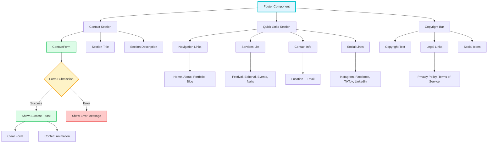
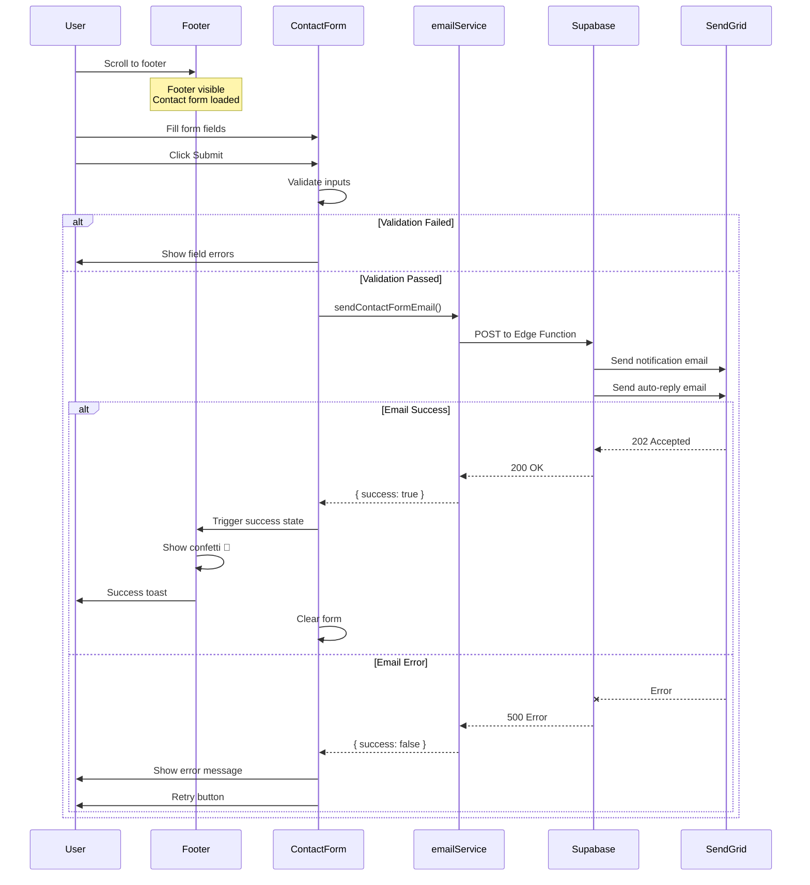
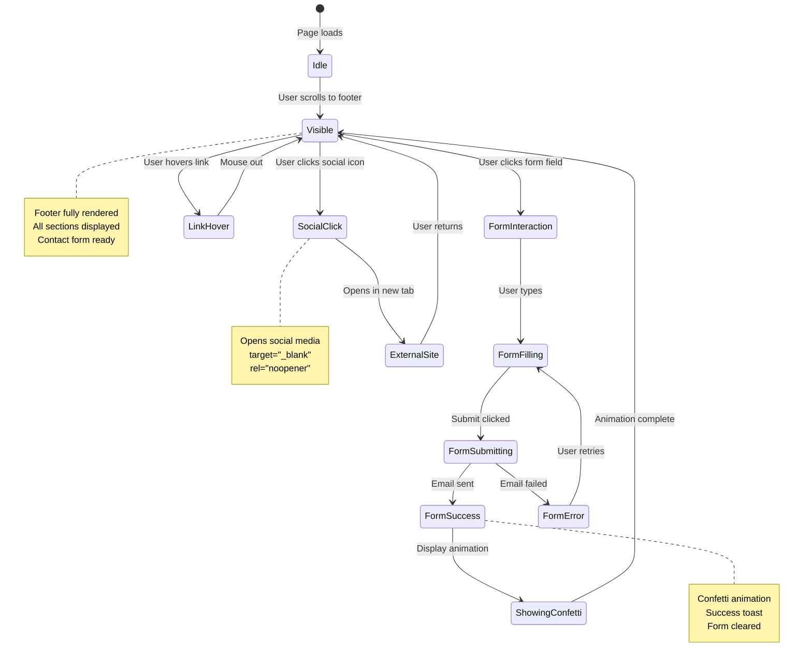

# Footer Component

**Version:** 4.0.0  
**Last Updated:** January 2025

Site-wide footer with contact form, social links, copyright information, and brand consistency.

## Purpose

Provide consistent footer across all pages with:
- SendGrid-integrated contact form
- Social media links
- Brand tagline and logo
- Copyright and legal information
- Accessibility compliance
- Responsive multi-column layout

---

## Usage

### Basic Usage

```tsx
import { Footer } from './components/common/Footer';

<Footer />
```

### With Custom Contact Handler

```tsx
<Footer 
  onContactSubmit={handleCustomSubmit}
  showContactForm={true}
/>
```

---

## Props

```typescript
interface FooterProps {
  /**
   * Whether to show the contact form section
   * @default true
   */
  showContactForm?: boolean;
  
  /**
   * Custom contact form submission handler
   * @optional (uses SendGrid by default)
   */
  onContactSubmit?: (data: ContactFormData) => Promise<void>;
  
  /**
   * Additional CSS classes
   * @default ""
   */
  className?: string;
  
  /**
   * Current year for copyright
   * @default new Date().getFullYear()
   */
  year?: number;
}
```

---

## Features

### Contact Form Integration

```tsx
import { ContactForm } from './ContactForm';

<section className="py-section bg-gray-50">
  <div className="max-w-7xl mx-auto px-6">
    <h2 className="text-section-h2 font-heading font-semibold text-center mb-fluid-lg">
      Get in Touch
    </h2>
    
    <ContactForm onSuccess={handleSuccess} />
  </div>
</section>
```

### Social Links

```tsx
import { SocialLinks } from './SocialLinks';

<div className="flex justify-center gap-6">
  <SocialLinks 
    iconSize={24}
    className="text-white hover:text-pink-300"
  />
</div>
```

### Brand Section

```tsx
<div className="text-center lg:text-left">
  <Logo size="md" className="mb-fluid-md" />
  
  <p className="text-fluid-base font-body text-gray-300 max-w-md">
    Makeup that shines with colour, energy, and connection.
  </p>
</div>
```

---

## Implementation Example

Complete footer implementation:

```tsx
import React from 'react';
import { Logo } from './Logo';
import { ContactForm } from './ContactForm';
import { SocialLinks } from './SocialLinks';

interface FooterProps {
  showContactForm?: boolean;
  className?: string;
}

export function Footer({ 
  showContactForm = true,
  className = '' 
}: FooterProps) {
  const currentYear = new Date().getFullYear();

  return (
    <footer className={`bg-gray-900 text-white ${className}`}>
      {/* Contact Form Section */}
      {showContactForm && (
        <section className="py-section bg-gray-800">
          <div className="max-w-4xl mx-auto px-6">
            <h2 className="text-section-h2 font-heading font-semibold text-white text-center mb-fluid-md">
              Let's Create Together
            </h2>
            
            <p className="text-body-guideline font-body text-gray-300 text-center mb-fluid-lg max-w-2xl mx-auto">
              Ready to bring your makeup vision to life? Get in touch and let's discuss your next project.
            </p>
            
            <ContactForm />
          </div>
        </section>
      )}

      {/* Main Footer Content */}
      <div className="py-fluid-xl px-6">
        <div className="max-w-7xl mx-auto">
          <div className="grid grid-cols-1 md:grid-cols-2 lg:grid-cols-4 gap-fluid-lg">
            {/* Brand Column */}
            <div className="text-center md:text-left">
              <Logo 
                size="md" 
                className="text-white mb-fluid-md mx-auto md:mx-0"
              />
              
              <p className="text-fluid-base font-body text-gray-300 mb-fluid-md">
                Makeup that shines with colour, energy, and connection.
              </p>
              
              <SocialLinks 
                iconSize={20}
                className="justify-center md:justify-start"
              />
            </div>

            {/* Quick Links */}
            <div>
              <h3 className="text-fluid-lg font-heading font-semibold mb-fluid-md">
                Quick Links
              </h3>
              
              <ul className="space-y-3">
                <li>
                  <a 
                    href="#home"
                    className="text-fluid-base font-body text-gray-300 hover:text-pink-400 transition-colors"
                  >
                    Home
                  </a>
                </li>
                <li>
                  <a 
                    href="#about"
                    className="text-fluid-base font-body text-gray-300 hover:text-pink-400 transition-colors"
                  >
                    About
                  </a>
                </li>
                <li>
                  <a 
                    href="#portfolio"
                    className="text-fluid-base font-body text-gray-300 hover:text-pink-400 transition-colors"
                  >
                    Portfolio
                  </a>
                </li>
                <li>
                  <a 
                    href="#blog"
                    className="text-fluid-base font-body text-gray-300 hover:text-pink-400 transition-colors"
                  >
                    Blog
                  </a>
                </li>
              </ul>
            </div>

            {/* Services */}
            <div>
              <h3 className="text-fluid-lg font-heading font-semibold mb-fluid-md">
                Services
              </h3>
              
              <ul className="space-y-3">
                <li className="text-fluid-base font-body text-gray-300">
                  Festival Makeup
                </li>
                <li className="text-fluid-base font-body text-gray-300">
                  Editorial Shoots
                </li>
                <li className="text-fluid-base font-body text-gray-300">
                  Special Events
                </li>
                <li className="text-fluid-base font-body text-gray-300">
                  Nail Art
                </li>
              </ul>
            </div>

            {/* Contact Info */}
            <div>
              <h3 className="text-fluid-lg font-heading font-semibold mb-fluid-md">
                Contact
              </h3>
              
              <ul className="space-y-3">
                <li className="text-fluid-base font-body text-gray-300">
                  Brisbane, Australia
                </li>
                <li>
                  <a 
                    href="mailto:ashley@ashshaw.makeup"
                    className="text-fluid-base font-body text-gray-300 hover:text-pink-400 transition-colors"
                  >
                    ashley@ashshaw.makeup
                  </a>
                </li>
              </ul>
            </div>
          </div>
        </div>
      </div>

      {/* Copyright Bar */}
      <div className="border-t border-gray-800 py-6 px-6">
        <div className="max-w-7xl mx-auto">
          <div className="flex flex-col md:flex-row justify-between items-center gap-4">
            <p className="text-fluid-sm font-body text-gray-400 text-center md:text-left">
              © {currentYear} Ash Shaw. All rights reserved.
            </p>
            
            <div className="flex gap-6">
              <a 
                href="#privacy"
                className="text-fluid-sm font-body text-gray-400 hover:text-pink-400 transition-colors"
              >
                Privacy Policy
              </a>
              <a 
                href="#terms"
                className="text-fluid-sm font-body text-gray-400 hover:text-pink-400 transition-colors"
              >
                Terms of Service
              </a>
            </div>
          </div>
        </div>
      </div>
    </footer>
  );
}
```

---

## Layout Variations

### Minimal Footer

```tsx
<footer className="bg-gray-900 text-white py-fluid-lg px-6">
  <div className="max-w-7xl mx-auto text-center">
    <Logo size="sm" className="text-white mb-fluid-md mx-auto" />
    
    <SocialLinks className="justify-center mb-fluid-md" />
    
    <p className="text-fluid-sm font-body text-gray-400">
      © 2025 Ash Shaw. All rights reserved.
    </p>
  </div>
</footer>
```

### Two-Column Footer

```tsx
<footer className="bg-gray-900 text-white py-fluid-xl px-6">
  <div className="max-w-7xl mx-auto grid grid-cols-1 md:grid-cols-2 gap-fluid-lg">
    {/* Left: Brand */}
    <div>
      <Logo size="md" className="text-white mb-fluid-md" />
      <p className="text-body-guideline font-body text-gray-300 mb-fluid-md">
        Makeup that shines with colour, energy, and connection.
      </p>
      <SocialLinks />
    </div>
    
    {/* Right: Navigation */}
    <div className="grid grid-cols-2 gap-fluid-md">
      <div>
        <h3 className="font-heading font-semibold mb-fluid-sm">Quick Links</h3>
        {/* Links */}
      </div>
      <div>
        <h3 className="font-heading font-semibold mb-fluid-sm">Services</h3>
        {/* Services */}
      </div>
    </div>
  </div>
</footer>
```

---

## Accessibility

### Semantic HTML

```tsx
<footer role="contentinfo">
  <nav aria-label="Footer navigation">
    <a href="#home">Home</a>
    <a href="#about">About</a>
  </nav>
  
  <address>
    <a href="mailto:ashley@ashshaw.makeup">
      ashley@ashshaw.makeup
    </a>
  </address>
</footer>
```

### Keyboard Navigation

```tsx
// All links must be keyboard accessible
<a 
  href="#"
  className="focus:outline-none focus:ring-2 focus:ring-pink-400 focus:ring-opacity-50 rounded"
>
  Link Text
</a>
```

### Screen Reader Support

```tsx
<footer aria-label="Site footer">
  <section aria-label="Contact form">
    <ContactForm />
  </section>
  
  <nav aria-label="Footer navigation">
    {/* Navigation links */}
  </nav>
  
  <section aria-label="Social media links">
    <SocialLinks />
  </section>
</footer>
```

---

## Common Patterns

### Newsletter Signup

```tsx
<div className="bg-gray-800 py-fluid-lg">
  <div className="max-w-4xl mx-auto px-6 text-center">
    <h3 className="text-fluid-xl font-heading font-semibold mb-fluid-md">
      Stay Updated
    </h3>
    
    <p className="text-body-guideline font-body text-gray-300 mb-fluid-md">
      Get the latest makeup tips and portfolio updates
    </p>
    
    <form className="flex flex-col sm:flex-row gap-4 max-w-md mx-auto">
      <input
        type="email"
        placeholder="your@email.com"
        className="flex-1 px-4 py-3 rounded-lg bg-white/10 border border-white/20 text-white placeholder:text-gray-400 focus:outline-none focus:ring-2 focus:ring-pink-400"
      />
      <button className="bg-gradient-pink-purple-blue text-white px-6 py-3 rounded-lg font-body font-medium hover:shadow-lg transition-shadow">
        Subscribe
      </button>
    </form>
  </div>
</div>
```

### Footer with CTA

```tsx
<section className="bg-gradient-pink-purple-blue text-white py-fluid-xl px-6">
  <div className="max-w-4xl mx-auto text-center">
    <h2 className="text-section-h2 font-heading font-bold mb-fluid-md">
      Ready to Transform Your Look?
    </h2>
    
    <p className="text-fluid-lg font-body mb-fluid-lg">
      Book a consultation and let's create something beautiful together.
    </p>
    
    <button className="bg-white text-pink-600 px-button py-button rounded-lg font-body font-semibold text-button-fluid shadow-xl hover:shadow-2xl hover:scale-105 transition-all">
      Book Now
    </button>
  </div>
</section>
```

---

## Common Mistakes

### ❌ Mistake 1: Missing Contact Information

```tsx
// ❌ WRONG - No way to contact
<footer>
  <p>© 2025 Ash Shaw</p>
</footer>
```

**Solution:**
```tsx
// ✅ CORRECT - Clear contact options
<footer>
  <ContactForm />
  <SocialLinks />
  <a href="mailto:ashley@ashshaw.makeup">Email</a>
</footer>
```

### ❌ Mistake 2: Low Contrast Text

```tsx
// ❌ WRONG - Gray text on dark background
<footer className="bg-gray-900">
  <p className="text-gray-600">Copyright info</p>
</footer>
```

**Solution:**
```tsx
// ✅ CORRECT - Sufficient contrast
<footer className="bg-gray-900">
  <p className="text-gray-300">Copyright info</p>
</footer>
```

### ❌ Mistake 3: No Responsive Layout

```tsx
// ❌ WRONG - Fixed columns on mobile
<footer>
  <div className="grid grid-cols-4">
    {/* Columns */}
  </div>
</footer>
```

**Solution:**
```tsx
// ✅ CORRECT - Responsive grid
<footer>
  <div className="grid grid-cols-1 md:grid-cols-2 lg:grid-cols-4">
    {/* Columns */}
  </div>
</footer>
```

---

## 🎨 Interactive Mermaid Diagrams

### Mermaid Flowchart (Footer Component Structure)



### Mermaid Sequence Diagram (Contact Form in Footer)



### Mermaid State Diagram (Footer Interaction States)



---

## Related Components

- **[ContactForm](./ContactForm.md)** - Contact form with SendGrid
- **[SocialLinks](./SocialLinks.md)** - Social media links
- **[Logo](./Logo.md)** - Brand logo
- **[Header](./Header.md)** - Site header

---

## Related Documentation

- **[Guidelines.md](../Guidelines.md)** - Main guidelines
- **[overview-components.md](../overview-components.md)** - Component system  
- **[FILE_STRUCTURE.md](../FILE_STRUCTURE.md)** - File organization
- **[design-tokens/colors.md](../design-tokens/colors.md)** - Color system
- **[design-tokens/spacing.md](../design-tokens/spacing.md)** - Spacing system

---

**Last Updated:** January 2025  
**Version:** 4.0.0