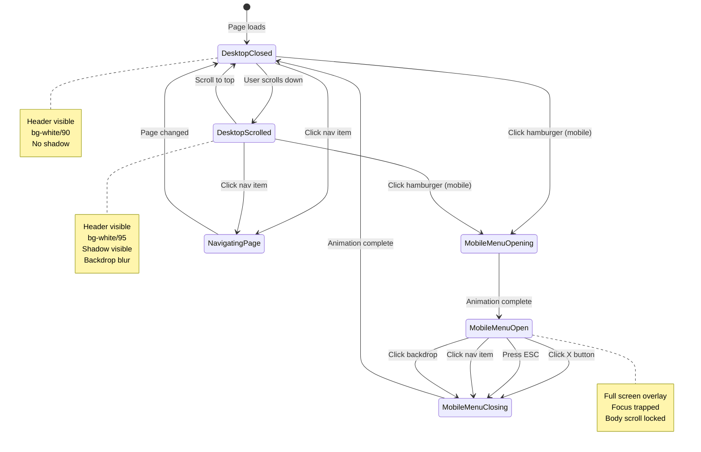
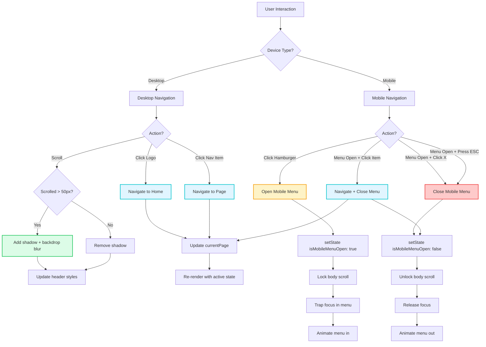
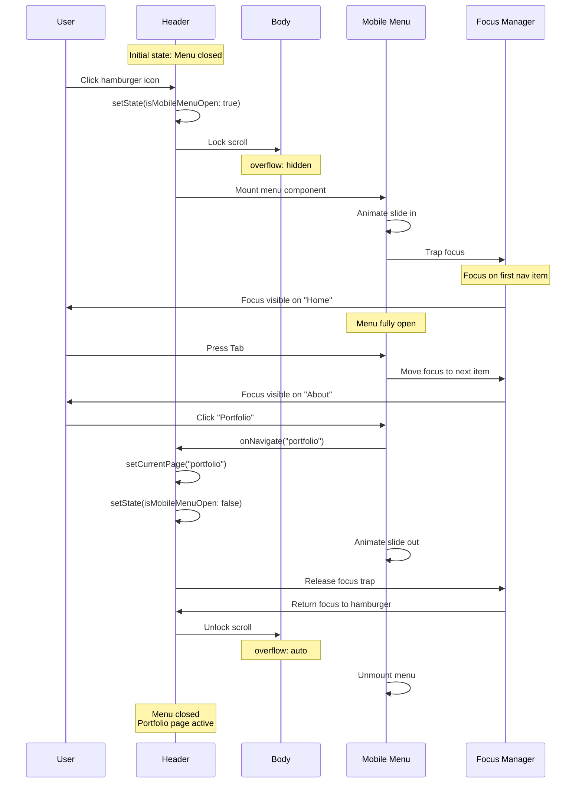

# Header Component

**Version:** 4.0.0  
**Last Updated:** January 2025

The main navigation header with responsive mobile menu, accessibility features, and smooth scroll behavior.

## Purpose

Provide consistent site-wide navigation with:
- Desktop horizontal navigation
- Mobile hamburger menu
- Active page indication
- Accessibility compliance (WCAG 2.1 AA)
- Sticky positioning for easy access
- Focus management and keyboard navigation

---

## Usage

### Basic Usage

```tsx
import { Header } from './components/common/Header';

<Header 
  currentPage="home"
  onNavigate={(page) => setCurrentPage(page)}
/>
```

### With Custom Styling

```tsx
<Header 
  currentPage="portfolio"
  onNavigate={handleNavigate}
  className="border-b border-gray-200"
/>
```

---

## Props

```typescript
interface HeaderProps {
  /**
   * Current active page
   * @required
   */
  currentPage: 'home' | 'about' | 'portfolio' | 'blog';
  
  /**
   * Navigation handler
   * @required
   */
  onNavigate: (page: string) => void;
  
  /**
   * Additional CSS classes
   * @default ""
   */
  className?: string;
  
  /**
   * Whether header should be sticky
   * @default true
   */
  sticky?: boolean;
  
  /**
   * Background transparency
   * @default true
   */
  transparent?: boolean;
}
```

---

## Features

### Sticky Positioning

```tsx
<header className="fixed top-0 left-0 right-0 z-50 bg-white/90 backdrop-blur-md">
  {/* Header content */}
</header>
```

### Mobile Menu

```tsx
const [isMobileMenuOpen, setIsMobileMenuOpen] = useState(false);

// Mobile menu button
<button 
  className="lg:hidden"
  onClick={() => setIsMobileMenuOpen(true)}
  aria-label="Open navigation menu"
>
  <Menu className="w-6 h-6" />
</button>

// Mobile menu overlay
{isMobileMenuOpen && (
  <div className="fixed inset-0 bg-white z-50 lg:hidden">
    {/* Mobile menu content */}
  </div>
)}
```

### Active Page Indication

```tsx
<nav>
  {navItems.map(item => (
    <a
      key={item.id}
      className={`
        ${currentPage === item.id 
          ? 'text-gradient-pink-purple-blue font-semibold' 
          : 'text-gray-700 hover:text-pink-500'
        }
      `}
    >
      {item.label}
    </a>
  ))}
</nav>
```

---

## Implementation Example

Complete header implementation:

```tsx
import React, { useState, useEffect } from 'react';
import { Menu, X } from 'lucide-react';
import { Logo } from './Logo';

interface HeaderProps {
  currentPage: 'home' | 'about' | 'portfolio' | 'blog';
  onNavigate: (page: string) => void;
  className?: string;
  sticky?: boolean;
}

export function Header({ 
  currentPage, 
  onNavigate, 
  className = '',
  sticky = true 
}: HeaderProps) {
  const [isMobileMenuOpen, setIsMobileMenuOpen] = useState(false);
  const [scrolled, setScrolled] = useState(false);

  // Track scroll for backdrop blur effect
  useEffect(() => {
    const handleScroll = () => {
      setScrolled(window.scrollY > 10);
    };
    
    window.addEventListener('scroll', handleScroll);
    return () => window.removeEventListener('scroll', handleScroll);
  }, []);

  // Prevent scroll when mobile menu is open
  useEffect(() => {
    if (isMobileMenuOpen) {
      document.body.style.overflow = 'hidden';
    } else {
      document.body.style.overflow = '';
    }
    
    return () => {
      document.body.style.overflow = '';
    };
  }, [isMobileMenuOpen]);

  const navItems = [
    { id: 'home', label: 'Home' },
    { id: 'about', label: 'About' },
    { id: 'portfolio', label: 'Portfolio' },
    { id: 'blog', label: 'Blog' }
  ];

  const handleNavClick = (page: string) => {
    onNavigate(page);
    setIsMobileMenuOpen(false);
  };

  return (
    <>
      <header 
        className={`
          ${sticky ? 'fixed' : 'relative'}
          top-0 left-0 right-0 z-50
          transition-all duration-300
          ${scrolled ? 'bg-white/95 backdrop-blur-md shadow-md' : 'bg-white/90 backdrop-blur-sm'}
          ${className}
        `}
      >
        <div className="max-w-7xl mx-auto px-6 py-4">
          <div className="flex items-center justify-between">
            {/* Logo */}
            <Logo 
              size="md"
              onClick={() => handleNavClick('home')}
              className="cursor-pointer hover:scale-105 transition-transform duration-300"
            />
            
            {/* Desktop Navigation */}
            <nav className="hidden lg:flex items-center gap-8">
              {navItems.map(item => (
                <button
                  key={item.id}
                  onClick={() => handleNavClick(item.id)}
                  className={`
                    font-body font-medium text-fluid-base
                    transition-all duration-300
                    ${currentPage === item.id
                      ? 'text-gradient-pink-purple-blue font-semibold'
                      : 'text-gray-700 hover:text-pink-500'
                    }
                    focus:outline-none focus:ring-2 focus:ring-pink-200 focus:ring-opacity-50 rounded-lg px-3 py-2
                  `}
                >
                  {item.label}
                </button>
              ))}
            </nav>
            
            {/* Mobile Menu Button */}
            <button
              className="lg:hidden p-2 rounded-lg hover:bg-gray-100 transition-colors"
              onClick={() => setIsMobileMenuOpen(true)}
              aria-label="Open navigation menu"
              aria-expanded={isMobileMenuOpen}
            >
              <Menu className="w-6 h-6 text-gray-700" />
            </button>
          </div>
        </div>
      </header>

      {/* Mobile Menu Overlay */}
      {isMobileMenuOpen && (
        <div 
          className="fixed inset-0 bg-white z-50 lg:hidden"
          role="dialog"
          aria-modal="true"
          aria-label="Mobile navigation menu"
        >
          <div className="flex flex-col h-full">
            {/* Mobile Menu Header */}
            <div className="flex items-center justify-between px-6 py-4 border-b border-gray-200">
              <Logo size="sm" />
              
              <button
                onClick={() => setIsMobileMenuOpen(false)}
                aria-label="Close menu"
                className="p-2 rounded-lg hover:bg-gray-100 transition-colors"
              >
                <X className="w-6 h-6 text-gray-700" />
              </button>
            </div>
            
            {/* Mobile Navigation */}
            <nav className="flex-1 flex flex-col items-center justify-center gap-8 px-6">
              {navItems.map(item => (
                <button
                  key={item.id}
                  onClick={() => handleNavClick(item.id)}
                  className={`
                    font-body font-semibold text-fluid-2xl
                    transition-all duration-300
                    ${currentPage === item.id
                      ? 'text-gradient-pink-purple-blue scale-110'
                      : 'text-gray-700 hover:text-pink-500 hover:scale-105'
                    }
                    focus:outline-none focus:ring-4 focus:ring-pink-200 focus:ring-opacity-50 rounded-lg px-6 py-3
                  `}
                >
                  {item.label}
                </button>
              ))}
            </nav>
          </div>
        </div>
      )}
    </>
  );
}
```

---

## Styling Patterns

### Desktop Navigation

```tsx
<nav className="hidden lg:flex items-center gap-8">
  <a className="font-body font-medium text-fluid-base text-gray-700 hover:text-pink-500 transition-colors">
    Home
  </a>
  <a className="font-body font-medium text-fluid-base text-gray-700 hover:text-pink-500 transition-colors">
    About
  </a>
  <a className="font-body font-medium text-fluid-base text-gradient-pink-purple-blue font-semibold">
    Portfolio
  </a>
</nav>
```

### Mobile Menu

```tsx
<nav className="flex flex-col items-center justify-center gap-8">
  <button className="font-body font-semibold text-fluid-2xl text-gray-700 hover:text-pink-500 hover:scale-105 transition-all">
    Home
  </button>
  <button className="font-body font-semibold text-fluid-2xl text-gradient-pink-purple-blue scale-110">
    Portfolio
  </button>
</nav>
```

---

## Accessibility

### Keyboard Navigation

```tsx
// Tab through navigation items
// Enter/Space to activate
// Escape to close mobile menu

const handleKeyDown = (e: React.KeyboardEvent) => {
  if (e.key === 'Escape' && isMobileMenuOpen) {
    setIsMobileMenuOpen(false);
  }
};

<div onKeyDown={handleKeyDown}>
  {/* Header content */}
</div>
```

### Screen Reader Support

```tsx
<header role="banner">
  <nav aria-label="Main navigation">
    <a 
      href="#"
      aria-current={currentPage === 'home' ? 'page' : undefined}
    >
      Home
    </a>
  </nav>
</header>
```

### Focus Management

```tsx
// Trap focus in mobile menu
useEffect(() => {
  if (isMobileMenuOpen) {
    const focusableElements = menuRef.current?.querySelectorAll(
      'button, [href], input, select, textarea, [tabindex]:not([tabindex="-1"])'
    );
    
    const firstElement = focusableElements?.[0] as HTMLElement;
    firstElement?.focus();
  }
}, [isMobileMenuOpen]);
```

---

## Common Patterns

### With CTA Button

```tsx
<Header currentPage={currentPage} onNavigate={handleNavigate}>
  <button className="ml-4 bg-gradient-pink-purple-blue text-white px-button py-2 rounded-lg font-body font-medium text-fluid-sm">
    View Portfolio
  </button>
</Header>
```

### With Search

```tsx
<Header currentPage={currentPage} onNavigate={handleNavigate}>
  <div className="ml-4">
    <SearchBar placeholder="Search..." />
  </div>
</Header>
```

---

## 🎨 Interactive Mermaid Diagrams

### Mermaid State Diagram (Header States)



### Mermaid Flowchart (Navigation Logic)



### Mermaid Sequence Diagram (Mobile Menu Interaction)



---

## Common Mistakes

### ❌ Mistake 1: No Active State

```tsx
// ❌ WRONG - No visual indication of current page
<a href="#">Home</a>
<a href="#">Portfolio</a>
```

**Solution:**
```tsx
// ✅ CORRECT - Clear active state
<a className={currentPage === 'home' ? 'text-gradient-pink-purple-blue font-semibold' : 'text-gray-700'}>
  Home
</a>
```

### ❌ Mistake 2: Missing Mobile Menu

```tsx
// ❌ WRONG - Desktop-only navigation
<nav className="flex gap-8">
  {/* Navigation items */}
</nav>
```

**Solution:**
```tsx
// ✅ CORRECT - Responsive navigation
<nav className="hidden lg:flex gap-8">
  {/* Desktop nav */}
</nav>
<button className="lg:hidden">
  <Menu />
</button>
```

### ❌ Mistake 3: No Scroll Prevention

```tsx
// ❌ WRONG - Page scrolls behind mobile menu
{isMobileMenuOpen && <MobileMenu />}
```

**Solution:**
```tsx
// ✅ CORRECT - Prevent scroll when menu open
useEffect(() => {
  document.body.style.overflow = isMobileMenuOpen ? 'hidden' : '';
}, [isMobileMenuOpen]);
```

---

## Related Components

- **[Logo](./Logo.md)** - Brand logo
- **[Footer](./Footer.md)** - Page footer
- **[SearchBar](./SearchBar.md)** - Search functionality

---

## Related Documentation

- **[Guidelines.md](../Guidelines.md)** - Main guidelines
- **[overview-components.md](../overview-components.md)** - Component system
- **[FILE_STRUCTURE.md](../FILE_STRUCTURE.md)** - File organization
- **[SITEMAP.md](../SITEMAP.md)** - Site navigation structure
- **[design-tokens/spacing.md](../design-tokens/spacing.md)** - Spacing system
- **[design-tokens/colors.md](../design-tokens/colors.md)** - Color system

---

**Last Updated:** January 2025  
**Version:** 4.0.0