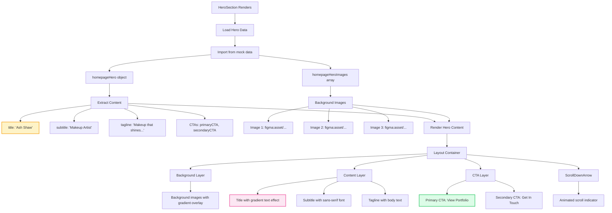
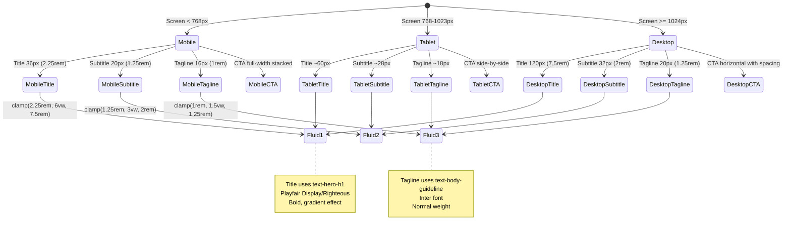
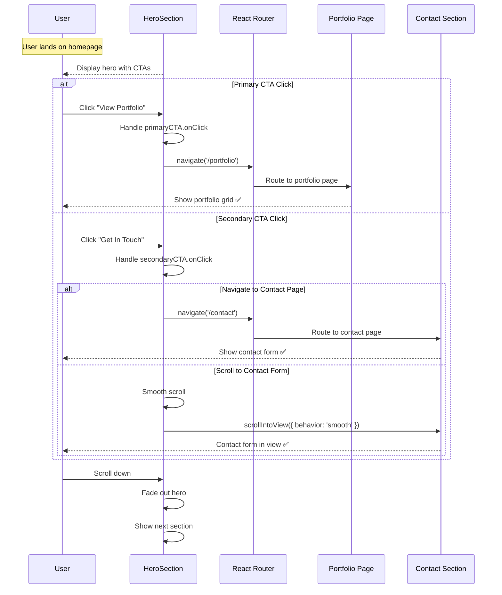
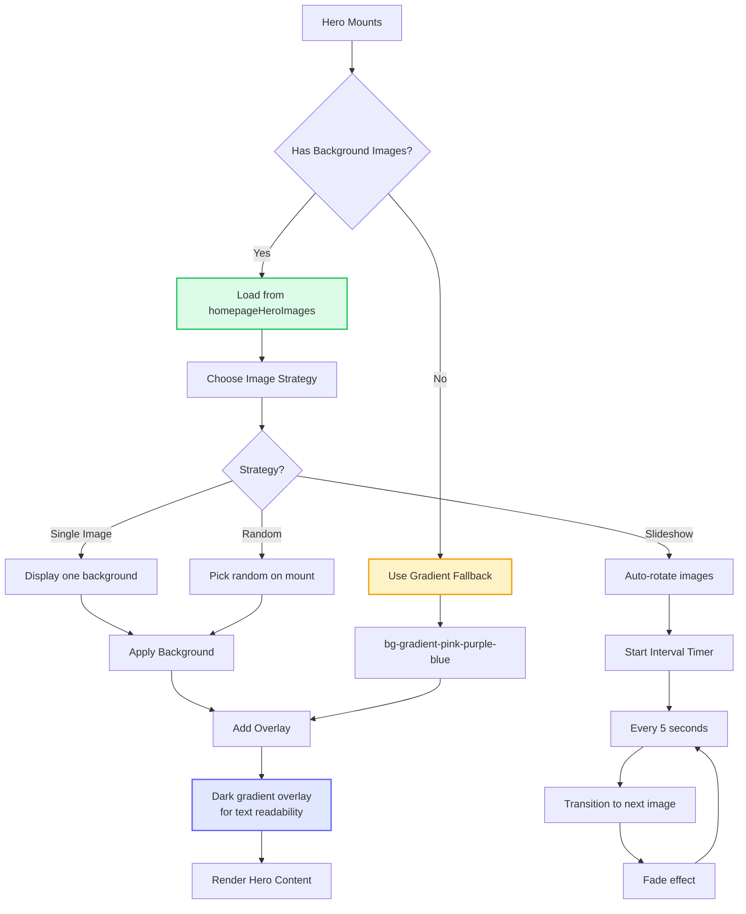
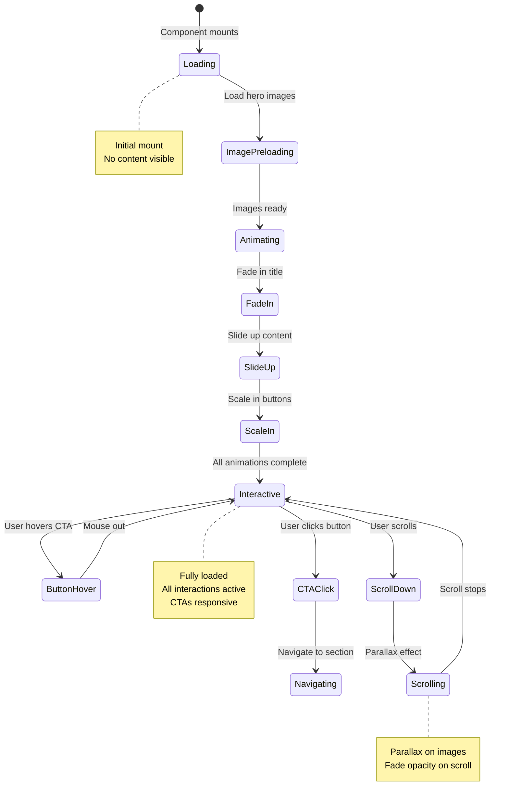
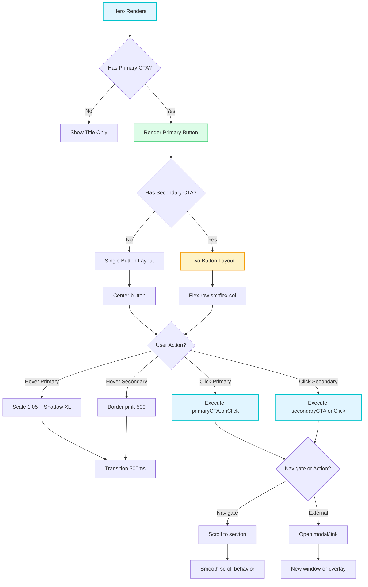
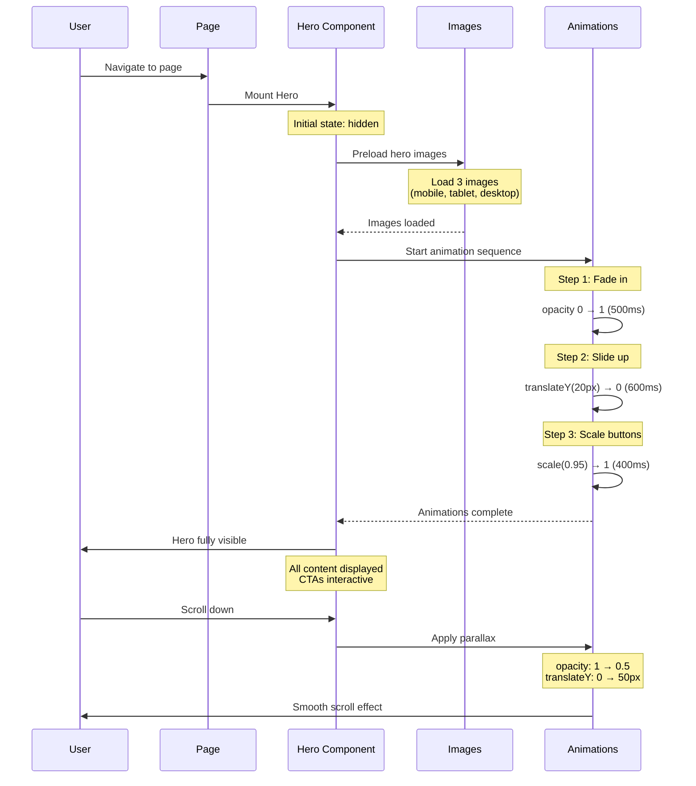

# HeroSection Component

**Version:** 4.0.0  
**Last Updated:** January 2025

Hero banner component for homepage with full-screen layout, gradient text, and call-to-action buttons.

## Purpose

Create impactful homepage hero with:
- Full-screen or large-scale layout
- Gradient text for brand name
- Professional tagline
- Multiple CTA buttons
- Background image or gradient
- ScrollDownArrow integration
- Responsive typography scaling
- Accessibility compliance

---

## Component Architecture

### Hero Section Layout Flow (Mermaid)



### Responsive Typography Scaling (Mermaid)



### CTA Interaction Flow (Mermaid)



### Background Image Handling (Mermaid)



---

## Usage

### Basic Usage

```tsx
import { HeroSection } from './components/sections/HeroSection';

<HeroSection 
  title="Ash Shaw"
  subtitle="Makeup Artist"
  tagline="Makeup that shines with colour, energy, and connection."
/>
```

### With CTAs

```tsx
<HeroSection 
  title="Ash Shaw"
  subtitle="Makeup Artist"
  tagline="Makeup that shines with colour, energy, and connection."
  primaryCTA={{
    text: 'View Portfolio',
    onClick: () => navigate('/portfolio')
  }}
  secondaryCTA={{
    text: 'Get In Touch',
    onClick: () => navigate('/contact')
  }}
/>
```

### With Background Image

```tsx
<HeroSection 
  title="Ash Shaw"
  backgroundImage="/images/hero-background.jpg"
  overlay="dark"
/>
```

---

## Props

```typescript
interface HeroSectionProps {
  /**
   * Main hero title (brand name)
   * @required
   */
  title: string;
  
  /**
   * Subtitle (profession/role)
   * @optional
   */
  subtitle?: string;
  
  /**
   * Tagline/brand message
   * @optional
   */
  tagline?: string;
  
  /**
   * Primary CTA button
   * @optional
   */
  primaryCTA?: {
    text: string;
    onClick: () => void;
    ariaLabel?: string;
  };
  
  /**
   * Secondary CTA button
   * @optional
   */
  secondaryCTA?: {
    text: string;
    onClick: () => void;
    ariaLabel?: string;
  };
  
  /**
   * Background image URL
   * @optional
   */
  backgroundImage?: string;
  
  /**
   * Background overlay type
   * @default "gradient"
   */
  overlay?: 'dark' | 'light' | 'gradient' | 'none';
  
  /**
   * Hero height
   * @default "screen"
   */
  height?: 'screen' | 'large' | 'medium';
  
  /**
   * Text alignment
   * @default "center"
   */
  alignment?: 'left' | 'center' | 'right';
  
  /**
   * Show scroll indicator
   * @default true
   */
  showScrollIndicator?: boolean;
  
  /**
   * Additional CSS classes
   * @default ""
   */
  className?: string;
}
```

---

## Implementation Example

Complete hero section implementation:

```tsx
import React from 'react';
import { Logo } from '../common/Logo';
import { ScrollDownArrow } from '../common/ScrollDownArrow';
import { SocialLinks } from '../common/SocialLinks';

interface HeroSectionProps {
  title: string;
  subtitle?: string;
  tagline?: string;
  primaryCTA?: {
    text: string;
    onClick: () => void;
    ariaLabel?: string;
  };
  secondaryCTA?: {
    text: string;
    onClick: () => void;
    ariaLabel?: string;
  };
  backgroundImage?: string;
  overlay?: 'dark' | 'light' | 'gradient' | 'none';
  height?: 'screen' | 'large' | 'medium';
  alignment?: 'left' | 'center' | 'right';
  showScrollIndicator?: boolean;
  className?: string;
}

export function HeroSection({ 
  title,
  subtitle,
  tagline,
  primaryCTA,
  secondaryCTA,
  backgroundImage,
  overlay = 'gradient',
  height = 'screen',
  alignment = 'center',
  showScrollIndicator = true,
  className = ''
}: HeroSectionProps) {
  const heightClasses = {
    screen: 'min-h-screen',
    large: 'min-h-[80vh]',
    medium: 'min-h-[60vh]'
  };

  const alignmentClasses = {
    left: 'text-left items-start',
    center: 'text-center items-center',
    right: 'text-right items-end'
  };

  const overlayClasses = {
    dark: 'bg-black/50',
    light: 'bg-white/50',
    gradient: 'bg-gradient-to-b from-black/30 via-transparent to-white',
    none: ''
  };

  return (
    <section 
      className={`
        relative ${heightClasses[height]} 
        flex flex-col justify-center
        overflow-hidden
        ${className}
      `}
    >
      {/* Background Image */}
      {backgroundImage && (
        <>
          <div 
            className="absolute inset-0 bg-cover bg-center bg-no-repeat"
            style={{ backgroundImage: `url(${backgroundImage})` }}
            aria-hidden="true"
          />
          
          {/* Overlay */}
          {overlay !== 'none' && (
            <div 
              className={`absolute inset-0 ${overlayClasses[overlay]}`}
              aria-hidden="true"
            />
          )}
        </>
      )}
      
      {/* Content */}
      <div className={`
        relative z-10 
        max-w-7xl mx-auto px-6 py-fluid-xl w-full
        flex flex-col ${alignmentClasses[alignment]}
        gap-fluid-lg
      `}>
        {/* Logo (optional, for branding) */}
        <Logo 
          size="lg"
          className={alignment === 'center' ? 'mx-auto' : ''}
        />
        
        {/* Subtitle */}
        {subtitle && (
          <p className="text-fluid-lg font-body font-medium text-gray-700 tracking-wide uppercase">
            {subtitle}
          </p>
        )}
        
        {/* Main Title */}
        <h1 className="text-hero-h1 font-title font-bold text-gradient-pink-purple-blue leading-tight tracking-tight">
          {title}
        </h1>
        
        {/* Tagline */}
        {tagline && (
          <p className="text-body-guideline font-body text-gray-700 max-w-2xl leading-relaxed">
            {tagline}
          </p>
        )}
        
        {/* CTAs */}
        {(primaryCTA || secondaryCTA) && (
          <div className={`
            flex flex-col sm:flex-row gap-4 mt-fluid-md
            ${alignment === 'center' ? 'justify-center' : ''}
            ${alignment === 'right' ? 'justify-end' : ''}
          `}>
            {primaryCTA && (
              <button
                onClick={primaryCTA.onClick}
                aria-label={primaryCTA.ariaLabel || primaryCTA.text}
                className="bg-gradient-pink-purple-blue hover:from-purple-700 hover:to-pink-700 text-white px-button py-button font-body font-medium text-button-fluid rounded-lg shadow-lg hover:shadow-xl transform hover:scale-105 transition-all duration-300 focus:outline-none focus:ring-4 focus:ring-pink-200 focus:ring-opacity-50"
              >
                {primaryCTA.text}
              </button>
            )}
            
            {secondaryCTA && (
              <button
                onClick={secondaryCTA.onClick}
                aria-label={secondaryCTA.ariaLabel || secondaryCTA.text}
                className="bg-white hover:bg-gray-50 text-gray-800 px-button py-button font-body font-medium text-button-fluid rounded-lg border-2 border-gray-300 hover:border-pink-500 shadow-md hover:shadow-lg transition-all duration-300 focus:outline-none focus:ring-4 focus:ring-pink-200 focus:ring-opacity-50"
              >
                {secondaryCTA.text}
              </button>
            )}
          </div>
        )}
        
        {/* Social Links */}
        <SocialLinks 
          iconSize={24}
          className={`
            text-gray-600 mt-fluid-md
            ${alignment === 'center' ? 'justify-center' : ''}
          `}
        />
      </div>
      
      {/* Scroll Indicator */}
      {showScrollIndicator && (
        <ScrollDownArrow className="absolute bottom-8 left-1/2 -translate-x-1/2" />
      )}
    </section>
  );
}
```

---

## Usage Patterns

### Homepage Hero

```tsx
function HomePage() {
  const navigate = useNavigate();
  
  return (
    <>
      <HeroSection 
        title="Ash Shaw"
        subtitle="Makeup Artist"
        tagline="Makeup that shines with colour, energy, and connection."
        primaryCTA={{
          text: 'View Portfolio',
          onClick: () => navigate('/portfolio')
        }}
        secondaryCTA={{
          text: 'Get In Touch',
          onClick: () => scrollToContact()
        }}
        showScrollIndicator={true}
      />
      
      {/* Rest of homepage content */}
    </>
  );
}
```

### With Background Image

```tsx
<HeroSection 
  title="Ash Shaw"
  subtitle="Professional Makeup Artist"
  tagline="Creating stunning looks for festivals, editorials, and special events."
  backgroundImage="/images/hero-festival-makeup.jpg"
  overlay="dark"
  primaryCTA={{
    text: 'Book Now',
    onClick: () => navigate('/contact')
  }}
/>
```

### Minimal Hero

```tsx
<HeroSection 
  title="Blog"
  tagline="Makeup tips, tutorials, and industry insights"
  height="medium"
  alignment="center"
  showScrollIndicator={false}
/>
```

### About Page Hero

```tsx
<HeroSection 
  title="About Me"
  subtitle="My Journey"
  tagline="From passion to profession - discover how makeup artistry became my calling."
  height="large"
  alignment="left"
  showScrollIndicator={false}
/>
```

---

## Advanced Features

### With Animated Entrance

```tsx
import { motion } from 'motion/react';

<section className="min-h-screen flex items-center justify-center">
  <motion.div
    initial={{ opacity: 0, y: 20 }}
    animate={{ opacity: 1, y: 0 }}
    transition={{ duration: 0.8 }}
    className="text-center"
  >
    <h1 className="text-hero-h1 font-title font-bold text-gradient-pink-purple-blue">
      {title}
    </h1>
  </motion.div>
</section>
```

### With Video Background

```tsx
<section className="relative min-h-screen">
  <video
    autoPlay
    loop
    muted
    playsInline
    className="absolute inset-0 w-full h-full object-cover"
  >
    <source src="/videos/hero-background.mp4" type="video/mp4" />
  </video>
  
  <div className="absolute inset-0 bg-black/40" />
  
  <div className="relative z-10 min-h-screen flex items-center justify-center">
    {/* Hero content */}
  </div>
</section>
```

### With Particles Effect

```tsx
import Particles from 'react-particles';

<section className="relative min-h-screen">
  <Particles className="absolute inset-0" options={particlesConfig} />
  
  <div className="relative z-10">
    {/* Hero content */}
  </div>
</section>
```

---

## Styling Variations

### Gradient Background

```tsx
<section className="min-h-screen bg-gradient-to-br from-pink-100 via-purple-50 to-blue-100">
  <HeroSection title="Ash Shaw" />
</section>
```

### Split Hero (Image + Content)

```tsx
<section className="min-h-screen grid grid-cols-1 lg:grid-cols-2">
  <div className="flex items-center justify-center p-fluid-xl">
    <div>
      <h1 className="text-hero-h1 font-title font-bold text-gradient-pink-purple-blue">
        Ash Shaw
      </h1>
      <p className="text-body-guideline font-body text-gray-700 mt-fluid-md">
        Professional makeup artist specializing in creative and editorial looks
      </p>
    </div>
  </div>
  
  <div className="bg-cover bg-center" style={{ backgroundImage: 'url(/hero.jpg)' }} />
</section>
```

---

## Accessibility

### Semantic HTML

```tsx
<section 
  role="banner"
  aria-label="Page hero"
>
  <h1>{title}</h1>
  <p>{tagline}</p>
</section>
```

### Keyboard Navigation

```tsx
<button
  onClick={primaryCTA.onClick}
  onKeyDown={(e) => {
    if (e.key === 'Enter' || e.key === ' ') {
      e.preventDefault();
      primaryCTA.onClick();
    }
  }}
  className="focus:outline-none focus:ring-4 focus:ring-pink-200 focus:ring-opacity-50"
>
  {primaryCTA.text}
</button>
```

### Background Image Alt

```tsx
{backgroundImage && (
  <div 
    role="img"
    aria-label="Hero background image showing makeup artistry"
    className="absolute inset-0 bg-cover bg-center"
    style={{ backgroundImage: `url(${backgroundImage})` }}
  />
)}
```

---

## Common Mistakes

### ❌ Mistake 1: Poor Text Contrast

```tsx
// ❌ WRONG - Text hard to read on background
<div className="bg-cover" style={{ backgroundImage: 'url(...)' }}>
  <h1 className="text-white">Title</h1>
</div>
```

**Solution:**
```tsx
// ✅ CORRECT - Add overlay for readability
<div className="relative">
  <div className="absolute inset-0 bg-cover" style={{ backgroundImage: 'url(...)' }} />
  <div className="absolute inset-0 bg-black/50" />
  <h1 className="relative z-10 text-white">Title</h1>
</div>
```

### ❌ Mistake 2: No Mobile Optimization

```tsx
// ❌ WRONG - Same size on all screens
<h1 className="text-9xl">Title</h1>
```

**Solution:**
```tsx
// ✅ CORRECT - Fluid typography
<h1 className="text-hero-h1">Title</h1>
```

---

## Related Components

- **[Logo](./Logo.md)** - Brand logo
- **[ScrollDownArrow](./ScrollDownArrow.md)** - Scroll indicator
- **[SocialLinks](./SocialLinks.md)** - Social media links

---

## Related Documentation

- **[Guidelines.md](../Guidelines.md)** - Main guidelines
- **[overview-components.md](../overview-components.md)** - Component system
- **[FILE_STRUCTURE.md](../FILE_STRUCTURE.md)** - File organization
- **[design-tokens/typography.md](../design-tokens/typography.md)** - Typography scale
- **[design-tokens/colors.md](../design-tokens/colors.md)** - Color system
- **[design-tokens/spacing.md](../design-tokens/spacing.md)** - Spacing system

---

## 🎨 Interactive Mermaid Diagrams

### Mermaid State Diagram (Hero Animation States)



### Mermaid Flowchart (Hero CTA Logic)



### Mermaid Sequence Diagram (Hero Load Sequence)



---

**Last Updated:** January 2025  
**Version:** 4.0.0