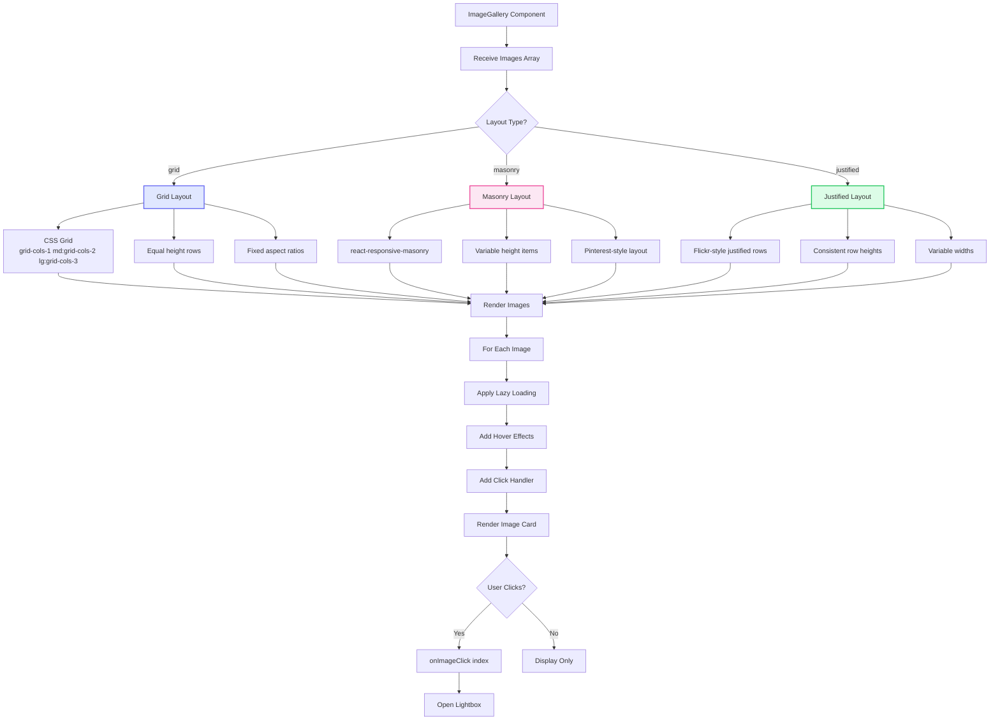
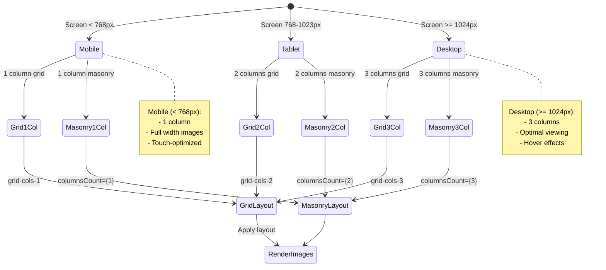
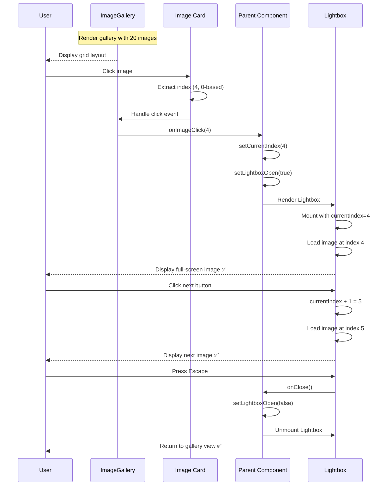
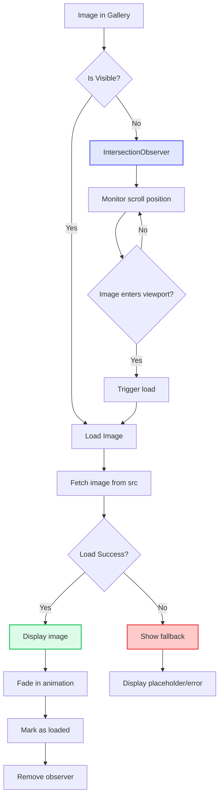
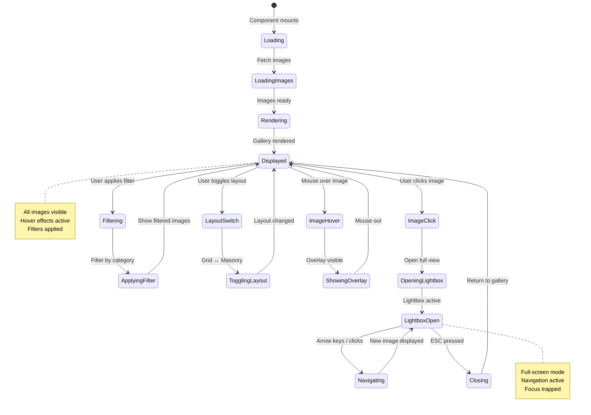
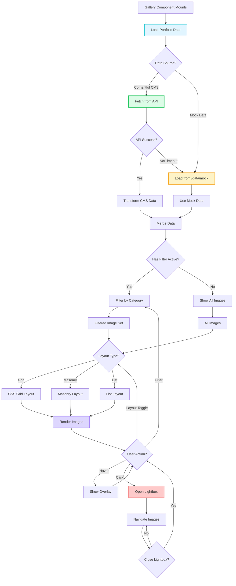
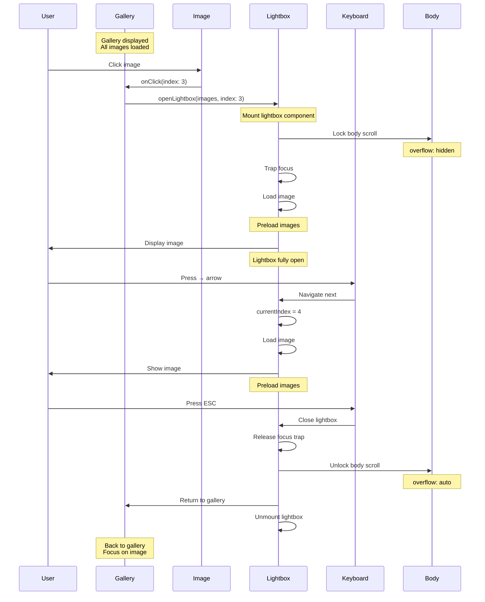

# ImageGallery Component

**Version:** 4.0.0  
**Last Updated:** January 2025

Responsive image gallery with multiple layout options and lightbox integration.

## Purpose

Display image collections with:
- Grid, masonry, and justified layouts
- Responsive column counts
- Lazy loading for performance
- Lightbox integration for full-screen viewing
- Hover effects and captions
- Accessibility compliance
- Touch-friendly on mobile

---

## Component Architecture

### Image Gallery Layout Flow (Mermaid)



### Responsive Column Breakpoints (Mermaid)



### Image Click to Lightbox Flow (Mermaid)



### Lazy Loading Implementation (Mermaid)



---

## Usage

### Basic Usage

```tsx
import { ImageGallery } from './components/ui/ImageGallery';

<ImageGallery 
  images={images}
  layout="grid"
/>
```

### With Lightbox

```tsx
const [lightboxOpen, setLightboxOpen] = useState(false);
const [currentIndex, setCurrentIndex] = useState(0);

<ImageGallery 
  images={images}
  layout="masonry"
  onImageClick={(index) => {
    setCurrentIndex(index);
    setLightboxOpen(true);
  }}
/>

<Lightbox 
  images={images}
  currentIndex={currentIndex}
  isOpen={lightboxOpen}
  onClose={() => setLightboxOpen(false)}
  onNavigate={setCurrentIndex}
/>
```

### Portfolio Gallery

```tsx
<ImageGallery 
  images={portfolioEntry.images}
  layout="grid"
  columns={{ sm: 2, md: 3, lg: 4 }}
  gap="md"
/>
```

---

## Props

```typescript
interface ImageGalleryProps {
  /**
   * Array of image URLs or image objects
   * @required
   */
  images: string[] | GalleryImage[];
  
  /**
   * Gallery layout type
   * @default "grid"
   */
  layout?: 'grid' | 'masonry' | 'justified';
  
  /**
   * Number of columns per breakpoint
   * @default { sm: 1, md: 2, lg: 3 }
   */
  columns?: {
    sm?: number;
    md?: number;
    lg?: number;
    xl?: number;
  };
  
  /**
   * Gap size between images
   * @default "md"
   */
  gap?: 'sm' | 'md' | 'lg';
  
  /**
   * Image click handler
   * @optional
   */
  onImageClick?: (index: number) => void;
  
  /**
   * Show captions
   * @default false
   */
  showCaptions?: boolean;
  
  /**
   * Enable lazy loading
   * @default true
   */
  lazyLoad?: boolean;
  
  /**
   * Aspect ratio for grid layout
   * @default "square"
   */
  aspectRatio?: 'square' | '4/3' | '16/9' | 'auto';
  
  /**
   * Additional CSS classes
   * @default ""
   */
  className?: string;
}

interface GalleryImage {
  url: string;
  alt?: string;
  caption?: string;
  thumbnail?: string;
}
```

---

## Features

### Layout Types

```tsx
// Grid Layout
const GridLayout = ({ images, columns, gap }: Props) => (
  <div className={`
    grid 
    grid-cols-${columns.sm} 
    md:grid-cols-${columns.md} 
    lg:grid-cols-${columns.lg}
    gap-${gap}
  `}>
    {images.map((image, index) => (
      <ImageItem key={index} image={image} />
    ))}
  </div>
);

// Masonry Layout (CSS columns)
const MasonryLayout = ({ images, columns }: Props) => (
  <div className={`
    columns-${columns.sm}
    md:columns-${columns.md}
    lg:columns-${columns.lg}
  `}>
    {images.map((image, index) => (
      <div key={index} className="break-inside-avoid mb-4">
        <ImageItem image={image} />
      </div>
    ))}
  </div>
);
```

### Lazy Loading

```tsx

```

### Hover Effects

```tsx
<div className="group relative overflow-hidden cursor-pointer">
  
  
  <div className="absolute inset-0 bg-black/50 opacity-0 group-hover:opacity-100 transition-opacity">
    <div className="absolute inset-0 flex items-center justify-center">
      <Expand className="w-8 h-8 text-white" />
    </div>
  </div>
</div>
```

---

## Implementation Example

Complete image gallery implementation:

```tsx
import React from 'react';
import { Expand } from 'lucide-react';

interface ImageGalleryProps {
  images: string[] | GalleryImage[];
  layout?: 'grid' | 'masonry' | 'justified';
  columns?: {
    sm?: number;
    md?: number;
    lg?: number;
  };
  gap?: 'sm' | 'md' | 'lg';
  onImageClick?: (index: number) => void;
  showCaptions?: boolean;
  lazyLoad?: boolean;
  aspectRatio?: 'square' | '4/3' | '16/9' | 'auto';
  className?: string;
}

interface GalleryImage {
  url: string;
  alt?: string;
  caption?: string;

}

export function ImageGallery({ 
  images,
  layout = 'grid',
  columns = { sm: 1, md: 2, lg: 3 },
  gap = 'md',
  onImageClick,
  showCaptions = false,
  lazyLoad = true,
  aspectRatio = 'square',
  className = ''
}: ImageGalleryProps) {
  const gapClasses = {
    sm: 'gap-2',
    md: 'gap-4',
    lg: 'gap-6'
  };

  const aspectRatioClasses = {
    square: 'aspect-square',
    '4/3': 'aspect-[4/3]',
    '16/9': 'aspect-[16/9]',
    auto: ''
  };

  const normalizedImages: GalleryImage[] = images.map(img => 
    typeof img === 'string' ? { url: img } : img
  );

  // Grid Layout
  if (layout === 'grid') {
    return (
      <div 
        className={`
          grid 
          grid-cols-${columns.sm} 
          md:grid-cols-${columns.md} 
          lg:grid-cols-${columns.lg}
          ${gapClasses[gap]}
          ${className}
        `}
      >
        {normalizedImages.map((image, index) => (
          <div
            key={index}
            className={`
              group relative overflow-hidden rounded-lg
              ${aspectRatioClasses[aspectRatio]}
              ${onImageClick ? 'cursor-pointer' : ''}
            `}
            onClick={() => onImageClick?.(index)}
          >
            
            
            {/* Hover Overlay */}
            {onImageClick && (
              <div className="absolute inset-0 bg-black/50 opacity-0 group-hover:opacity-100 transition-opacity duration-300 flex items-center justify-center">
                <Expand className="w-8 h-8 text-white" />
              </div>
            )}
            
            {/* Caption */}
            {showCaptions && image.caption && (
              <div className="absolute bottom-0 left-0 right-0 bg-gradient-to-t from-black/70 to-transparent p-4">
                <p className="text-white text-fluid-sm font-body">
                  {image.caption}
                </p>
              </div>
            )}
          </div>
        ))}
      </div>
    );
  }

  // Masonry Layout
  if (layout === 'masonry') {
    return (
      <div 
        className={`
          columns-${columns.sm}
          md:columns-${columns.md}
          lg:columns-${columns.lg}
          ${gapClasses[gap]}
          ${className}
        `}
      >
        {normalizedImages.map((image, index) => (
          <div
            key={index}
            className={`
              break-inside-avoid mb-${gap === 'sm' ? '2' : gap === 'md' ? '4' : '6'}
              group relative overflow-hidden rounded-lg
              ${onImageClick ? 'cursor-pointer' : ''}
            `}
            onClick={() => onImageClick?.(index)}
          >
            
            
            {onImageClick && (
              <div className="absolute inset-0 bg-black/50 opacity-0 group-hover:opacity-100 transition-opacity duration-300 flex items-center justify-center">
                <Expand className="w-8 h-8 text-white" />
              </div>
            )}
            
            {showCaptions && image.caption && (
              <div className="absolute bottom-0 left-0 right-0 bg-gradient-to-t from-black/70 to-transparent p-4">
                <p className="text-white text-fluid-sm font-body">
                  {image.caption}
                </p>
              </div>
            )}
          </div>
        ))}
      </div>
    );
  }

  // Justified Layout (flex with varying widths)
  return (
    <div className={`flex flex-wrap ${gapClasses[gap]} ${className}`}>
      {normalizedImages.map((image, index) => (
        <div
          key={index}
          className={`
            flex-grow group relative overflow-hidden rounded-lg
            ${onImageClick ? 'cursor-pointer' : ''}
          `}
          style={{ flexBasis: `${Math.random() * 200 + 200}px` }}
          onClick={() => onImageClick?.(index)}
        >
          
          
          {onImageClick && (
            <div className="absolute inset-0 bg-black/50 opacity-0 group-hover:opacity-100 transition-opacity duration-300 flex items-center justify-center">
              <Expand className="w-8 h-8 text-white" />
            </div>
          )}
        </div>
      ))}
    </div>
  );
}
```

---

## Usage Patterns

### Portfolio Page Gallery

```tsx
function PortfolioEntry({ entry }: Props) {
  const [lightboxOpen, setLightboxOpen] = useState(false);
  const [currentIndex, setCurrentIndex] = useState(0);
  
  return (
    <section className="py-section">
      <div className="max-w-7xl mx-auto px-6">
        <h1 className="text-section-h2 font-heading font-semibold mb-fluid-lg">
          {entry.title}
        </h1>
        
        <ImageGallery 
          images={entry.images}
          layout="masonry"
          columns={{ sm: 1, md: 2, lg: 3 }}
          gap="md"
          onImageClick={(index) => {
            setCurrentIndex(index);
            setLightboxOpen(true);
          }}
        />
      </div>
      
      <Lightbox 
        images={entry.images}
        currentIndex={currentIndex}
        isOpen={lightboxOpen}
        onClose={() => setLightboxOpen(false)}
        onNavigate={setCurrentIndex}
        title={entry.title}
      />
    </section>
  );
}
```

### Instagram-Style Grid

```tsx
<ImageGallery 
  images={instagramImages}
  layout="grid"
  columns={{ sm: 3, md: 3, lg: 3 }}
  gap="sm"
  aspectRatio="square"
  onImageClick={handleImageClick}
/>
```

### Before/After Gallery

```tsx
const beforeAfterImages = [
  { url: '/before1.jpg', caption: 'Before' },
  { url: '/after1.jpg', caption: 'After' },
  { url: '/before2.jpg', caption: 'Before' },
  { url: '/after2.jpg', caption: 'After' }
];

<ImageGallery 
  images={beforeAfterImages}
  layout="grid"
  columns={{ sm: 2, md: 2, lg: 2 }}
  showCaptions={true}
/>
```

### Full-Width Hero Gallery

```tsx
<ImageGallery 
  images={heroImages}
  layout="justified"
  gap="sm"
  className="w-full"
  onImageClick={handleImageClick}
/>
```

---

## Advanced Features

### With Category Filtering

```tsx
function FilteredGallery({ allImages }: Props) {
  const [category, setCategory] = useState('all');
  
  const filteredImages = category === 'all'
    ? allImages
    : allImages.filter(img => img.category === category);
  
  return (
    <>
      <CategoryFilter 
        categories={categories}
        activeCategory={category}
        onCategoryChange={setCategory}
      />
      
      <ImageGallery 
        images={filteredImages}
        layout="masonry"
      />
    </>
  );
}
```

### With Load More

```tsx
function PaginatedGallery({ images }: Props) {
  const [visibleCount, setVisibleCount] = useState(12);
  const visibleImages = images.slice(0, visibleCount);
  
  return (
    <>
      <ImageGallery images={visibleImages} layout="grid" />
      
      {visibleCount < images.length && (
        <div className="text-center mt-fluid-lg">
          <button
            onClick={() => setVisibleCount(prev => prev + 12)}
            className="bg-gradient-pink-purple-blue text-white px-button py-button rounded-lg font-body font-medium"
          >
            Load More
          </button>
        </div>
      )}
    </>
  );
}
```

### With Skeleton Loading

```tsx
function GalleryWithLoading({ images, isLoading }: Props) {
  if (isLoading) {
    return (
      <div className="grid grid-cols-3 gap-4">
        {[...Array(9)].map((_, i) => (
          <div key={i} className="aspect-square bg-gray-200 animate-pulse rounded-lg" />
        ))}
      </div>
    );
  }
  
  return <ImageGallery images={images} />;
}
```

---

## Accessibility

### Semantic HTML

```tsx
<figure>
  
  
  {image.caption && (
    <figcaption>{image.caption}</figcaption>
  )}
</figure>
```

### Keyboard Navigation

```tsx
<div
  tabIndex={0}
  onClick={() => onImageClick(index)}
  onKeyDown={(e) => {
    if (e.key === 'Enter' || e.key === ' ') {
      e.preventDefault();
      onImageClick(index);
    }
  }}
  className="focus:outline-none focus:ring-4 focus:ring-pink-200 rounded-lg"
>
  
</div>
```

### ARIA Labels

```tsx
<nav aria-label="Image gallery">
  <div className="grid grid-cols-3 gap-4">
    {images.map((image, index) => (
      <button
        key={index}
        onClick={() => onImageClick(index)}
        aria-label={`View ${image.alt || `image ${index + 1}`} in lightbox`}
      >
        
      </button>
    ))}
  </div>
</nav>
```

---

## Common Mistakes

### ❌ Mistake 1: Missing Alt Text

```tsx
// ❌ WRONG

```

**Solution:**
```tsx
// ✅ CORRECT

```

### ❌ Mistake 2: Not Lazy Loading

```tsx
// ❌ WRONG - All images load immediately

```

**Solution:**
```tsx
// ✅ CORRECT - Lazy load for performance

```

### ❌ Mistake 3: Fixed Column Count

```tsx
// ❌ WRONG - Same columns on all screens
<div className="grid grid-cols-4">
```

**Solution:**
```tsx
// ✅ CORRECT - Responsive columns
<div className="grid grid-cols-1 md:grid-cols-2 lg:grid-cols-4">
```

---

## 🎨 Interactive Mermaid Diagrams

### Mermaid State Diagram (Gallery States)



### Mermaid Flowchart (Image Loading & Display)



### Mermaid Sequence Diagram (Image Click → Lightbox)



---

## Related Components

- **[Lightbox](./Lightbox.md)** - Full-screen viewer
- **[PortfolioCard](./PortfolioCard.md)** - Portfolio items
- **[CategoryFilter](./CategoryFilter.md)** - Filtering

---

## Related Documentation

- **[Guidelines.md](../Guidelines.md)** - Main guidelines
- **[overview-components.md](../overview-components.md)** - Component system
- **[FILE_STRUCTURE.md](../FILE_STRUCTURE.md)** - File organization
- **[design-tokens/spacing.md](../design-tokens/spacing.md)** - Spacing system

---