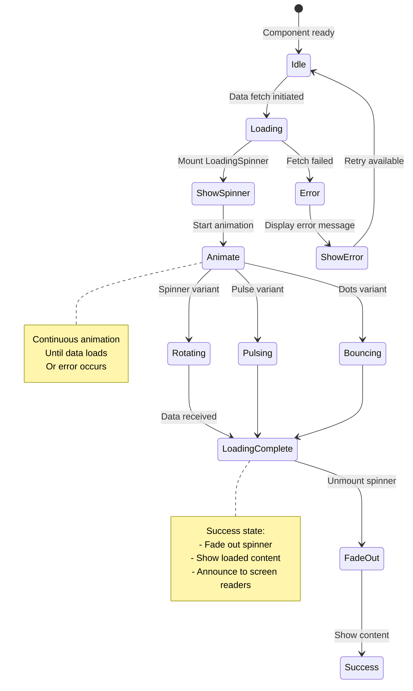
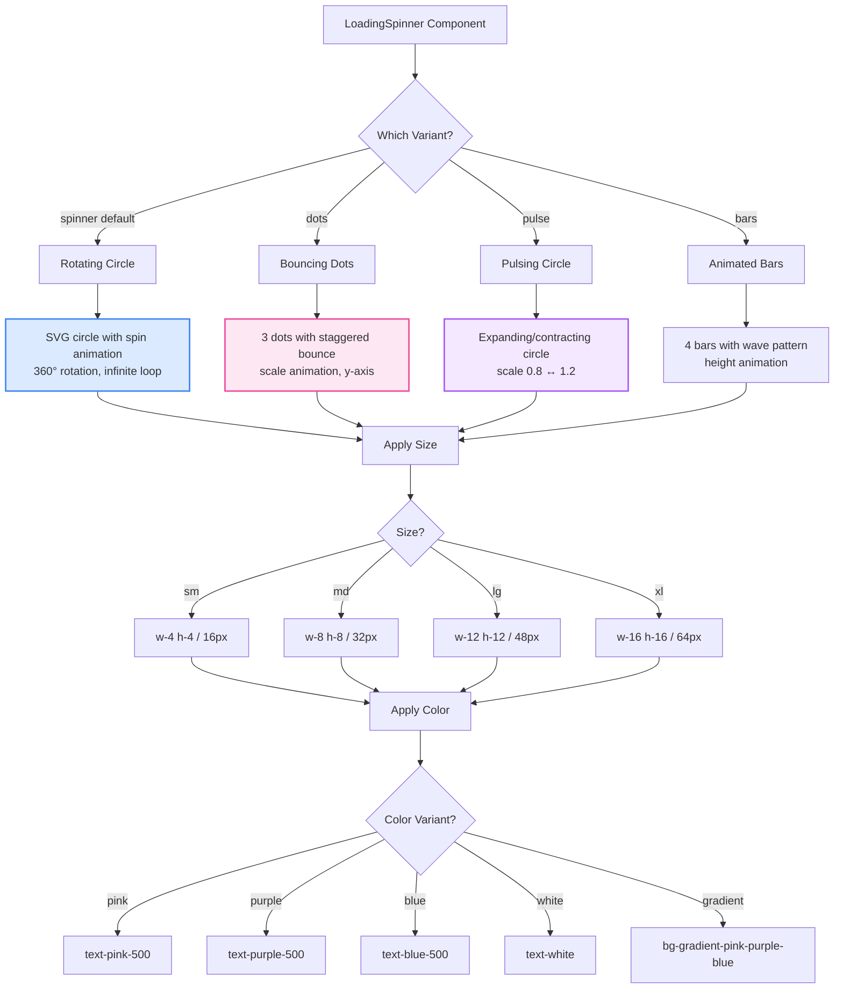
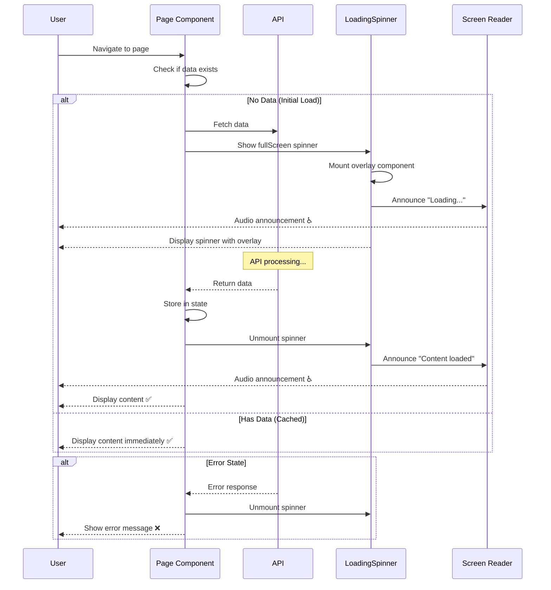

# LoadingSpinner Component

**Version:** 4.0.0  
**Last Updated:** January 2025

Loading indicator component with multiple variants and size options.

## Purpose

Provide loading state feedback with:
- Multiple visual styles (spinner, dots, pulse)
- Size variants (sm, md, lg, xl)
- Color customization
- Full-screen overlay option
- Accessible loading announcements
- Smooth animations

---

## Component Architecture

### Loading State Flow (Mermaid)



### Loading Spinner Variants (Mermaid)



### Full-Screen Loading Flow (Mermaid)



---

## Usage

### Basic Usage

```tsx
import { LoadingSpinner } from './components/ui/LoadingSpinner';

<LoadingSpinner />
```

### With Custom Size and Color

```tsx
<LoadingSpinner 
  size="lg"
  color="pink"
/>
```

### Full-Screen Overlay

```tsx
<LoadingSpinner 
  fullScreen
  text="Loading portfolio..."
/>
```

### Different Variants

```tsx
<LoadingSpinner variant="spinner" />
<LoadingSpinner variant="dots" />
<LoadingSpinner variant="pulse" />
```

---

## Props

```typescript
interface LoadingSpinnerProps {
  /**
   * Spinner variant
   * @default "spinner"
   */
  variant?: 'spinner' | 'dots' | 'pulse' | 'bars';
  
  /**
   * Spinner size
   * @default "md"
   */
  size?: 'sm' | 'md' | 'lg' | 'xl';
  
  /**
   * Color theme
   * @default "pink"
   */
  color?: 'pink' | 'purple' | 'blue' | 'gray' | 'white';
  
  /**
   * Show as full-screen overlay
   * @default false
   */
  fullScreen?: boolean;
  
  /**
   * Loading text to display
   * @optional
   */
  text?: string;
  
  /**
   * Additional CSS classes
   * @default ""
   */
  className?: string;
}
```

---

## Implementation Example

Complete loading spinner implementation:

```tsx
import React from 'react';
import { Loader } from 'lucide-react';

interface LoadingSpinnerProps {
  variant?: 'spinner' | 'dots' | 'pulse' | 'bars';
  size?: 'sm' | 'md' | 'lg' | 'xl';
  color?: 'pink' | 'purple' | 'blue' | 'gray' | 'white';
  fullScreen?: boolean;
  text?: string;
  className?: string;
}

export function LoadingSpinner({ 
  variant = 'spinner',
  size = 'md',
  color = 'pink',
  fullScreen = false,
  text,
  className = ''
}: LoadingSpinnerProps) {
  const sizeClasses = {
    sm: 'w-4 h-4',
    md: 'w-8 h-8',
    lg: 'w-12 h-12',
    xl: 'w-16 h-16'
  };

  const colorClasses = {
    pink: 'text-pink-500',
    purple: 'text-purple-500',
    blue: 'text-blue-500',
    gray: 'text-gray-500',
    white: 'text-white'
  };

  const dotSizes = {
    sm: 'w-1.5 h-1.5',
    md: 'w-2.5 h-2.5',
    lg: 'w-4 h-4',
    xl: 'w-6 h-6'
  };

  // Spinner Variant
  const SpinnerIcon = () => (
    <Loader 
      className={`${sizeClasses[size]} ${colorClasses[color]} animate-spin`}
      aria-hidden="true"
    />
  );

  // Dots Variant
  const DotsVariant = () => (
    <div className="flex gap-2" aria-hidden="true">
      {[0, 1, 2].map(i => (
        <div
          key={i}
          className={`
            ${dotSizes[size]} rounded-full bg-current ${colorClasses[color]}
            animate-bounce
          `}
          style={{ animationDelay: `${i * 0.15}s` }}
        />
      ))}
    </div>
  );

  // Pulse Variant
  const PulseVariant = () => (
    <div 
      className={`
        ${sizeClasses[size]} rounded-full ${colorClasses[color]}
        bg-current opacity-75 animate-ping
      `}
      aria-hidden="true"
    />
  );

  // Bars Variant
  const BarsVariant = () => (
    <div className="flex gap-1 items-end" aria-hidden="true">
      {[0, 1, 2, 3].map(i => (
        <div
          key={i}
          className={`
            w-1 bg-current ${colorClasses[color]}
            animate-pulse
          `}
          style={{ 
            height: size === 'sm' ? '16px' : size === 'md' ? '24px' : size === 'lg' ? '32px' : '40px',
            animationDelay: `${i * 0.1}s`
          }}
        />
      ))}
    </div>
  );

  const renderVariant = () => {
    switch (variant) {
      case 'dots':
        return <DotsVariant />;
      case 'pulse':
        return <PulseVariant />;
      case 'bars':
        return <BarsVariant />;
      default:
        return <SpinnerIcon />;
    }
  };

  const content = (
    <div className="flex flex-col items-center justify-center gap-3">
      {renderVariant()}
      
      {text && (
        <p className={`
          font-body font-medium
          ${size === 'sm' ? 'text-fluid-xs' : size === 'md' ? 'text-fluid-sm' : 'text-fluid-base'}
          ${colorClasses[color]}
        `}>
          {text}
        </p>
      )}
      
      {/* Screen reader announcement */}
      <span className="sr-only" role="status" aria-live="polite">
        {text || 'Loading...'}
      </span>
    </div>
  );

  if (fullScreen) {
    return (
      <div className="fixed inset-0 z-50 flex items-center justify-center bg-white/90 backdrop-blur-sm">
        {content}
      </div>
    );
  }

  return (
    <div className={`flex items-center justify-center ${className}`}>
      {content}
    </div>
  );
}
```

---

## Usage Patterns

### Page Loading

```tsx
function PortfolioPage() {
  const [isLoading, setIsLoading] = useState(true);
  
  useEffect(() => {
    fetchPortfolio().then(() => setIsLoading(false));
  }, []);
  
  if (isLoading) {
    return (
      <LoadingSpinner 
        fullScreen
        text="Loading portfolio..."
        size="lg"
      />
    );
  }
  
  return <PortfolioContent />;
}
```

### Button Loading State

```tsx
function SubmitButton({ onClick, isLoading }: Props) {
  return (
    <button
      onClick={onClick}
      disabled={isLoading}
      className="bg-gradient-pink-purple-blue text-white px-button py-button rounded-lg"
    >
      {isLoading ? (
        <span className="flex items-center gap-2">
          <LoadingSpinner size="sm" color="white" />
          <span>Sending...</span>
        </span>
      ) : (
        'Send Message'
      )}
    </button>
  );
}
```

### Inline Loading

```tsx
<div className="py-fluid-xl">
  <LoadingSpinner 
    variant="dots"
    size="md"
    text="Loading more posts..."
  />
</div>
```

### Card Loading State

```tsx
function BlogCard({ post, isLoading }: Props) {
  if (isLoading) {
    return (
      <div className="bg-white/80 rounded-2xl p-fluid-lg flex items-center justify-center h-64">
        <LoadingSpinner variant="pulse" />
      </div>
    );
  }
  
  return <BlogCardContent post={post} />;
}
```

---

## Advanced Features

### With Progress Percentage

```tsx
function LoadingWithProgress({ progress }: { progress: number }) {
  return (
    <div className="flex flex-col items-center gap-4">
      <LoadingSpinner size="lg" />
      
      <div className="w-64 h-2 bg-gray-200 rounded-full overflow-hidden">
        <div 
          className="h-full bg-gradient-pink-purple-blue transition-all duration-300"
          style={{ width: `${progress}%` }}
        />
      </div>
      
      <p className="text-fluid-sm font-body text-gray-600">
        {progress}% Complete
      </p>
    </div>
  );
}
```

### Custom Gradient Spinner

```tsx
<div className="relative w-12 h-12">
  <div className="absolute inset-0 rounded-full border-4 border-gray-200" />
  <div className="absolute inset-0 rounded-full border-4 border-transparent border-t-pink-500 border-r-purple-500 animate-spin" />
</div>
```

### Skeleton Loading

```tsx
function SkeletonLoader() {
  return (
    <div className="space-y-4 animate-pulse">
      <div className="h-48 bg-gray-200 rounded-lg" />
      <div className="h-4 bg-gray-200 rounded w-3/4" />
      <div className="h-4 bg-gray-200 rounded w-1/2" />
    </div>
  );
}
```

---

## Variants

### Spinner (Default)

```tsx
<LoadingSpinner variant="spinner" />
```
Rotating circle icon - best for general loading.

### Dots

```tsx
<LoadingSpinner variant="dots" />
```
Three bouncing dots - subtle and friendly.

### Pulse

```tsx
<LoadingSpinner variant="pulse" />
```
Pulsing circle - minimal and clean.

### Bars

```tsx
<LoadingSpinner variant="bars" />
```
Animated vertical bars - modern look.

---

## Accessibility

### Screen Reader Announcements

```tsx
<div role="status" aria-live="polite">
  <span className="sr-only">Loading content...</span>
  <LoadingSpinner />
</div>
```

### ARIA Labels

```tsx
<button disabled aria-busy="true" aria-label="Loading...">
  <LoadingSpinner size="sm" />
</button>
```

### Reduced Motion

```tsx
@media (prefers-reduced-motion: reduce) {
  .animate-spin,
  .animate-bounce,
  .animate-pulse {
    animation: none;
  }
}
```

---

## Common Mistakes

### ❌ Mistake 1: No Loading Text

```tsx
// ❌ WRONG - No context for screen readers
<LoadingSpinner />
```

**Solution:**
```tsx
// ✅ CORRECT - Descriptive text
<LoadingSpinner text="Loading portfolio..." />

// Or hidden text for screen readers
<span className="sr-only">Loading...</span>
<LoadingSpinner />
```

### ❌ Mistake 2: Blocking All Interaction

```tsx
// ❌ WRONG - Can't cancel or navigate away
<div className="fixed inset-0 z-50">
  <LoadingSpinner />
</div>
```

**Solution:**
```tsx
// ✅ CORRECT - Allow closing if needed
<div className="fixed inset-0 z-50">
  <LoadingSpinner text="Loading..." />
  <button onClick={onCancel}>Cancel</button>
</div>
```

### ❌ Mistake 3: Wrong Size in Context

```tsx
// ❌ WRONG - Huge spinner in small button
<button className="px-4 py-2">
  <LoadingSpinner size="xl" />
</button>
```

**Solution:**
```tsx
// ✅ CORRECT - Appropriate size
<button className="px-4 py-2">
  <LoadingSpinner size="sm" />
</button>
```

---

## Related Components

- **[Modal](./Modal.md)** - Loading in modals
- **[Button](#)** - Button loading states
- **[ContactForm](./ContactForm.md)** - Form submission loading

---

## Related Documentation

- **[Guidelines.md](../Guidelines.md)** - Main guidelines
- **[overview-components.md](../overview-components.md)** - Component system
- **[FILE_STRUCTURE.md](../FILE_STRUCTURE.md)** - File organization
- **[design-tokens/colors.md](../design-tokens/colors.md)** - Color system

---

**Last Updated:** January 2025  
**Version:** 4.0.0