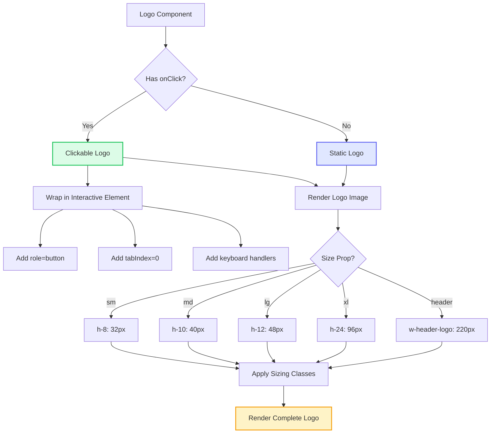
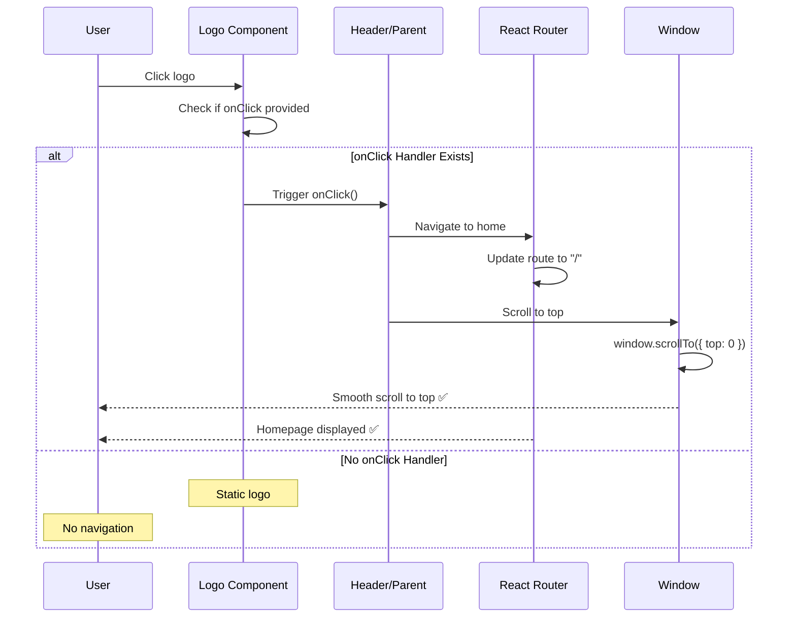
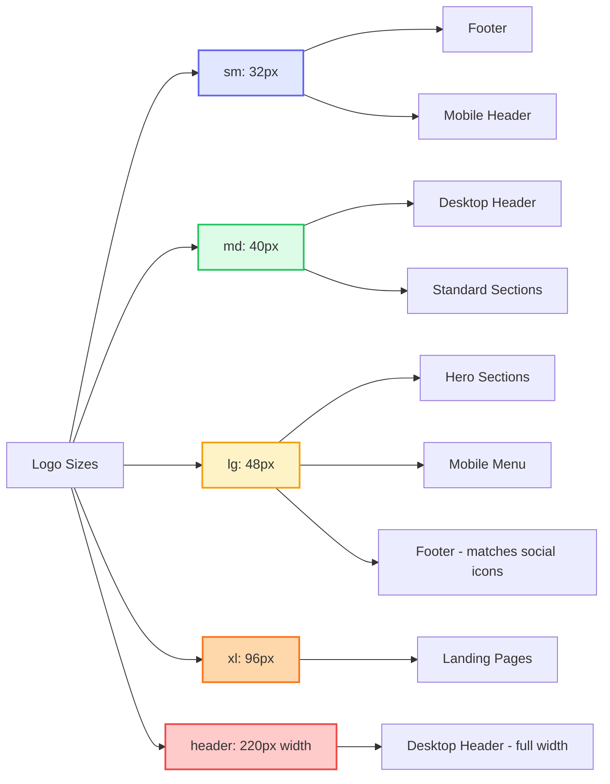

# Logo Component

**Version:** 4.0.0  
**Last Updated:** January 2025

The Logo component displays the Ash Shaw brand logo with responsive sizing, animations, and proper accessibility features.

## Purpose

Display the Ash Shaw brand logo consistently across the site with:
- Responsive sizing for different contexts
- Hover animations and gradient effects
- Proper accessibility labels
- Navigation functionality (links to homepage)

---

## Component Architecture

### Logo Component Flow (Mermaid)



### Logo Click Interaction (Mermaid)



---

## Usage

### Basic Usage

```tsx
import { Logo } from './components/common/Logo';

<Logo size="md" />
```

### With Custom Styling

```tsx
<Logo 
  size="lg"
  className="text-gradient-pink-purple-blue hover:scale-105 transition-transform duration-300"
/>
```

### In Header

```tsx
import { Logo } from './components/common/Logo';

<header className="flex items-center justify-between p-4">
  <Logo 
    size="md"
    onClick={() => navigateToHome()}
    className="cursor-pointer"
  />
  <nav>{/* Navigation items */}</nav>
</header>
```

### In Footer

```tsx
import { Logo } from './components/common/Logo';

<footer className="py-8">
  <Logo 
    size="sm"
    className="mb-4"
  />
  <p className="text-body-guideline font-body">
    Makeup that shines with colour, energy, and connection.
  </p>
</footer>
```

---

## Props

```typescript
interface LogoProps {
  /**
   * Size variant for responsive display
   * @default "md"
   */
  size?: 'sm' | 'md' | 'lg';
  
  /**
   * Additional CSS classes for customization
   * @example "hover:scale-110 transition-transform"
   */
  className?: string;
  
  /**
   * Click handler for navigation
   * @example () => navigateToHome()
   */
  onClick?: () => void;
  
  /**
   * Accessibility label (auto-generated if not provided)
   * @default "Ash Shaw - Makeup Artist, navigate to homepage"
   */
  ariaLabel?: string;
}
```

---

## Size Variants

### Logo Size Comparison (Mermaid)



### Small (`size="sm"`)
- **Usage:** Footer, mobile menu (collapsed), sidebar
- **Dimensions:** Approximately 120px width
- **Font Size:** Smaller text scale for compact spaces

```tsx
<Logo size="sm" />
```

### Medium (`size="md"`) - Default
- **Usage:** Header desktop, standard page sections
- **Dimensions:** Approximately 180px width
- **Font Size:** Standard readable size

```tsx
<Logo size="md" />
```

### Large (`size="lg"`)
- **Usage:** Hero sections, landing pages, mobile menu (expanded)
- **Dimensions:** Approximately 240px width
- **Font Size:** Large, prominent display

```tsx
<Logo size="lg" />
```

---

## Styling

### Typography

The logo uses the brand typography system:

```tsx
<span className="font-heading font-semibold">Ash Shaw</span>
```

**Fonts:**
- Primary: Playfair Display (serif) - elegant, sophisticated
- Secondary: Inter (sans-serif) - modern, readable

### Colors

Logo supports multiple color variations:

#### Default (Text Color)
```tsx
<Logo className="text-gray-800" />
```

#### Gradient (Brand Style)
```tsx
<Logo className="text-gradient-pink-purple-blue" />
```

#### Custom Colors
```tsx
<Logo className="text-purple-600" />
<Logo className="text-white" /> {/* On dark backgrounds */}
```

### Animations

#### Hover Scale
```tsx
<Logo className="hover:scale-105 transition-transform duration-300" />
```

#### Gradient Animation
```tsx
<Logo className="text-gradient-pink-purple-blue animate-gradient-x" />
```

#### Focus States
```tsx
<Logo className="focus:outline-none focus:ring-4 focus:ring-pink-200 focus:ring-opacity-50 rounded-lg" />
```

---

## Common Patterns

### Header Logo (Clickable)

```tsx
import { Logo } from './components/common/Logo';

function Header({ onNavigate }: HeaderProps) {
  return (
    <header className="fixed top-0 left-0 right-0 bg-white/90 backdrop-blur-md z-50 py-4 px-6 shadow-sm">
      <div className="max-w-7xl mx-auto flex items-center justify-between">
        <Logo 
          size="md"
          onClick={() => onNavigate('home')}
          className="cursor-pointer text-gray-800 hover:text-gradient-pink-purple-blue transition-colors duration-300 focus:outline-none focus:ring-4 focus:ring-pink-200 rounded-lg"
          ariaLabel="Ash Shaw logo, click to navigate to homepage"
        />
        
        <nav>{/* Navigation menu */}</nav>
      </div>
    </header>
  );
}
```

### Footer Logo

```tsx
import { Logo } from './components/common/Logo';

function Footer() {
  return (
    <footer className="bg-gray-900 text-white py-12 px-6">
      <div className="max-w-7xl mx-auto">
        <Logo 
          size="sm"
          className="text-white mb-6"
        />
        
        <p className="text-body-guideline font-body text-gray-300 mb-4">
          Makeup that shines with colour, energy, and connection.
        </p>
        
        {/* Contact and social links */}
      </div>
    </footer>
  );
}
```

### Mobile Menu Logo

```tsx
import { Logo } from './components/common/Logo';

function MobileMenu({ isOpen, onClose }: MobileMenuProps) {
  return (
    <div className={`fixed inset-0 bg-white z-50 ${isOpen ? 'block' : 'hidden'}`}>
      <div className="flex flex-col items-center justify-center h-full">
        <Logo 
          size="lg"
          onClick={onClose}
          className="mb-8 text-gradient-pink-purple-blue cursor-pointer"
          ariaLabel="Ash Shaw logo, click to close menu"
        />
        
        <nav className="flex flex-col gap-6">
          {/* Menu items */}
        </nav>
      </div>
    </div>
  );
}
```

---

## Accessibility

### Keyboard Navigation

When logo is clickable (has `onClick`):
- **Tab:** Focus the logo
- **Enter/Space:** Trigger navigation
- **Escape:** (in mobile menu context) Close menu

```tsx
const handleKeyDown = (e: React.KeyboardEvent) => {
  if (e.key === 'Enter' || e.key === ' ') {
    e.preventDefault();
    onClick?.();
  }
};

<div
  role="button"
  tabIndex={0}
  onClick={onClick}
  onKeyDown={handleKeyDown}
  aria-label={ariaLabel}
>
  <Logo size={size} />
</div>
```

### Screen Reader Support

```tsx
// Proper ARIA labeling
<Logo ariaLabel="Ash Shaw Makeup Artist, navigate to homepage" />

// In header context
<header role="banner">
  <Logo 
    ariaLabel="Ash Shaw logo, click to return to homepage"
    onClick={navigateHome}
  />
</header>
```

### Focus Management

```tsx
// Visible focus indicator
<Logo className="focus:outline-none focus:ring-4 focus:ring-pink-200 focus:ring-opacity-50 rounded-lg p-2" />
```

---

## Responsive Behavior

### Mobile (320px - 767px)
- Use `size="sm"` for header to save space
- Use `size="lg"` in mobile menu for prominence
- Center-align in mobile layouts

```tsx
<Logo 
  size="sm"
  className="mx-auto sm:mx-0" 
/>
```

### Tablet (768px - 1023px)
- Use `size="md"` for header
- Left-align with responsive padding

```tsx
<Logo 
  size="md"
  className="md:ml-0" 
/>
```

### Desktop (1024px+)
- Use `size="md"` or `size="lg"` based on context
- Fixed positioning in header
- Enhanced hover effects

```tsx
<Logo 
  size="md"
  className="lg:hover:scale-105 transition-transform"
/>
```

---

## Related Components

- **[Header](../common/Header.tsx)** - Main navigation component
- **[Footer](../common/Footer.tsx)** - Footer with logo
- **[SocialLinks](../common/SocialLinks.tsx)** - Social media icons

---

## Related Documentation

- **[Guidelines.md](../Guidelines.md)** - Main guidelines
- **[overview-components.md](../overview-components.md)** - Component system
- **[FILE_STRUCTURE.md](../FILE_STRUCTURE.md)** - File organization
- **[design-tokens/typography.md](../design-tokens/typography.md)** - Typography system
- **[design-tokens/colors.md](../design-tokens/colors.md)** - Color system

---