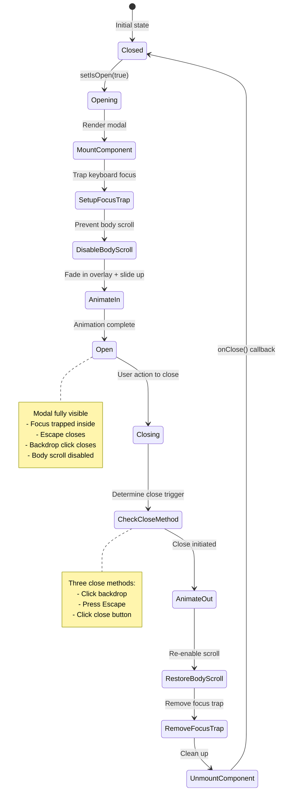
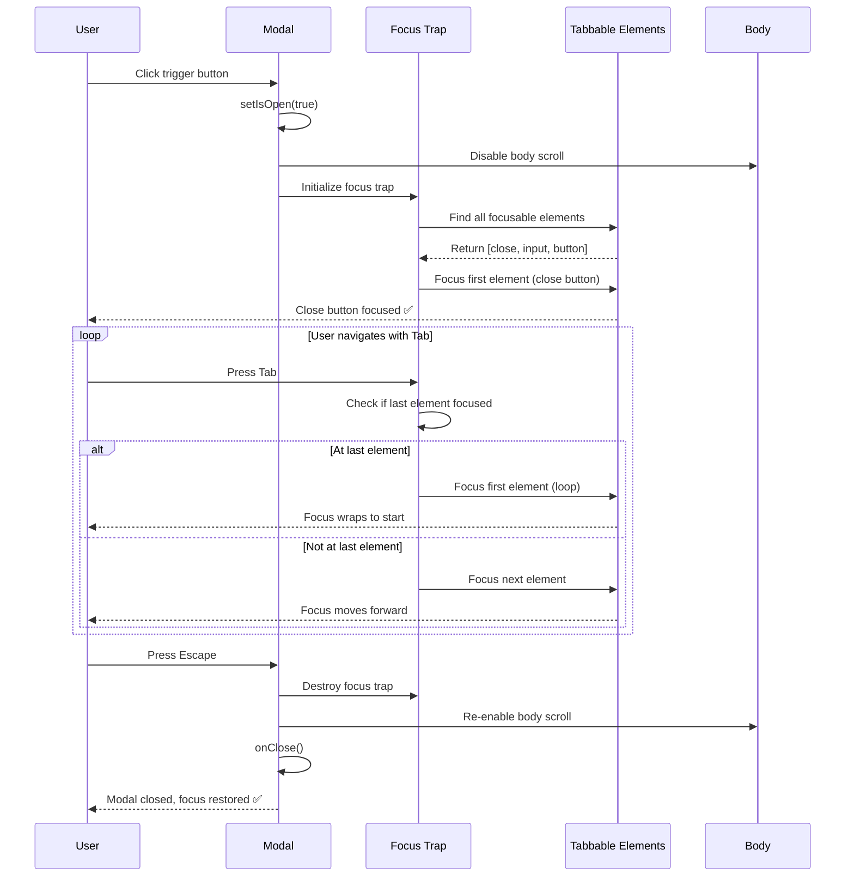
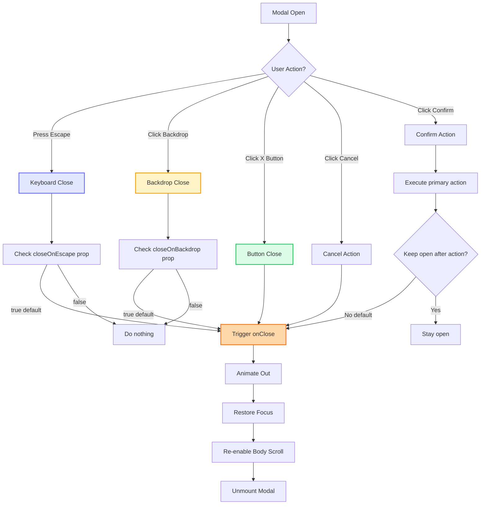

# Modal Component

**Version:** 4.0.0  
**Last Updated:** January 2025

Reusable modal/dialog component with overlay, animations, and accessibility features.

## Purpose

Provide modal dialog functionality with:
- Full-screen overlay with backdrop blur
- Close on backdrop click or Escape key
- Smooth enter/exit animations
- Focus trap for accessibility
- Customizable content and actions
- Multiple size variants
- Scroll handling for long content
- WCAG 2.1 AA compliance

---

## Component Architecture

### Modal Lifecycle (Mermaid)



### Focus Trap Interaction (Mermaid)



### Close Triggers (Mermaid)



---

## Usage

### Basic Usage

```tsx
import { Modal } from './components/ui/Modal';

<Modal 
  isOpen={isOpen}
  onClose={() => setIsOpen(false)}
  title="Booking Inquiry"
>
  <p>Modal content goes here</p>
</Modal>
```

### With Actions

```tsx
<Modal 
  isOpen={isOpen}
  onClose={() => setIsOpen(false)}
  title="Confirm Deletion"
  primaryAction={{
    text: 'Delete',
    onClick: handleDelete,
    variant: 'danger'
  }}
  secondaryAction={{
    text: 'Cancel',
    onClick: () => setIsOpen(false)
  }}
>
  <p>Are you sure you want to delete this portfolio entry?</p>
</Modal>
```

### Contact Form Modal

```tsx
<Modal 
  isOpen={contactModalOpen}
  onClose={() => setContactModalOpen(false)}
  title="Get In Touch"
  size="lg"
>
  <ContactForm onSuccess={() => setContactModalOpen(false)} />
</Modal>
```

---

## Props

```typescript
interface ModalProps {
  /**
   * Whether modal is open
   * @required
   */
  isOpen: boolean;
  
  /**
   * Close handler
   * @required
   */
  onClose: () => void;
  
  /**
   * Modal title
   * @optional
   */
  title?: string;
  
  /**
   * Modal content
   * @required
   */
  children: React.ReactNode;
  
  /**
   * Primary action button
   * @optional
   */
  primaryAction?: ModalAction;
  
  /**
   * Secondary action button
   * @optional
   */
  secondaryAction?: ModalAction;
  
  /**
   * Modal size
   * @default "md"
   */
  size?: 'sm' | 'md' | 'lg' | 'xl' | 'full';
  
  /**
   * Show close button
   * @default true
   */
  showCloseButton?: boolean;
  
  /**
   * Close on backdrop click
   * @default true
   */
  closeOnBackdrop?: boolean;
  
  /**
   * Close on Escape key
   * @default true
   */
  closeOnEscape?: boolean;
  
  /**
   * Additional CSS classes
   * @default ""
   */
  className?: string;
}

interface ModalAction {
  text: string;
  onClick: () => void;
  variant?: 'primary' | 'secondary' | 'danger';
  disabled?: boolean;
  loading?: boolean;
}
```

---

## Features

### Focus Trap

```typescript
useEffect(() => {
  if (!isOpen) return;
  
  const modal = modalRef.current;
  const focusableElements = modal?.querySelectorAll(
    'button, [href], input, select, textarea, [tabindex]:not([tabindex="-1"])'
  );
  
  const firstElement = focusableElements?.[0] as HTMLElement;
  const lastElement = focusableElements?.[focusableElements.length - 1] as HTMLElement;
  
  firstElement?.focus();
  
  const handleTab = (e: KeyboardEvent) => {
    if (e.key !== 'Tab') return;
    
    if (e.shiftKey && document.activeElement === firstElement) {
      e.preventDefault();
      lastElement?.focus();
    } else if (!e.shiftKey && document.activeElement === lastElement) {
      e.preventDefault();
      firstElement?.focus();
    }
  };
  
  document.addEventListener('keydown', handleTab);
  return () => document.removeEventListener('keydown', handleTab);
}, [isOpen]);
```

### Body Scroll Lock

```typescript
useEffect(() => {
  if (isOpen) {
    document.body.style.overflow = 'hidden';
  } else {
    document.body.style.overflow = '';
  }
  
  return () => {
    document.body.style.overflow = '';
  };
}, [isOpen]);
```

### Escape Key Handling

```typescript
useEffect(() => {
  if (!isOpen || !closeOnEscape) return;
  
  const handleEscape = (e: KeyboardEvent) => {
    if (e.key === 'Escape') {
      onClose();
    }
  };
  
  document.addEventListener('keydown', handleEscape);
  return () => document.removeEventListener('keydown', handleEscape);
}, [isOpen, closeOnEscape, onClose]);
```

---

## Implementation Example

Complete modal implementation:

```tsx
import React, { useEffect, useRef } from 'react';
import { X, Loader } from 'lucide-react';

interface ModalProps {
  isOpen: boolean;
  onClose: () => void;
  title?: string;
  children: React.ReactNode;
  primaryAction?: ModalAction;
  secondaryAction?: ModalAction;
  size?: 'sm' | 'md' | 'lg' | 'xl' | 'full';
  showCloseButton?: boolean;
  closeOnBackdrop?: boolean;
  closeOnEscape?: boolean;
  className?: string;
}

interface ModalAction {
  text: string;
  onClick: () => void;
  variant?: 'primary' | 'secondary' | 'danger';
  disabled?: boolean;
  loading?: boolean;
}

export function Modal({ 
  isOpen,
  onClose,
  title,
  children,
  primaryAction,
  secondaryAction,
  size = 'md',
  showCloseButton = true,
  closeOnBackdrop = true,
  closeOnEscape = true,
  className = ''
}: ModalProps) {
  const modalRef = useRef<HTMLDivElement>(null);

  const sizeClasses = {
    sm: 'max-w-md',
    md: 'max-w-2xl',
    lg: 'max-w-4xl',
    xl: 'max-w-6xl',
    full: 'max-w-full mx-4'
  };

  const actionVariants = {
    primary: 'bg-gradient-pink-purple-blue hover:from-purple-700 hover:to-pink-700 text-white',
    secondary: 'bg-gray-200 hover:bg-gray-300 text-gray-800',
    danger: 'bg-red-600 hover:bg-red-700 text-white'
  };

  // Prevent body scroll
  useEffect(() => {
    if (isOpen) {
      document.body.style.overflow = 'hidden';
    } else {
      document.body.style.overflow = '';
    }
    
    return () => {
      document.body.style.overflow = '';
    };
  }, [isOpen]);

  // Escape key handler
  useEffect(() => {
    if (!isOpen || !closeOnEscape) return;
    
    const handleEscape = (e: KeyboardEvent) => {
      if (e.key === 'Escape') {
        onClose();
      }
    };
    
    document.addEventListener('keydown', handleEscape);
    return () => document.removeEventListener('keydown', handleEscape);
  }, [isOpen, closeOnEscape, onClose]);

  // Focus trap
  useEffect(() => {
    if (!isOpen) return;
    
    const modal = modalRef.current;
    const focusableElements = modal?.querySelectorAll(
      'button, [href], input, select, textarea, [tabindex]:not([tabindex="-1"])'
    );
    
    const firstElement = focusableElements?.[0] as HTMLElement;
    const lastElement = focusableElements?.[focusableElements.length - 1] as HTMLElement;
    
    firstElement?.focus();
    
    const handleTab = (e: KeyboardEvent) => {
      if (e.key !== 'Tab') return;
      
      if (e.shiftKey && document.activeElement === firstElement) {
        e.preventDefault();
        lastElement?.focus();
      } else if (!e.shiftKey && document.activeElement === lastElement) {
        e.preventDefault();
        firstElement?.focus();
      }
    };
    
    document.addEventListener('keydown', handleTab);
    return () => document.removeEventListener('keydown', handleTab);
  }, [isOpen]);

  if (!isOpen) return null;

  return (
    <div 
      className="fixed inset-0 z-50 flex items-center justify-center p-4"
      role="dialog"
      aria-modal="true"
      aria-labelledby={title ? 'modal-title' : undefined}
    >
      {/* Backdrop */}
      <div 
        className="absolute inset-0 bg-black/50 backdrop-blur-sm"
        onClick={closeOnBackdrop ? onClose : undefined}
        aria-hidden="true"
      />
      
      {/* Modal Container */}
      <div
        ref={modalRef}
        className={`
          relative bg-white rounded-2xl shadow-2xl
          w-full ${sizeClasses[size]}
          max-h-[90vh] overflow-hidden
          flex flex-col
          ${className}
        `}
      >
        {/* Header */}
        {(title || showCloseButton) && (
          <div className="flex items-center justify-between p-6 border-b border-gray-200">
            {title && (
              <h2 
                id="modal-title"
                className="text-fluid-xl font-heading font-semibold text-gray-800"
              >
                {title}
              </h2>
            )}
            
            {showCloseButton && (
              <button
                onClick={onClose}
                className="w-10 h-10 rounded-lg hover:bg-gray-100 flex items-center justify-center transition-colors ml-auto"
                aria-label="Close modal"
              >
                <X className="w-5 h-5 text-gray-600" />
              </button>
            )}
          </div>
        )}
        
        {/* Content */}
        <div className="flex-1 overflow-y-auto p-6">
          {children}
        </div>
        
        {/* Actions */}
        {(primaryAction || secondaryAction) && (
          <div className="flex items-center justify-end gap-3 p-6 border-t border-gray-200">
            {secondaryAction && (
              <button
                onClick={secondaryAction.onClick}
                disabled={secondaryAction.disabled}
                className={`
                  px-6 py-3 rounded-lg font-body font-medium text-fluid-sm
                  transition-colors
                  ${actionVariants[secondaryAction.variant || 'secondary']}
                  disabled:opacity-50 disabled:cursor-not-allowed
                `}
              >
                {secondaryAction.text}
              </button>
            )}
            
            {primaryAction && (
              <button
                onClick={primaryAction.onClick}
                disabled={primaryAction.disabled || primaryAction.loading}
                className={`
                  px-6 py-3 rounded-lg font-body font-medium text-fluid-sm
                  transition-colors flex items-center gap-2
                  ${actionVariants[primaryAction.variant || 'primary']}
                  disabled:opacity-50 disabled:cursor-not-allowed
                `}
              >
                {primaryAction.loading && (
                  <Loader className="w-4 h-4 animate-spin" />
                )}
                <span>{primaryAction.text}</span>
              </button>
            )}
          </div>
        )}
      </div>
    </div>
  );
}
```

---

## Usage Patterns

### Confirmation Modal

```tsx
function DeleteConfirmation({ onConfirm }: Props) {
  const [isOpen, setIsOpen] = useState(false);
  
  return (
    <>
      <button onClick={() => setIsOpen(true)}>Delete</button>
      
      <Modal 
        isOpen={isOpen}
        onClose={() => setIsOpen(false)}
        title="Confirm Deletion"
        size="sm"
        primaryAction={{
          text: 'Delete',
          onClick: () => {
            onConfirm();
            setIsOpen(false);
          },
          variant: 'danger'
        }}
        secondaryAction={{
          text: 'Cancel',
          onClick: () => setIsOpen(false)
        }}
      >
        <p className="text-body-guideline font-body text-gray-700">
          Are you sure you want to delete this portfolio entry? This action cannot be undone.
        </p>
      </Modal>
    </>
  );
}
```

### Form Modal

```tsx
function BookingModal() {
  const [isOpen, setIsOpen] = useState(false);
  const [isSubmitting, setIsSubmitting] = useState(false);
  
  const handleSubmit = async () => {
    setIsSubmitting(true);
    await submitBooking();
    setIsSubmitting(false);
    setIsOpen(false);
  };
  
  return (
    <Modal 
      isOpen={isOpen}
      onClose={() => setIsOpen(false)}
      title="Book a Session"
      size="lg"
      primaryAction={{
        text: 'Submit Inquiry',
        onClick: handleSubmit,
        loading: isSubmitting
      }}
    >
      <form className="space-y-fluid-md">
        <input type="text" placeholder="Name" />
        <input type="email" placeholder="Email" />
        <textarea placeholder="Tell me about your event" />
      </form>
    </Modal>
  );
}
```

### Image Detail Modal

```tsx
function ImageDetailModal({ image }: Props) {
  const [isOpen, setIsOpen] = useState(false);
  
  return (
    <Modal 
      isOpen={isOpen}
      onClose={() => setIsOpen(false)}
      size="xl"
      showCloseButton={true}
    >
      <div className="space-y-fluid-md">
        
        
        <div>
          <h3 className="text-fluid-xl font-heading font-semibold mb-2">
            {image.title}
          </h3>
          <p className="text-body-guideline font-body text-gray-700">
            {image.description}
          </p>
        </div>
        
        <ShareComponent 
          variant="inline"
          title={image.title}
          url={image.url}
        />
      </div>
    </Modal>
  );
}
```

### Success Modal

```tsx
function SuccessModal({ isOpen, onClose }: Props) {
  return (
    <Modal 
      isOpen={isOpen}
      onClose={onClose}
      size="sm"
      primaryAction={{
        text: 'Close',
        onClick: onClose
      }}
    >
      <div className="text-center py-fluid-lg">
        <div className="w-16 h-16 bg-green-100 rounded-full flex items-center justify-center mx-auto mb-fluid-md">
          <CheckCircle className="w-10 h-10 text-green-600" />
        </div>
        
        <h3 className="text-fluid-xl font-heading font-semibold mb-2">
          Success!
        </h3>
        
        <p className="text-body-guideline font-body text-gray-700">
          Your inquiry has been submitted. I'll get back to you within 24 hours.
        </p>
      </div>
    </Modal>
  );
}
```

---

## Advanced Features

### Multi-Step Modal

```tsx
function MultiStepModal() {
  const [step, setStep] = useState(1);
  
  return (
    <Modal 
      isOpen={isOpen}
      onClose={onClose}
      title={`Step ${step} of 3`}
      primaryAction={{
        text: step === 3 ? 'Submit' : 'Next',
        onClick: () => step === 3 ? handleSubmit() : setStep(step + 1)
      }}
      secondaryAction={{
        text: step === 1 ? 'Cancel' : 'Back',
        onClick: () => step === 1 ? onClose() : setStep(step - 1)
      }}
    >
      {step === 1 && <Step1Content />}
      {step === 2 && <Step2Content />}
      {step === 3 && <Step3Content />}
    </Modal>
  );
}
```

### Animated Modal

```tsx
import { motion, AnimatePresence } from 'motion/react';

<AnimatePresence>
  {isOpen && (
    <motion.div
      initial={{ opacity: 0 }}
      animate={{ opacity: 1 }}
      exit={{ opacity: 0 }}
      className="fixed inset-0 z-50"
    >
      <motion.div
        initial={{ scale: 0.9, opacity: 0 }}
        animate={{ scale: 1, opacity: 1 }}
        exit={{ scale: 0.9, opacity: 0 }}
        className="bg-white rounded-2xl"
      >
        {/* Modal content */}
      </motion.div>
    </motion.div>
  )}
</AnimatePresence>
```

---

## Accessibility

### ARIA Attributes

```tsx
<div
  role="dialog"
  aria-modal="true"
  aria-labelledby="modal-title"
  aria-describedby="modal-description"
>
  <h2 id="modal-title">Modal Title</h2>
  <p id="modal-description">Modal description</p>
</div>
```

### Focus Management

```tsx
// Auto-focus first interactive element
useEffect(() => {
  if (isOpen) {
    const firstButton = modalRef.current?.querySelector('button');
    firstButton?.focus();
  }
}, [isOpen]);
```

---

## Common Mistakes

### ❌ Mistake 1: No Body Scroll Lock

```tsx
// ❌ WRONG - Page scrolls behind modal
{isOpen && <Modal />}
```

**Solution:**
```tsx
// ✅ CORRECT
useEffect(() => {
  document.body.style.overflow = isOpen ? 'hidden' : '';
}, [isOpen]);
```

### ❌ Mistake 2: No Focus Trap

```tsx
// ❌ WRONG - Tab moves outside modal
<div className="modal">
  <button>Action</button>
</div>
```

**Solution:**
```tsx
// ✅ CORRECT - Implement focus trap
// See implementation example above
```

---

## Related Components

- **[ContactForm](./ContactForm.md)** - Form in modal
- **[Lightbox](./Lightbox.md)** - Image viewer

---

## Related Documentation

- **[Guidelines.md](../Guidelines.md)** - Main guidelines
- **[overview-components.md](../overview-components.md)** - Component system
- **[FILE_STRUCTURE.md](../FILE_STRUCTURE.md)** - File organization
- **[design-tokens/spacing.md](../design-tokens/spacing.md)** - Spacing system

---

**Last Updated:** January 2025  
**Version:** 4.0.0