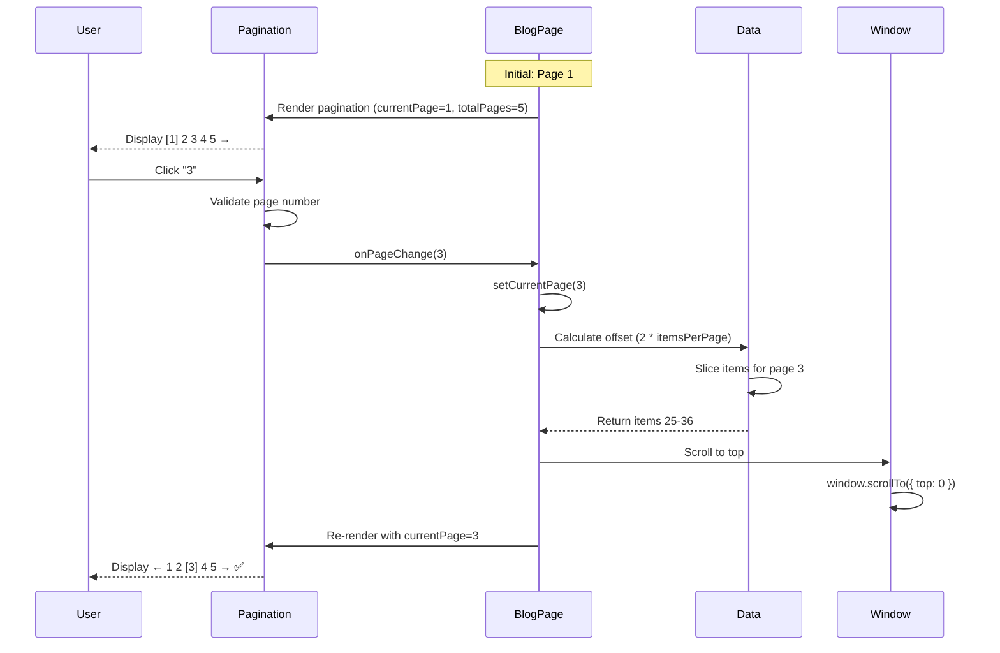
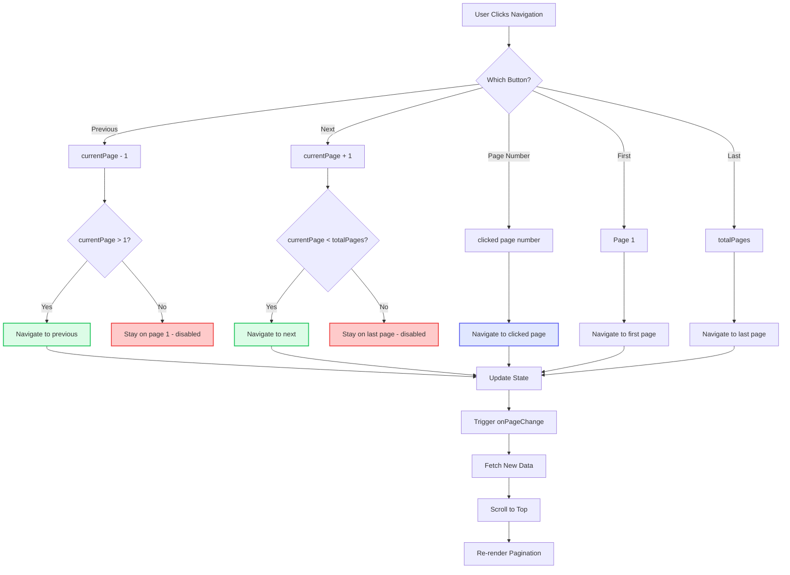
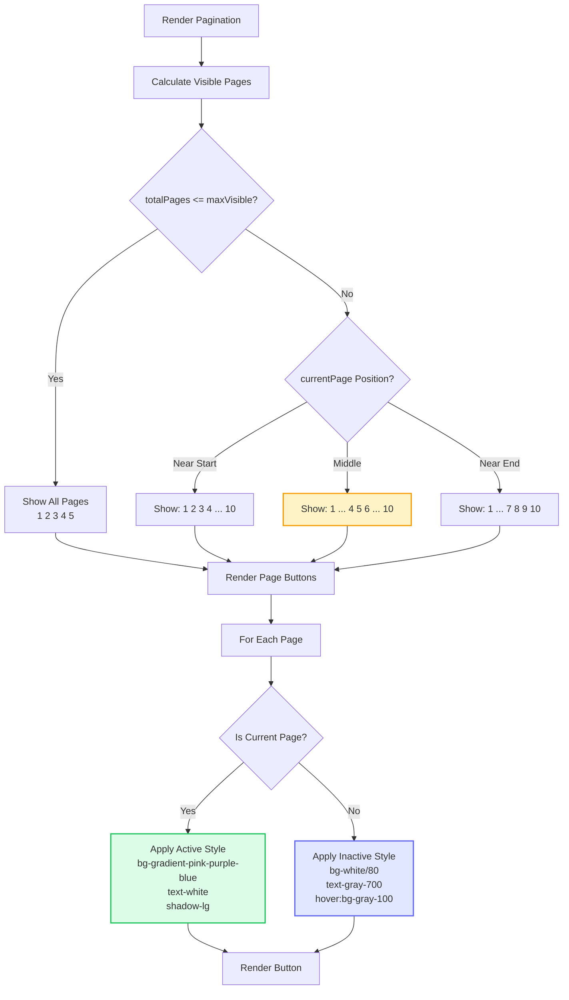
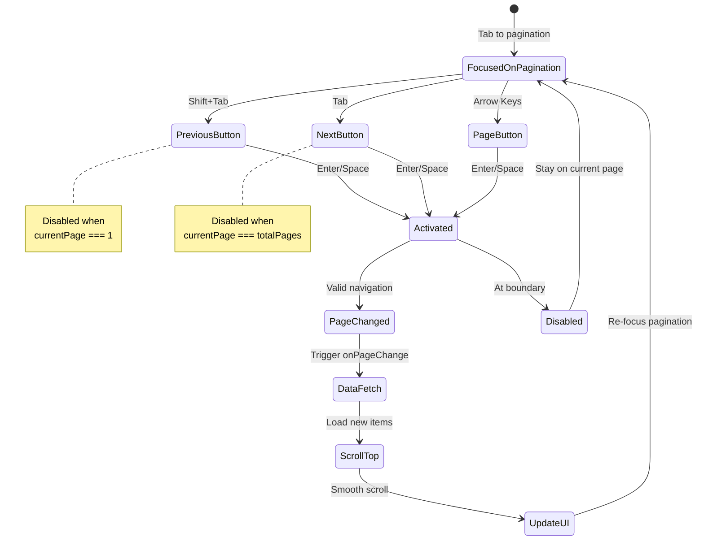

# Pagination Component

**Version:** 4.0.0  
**Last Updated:** January 2025

Page navigation component with numbered pages, previous/next buttons, and accessibility features.

## Purpose

Provide multi-page navigation with:
- Numbered page buttons
- Previous/Next navigation
- First/Last page jumps
- Active page indication
- Ellipsis for long page ranges
- Keyboard navigation support
- Mobile-responsive design
- WCAG 2.1 AA compliance

---

## Component Architecture

### Pagination Interaction Flow (Mermaid)



### Page Navigation Logic (Mermaid)



### Ellipsis Display Logic (Mermaid)



### Keyboard Navigation (Mermaid)



---

## Usage

### Basic Usage

```tsx
import { Pagination } from './components/ui/Pagination';

<Pagination 
  currentPage={currentPage}
  totalPages={totalPages}
  onPageChange={setCurrentPage}
/>
```

### With Custom Page Size

```tsx
<Pagination 
  currentPage={currentPage}
  totalPages={totalPages}
  onPageChange={setCurrentPage}
  maxVisiblePages={5}
/>
```

### Blog Pagination

```tsx
const POSTS_PER_PAGE = 12;
const totalPages = Math.ceil(posts.length / POSTS_PER_PAGE);

<Pagination 
  currentPage={currentPage}
  totalPages={totalPages}
  onPageChange={handlePageChange}
/>
```

---

## Props

```typescript
interface PaginationProps {
  /**
   * Current active page (1-indexed)
   * @required
   */
  currentPage: number;
  
  /**
   * Total number of pages
   * @required
   */
  totalPages: number;
  
  /**
   * Page change handler
   * @required
   */
  onPageChange: (page: number) => void;
  
  /**
   * Maximum visible page numbers
   * @default 7
   */
  maxVisiblePages?: number;
  
  /**
   * Show first/last page buttons
   * @default true
   */
  showFirstLast?: boolean;
  
  /**
   * Show previous/next buttons
   * @default true
   */
  showPrevNext?: boolean;
  
  /**
   * Additional CSS classes
   * @default ""
   */
  className?: string;
  
  /**
   * Scroll to top on page change
   * @default true
   */
  scrollToTop?: boolean;
}
```

---

## Features

### Page Range Calculation

```typescript
const getPageRange = (
  currentPage: number,
  totalPages: number,
  maxVisible: number
): (number | 'ellipsis')[] => {
  if (totalPages <= maxVisible) {
    return Array.from({ length: totalPages }, (_, i) => i + 1);
  }
  
  const pages: (number | 'ellipsis')[] = [];
  const halfVisible = Math.floor(maxVisible / 2);
  
  // Always show first page
  pages.push(1);
  
  // Calculate range around current page
  let start = Math.max(2, currentPage - halfVisible);
  let end = Math.min(totalPages - 1, currentPage + halfVisible);
  
  // Adjust if at start or end
  if (currentPage <= halfVisible) {
    end = maxVisible - 1;
  } else if (currentPage >= totalPages - halfVisible) {
    start = totalPages - maxVisible + 2;
  }
  
  // Add left ellipsis
  if (start > 2) {
    pages.push('ellipsis');
  }
  
  // Add page numbers
  for (let i = start; i <= end; i++) {
    pages.push(i);
  }
  
  // Add right ellipsis
  if (end < totalPages - 1) {
    pages.push('ellipsis');
  }
  
  // Always show last page
  if (totalPages > 1) {
    pages.push(totalPages);
  }
  
  return pages;
};
```

### Scroll to Top

```typescript
const handlePageChange = (page: number) => {
  onPageChange(page);
  
  if (scrollToTop) {
    window.scrollTo({ top: 0, behavior: 'smooth' });
  }
};
```

---

## Implementation Example

Complete pagination implementation:

```tsx
import React from 'react';
import { ChevronLeft, ChevronRight, ChevronsLeft, ChevronsRight } from 'lucide-react';

interface PaginationProps {
  currentPage: number;
  totalPages: number;
  onPageChange: (page: number) => void;
  maxVisiblePages?: number;
  showFirstLast?: boolean;
  showPrevNext?: boolean;
  className?: string;
  scrollToTop?: boolean;
}

export function Pagination({ 
  currentPage,
  totalPages,
  onPageChange,
  maxVisiblePages = 7,
  showFirstLast = true,
  showPrevNext = true,
  className = '',
  scrollToTop = true
}: PaginationProps) {
  const getPageRange = (): (number | 'ellipsis')[] => {
    if (totalPages <= maxVisiblePages) {
      return Array.from({ length: totalPages }, (_, i) => i + 1);
    }
    
    const pages: (number | 'ellipsis')[] = [];
    const halfVisible = Math.floor(maxVisiblePages / 2);
    
    pages.push(1);
    
    let start = Math.max(2, currentPage - halfVisible);
    let end = Math.min(totalPages - 1, currentPage + halfVisible);
    
    if (currentPage <= halfVisible) {
      end = maxVisiblePages - 1;
    } else if (currentPage >= totalPages - halfVisible) {
      start = totalPages - maxVisiblePages + 2;
    }
    
    if (start > 2) {
      pages.push('ellipsis');
    }
    
    for (let i = start; i <= end; i++) {
      pages.push(i);
    }
    
    if (end < totalPages - 1) {
      pages.push('ellipsis');
    }
    
    if (totalPages > 1) {
      pages.push(totalPages);
    }
    
    return pages;
  };

  const handlePageChange = (page: number) => {
    if (page < 1 || page > totalPages || page === currentPage) return;
    
    onPageChange(page);
    
    if (scrollToTop) {
      window.scrollTo({ top: 0, behavior: 'smooth' });
    }
  };

  const pageRange = getPageRange();

  return (
    <nav 
      className={`flex items-center justify-center gap-2 ${className}`}
      role="navigation"
      aria-label="Pagination"
    >
      {/* First Page */}
      {showFirstLast && (
        <button
          onClick={() => handlePageChange(1)}
          disabled={currentPage === 1}
          className="w-10 h-10 rounded-lg flex items-center justify-center bg-white border border-gray-300 hover:bg-gray-50 disabled:opacity-50 disabled:cursor-not-allowed transition-colors"
          aria-label="Go to first page"
        >
          <ChevronsLeft className="w-5 h-5 text-gray-600" />
        </button>
      )}
      
      {/* Previous Page */}
      {showPrevNext && (
        <button
          onClick={() => handlePageChange(currentPage - 1)}
          disabled={currentPage === 1}
          className="w-10 h-10 rounded-lg flex items-center justify-center bg-white border border-gray-300 hover:bg-gray-50 disabled:opacity-50 disabled:cursor-not-allowed transition-colors"
          aria-label="Go to previous page"
        >
          <ChevronLeft className="w-5 h-5 text-gray-600" />
        </button>
      )}
      
      {/* Page Numbers */}
      {pageRange.map((page, index) => {
        if (page === 'ellipsis') {
          return (
            <span 
              key={`ellipsis-${index}`}
              className="w-10 h-10 flex items-center justify-center text-gray-400"
              aria-hidden="true"
            >
              ...
            </span>
          );
        }
        
        const isActive = page === currentPage;
        
        return (
          <button
            key={page}
            onClick={() => handlePageChange(page)}
            aria-label={`Go to page ${page}`}
            aria-current={isActive ? 'page' : undefined}
            className={`
              w-10 h-10 rounded-lg font-body font-medium text-fluid-sm
              transition-all duration-300
              ${isActive
                ? 'bg-gradient-pink-purple-blue text-white shadow-lg scale-110'
                : 'bg-white text-gray-700 border border-gray-300 hover:bg-gray-50'
              }
            `}
          >
            {page}
          </button>
        );
      })}
      
      {/* Next Page */}
      {showPrevNext && (
        <button
          onClick={() => handlePageChange(currentPage + 1)}
          disabled={currentPage === totalPages}
          className="w-10 h-10 rounded-lg flex items-center justify-center bg-white border border-gray-300 hover:bg-gray-50 disabled:opacity-50 disabled:cursor-not-allowed transition-colors"
          aria-label="Go to next page"
        >
          <ChevronRight className="w-5 h-5 text-gray-600" />
        </button>
      )}
      
      {/* Last Page */}
      {showFirstLast && (
        <button
          onClick={() => handlePageChange(totalPages)}
          disabled={currentPage === totalPages}
          className="w-10 h-10 rounded-lg flex items-center justify-center bg-white border border-gray-300 hover:bg-gray-50 disabled:opacity-50 disabled:cursor-not-allowed transition-colors"
          aria-label="Go to last page"
        >
          <ChevronsRight className="w-5 h-5 text-gray-600" />
        </button>
      )}
    </nav>
  );
}
```

---

## Usage Patterns

### Blog Listing

```tsx
function BlogPage() {
  const [currentPage, setCurrentPage] = useState(1);
  const POSTS_PER_PAGE = 12;
  
  const totalPages = Math.ceil(posts.length / POSTS_PER_PAGE);
  const startIndex = (currentPage - 1) * POSTS_PER_PAGE;
  const currentPosts = posts.slice(startIndex, startIndex + POSTS_PER_PAGE);
  
  return (
    <section className="py-section px-6">
      <div className="max-w-7xl mx-auto">
        {/* Blog posts */}
        <div className="grid grid-cols-1 md:grid-cols-3 gap-fluid-md mb-fluid-xl">
          {currentPosts.map(post => (
            <BlogCard key={post.id} post={post} />
          ))}
        </div>
        
        {/* Pagination */}
        <Pagination 
          currentPage={currentPage}
          totalPages={totalPages}
          onPageChange={setCurrentPage}
        />
      </div>
    </section>
  );
}
```

### Portfolio Gallery

```tsx
function PortfolioGallery() {
  const [currentPage, setCurrentPage] = useState(1);
  const ITEMS_PER_PAGE = 9;
  
  const filteredEntries = activeCategory === 'all'
    ? entries
    : entries.filter(e => e.category === activeCategory);
  
  const totalPages = Math.ceil(filteredEntries.length / ITEMS_PER_PAGE);
  const paginatedEntries = filteredEntries.slice(
    (currentPage - 1) * ITEMS_PER_PAGE,
    currentPage * ITEMS_PER_PAGE
  );
  
  return (
    <>
      <div className="grid grid-cols-1 md:grid-cols-3 gap-fluid-md">
        {paginatedEntries.map(entry => (
          <PortfolioCard key={entry.id} entry={entry} />
        ))}
      </div>
      
      {totalPages > 1 && (
        <Pagination 
          currentPage={currentPage}
          totalPages={totalPages}
          onPageChange={setCurrentPage}
          className="mt-fluid-xl"
        />
      )}
    </>
  );
}
```

### Compact Mobile Variant

```tsx
<Pagination 
  currentPage={currentPage}
  totalPages={totalPages}
  onPageChange={setCurrentPage}
  showFirstLast={false}
  maxVisiblePages={3}
  className="md:hidden"
/>

<Pagination 
  currentPage={currentPage}
  totalPages={totalPages}
  onPageChange={setCurrentPage}
  maxVisiblePages={7}
  className="hidden md:flex"
/>
```

---

## Advanced Features

### With Page Info

```tsx
<div className="flex flex-col items-center gap-4">
  <div className="text-fluid-sm font-body text-gray-600">
    Showing {startIndex + 1}-{Math.min(startIndex + ITEMS_PER_PAGE, total)} of {total} items
  </div>
  
  <Pagination 
    currentPage={currentPage}
    totalPages={totalPages}
    onPageChange={setCurrentPage}
  />
</div>
```

### With URL Parameters

```tsx
import { useSearchParams } from 'react-router-dom';

function PaginatedContent() {
  const [searchParams, setSearchParams] = useSearchParams();
  const currentPage = parseInt(searchParams.get('page') || '1', 10);
  
  const handlePageChange = (page: number) => {
    setSearchParams({ page: page.toString() });
  };
  
  return (
    <Pagination 
      currentPage={currentPage}
      totalPages={totalPages}
      onPageChange={handlePageChange}
    />
  );
}
```

### With Items Per Page Selector

```tsx
const [itemsPerPage, setItemsPerPage] = useState(12);
const totalPages = Math.ceil(items.length / itemsPerPage);

<div className="flex items-center justify-between">
  <select
    value={itemsPerPage}
    onChange={(e) => {
      setItemsPerPage(Number(e.target.value));
      setCurrentPage(1);
    }}
    className="px-4 py-2 border border-gray-300 rounded-lg"
  >
    <option value={6}>6 per page</option>
    <option value={12}>12 per page</option>
    <option value={24}>24 per page</option>
  </select>
  
  <Pagination 
    currentPage={currentPage}
    totalPages={totalPages}
    onPageChange={setCurrentPage}
  />
</div>
```

---

## Accessibility

### Keyboard Navigation

```tsx
<button
  onClick={() => handlePageChange(page)}
  onKeyDown={(e) => {
    if (e.key === 'Enter' || e.key === ' ') {
      e.preventDefault();
      handlePageChange(page);
    }
  }}
  className="focus:outline-none focus:ring-2 focus:ring-pink-200 focus:ring-opacity-50 rounded-lg"
>
  {page}
</button>
```

### ARIA Attributes

```tsx
<nav 
  role="navigation"
  aria-label="Pagination navigation"
>
  <button
    onClick={() => handlePageChange(page)}
    aria-label={`Go to page ${page}`}
    aria-current={page === currentPage ? 'page' : undefined}
  >
    {page}
  </button>
</nav>
```

### Screen Reader Announcements

```tsx
<div 
  role="status"
  aria-live="polite"
  className="sr-only"
>
  Page {currentPage} of {totalPages}
</div>
```

---

## Common Mistakes

### ❌ Mistake 1: 0-Indexed Pages

```tsx
// ❌ WRONG - Pages start at 0
<Pagination currentPage={0} totalPages={10} />
```

**Solution:**
```tsx
// ✅ CORRECT - Pages are 1-indexed
<Pagination currentPage={1} totalPages={10} />
```

### ❌ Mistake 2: No Active State

```tsx
// ❌ WRONG - Can't tell current page
<button>{page}</button>
```

**Solution:**
```tsx
// ✅ CORRECT - Clear active indication
<button className={page === currentPage ? 'bg-pink-600 text-white' : 'bg-white'}>
  {page}
</button>
```

### ❌ Mistake 3: Not Scrolling to Top

```tsx
// ❌ WRONG - User stays at bottom after page change
onPageChange(newPage);
```

**Solution:**
```tsx
// ✅ CORRECT - Scroll to top
onPageChange(newPage);
window.scrollTo({ top: 0, behavior: 'smooth' });
```

---

## Related Components

- **[BlogCard](./BlogCard.md)** - Blog post cards
- **[PortfolioCard](./PortfolioCard.md)** - Portfolio items
- **[CategoryFilter](./CategoryFilter.md)** - Category filtering
- **[SearchBar](./SearchBar.md)** - Search functionality

---

## Related Documentation

- **[Guidelines.md](../Guidelines.md)** - Main guidelines
- **[overview-components.md](../overview-components.md)** - Component system
- **[overview-icons.md](../overview-icons.md)** - Icon system
- **[FILE_STRUCTURE.md](../FILE_STRUCTURE.md)** - File organization
- **[design-tokens/spacing.md](../design-tokens/spacing.md)** - Spacing system

---

**Last Updated:** January 2025  
**Version:** 4.0.0