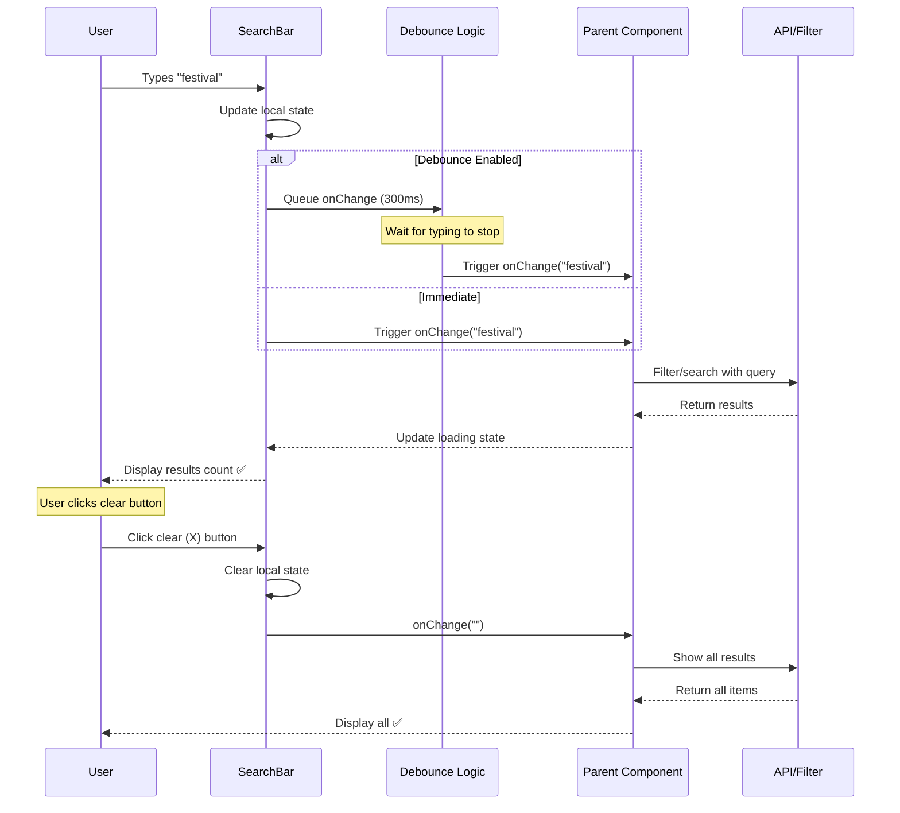
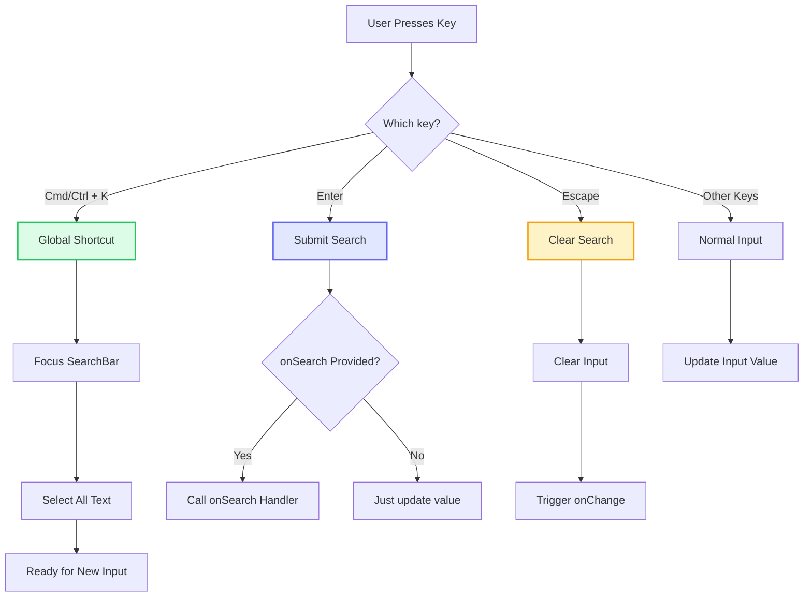
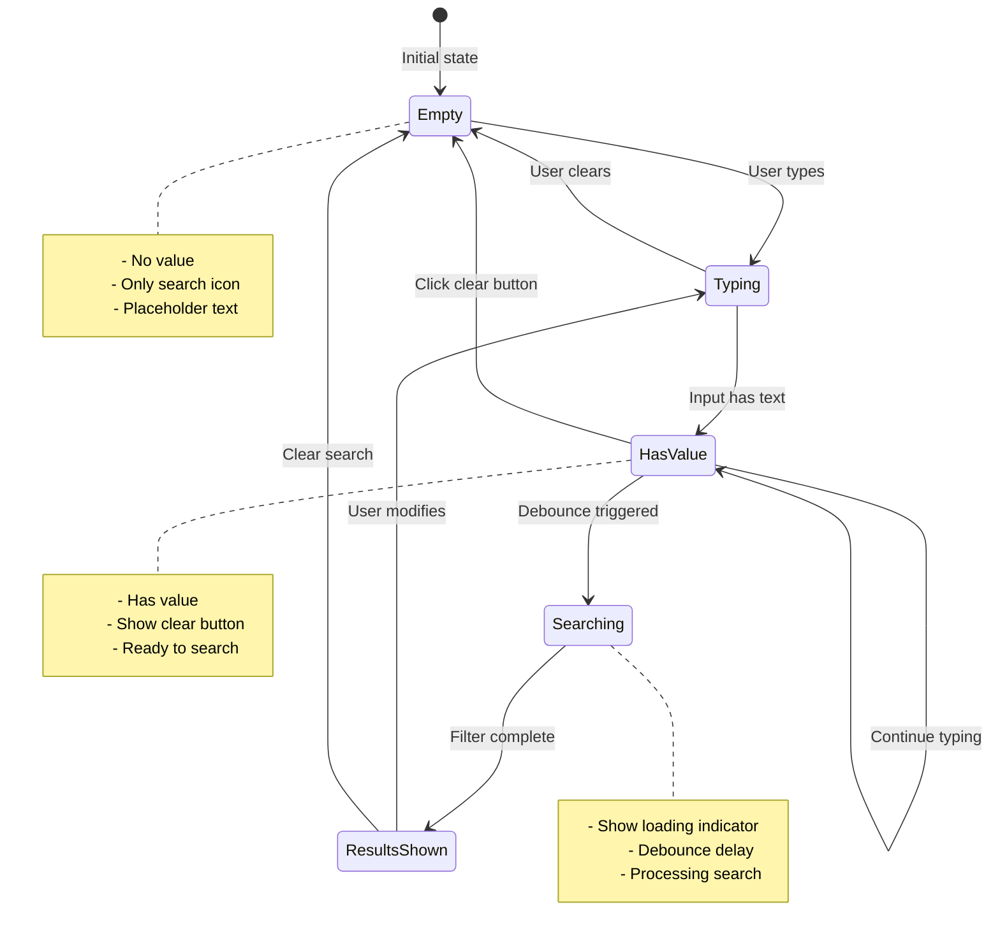

# SearchBar Component

**Version:** 4.0.0  
**Last Updated:** January 2025

Search input component with clear functionality, keyboard shortcuts, and accessibility features.

## Purpose

Provide content search functionality with:
- Search icon indicator
- Clear button when input has value
- Keyboard shortcuts (e.g., Cmd/Ctrl+K)
- Debounced search for performance
- Accessibility compliance
- Loading state indication
- Responsive design

---

## Component Architecture

### SearchBar Interaction Flow (Mermaid)



### Keyboard Shortcut Handling (Mermaid)



### State Management (Mermaid)



---

## Usage

### Basic Usage

```tsx
import { SearchBar } from './components/ui/SearchBar';

<SearchBar 
  value={searchQuery}
  onChange={setSearchQuery}
  placeholder="Search portfolio..."
/>
```

### With Search Handler

```tsx
<SearchBar 
  value={searchQuery}
  onChange={setSearchQuery}
  onSearch={handleSearch}
  placeholder="Search blog posts..."
/>
```

### With Debounce

```tsx
<SearchBar 
  value={searchQuery}
  onChange={setSearchQuery}
  debounceMs={300}
  placeholder="Search..."
/>
```

---

## Props

```typescript
interface SearchBarProps {
  /**
   * Current search value
   * @required
   */
  value: string;
  
  /**
   * Change handler
   * @required
   */
  onChange: (value: string) => void;
  
  /**
   * Search submit handler (on Enter key)
   * @optional
   */
  onSearch?: (value: string) => void;
  
  /**
   * Placeholder text
   * @default "Search..."
   */
  placeholder?: string;
  
  /**
   * Debounce delay in milliseconds
   * @default 0 (no debounce)
   */
  debounceMs?: number;
  
  /**
   * Show loading indicator
   * @default false
   */
  isLoading?: boolean;
  
  /**
   * Additional CSS classes
   * @default ""
   */
  className?: string;
  
  /**
   * Autofocus on mount
   * @default false
   */
  autoFocus?: boolean;
  
  /**
   * Enable keyboard shortcut (Cmd/Ctrl+K)
   * @default true
   */
  enableShortcut?: boolean;
}
```

---

## Features

### Debounced Search

```typescript
const useDebounce = (value: string, delay: number) => {
  const [debouncedValue, setDebouncedValue] = useState(value);
  
  useEffect(() => {
    const handler = setTimeout(() => {
      setDebouncedValue(value);
    }, delay);
    
    return () => clearTimeout(handler);
  }, [value, delay]);
  
  return debouncedValue;
};
```

### Keyboard Shortcuts

```typescript
useEffect(() => {
  const handleKeyDown = (e: KeyboardEvent) => {
    // Cmd+K (Mac) or Ctrl+K (Windows)
    if ((e.metaKey || e.ctrlKey) && e.key === 'k') {
      e.preventDefault();
      inputRef.current?.focus();
    }
    
    // Escape to clear
    if (e.key === 'Escape') {
      onChange('');
      inputRef.current?.blur();
    }
  };
  
  document.addEventListener('keydown', handleKeyDown);
  return () => document.removeEventListener('keydown', handleKeyDown);
}, []);
```

### Clear Button

```tsx
{value && (
  <button
    onClick={() => onChange('')}
    className="absolute right-3 top-1/2 -translate-y-1/2"
    aria-label="Clear search"
  >
    <X className="w-4 h-4 text-gray-400 hover:text-gray-600" />
  </button>
)}
```

---

## Implementation Example

Complete search bar implementation:

```tsx
import React, { useState, useEffect, useRef } from 'react';
import { Search, X, Loader } from 'lucide-react';

interface SearchBarProps {
  value: string;
  onChange: (value: string) => void;
  onSearch?: (value: string) => void;
  placeholder?: string;
  debounceMs?: number;
  isLoading?: boolean;
  className?: string;
  autoFocus?: boolean;
  enableShortcut?: boolean;
}

export function SearchBar({ 
  value,
  onChange,
  onSearch,
  placeholder = 'Search...',
  debounceMs = 0,
  isLoading = false,
  className = '',
  autoFocus = false,
  enableShortcut = true
}: SearchBarProps) {
  const inputRef = useRef<HTMLInputElement>(null);
  const [localValue, setLocalValue] = useState(value);

  // Sync local value with prop value
  useEffect(() => {
    setLocalValue(value);
  }, [value]);

  // Debounce
  useEffect(() => {
    if (debounceMs > 0) {
      const handler = setTimeout(() => {
        onChange(localValue);
      }, debounceMs);
      
      return () => clearTimeout(handler);
    } else {
      onChange(localValue);
    }
  }, [localValue, debounceMs]);

  // Keyboard shortcuts
  useEffect(() => {
    if (!enableShortcut) return;
    
    const handleKeyDown = (e: KeyboardEvent) => {
      // Cmd+K or Ctrl+K to focus
      if ((e.metaKey || e.ctrlKey) && e.key === 'k') {
        e.preventDefault();
        inputRef.current?.focus();
      }
      
      // Escape to clear and blur
      if (e.key === 'Escape' && document.activeElement === inputRef.current) {
        onChange('');
        setLocalValue('');
        inputRef.current?.blur();
      }
    };
    
    document.addEventListener('keydown', handleKeyDown);
    return () => document.removeEventListener('keydown', handleKeyDown);
  }, [enableShortcut]);

  // Handle form submit
  const handleSubmit = (e: React.FormEvent) => {
    e.preventDefault();
    onSearch?.(localValue);
  };

  const handleClear = () => {
    setLocalValue('');
    onChange('');
    inputRef.current?.focus();
  };

  return (
    <form 
      onSubmit={handleSubmit}
      className={`relative ${className}`}
    >
      {/* Search Icon */}
      <div className="absolute left-3 top-1/2 -translate-y-1/2 pointer-events-none">
        {isLoading ? (
          <Loader className="w-5 h-5 text-gray-400 animate-spin" />
        ) : (
          <Search className="w-5 h-5 text-gray-400" />
        )}
      </div>
      
      {/* Input */}
      <input
        ref={inputRef}
        type="text"
        value={localValue}
        onChange={(e) => setLocalValue(e.target.value)}
        placeholder={placeholder}
        autoFocus={autoFocus}
        className={`
          w-full 
          pl-10 
          ${localValue ? 'pr-10' : 'pr-4'}
          py-3 
          rounded-lg 
          border border-gray-300 
          bg-white
          focus:outline-none 
          focus:ring-2 
          focus:ring-pink-200 
          focus:border-pink-500
          font-body 
          text-body-guideline
          placeholder:text-gray-400
          transition-shadow
        `}
        aria-label="Search"
      />
      
      {/* Clear Button */}
      {localValue && (
        <button
          type="button"
          onClick={handleClear}
          className="absolute right-3 top-1/2 -translate-y-1/2 p-1 rounded hover:bg-gray-100 transition-colors"
          aria-label="Clear search"
        >
          <X className="w-4 h-4 text-gray-400 hover:text-gray-600" />
        </button>
      )}
      
      {/* Keyboard Shortcut Hint (optional) */}
      {enableShortcut && !localValue && !isLoading && (
        <div className="absolute right-3 top-1/2 -translate-y-1/2 hidden sm:flex items-center gap-1 text-fluid-xs text-gray-400 pointer-events-none">
          <kbd className="px-2 py-1 bg-gray-100 rounded text-gray-600 font-mono">
            {navigator.platform.includes('Mac') ? '⌘' : 'Ctrl'}
          </kbd>
          <kbd className="px-2 py-1 bg-gray-100 rounded text-gray-600 font-mono">
            K
          </kbd>
        </div>
      )}
    </form>
  );
}
```

---

## Usage Patterns

### Blog Search

```tsx
import { useState } from 'react';
import { SearchBar } from './components/ui/SearchBar';

function BlogPage() {
  const [searchQuery, setSearchQuery] = useState('');
  const [isSearching, setIsSearching] = useState(false);
  
  const filteredPosts = posts.filter(post => 
    post.title.toLowerCase().includes(searchQuery.toLowerCase()) ||
    post.content.toLowerCase().includes(searchQuery.toLowerCase())
  );
  
  return (
    <section className="py-section">
      <div className="max-w-4xl mx-auto px-6">
        <h1 className="text-section-h2 font-heading font-semibold text-center mb-fluid-lg">
          Blog
        </h1>
        
        <SearchBar 
          value={searchQuery}
          onChange={setSearchQuery}
          placeholder="Search blog posts..."
          debounceMs={300}
          className="max-w-2xl mx-auto mb-fluid-xl"
        />
        
        <div className="grid grid-cols-1 md:grid-cols-2 gap-fluid-md">
          {filteredPosts.map(post => (
            <BlogCard key={post.id} post={post} />
          ))}
        </div>
        
        {filteredPosts.length === 0 && (
          <p className="text-center text-gray-600 py-fluid-xl">
            No posts found matching "{searchQuery}"
          </p>
        )}
      </div>
    </section>
  );
}
```

### Portfolio Search

```tsx
function PortfolioPage() {
  const [searchQuery, setSearchQuery] = useState('');
  
  const filteredEntries = portfolioEntries.filter(entry => 
    entry.title.toLowerCase().includes(searchQuery.toLowerCase()) ||
    entry.category.toLowerCase().includes(searchQuery.toLowerCase()) ||
    entry.tags?.some(tag => tag.toLowerCase().includes(searchQuery.toLowerCase()))
  );
  
  return (
    <section className="py-section">
      <div className="flex flex-col sm:flex-row justify-between items-start sm:items-center gap-4 mb-fluid-lg">
        <h2 className="text-section-h2 font-heading font-semibold">
          Portfolio
        </h2>
        
        <SearchBar 
          value={searchQuery}
          onChange={setSearchQuery}
          placeholder="Search by title, category, or tag..."
          className="w-full sm:w-96"
        />
      </div>
      
      <div className="grid grid-cols-1 md:grid-cols-2 lg:grid-cols-3 gap-fluid-md">
        {filteredEntries.map(entry => (
          <PortfolioCard key={entry.id} entry={entry} />
        ))}
      </div>
    </section>
  );
}
```

### Search with Filters

```tsx
function SearchAndFilter() {
  const [searchQuery, setSearchQuery] = useState('');
  const [selectedCategory, setSelectedCategory] = useState('all');
  
  return (
    <div className="flex flex-col md:flex-row gap-4 mb-fluid-lg">
      <SearchBar 
        value={searchQuery}
        onChange={setSearchQuery}
        placeholder="Search..."
        className="flex-1"
      />
      
      <select
        value={selectedCategory}
        onChange={(e) => setSelectedCategory(e.target.value)}
        className="px-4 py-3 rounded-lg border border-gray-300 focus:outline-none focus:ring-2 focus:ring-pink-200 font-body text-body-guideline"
      >
        <option value="all">All Categories</option>
        <option value="festival">Festival</option>
        <option value="editorial">Editorial</option>
        <option value="special-event">Special Event</option>
      </select>
    </div>
  );
}
```

---

## Accessibility

### ARIA Labels

```tsx
<input
  type="text"
  role="searchbox"
  aria-label="Search blog posts"
  aria-describedby="search-hint"
  placeholder="Search..."
/>

<p id="search-hint" className="sr-only">
  Press Cmd+K to focus the search box
</p>
```

### Keyboard Navigation

- **Tab** - Focus search input
- **Cmd/Ctrl+K** - Focus from anywhere
- **Escape** - Clear and blur
- **Enter** - Submit search

```tsx
<input
  onKeyDown={(e) => {
    if (e.key === 'Escape') {
      handleClear();
      e.currentTarget.blur();
    }
  }}
/>
```

---

## Common Mistakes

### ❌ Mistake 1: No Debounce for API Calls

```tsx
// ❌ WRONG - API called on every keystroke
onChange={(value) => {
  setSearch(value);
  fetchResults(value); // Too many requests!
}}
```

**Solution:**
```tsx
// ✅ CORRECT - Debounced search
<SearchBar 
  value={search}
  onChange={setSearch}
  debounceMs={300}
/>
```

### ❌ Mistake 2: Missing Clear Button

```tsx
// ❌ WRONG - No way to clear quickly
<input value={search} onChange={handleChange} />
```

**Solution:**
```tsx
// ✅ CORRECT - Clear button included
<SearchBar value={search} onChange={setSearch} />
```

---

## Related Components

- **[PortfolioCard](./PortfolioCard.md)** - Portfolio items
- **[LayoutSwitcher](./LayoutSwitcher.md)** - View toggle

---

## Related Documentation

- **[Guidelines.md](../Guidelines.md)** - Main guidelines
- **[overview-components.md](../overview-components.md)** - Component system
- **[overview-icons.md](../overview-icons.md)** - Icon system
- **[FILE_STRUCTURE.md](../FILE_STRUCTURE.md)** - File organization

---

**Last Updated:** January 2025  
**Version:** 4.0.0