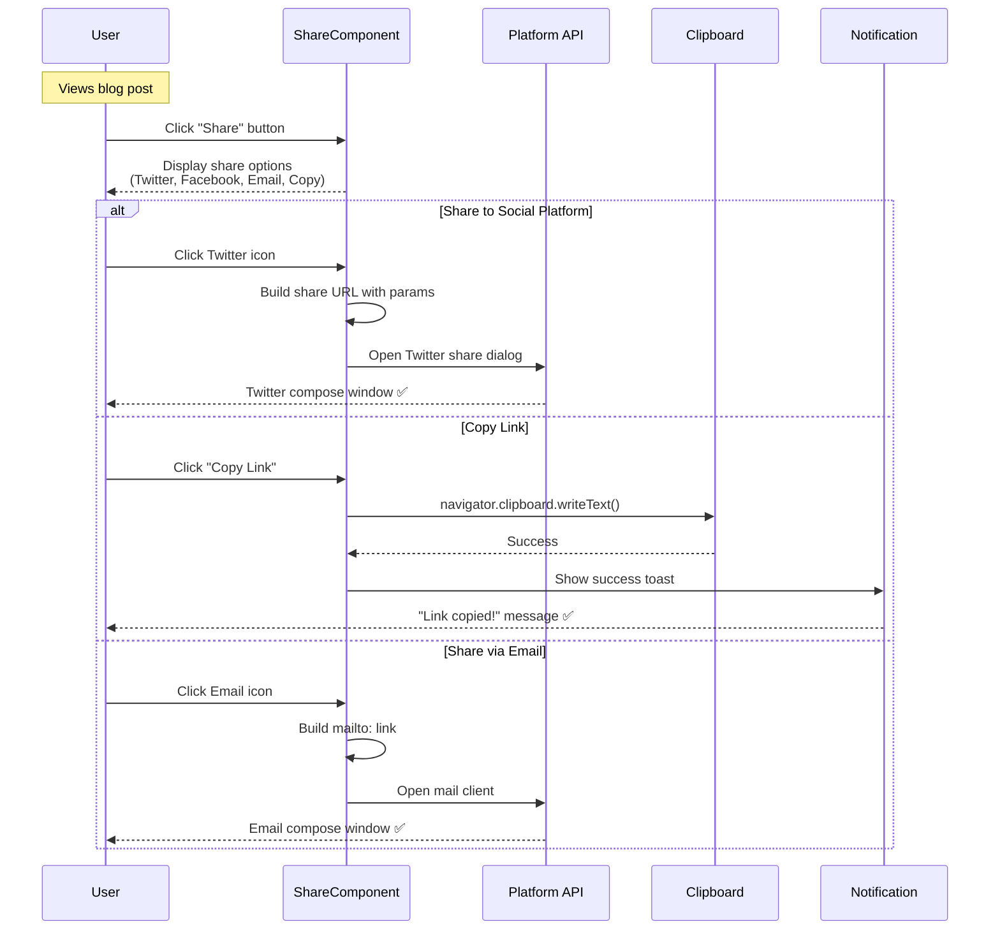
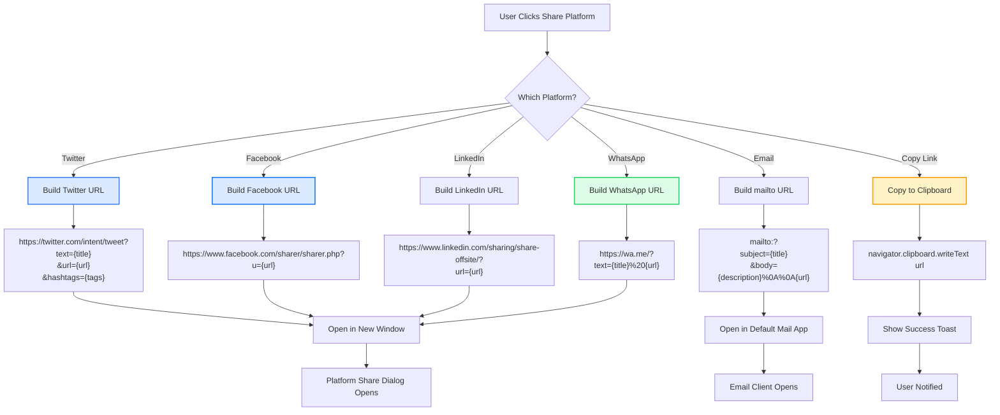
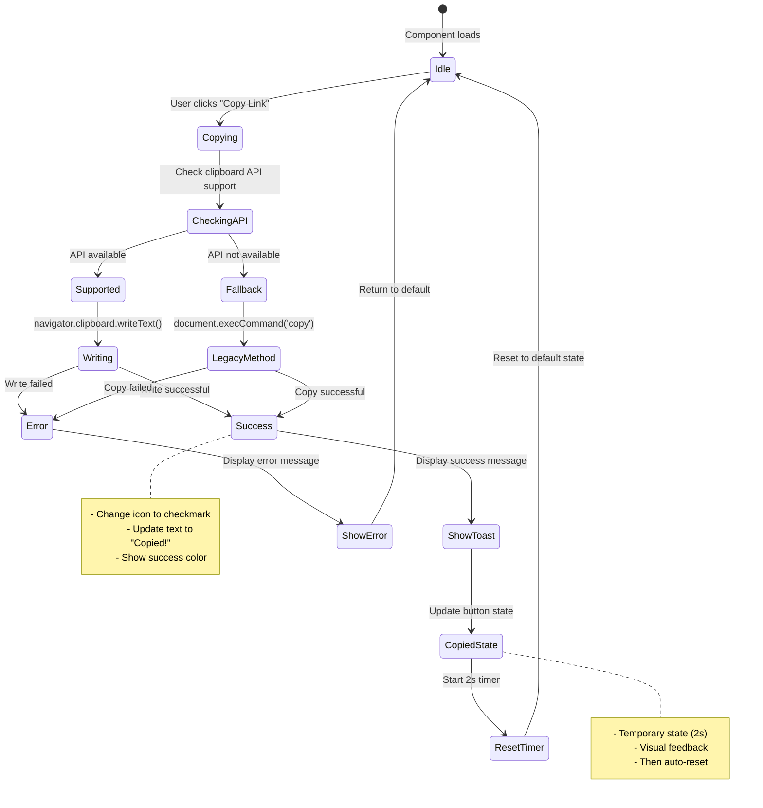

# ShareComponent

**Version:** 4.0.0  
**Last Updated:** January 2025

Social sharing component with multiple platform support and flexible display variants.

## Purpose

Provide easy content sharing with:
- Twitter/X, Facebook, Instagram integration
- WhatsApp, Email, and Copy link functionality
- Multiple display variants (dropdown, inline, compact)
- Accessibility compliance
- Success feedback
- Customizable styling

---

## Component Architecture

### Share Flow Sequence (Mermaid)



### Platform Share URL Building (Mermaid)



### Copy Link State Management (Mermaid)



---

## Usage

### Basic Usage

```tsx
import { ShareComponent } from './components/ui/ShareComponent';

<ShareComponent 
  title="Blog Post Title"
  url={window.location.href}
  description="Blog post description"
/>
```

### Inline Variant

```tsx
<ShareComponent 
  variant="inline"
  title="Portfolio Entry"
  url={shareUrl}
  description="Amazing festival makeup"
/>
```

### Dropdown Variant

```tsx
<ShareComponent 
  variant="dropdown"
  title="Article Title"
  url={articleUrl}
/>
```

---

## Props

```typescript
interface ShareComponentProps {
  /**
   * Content title to share
   * @required
   */
  title: string;
  
  /**
   * URL to share
   * @required
   */
  url: string;
  
  /**
   * Content description for social previews
   * @optional
   */
  description?: string;
  
  /**
   * Display variant
   * @default "inline"
   */
  variant?: 'dropdown' | 'inline' | 'compact';
  
  /**
   * Additional CSS classes
   * @default ""
   */
  className?: string;
  
  /**
   * Custom button text (for dropdown variant)
   * @default "Share"
   */
  buttonText?: string;
  
  /**
   * Platforms to display
   * @default all platforms
   */
  platforms?: SharePlatform[];
}

type SharePlatform = 'twitter' | 'facebook' | 'whatsapp' | 'email' | 'copy';
```

---

## Features

### Platform Integration

```typescript
const shareUrls = {
  twitter: `https://twitter.com/intent/tweet?text=${encodeURIComponent(title)}&url=${encodeURIComponent(url)}`,
  facebook: `https://www.facebook.com/sharer/sharer.php?u=${encodeURIComponent(url)}`,
  whatsapp: `https://wa.me/?text=${encodeURIComponent(`${title} ${url}`)}`,
  email: `mailto:?subject=${encodeURIComponent(title)}&body=${encodeURIComponent(`${description}\n\n${url}`)}`
};
```

### Copy to Clipboard

```typescript
const copyToClipboard = async () => {
  try {
    await navigator.clipboard.writeText(url);
    setShowCopiedFeedback(true);
    setTimeout(() => setShowCopiedFeedback(false), 2000);
  } catch (error) {
    console.error('Failed to copy:', error);
  }
};
```

### Success Feedback

```tsx
{showCopiedFeedback && (
  <div className="absolute -top-10 left-1/2 -translate-x-1/2 bg-green-600 text-white px-4 py-2 rounded-lg text-fluid-sm font-body font-medium whitespace-nowrap shadow-lg">
    Link copied!
  </div>
)}
```

---

## Implementation Example

Complete share component implementation:

```tsx
import React, { useState } from 'react';
import { Share2, Twitter, Facebook, MessageCircle, Mail, Link, Check } from 'lucide-react';

interface ShareComponentProps {
  title: string;
  url: string;
  description?: string;
  variant?: 'dropdown' | 'inline' | 'compact';
  className?: string;
  platforms?: SharePlatform[];
}

type SharePlatform = 'twitter' | 'facebook' | 'whatsapp' | 'email' | 'copy';

export function ShareComponent({ 
  title,
  url,
  description = '',
  variant = 'inline',
  className = '',
  platforms = ['twitter', 'facebook', 'whatsapp', 'email', 'copy']
}: ShareComponentProps) {
  const [isOpen, setIsOpen] = useState(false);
  const [showCopiedFeedback, setShowCopiedFeedback] = useState(false);

  const shareData = {
    twitter: {
      url: `https://twitter.com/intent/tweet?text=${encodeURIComponent(title)}&url=${encodeURIComponent(url)}`,
      icon: Twitter,
      label: 'Share on Twitter',
      color: 'text-blue-400 hover:text-blue-500'
    },
    facebook: {
      url: `https://www.facebook.com/sharer/sharer.php?u=${encodeURIComponent(url)}`,
      icon: Facebook,
      label: 'Share on Facebook',
      color: 'text-blue-600 hover:text-blue-700'
    },
    whatsapp: {
      url: `https://wa.me/?text=${encodeURIComponent(`${title} ${url}`)}`,
      icon: MessageCircle,
      label: 'Share on WhatsApp',
      color: 'text-green-600 hover:text-green-700'
    },
    email: {
      url: `mailto:?subject=${encodeURIComponent(title)}&body=${encodeURIComponent(`${description}\n\n${url}`)}`,
      icon: Mail,
      label: 'Share via Email',
      color: 'text-gray-600 hover:text-gray-700'
    }
  };

  const copyToClipboard = async () => {
    try {
      await navigator.clipboard.writeText(url);
      setShowCopiedFeedback(true);
      setTimeout(() => setShowCopiedFeedback(false), 2000);
    } catch (error) {
      console.error('Failed to copy:', error);
    }
  };

  const handleShare = (platform: Exclude<SharePlatform, 'copy'>) => {
    window.open(shareData[platform].url, '_blank', 'width=600,height=400');
  };

  // Inline variant
  if (variant === 'inline') {
    return (
      <div className={`flex items-center gap-3 ${className}`}>
        <span className="text-fluid-sm font-body font-medium text-gray-600">
          Share:
        </span>
        
        <div className="flex items-center gap-2">
          {platforms.filter(p => p !== 'copy').map(platform => {
            const Platform = shareData[platform];
            const Icon = Platform.icon;
            
            return (
              <button
                key={platform}
                onClick={() => handleShare(platform)}
                className={`w-10 h-10 rounded-full bg-white/80 backdrop-blur-sm border border-gray-200 flex items-center justify-center transition-all hover:scale-110 hover:shadow-md ${Platform.color}`}
                aria-label={Platform.label}
              >
                <Icon className="w-5 h-5" />
              </button>
            );
          })}
          
          {platforms.includes('copy') && (
            <div className="relative">
              <button
                onClick={copyToClipboard}
                className="w-10 h-10 rounded-full bg-white/80 backdrop-blur-sm border border-gray-200 flex items-center justify-center transition-all hover:scale-110 hover:shadow-md text-gray-600 hover:text-pink-500"
                aria-label="Copy link"
              >
                {showCopiedFeedback ? (
                  <Check className="w-5 h-5 text-green-600" />
                ) : (
                  <Link className="w-5 h-5" />
                )}
              </button>
              
              {showCopiedFeedback && (
                <div className="absolute -top-10 left-1/2 -translate-x-1/2 bg-green-600 text-white px-3 py-1 rounded text-fluid-xs font-body font-medium whitespace-nowrap shadow-lg">
                  Link copied!
                </div>
              )}
            </div>
          )}
        </div>
      </div>
    );
  }

  // Dropdown variant
  if (variant === 'dropdown') {
    return (
      <div className={`relative ${className}`}>
        <button
          onClick={() => setIsOpen(!isOpen)}
          className="flex items-center gap-2 px-4 py-2 bg-white/80 backdrop-blur-sm border border-gray-200 rounded-lg hover:bg-gray-50 transition-colors"
          aria-label="Share options"
          aria-expanded={isOpen}
        >
          <Share2 className="w-5 h-5 text-gray-600" />
          <span className="text-fluid-sm font-body font-medium text-gray-700">
            Share
          </span>
        </button>
        
        {isOpen && (
          <>
            <div 
              className="fixed inset-0 z-40"
              onClick={() => setIsOpen(false)}
            />
            
            <div className="absolute top-full right-0 mt-2 bg-white rounded-lg shadow-xl border border-gray-200 py-2 min-w-[200px] z-50">
              {platforms.filter(p => p !== 'copy').map(platform => {
                const Platform = shareData[platform];
                const Icon = Platform.icon;
                
                return (
                  <button
                    key={platform}
                    onClick={() => {
                      handleShare(platform);
                      setIsOpen(false);
                    }}
                    className="w-full flex items-center gap-3 px-4 py-2 hover:bg-gray-50 transition-colors"
                  >
                    <Icon className={`w-5 h-5 ${Platform.color}`} />
                    <span className="text-fluid-sm font-body text-gray-700">
                      {Platform.label.replace('Share on ', '').replace('Share via ', '')}
                    </span>
                  </button>
                );
              })}
              
              {platforms.includes('copy') && (
                <button
                  onClick={() => {
                    copyToClipboard();
                    setIsOpen(false);
                  }}
                  className="w-full flex items-center gap-3 px-4 py-2 hover:bg-gray-50 transition-colors border-t border-gray-100 mt-1 pt-3"
                >
                  <Link className="w-5 h-5 text-gray-600" />
                  <span className="text-fluid-sm font-body text-gray-700">
                    Copy Link
                  </span>
                </button>
              )}
            </div>
          </>
        )}
      </div>
    );
  }

  // Compact variant
  return (
    <button
      onClick={() => setIsOpen(!isOpen)}
      className={`flex items-center gap-2 text-gray-600 hover:text-pink-500 transition-colors ${className}`}
      aria-label="Share"
    >
      <Share2 className="w-5 h-5" />
    </button>
  );
}
```

---

## Usage Patterns

### Blog Post Footer

```tsx
<article>
  <h1>Blog Post Title</h1>
  <div className="prose">
    {/* Blog content */}
  </div>
  
  <footer className="mt-fluid-xl pt-fluid-lg border-t border-gray-200">
    <ShareComponent 
      variant="inline"
      title={post.title}
      url={window.location.href}
      description={post.excerpt}
    />
  </footer>
</article>
```

### Portfolio Entry

```tsx
<div className="flex items-center justify-between">
  <h2>Festival Makeup 2024</h2>
  
  <ShareComponent 
    variant="dropdown"
    title="Festival Makeup 2024"
    url={portfolioUrl}
    description="Vibrant festival makeup with UV accents"
  />
</div>
```

### Mobile Share Bar

```tsx
<div className="fixed bottom-0 left-0 right-0 bg-white/95 backdrop-blur-md border-t border-gray-200 p-4 md:hidden">
  <ShareComponent 
    variant="inline"
    title={content.title}
    url={shareUrl}
    className="justify-center"
  />
</div>
```

---

## Accessibility

### ARIA Labels

```tsx
<button 
  aria-label="Share on Twitter"
  onClick={handleTwitterShare}
>
  <Twitter className="w-5 h-5" />
</button>
```

### Keyboard Navigation

```tsx
// Close dropdown on Escape
useEffect(() => {
  const handleEscape = (e: KeyboardEvent) => {
    if (e.key === 'Escape') {
      setIsOpen(false);
    }
  };
  
  if (isOpen) {
    document.addEventListener('keydown', handleEscape);
  }
  
  return () => document.removeEventListener('keydown', handleEscape);
}, [isOpen]);
```

---

## Common Mistakes

### ❌ Mistake 1: Not Encoding URLs

```tsx
// ❌ WRONG - Special characters break sharing
const url = `https://twitter.com/intent/tweet?text=${title}&url=${shareUrl}`;
```

**Solution:**
```tsx
// ✅ CORRECT - Properly encoded
const url = `https://twitter.com/intent/tweet?text=${encodeURIComponent(title)}&url=${encodeURIComponent(shareUrl)}`;
```

### ❌ Mistake 2: Missing Success Feedback

```tsx
// ❌ WRONG - No confirmation after copying
await navigator.clipboard.writeText(url);
```

**Solution:**
```tsx
// ✅ CORRECT - Visual confirmation
await navigator.clipboard.writeText(url);
setShowCopiedFeedback(true);
setTimeout(() => setShowCopiedFeedback(false), 2000);
```

---

## Related Components

- **[PortfolioCard](./PortfolioCard.md)** - Portfolio items
- **[ReadMoreButton](./ReadMoreButton.md)** - Expandable content

---

## Related Documentation

- **[Guidelines.md](../Guidelines.md)** - Main guidelines
- **[overview-components.md](../overview-components.md)** - Component system
- **[overview-icons.md](../overview-icons.md)** - Icon system
- **[FILE_STRUCTURE.md](../FILE_STRUCTURE.md)** - File organization

---

**Last Updated:** January 2025  
**Version:** 4.0.0