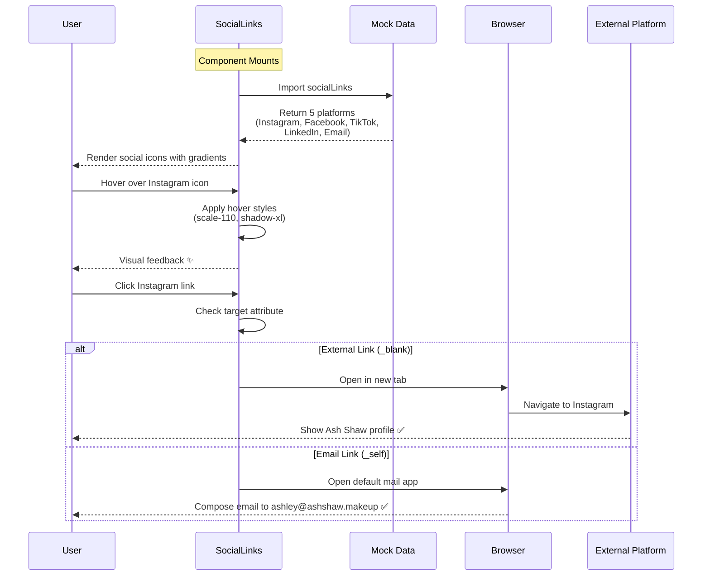
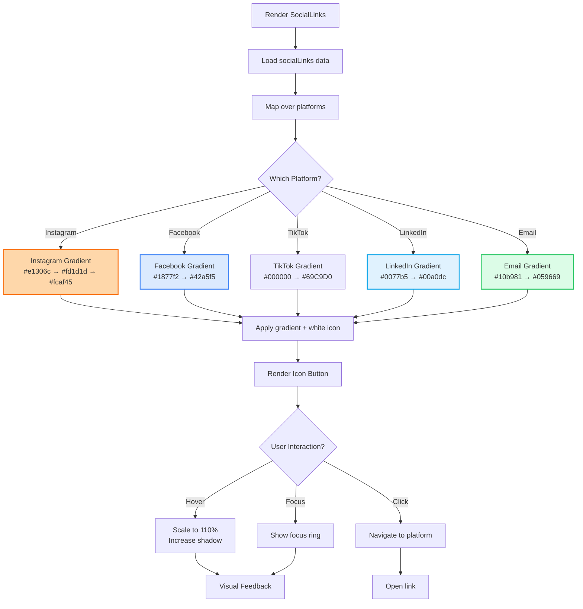
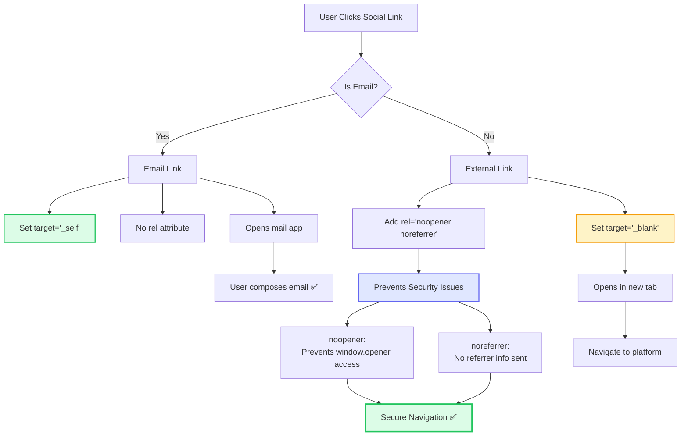
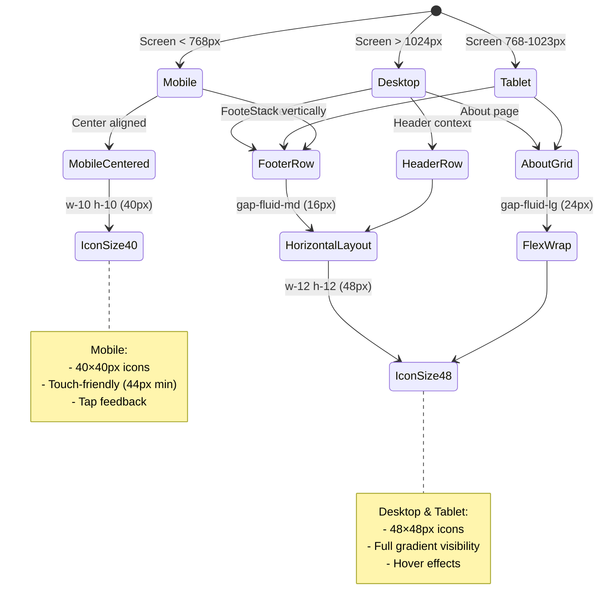

# SocialLinks Component

**Version:** 4.0.0  
**Last Updated:** January 2025

Social media link buttons with consistent styling and accessibility features.

## Purpose

Provide social media navigation with:
- Instagram, Facebook, TikTok, LinkedIn, Email integration
- Hover animations and visual feedback
- Customizable icon sizes and colors
- Accessibility compliance
- Responsive layout
- External link handling

---

## Component Architecture

### Social Link Click Flow (Mermaid)



### Platform-Specific Gradient Logic (Mermaid)



### External Link Safety (Mermaid)



### Responsive Layout States (Mermaid)



---

## 📦 Data Source

Social links are managed in the **centralized mock data system**.

### Import Pattern

```typescript
// Recommended: Main barrel export
import { socialLinks } from '@/data/mock';

// Or category-specific import
import { socialLinks } from '@/data/mock/ui/social-links';

// Type import
import type { SocialLink } from '@/data/types';
```

### Available Platforms

The project includes **5 social media platforms**:

| Platform | Icon | URL | Priority | Target |
|----------|------|-----|----------|--------|
| **Instagram** | `Instagram` | `https://instagram.com/ashshawmakeup` | Primary | `_blank` |
| **Facebook** | `Facebook` | `https://facebook.com/ashshawmakeup` | Secondary | `_blank` |
| **TikTok** | `Music` | `https://tiktok.com/@ashshawmakeup` | Secondary | `_blank` |
| **LinkedIn** | `Linkedin` | `https://linkedin.com/in/ashshaw` | Tertiary | `_blank` |
| **Email** | `Mail` | `mailto:ashley@ashshaw.makeup` | Contact | - |

**Note:** LinkedIn uses the `Linkedin` icon from lucide-react (verified).

### Data Structure

```typescript
export interface SocialLink {
  platform: string;      // e.g., "instagram", "facebook"
  url: string;          // Full URL or mailto link
  icon: string;         // Lucide icon name
  label: string;        // Accessible label (e.g., "Follow us on Instagram")
  primary?: boolean;    // Featured/priority link
}
```

**Data location:** `/data/mock/ui/social-links.ts`

### Usage in Components

```typescript
import { socialLinks } from '@/data/mock';

export function Footer() {
  return (
    <div className="flex gap-4">
      {socialLinks.map((link) => {
        const Icon = Icons[link.icon]; // Dynamic icon lookup
        
        return (
          <a
            key={link.platform}
            href={link.url}
            target={link.platform !== 'email' ? '_blank' : undefined}
            rel={link.platform !== 'email' ? 'noopener noreferrer' : undefined}
            aria-label={link.label}
            className="text-gray-600 hover:text-pink-500 transition-colors duration-300 focus:outline-none focus:ring-2 focus:ring-pink-200 rounded-lg p-2"
          >
            <Icon className="w-6 h-6" />
          </a>
        );
      })}
    </div>
  );
}
```

### Updating Social Links

**To add, remove, or modify social links:**

1. Edit `/data/mock/ui/social-links.ts`
2. Update the `socialLinks` array
3. Verify icon exists in lucide-react (see [overview-icons.md](../overview-icons.md))
4. Test changes across all components

**Example:**
```typescript
export const socialLinks: SocialLink[] = [
  {
    platform: 'instagram',
    url: 'https://instagram.com/ashshawmakeup',
    icon: 'Instagram',
    label: 'Follow us on Instagram',
    primary: true
  },
  // Add new platform
  {
    platform: 'twitter',
    url: 'https://twitter.com/ashshawmakeup',
    icon: 'Twitter',
    label: 'Follow us on Twitter'
  }
];
```

**See [mock-data.md](../mock-data.md) for complete mock data documentation.**

---

## Usage

### Basic Usage

```tsx
import { SocialLinks } from './components/common/SocialLinks';

<SocialLinks />
```

### With Custom Styling

```tsx
<SocialLinks 
  iconSize={24}
  className="text-white hover:text-pink-300"
/>
```

### Custom Layout

```tsx
<SocialLinks 
  layout="vertical"
  showLabels={true}
  iconSize={20}
/>
```

---

## Props

```typescript
interface SocialLinksProps {
  /**
   * Icon size in pixels
   * @default 20
   */
  iconSize?: number;
  
  /**
   * Layout orientation
   * @default "horizontal"
   */
  layout?: 'horizontal' | 'vertical';
  
  /**
   * Show platform labels
   * @default false
   */
  showLabels?: boolean;
  
  /**
   * Additional CSS classes
   * @default ""
   */
  className?: string;
  
  /**
   * Platforms to display
   * @default all platforms
   */
  platforms?: SocialPlatform[];
  
  /**
   * Custom platform URLs
   * @optional (uses default URLs)
   */
  customUrls?: Partial<Record<SocialPlatform, string>>;
}

type SocialPlatform = 'instagram' | 'facebook' | 'tiktok' | 'linkedin' | 'email';
```

---

## Social Platform Configuration

```typescript
const SOCIAL_LINKS = {
  instagram: {
    url: 'https://instagram.com/ashshawmakeup',
    label: 'Instagram',
    icon: Instagram,
    color: 'text-pink-600 hover:text-pink-700'
  },
  facebook: {
    url: 'https://facebook.com/ashshawmakeup',
    label: 'Facebook',
    icon: Facebook,
    color: 'text-blue-600 hover:text-blue-700'
  },
  tiktok: {
    url: 'https://tiktok.com/@ashshawmakeup',
    label: 'TikTok',
    icon: Music, // TikTok icon alternative
    color: 'text-gray-900 hover:text-pink-500'
  },
  linkedin: {
    url: 'https://linkedin.com/in/ashshaw',
    label: 'LinkedIn',
    icon: Linkedin,
    color: 'text-blue-600 hover:text-blue-700'
  },
  email: {
    url: 'mailto:ashley@ashshaw.makeup',
    label: 'Email',
    icon: Mail,
    color: 'text-gray-600 hover:text-pink-500'
  }
};
```

---

## Implementation Example

Complete social links implementation:

```tsx
import React from 'react';
import { Instagram, Facebook, Music, Linkedin, Mail } from 'lucide-react';

interface SocialLinksProps {
  iconSize?: number;
  layout?: 'horizontal' | 'vertical';
  showLabels?: boolean;
  className?: string;
  platforms?: SocialPlatform[];
}

type SocialPlatform = 'instagram' | 'facebook' | 'tiktok' | 'linkedin' | 'email';

const SOCIAL_LINKS = {
  instagram: {
    url: 'https://instagram.com/ashshawmakeup',
    label: 'Instagram',
    icon: Instagram,
    color: 'text-pink-600 hover:text-pink-700'
  },
  facebook: {
    url: 'https://facebook.com/ashshawmakeup',
    label: 'Facebook',
    icon: Facebook,
    color: 'text-blue-600 hover:text-blue-700'
  },
  tiktok: {
    url: 'https://tiktok.com/@ashshawmakeup',
    label: 'TikTok',
    icon: Music,
    color: 'text-gray-900 hover:text-pink-500'
  },
  linkedin: {
    url: 'https://linkedin.com/in/ashshaw',
    label: 'LinkedIn',
    icon: Linkedin,
    color: 'text-blue-600 hover:text-blue-700'
  },
  email: {
    url: 'mailto:ashley@ashshaw.makeup',
    label: 'Email',
    icon: Mail,
    color: 'text-gray-600 hover:text-pink-500'
  }
};

export function SocialLinks({ 
  iconSize = 20,
  layout = 'horizontal',
  showLabels = false,
  className = '',
  platforms = ['instagram', 'facebook', 'tiktok', 'linkedin', 'email']
}: SocialLinksProps) {
  return (
    <div 
      className={`
        flex 
        ${layout === 'horizontal' ? 'flex-row items-center gap-4' : 'flex-col items-start gap-3'}
        ${className}
      `}
      role="navigation"
      aria-label="Social media links"
    >
      {platforms.map(platform => {
        const social = SOCIAL_LINKS[platform];
        const Icon = social.icon;
        
        return (
          <a
            key={platform}
            href={social.url}
            target={platform !== 'email' ? '_blank' : undefined}
            rel={platform !== 'email' ? 'noopener noreferrer' : undefined}
            aria-label={`Visit Ash Shaw on ${social.label}`}
            className={`
              flex items-center gap-2
              transition-all duration-300
              ${social.color}
              ${showLabels ? '' : 'hover:scale-110'}
              focus:outline-none focus:ring-2 focus:ring-pink-200 focus:ring-opacity-50 rounded-lg p-1
            `}
          >
            <Icon size={iconSize} />
            
            {showLabels && (
              <span className="text-fluid-sm font-body font-medium">
                {social.label}
              </span>
            )}
          </a>
        );
      })}
    </div>
  );
}
```

---

## Usage Patterns

### Footer Social Links

```tsx
<footer className="bg-gray-900 text-white py-fluid-xl px-6">
  <div className="max-w-7xl mx-auto">
    <div className="text-center mb-fluid-md">
      <h3 className="text-fluid-lg font-heading font-semibold mb-fluid-sm">
        Follow Me
      </h3>
      
      <SocialLinks 
        iconSize={24}
        className="justify-center text-white hover:text-pink-300"
      />
    </div>
  </div>
</footer>
```

### Hero Section Social Links

```tsx
<section className="py-section text-center">
  <h1 className="text-hero-h1 font-title font-bold text-gradient-pink-purple-blue mb-fluid-md">
    Ash Shaw
  </h1>
  
  <p className="text-fluid-lg font-body text-gray-700 mb-fluid-lg">
    Makeup Artist | Brisbane, Australia
  </p>
  
  <SocialLinks 
    iconSize={28}
    className="justify-center text-gray-700"
  />
</section>
```

### Sidebar with Labels

```tsx
<aside className="bg-white/80 backdrop-blur-sm rounded-2xl p-fluid-lg">
  <h3 className="text-fluid-lg font-heading font-semibold mb-fluid-md">
    Connect With Me
  </h3>
  
  <SocialLinks 
    layout="vertical"
    showLabels={true}
    iconSize={20}
    className="text-gray-700"
  />
</aside>
```

### Contact Page

```tsx
<section className="py-section px-6">
  <div className="max-w-4xl mx-auto text-center">
    <h2 className="text-section-h2 font-heading font-semibold mb-fluid-md">
      Get In Touch
    </h2>
    
    <p className="text-body-guideline font-body text-gray-700 mb-fluid-lg">
      Reach out through any of these platforms
    </p>
    
    <SocialLinks 
      iconSize={32}
      className="justify-center gap-6"
    />
  </div>
</section>
```

---

## Advanced Patterns

### With Custom Platform URLs

```tsx
<SocialLinks 
  customUrls={{
    instagram: 'https://instagram.com/custom-handle',
    email: 'mailto:custom@email.com'
  }}
/>
```

### Circular Button Style

```tsx
<div className="flex gap-3">
  {['instagram', 'facebook', 'tiktok'].map(platform => (
    <a
      key={platform}
      href={SOCIAL_LINKS[platform].url}
      className="w-12 h-12 rounded-full bg-gradient-pink-purple-blue flex items-center justify-center text-white hover:shadow-xl transition-all hover:scale-110"
      aria-label={SOCIAL_LINKS[platform].label}
    >
      {React.createElement(SOCIAL_LINKS[platform].icon, { size: 20 })}
    </a>
  ))}
</div>
```

### With Share Count (if available)

```tsx
<div className="flex items-center gap-2">
  <a href={SOCIAL_LINKS.instagram.url} className="flex items-center gap-2">
    <Instagram size={20} />
    <span className="text-fluid-sm font-body">
      12.5k followers
    </span>
  </a>
</div>
```

### Animated on Hover

```tsx
<a
  href={social.url}
  className="group relative"
>
  <div className="absolute inset-0 bg-pink-500/20 rounded-full scale-0 group-hover:scale-100 transition-transform duration-300" />
  
  <Icon 
    size={24}
    className="relative z-10 transition-transform group-hover:scale-110"
  />
</a>
```

---

## Accessibility

### External Link Handling

```tsx
<a
  href={url}
  target="_blank"
  rel="noopener noreferrer"
  aria-label="Visit Ash Shaw on Instagram (opens in new tab)"
>
  <Instagram />
</a>
```

### Navigation Landmark

```tsx
<nav aria-label="Social media links">
  <ul className="flex gap-4">
    <li>
      <a href={instagram} aria-label="Instagram">
        <Instagram />
      </a>
    </li>
  </ul>
</nav>
```

### Keyboard Navigation

```tsx
<a
  href={url}
  className="focus:outline-none focus:ring-2 focus:ring-pink-200 focus:ring-opacity-50 rounded-lg p-2"
  onKeyDown={(e) => {
    if (e.key === 'Enter') {
      window.open(url, '_blank');
    }
  }}
>
  <Icon />
</a>
```

---

## Common Mistakes

### ❌ Mistake 1: Missing rel="noopener"

```tsx
// ❌ WRONG - Security risk
<a href={url} target="_blank">
  <Instagram />
</a>
```

**Solution:**
```tsx
// ✅ CORRECT - Secure external links
<a href={url} target="_blank" rel="noopener noreferrer">
  <Instagram />
</a>
```

### ❌ Mistake 2: No Aria Labels

```tsx
// ❌ WRONG - No context for screen readers
<a href={instagramUrl}>
  <Instagram />
</a>
```

**Solution:**
```tsx
// ✅ CORRECT - Clear labels
<a href={instagramUrl} aria-label="Visit Ash Shaw on Instagram">
  <Instagram />
</a>
```

### ❌ Mistake 3: Inconsistent Spacing

```tsx
// ❌ WRONG - Random gaps
<div className="flex gap-2">
  <Instagram size={20} />
  <div className="ml-5">
    <Facebook size={24} />
  </div>
</div>
```

**Solution:**
```tsx
// ✅ CORRECT - Consistent spacing
<div className="flex gap-4">
  <Instagram size={20} />
  <Facebook size={20} />
</div>
```

---

## Platform-Specific Notes

### Instagram
- Primary platform for makeup artists
- Use Instagram icon from lucide-react
- Link to profile: `https://instagram.com/username`

### Facebook
- Secondary social platform
- Use Facebook icon from lucide-react
- Link to page: `https://facebook.com/page-name`

### TikTok
- Growing platform for makeup content
- Use Music icon as alternative (lucide-react doesn't have TikTok)
- Link: `https://tiktok.com/@username`

### LinkedIn
- Professional networking platform
- Use Linkedin icon from lucide-react
- Link: `https://linkedin.com/in/username`

### Email
- Direct contact method
- Use Mail icon from lucide-react
- Link: `mailto:email@address.com`

---

## Related Components

- **[Footer](./Footer.md)** - Site footer with social links
- **[Header](./Header.md)** - Main navigation
- **[ContactForm](./ContactForm.md)** - Contact form integration
- **[ShareComponent](./ShareComponent.md)** - Content sharing

---

## Related Documentation

- **[Guidelines.md](../Guidelines.md)** - Main project guidelines
- **[mock-data.md](../mock-data.md)** - Mock data system guide
- **[overview-components.md](../overview-components.md)** - Component architecture
- **[overview-icons.md](../overview-icons.md)** - Icon verification process
- **[design-tokens/colors.md](../design-tokens/colors.md)** - Color system
- **[FILE_STRUCTURE.md](../FILE_STRUCTURE.md)** - File organization

---

**Last Updated:** January 2025  
**Version:** 4.0.0