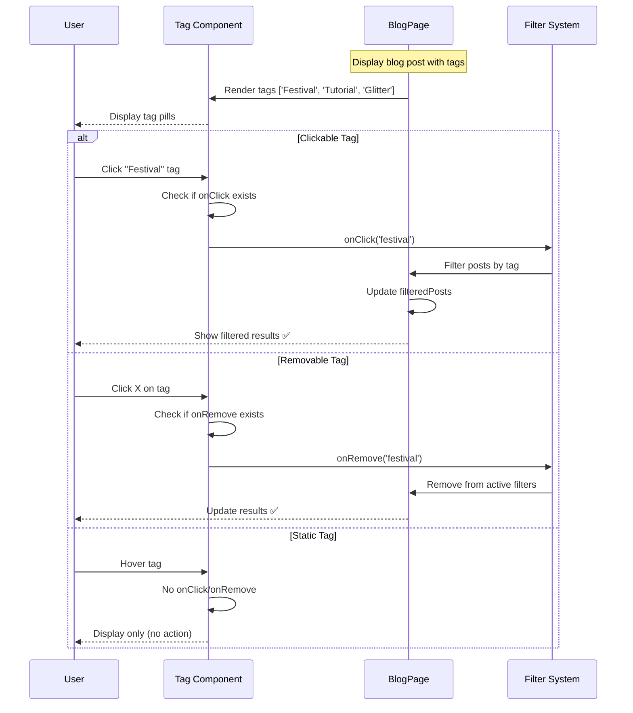
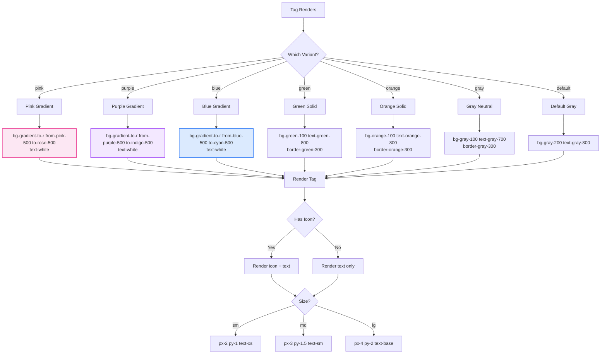

# Tag Component

**Version:** 4.0.0  
**Last Updated:** January 2025

Tag/badge component for categorization, labels, and metadata display.

## Purpose

Display labels and categories with:
- Multiple color variants
- Size options (sm, md, lg)
- Icon support
- Removable/dismissible option
- Interactive (clickable) variant
- Customizable styling
- Accessibility support

---

## Component Architecture

### Tag Interaction Flow (Mermaid)



### Tag Variant Color Mapping (Mermaid)



### Tag State Management (Mermaid)

```mermaid
stateDiagram-v2
    [*] --> Static: onClick/onRemove undefined
    [*] --> Interactive: onClick defined
    [*] --> Removable: onRemove defined
    
    Static --> Idle: Display only
    Idle --> Idle: No user actions
    
    Interactive --> Clickable: Cursor pointer
    Clickable --> Hover: Mouse enter
    Clickable --> Focused: Keyboard focus
    
    Hover --> Click: Mouse click
    Focused --> Click: Enter/Space key
    
    Click --> FilterActive: Execute onClick
    FilterActive --> UpdateUI: Apply filter
    UpdateUI --> Clickable: Return to idle
    
    Removable --> RemovableIdle: Show X button
    RemovableIdle --> RemoveHover: Hover X button
    RemoveHover --> Remove: Click X
    
    Remove --> Unmount: Execute onRemove
    Unmount --> [*]: Tag removed from DOM
    
    note right of Interactive
        Clickable tags:
        - Cursor pointer
        - Hover effects
        - Filter on click
    end note
    
    note right of Removable
        Removable tags:
        - X close button
        - Remove from list
        - Dismiss action
    end note
```

---

## Usage

### Basic Usage

```tsx
import { Tag } from './components/ui/Tag';

<Tag>Festival</Tag>
```

### With Color Variant

```tsx
<Tag variant="pink">Festival</Tag>
<Tag variant="purple">Editorial</Tag>
<Tag variant="blue">Special Event</Tag>
```

### Clickable Tag

```tsx
<Tag 
  variant="pink"
  onClick={() => filterByTag('festival')}
>
  Festival
</Tag>
```

### Removable Tag

```tsx
<Tag 
  variant="purple"
  onRemove={() => removeTag('makeup-tutorial')}
>
  Makeup Tutorial
</Tag>
```

### With Icon

```tsx
import { Sparkles } from 'lucide-react';

<Tag 
  variant="pink"
  icon={<Sparkles className="w-3 h-3" />}
>
  Featured
</Tag>
```

---

## Props

```typescript
interface TagProps {
  /**
   * Tag content
   * @required
   */
  children: React.ReactNode;
  
  /**
   * Color variant
   * @default "gray"
   */
  variant?: 'pink' | 'purple' | 'blue' | 'green' | 'yellow' | 'red' | 'gray';
  
  /**
   * Tag size
   * @default "md"
   */
  size?: 'sm' | 'md' | 'lg';
  
  /**
   * Optional icon
   * @optional
   */
  icon?: React.ReactNode;
  
  /**
   * Click handler (makes tag interactive)
   * @optional
   */
  onClick?: () => void;
  
  /**
   * Remove/dismiss handler
   * @optional
   */
  onRemove?: () => void;
  
  /**
   * Additional CSS classes
   * @default ""
   */
  className?: string;
}
```

---

## Implementation Example

Complete tag component implementation:

```tsx
import React from 'react';
import { X } from 'lucide-react';

interface TagProps {
  children: React.ReactNode;
  variant?: 'pink' | 'purple' | 'blue' | 'green' | 'yellow' | 'red' | 'gray';
  size?: 'sm' | 'md' | 'lg';
  icon?: React.ReactNode;
  onClick?: () => void;
  onRemove?: () => void;
  className?: string;
}

export function Tag({ 
  children,
  variant = 'gray',
  size = 'md',
  icon,
  onClick,
  onRemove,
  className = ''
}: TagProps) {
  const variantClasses = {
    pink: 'bg-pink-100 text-pink-700 hover:bg-pink-200',
    purple: 'bg-purple-100 text-purple-700 hover:bg-purple-200',
    blue: 'bg-blue-100 text-blue-700 hover:bg-blue-200',
    green: 'bg-green-100 text-green-700 hover:bg-green-200',
    yellow: 'bg-yellow-100 text-yellow-700 hover:bg-yellow-200',
    red: 'bg-red-100 text-red-700 hover:bg-red-200',
    gray: 'bg-gray-100 text-gray-700 hover:bg-gray-200'
  };

  const sizeClasses = {
    sm: 'px-2 py-0.5 text-fluid-xs',
    md: 'px-3 py-1 text-fluid-sm',
    lg: 'px-4 py-1.5 text-fluid-base'
  };

  const iconSizes = {
    sm: 'w-3 h-3',
    md: 'w-4 h-4',
    lg: 'w-5 h-5'
  };

  const Component = onClick ? 'button' : 'span';

  return (
    <Component
      onClick={onClick}
      className={`
        inline-flex items-center gap-1.5
        rounded-full font-body font-medium
        transition-colors duration-200
        ${variantClasses[variant]}
        ${sizeClasses[size]}
        ${onClick ? 'cursor-pointer' : ''}
        ${className}
      `}
      type={onClick ? 'button' : undefined}
    >
      {icon && <span className={iconSizes[size]}>{icon}</span>}
      
      <span>{children}</span>
      
      {onRemove && (
        <button
          onClick={(e) => {
            e.stopPropagation();
            onRemove();
          }}
          className="ml-1 hover:opacity-70 transition-opacity"
          aria-label={`Remove ${children}`}
        >
          <X className={iconSizes[size]} />
        </button>
      )}
    </Component>
  );
}
```

---

## Usage Patterns

### Blog Post Tags

```tsx
function BlogPost({ post }: Props) {
  return (
    <article>
      <h1>{post.title}</h1>
      
      <div className="flex flex-wrap gap-2 mb-fluid-md">
        {post.tags.map(tag => (
          <Tag 
            key={tag}
            variant="pink"
            size="sm"
            onClick={() => filterByTag(tag)}
          >
            #{tag}
          </Tag>
        ))}
      </div>
      
      {/* Post content */}
    </article>
  );
}
```

### Portfolio Categories

```tsx
function PortfolioCard({ entry }: Props) {
  const categoryColors = {
    festival: 'purple',
    editorial: 'pink',
    'special-event': 'blue',
    nails: 'green'
  };
  
  return (
    <article className="bg-white rounded-2xl p-fluid-md">
      <Tag variant={categoryColors[entry.category]}>
        {entry.category}
      </Tag>
      
      <h3>{entry.title}</h3>
      {/* Card content */}
    </article>
  );
}
```

### Filter Tags (Removable)

```tsx
function ActiveFilters({ filters, onRemove }: Props) {
  if (filters.length === 0) return null;
  
  return (
    <div className="flex flex-wrap gap-2 mb-fluid-md">
      <span className="text-fluid-sm font-body text-gray-600">
        Active filters:
      </span>
      
      {filters.map(filter => (
        <Tag
          key={filter.id}
          variant="pink"
          size="sm"
          onRemove={() => onRemove(filter.id)}
        >
          {filter.label}
        </Tag>
      ))}
      
      <button
        onClick={() => onRemove('all')}
        className="text-fluid-sm font-body text-pink-600 hover:text-pink-700"
      >
        Clear all
      </button>
    </div>
  );
}
```

### Status Indicators

```tsx
function BookingStatus({ status }: Props) {
  const statusConfig = {
    pending: { variant: 'yellow', label: 'Pending' },
    confirmed: { variant: 'green', label: 'Confirmed' },
    completed: { variant: 'blue', label: 'Completed' },
    cancelled: { variant: 'red', label: 'Cancelled' }
  };
  
  const config = statusConfig[status];
  
  return (
    <Tag variant={config.variant}>
      {config.label}
    </Tag>
  );
}
```

### Tag Cloud

```tsx
function TagCloud({ tags }: Props) {
  return (
    <div className="bg-gray-50 rounded-2xl p-fluid-lg">
      <h3 className="text-fluid-lg font-heading font-semibold mb-fluid-md">
        Popular Tags
      </h3>
      
      <div className="flex flex-wrap gap-2">
        {tags.map(tag => (
          <Tag
            key={tag.name}
            variant="purple"
            size={tag.count > 10 ? 'lg' : tag.count > 5 ? 'md' : 'sm'}
            onClick={() => navigate(`/blog/tag/${tag.slug}`)}
          >
            {tag.name} ({tag.count})
          </Tag>
        ))}
      </div>
    </div>
  );
}
```

---

## Advanced Features

### With Badge Count

```tsx
<Tag variant="pink">
  Notifications
  <span className="ml-1 px-1.5 py-0.5 bg-pink-600 text-white rounded-full text-fluid-xs">
    3
  </span>
</Tag>
```

### Gradient Tags

```tsx
<span className="inline-flex items-center px-3 py-1 rounded-full bg-gradient-pink-purple-blue text-white font-body font-medium text-fluid-sm">
  Featured
</span>
```

### Outlined Variant

```tsx
<span className="inline-flex items-center px-3 py-1 rounded-full border-2 border-pink-500 text-pink-700 font-body font-medium text-fluid-sm hover:bg-pink-50">
  Festival
</span>
```

### With Dot Indicator

```tsx
<Tag variant="green">
  <span className="w-2 h-2 bg-green-500 rounded-full" />
  Active
</Tag>
```

---

## Color Variants

### Pink
```tsx
<Tag variant="pink">Festival</Tag>
```
Use for: Festival makeup, featured items, primary categories

### Purple
```tsx
<Tag variant="purple">Editorial</Tag>
```
Use for: Editorial work, creative categories

### Blue
```tsx
<Tag variant="blue">Special Event</Tag>
```
Use for: Events, informational tags

### Green
```tsx
<Tag variant="green">Verified</Tag>
```
Use for: Success states, verified items, active status

### Yellow
```tsx
<Tag variant="yellow">Pending</Tag>
```
Use for: Warnings, pending states, attention needed

### Red
```tsx
<Tag variant="red">Cancelled</Tag>
```
Use for: Errors, cancelled items, important alerts

### Gray
```tsx
<Tag variant="gray">Draft</Tag>
```
Use for: Neutral tags, inactive states, default

---

## Accessibility

### Interactive Tags

```tsx
<button
  onClick={onClick}
  className="tag"
  type="button"
  aria-label="Filter by festival makeup"
>
  Festival
</button>
```

### Removable Tags

```tsx
<span className="tag">
  <span>Tutorial</span>
  <button
    onClick={onRemove}
    aria-label="Remove tutorial tag"
  >
    <X className="w-3 h-3" />
  </button>
</span>
```

### Semantic HTML

```tsx
// For clickable tags
<button type="button">Tag</button>

// For display-only tags
<span>Tag</span>

// In a list of tags
<ul className="flex gap-2">
  <li><Tag>Tag 1</Tag></li>
  <li><Tag>Tag 2</Tag></li>
</ul>
```

---

## Common Mistakes

### ❌ Mistake 1: All Tags Same Color

```tsx
// ❌ WRONG - No visual distinction
<Tag>Festival</Tag>
<Tag>Editorial</Tag>
<Tag>Nails</Tag>
```

**Solution:**
```tsx
// ✅ CORRECT - Color-coded categories
<Tag variant="purple">Festival</Tag>
<Tag variant="pink">Editorial</Tag>
<Tag variant="green">Nails</Tag>
```

### ❌ Mistake 2: Missing Click Feedback

```tsx
// ❌ WRONG - No visual indication it's clickable
<div onClick={filter}>Festival</div>
```

**Solution:**
```tsx
// ✅ CORRECT - Button with hover state
<Tag variant="pink" onClick={filter}>
  Festival
</Tag>
```

### ❌ Mistake 3: No Remove Confirmation

```tsx
// ❌ WRONG - Accidental removal
<Tag onRemove={() => removeTag(id)}>Tag</Tag>
```

**Solution:**
```tsx
// ✅ CORRECT - Confirm before removing important tags
<Tag onRemove={() => {
  if (confirm('Remove this tag?')) removeTag(id);
}}>
  Important Tag
</Tag>
```

---

## Related Components

- **[CategoryFilter](./CategoryFilter.md)** - Category filtering
- **[BlogCard](./BlogCard.md)** - Blog posts with tags
- **[PortfolioCard](./PortfolioCard.md)** - Portfolio categories

---

## Related Documentation

- **[Guidelines.md](../Guidelines.md)** - Main guidelines
- **[overview-components.md](../overview-components.md)** - Component system
- **[FILE_STRUCTURE.md](../FILE_STRUCTURE.md)** - File organization
- **[design-tokens/colors.md](../design-tokens/colors.md)** - Color system
- **[design-tokens/typography.md](../design-tokens/typography.md)** - Typography scale

---

**Last Updated:** January 2025  
**Version:** 4.0.0