# Contentful CMS - Architecture Diagrams

**Visual reference for content structure, relationships, and data flow**

---

## 📊 Content Model Relationships

### Complete Content Architecture

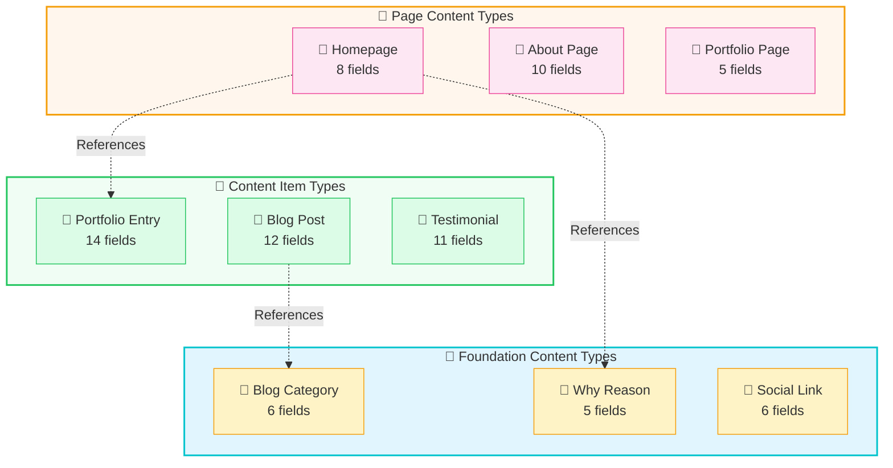

---

## 🔄 Content Flow & Dependencies

### Creation Order Diagram

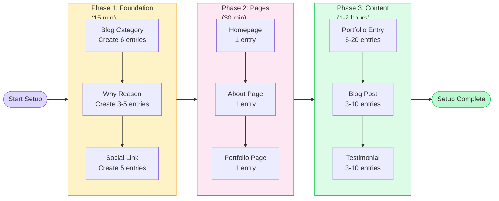

---

## 🏗️ Data Transformation Flow

### Contentful → Application Pipeline

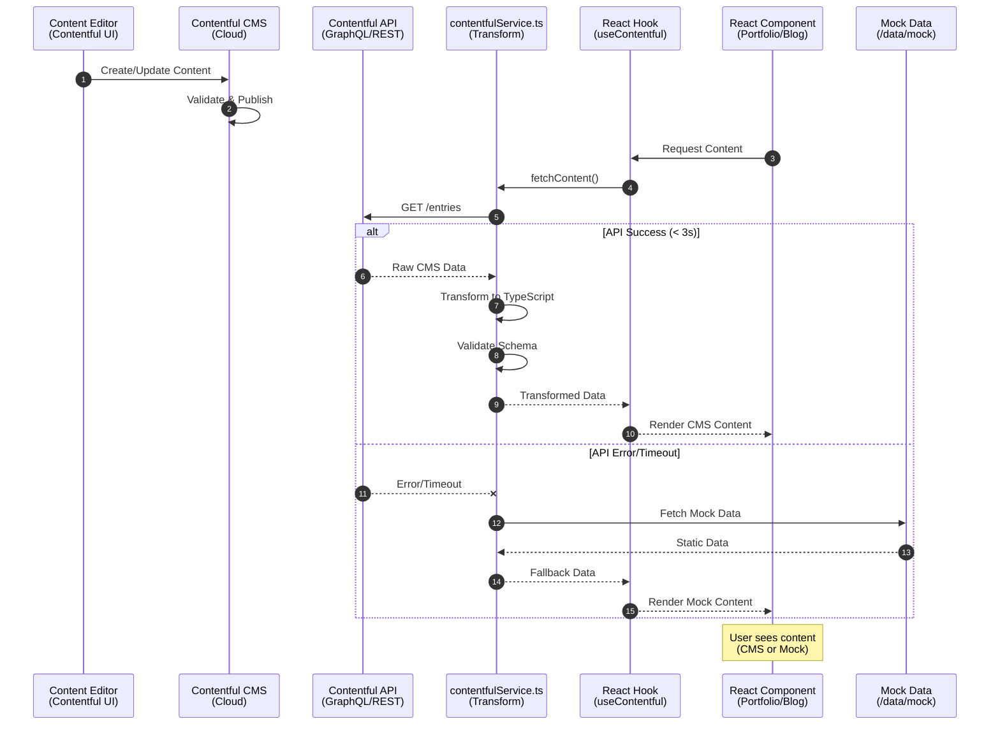

---

## 📦 Content Type Field Distribution

### Fields per Content Type

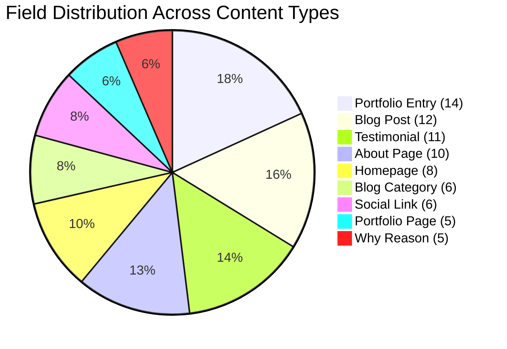

**Total:** 77 fields across 9 content types

---

## 🎯 Content Type Priority Matrix

### Implementation Priority vs Complexity

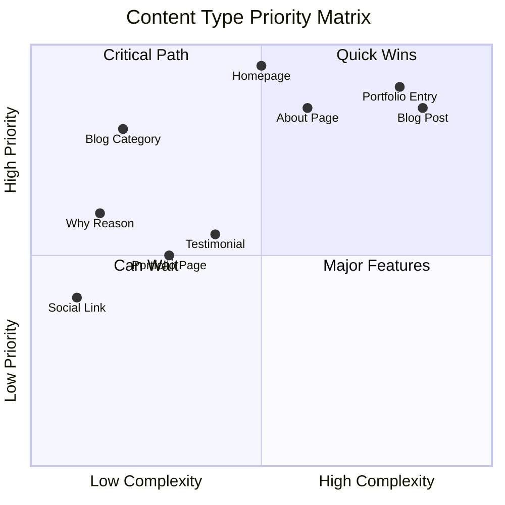

**Interpretation:**
- **Quadrant 2 (Top Left):** Start here - High priority, low complexity
- **Quadrant 1 (Top Right):** Do next - High priority, high complexity
- **Quadrant 4 (Bottom Right):** After critical content - Nice to have
- **Quadrant 3 (Bottom Left):** Optional - Can add later

---

## 🔗 Field Type Distribution

### Field Types Across All Content Types

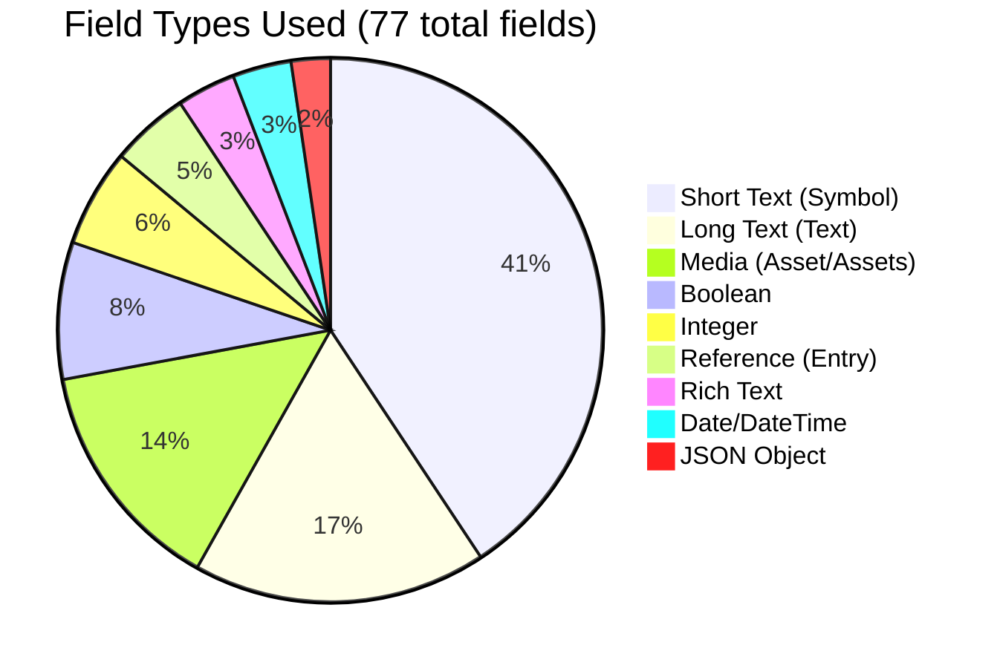

---

## 📋 Content Entry Workflow

### Editorial Process Flow

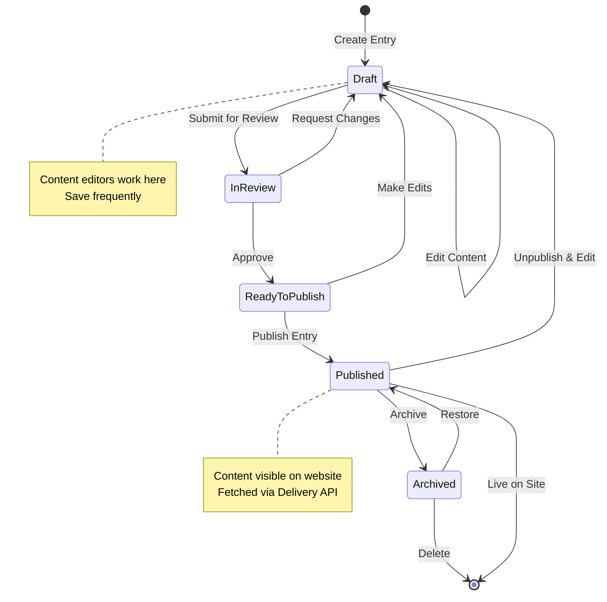

---

## 🎨 Homepage Content Structure

### Homepage Data Sources

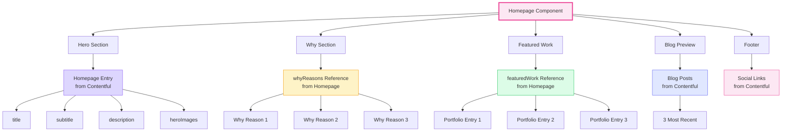

---

## 📝 Blog Post Content Structure

### Blog Post Anatomy

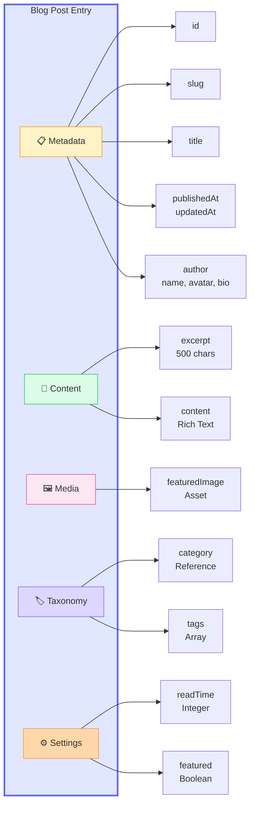

---

## 🖼️ Portfolio Entry Content Structure

### Portfolio Entry Anatomy

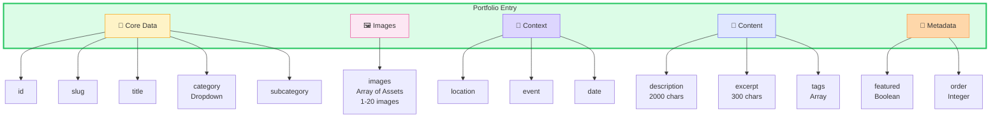

---

## 🔄 API Integration Architecture

### Complete System Overview

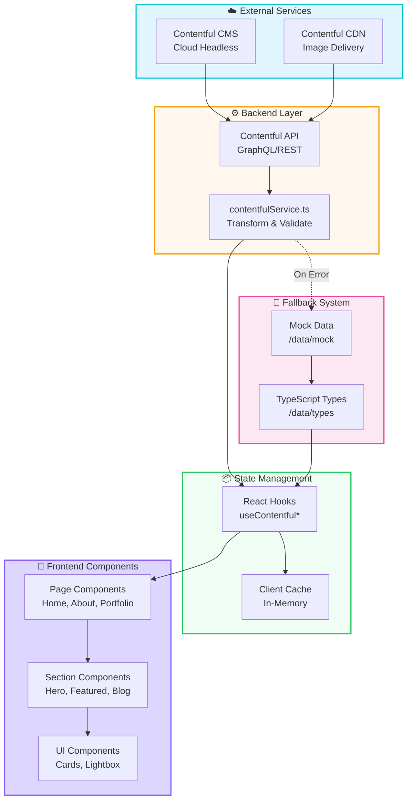

---

## 📊 Content Volume Planning

### Recommended Content Targets

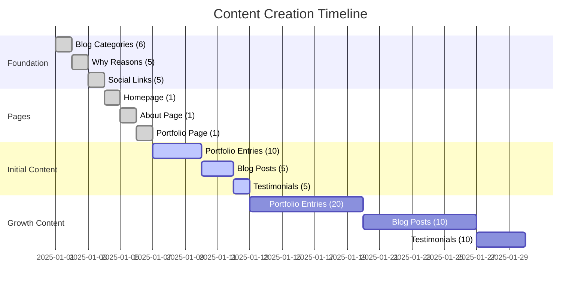

**Milestones:**
- **Day 3:** Foundation complete
- **Day 6:** All page templates ready
- **Day 13:** Minimum viable content (MVP)
- **Day 30:** Full content library

---

## 🎯 Field Validation Summary

### Validation Rules Overview

| Field Type | Common Validations | Example |
|-----------|-------------------|---------|
| **Symbol (Short Text)** | Max length, Unique, Pattern | Max 100 chars |
| **Text (Long Text)** | Max length, Min length | Max 2000 chars |
| **Integer** | Range, In (dropdown) | 0-999 |
| **Boolean** | Default value | true/false |
| **Date/DateTime** | Format | ISO 8601 |
| **Asset** | MIME type, File size | Images only, <5MB |
| **Asset[]** | Size (min/max count) | 1-20 images |
| **Entry** | Link content type | blogCategory only |
| **Entry[]** | Link content type | whyReason only |
| **RichText** | Enabled node types | Headings, lists, links |

---

## 📚 TypeScript Type Alignment

### Content Type → TypeScript Mapping

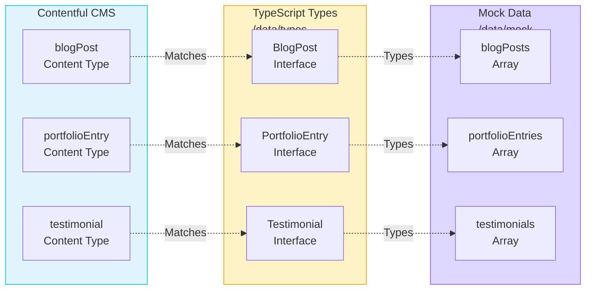

**Critical Requirement:** All field names must match exactly between Contentful and TypeScript interfaces!

---

## 🚀 Quick Reference Legend

### Diagram Symbols

| Symbol | Meaning |
|--------|---------|
| 📁 | Content Type |
| 📄 | Page |
| 📝 | Content Item |
| 🖼️ | Media/Asset |
| 🔗 | Reference Relationship |
| ⚙️ | Configuration |
| 📋 | Metadata |
| 🏷️ | Tags/Categories |
| ☁️ | External Service |
| 💾 | Local Storage |
| ➡️ | Data Flow |
| ⚡ | Quick Action |

---

**Last Updated:** January 2025  
**Version:** 1.0.0

For complete documentation, see:
- [Quick Setup Guide](./contentful-quick-setup.md)
- [Content Models](./contentful-content-models.md)
- [Integration Guide](./contentful-integration.md)
