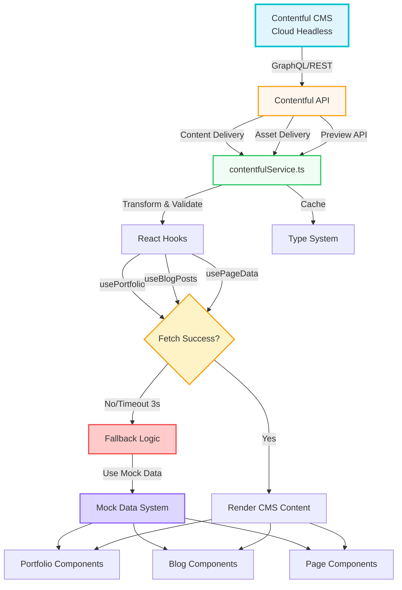
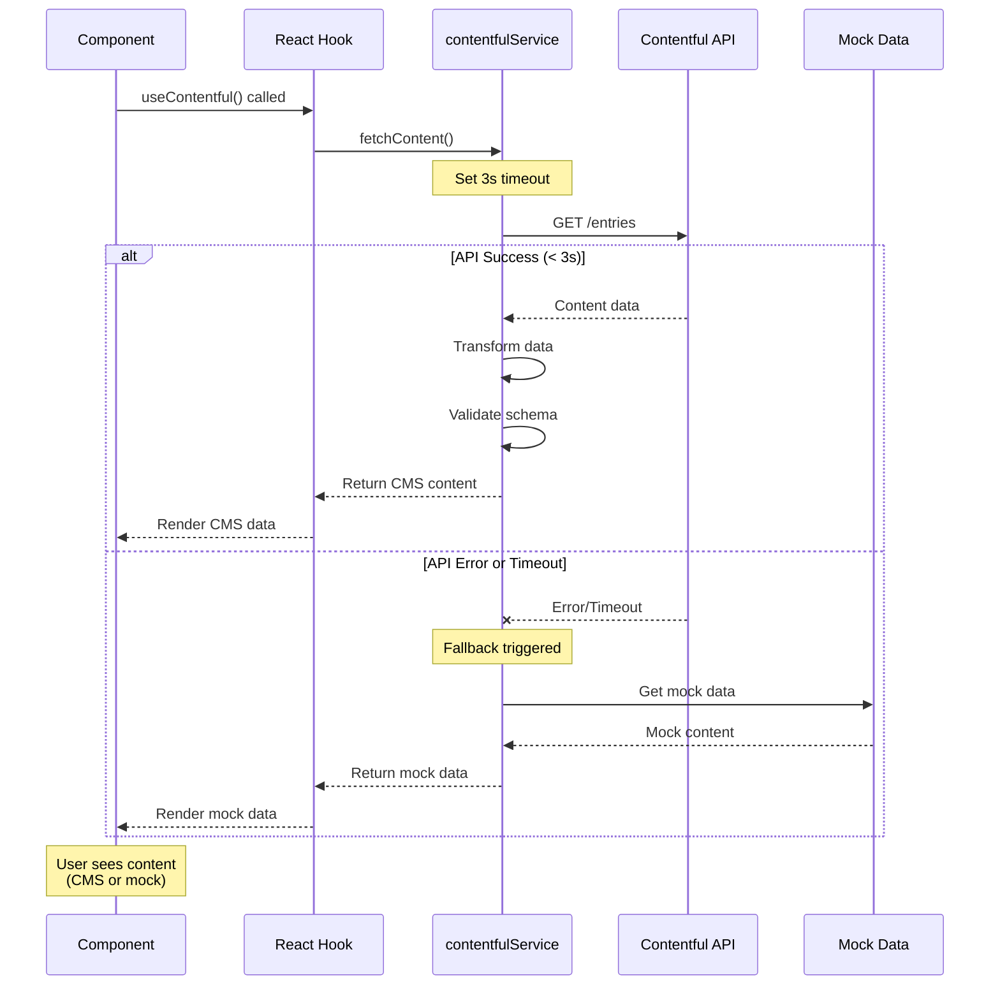
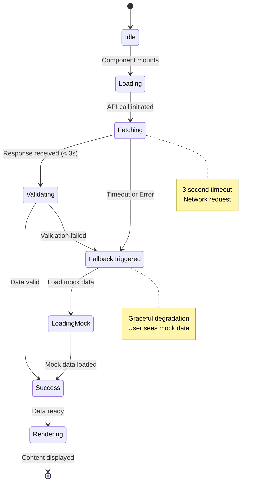

# Contentful CMS Integration Guidelines

**Version:** 1.0.0  
**Last Updated:** January 2025  
**Status:** Production-Ready

---

## 📚 Table of Contents

1. [Overview](#overview)
2. [Architecture](#architecture)
3. [Content Models](#content-models)
4. [Mock Data Alignment](#mock-data-alignment)
5. [Setup & Configuration](#setup--configuration)
6. [Content Type Mapping](#content-type-mapping)
7. [Usage Patterns](#usage-patterns)
8. [API Integration](#api-integration)
9. [Error Handling](#error-handling)
10. [Best Practices](#best-practices)

---

## 🎯 Overview

### What is Contentful Integration?

The Contentful CMS integration provides dynamic content management for the Ash Shaw Portfolio while maintaining seamless fallback to mock data when the CMS is unavailable.

### Key Benefits

✅ **Dynamic Content** - Update content without code deployment  
✅ **Mock Data Fallback** - Works offline with local data  
✅ **Type Safety** - Full TypeScript support matching mock data  
✅ **Performance** - Intelligent caching and timeout handling  
✅ **Validation** - Content validation before rendering  
✅ **Preview Mode** - Draft content preview support

---

## 🏗️ Architecture

### System Design

#### ASCII Diagram (Text-Based)

```
┌─────────────────────────────────────────────────────────────────────┐
│                     CONTENTFUL CMS ARCHITECTURE                      │
└─────────────────────────────────────────────────────────────────────┘

                    ┌──────────────────────┐
                    │   Contentful CMS     │
                    │  (Cloud Headless)    │
                    │                      │
                    │  • Portfolio Entries │
                    │  • Blog Posts        │
                    │  • Page Content      │
                    │  • Media Assets      │
                    └──────────┬───────────┘
                               │
                    ┌──────────▼───────────┐
                    │  Contentful API      │
                    │  (GraphQL/REST)      │
                    │                      │
                    │  • Content Delivery  │
                    │  • Asset Delivery    │
                    │  • Preview API       │
                    └──────────┬───────────┘
                               │
         ┌─────────────────────┼─────────────────────┐
         │                     │                     │
         ▼                     ▼                     ▼
┌────────────────┐  ┌────────────────┐  ┌────────────────┐
│ contentful     │  │  React Hooks   │  │  Type System   │
│ Service.ts     │  │                │  │                │
│                │  │ • usePortfolio │  │ • Portfolio    │
│ • fetchContent │  │ • useBlogPosts │  │ • BlogPost     │
│ • transform    │  │ • usePageData  │  │ • PageContent  │
│ • validate     │  │                │  │                │
│ • cache        │  │ (with timeout) │  │ (TypeScript)   │
└────────┬───────┘  └────────┬───────┘  └────────────────┘
         │                   │
         │                   │
         └───────────┬───────┘
                     │
            ┌────────▼─────────┐
            │  FALLBACK LOGIC  │
            │                  │
            │  IF ERROR OR     │
            │  TIMEOUT (3s):   │
            │  Use Mock Data   │
            └────────┬─────────┘
                     │
         ┌───────────┼───────────┐
         │           │           │
         ▼           ▼           ▼
┌────────────┐ ┌──────────┐ ┌──────────┐
│ Portfolio  │ │   Blog   │ │  Pages   │
│ Components │ │Components│ │Components│
│            │ │          │ │          │
│ • Gallery  │ │ • Posts  │ │ • Home   │
│ • Cards    │ │ • Search │ │ • About  │
│ • Lightbox │ │ • Filter │ │ • Hero   │
└────────────┘ └──────────┘ └──────────┘
```

#### Mermaid Diagram (Interactive)



#### Mermaid Sequence Diagram (Data Fetch Flow)



#### Mermaid State Diagram (Content Loading States)



### System Components

- **Contentful CMS (Cloud Headless):** Manages content, including portfolio entries, blog posts, page content, and media assets.
- **Contentful API (GraphQL/REST):** Provides access to content and assets through API requests.
- **contentfulService.ts:** Handles API requests, data transformation, validation, and caching.
- **React Hooks:** Abstracts API calls and provides a simple interface for components to fetch and use content.
- **Type System (TypeScript):** Ensures type safety and consistency between CMS data and mock data.
- **Fallback Logic:** Automatically switches to mock data if the CMS is unavailable or if a request times out.
- **Portfolio, Blog, and Pages Components:** Use the fetched data to render content dynamically.

---

## 📋 Content Models

### Content Model Alignment with Mock Data

**All Contentful content models must match the structure in `/data/mock/`**

| Content Type | Contentful Model | Mock Data File | Status |
|--------------|------------------|----------------|--------|
| **Homepage Hero** | `homepage` | `/data/mock/pages/home.ts` | ✅ Aligned |
| **About Page** | `aboutPage` | `/data/mock/pages/about.ts` | ✅ Aligned |
| **Portfolio Page** | `portfolioPage` | `/data/mock/pages/portfolio.ts` | ✅ Aligned |
| **Portfolio Entry** | `portfolioEntry` | `/data/mock/portfolio/*.ts` | ✅ Aligned |
| **Blog Post** | `blogPost` | `/data/mock/blog/posts.ts` | ✅ Aligned |
| **Blog Category** | `blogCategory` | `/data/mock/blog/categories.ts` | ✅ Aligned |

---

## 🔄 Mock Data Alignment

### Critical Requirement

**Every Contentful content model MUST have a corresponding mock data structure.**

This ensures:
- ✅ Development without CMS connection
- ✅ Offline functionality
- ✅ Testing with reliable data
- ✅ Graceful degradation
- ✅ Type consistency

### Alignment Process

```typescript
// 1. Define TypeScript interface (shared)
// /data/types/page.ts
export interface HeroContent {
  title: string;
  subtitle: string;
  description: string;
  image?: HeroImage;
}

// 2. Create mock data matching interface
// /data/mock/pages/home.ts
export const homepageHero: HeroContent = {
  title: 'Ash Shaw',
  subtitle: 'Makeup Artist & Creative Spirit',
  description: '...'
};

// 3. Contentful content model MUST return same structure
// /utils/contentfulService.ts
export async function getHomepageContent(): Promise<HeroContent> {
  // Returns data matching HeroContent interface
}

// 4. Component uses with fallback
const { data: cmsData } = useHomepageContent();
const hero = cmsData?.hero || homepageHero; // Seamless fallback
```

---

## ⚙️ Setup & Configuration

### Environment Variables

**Required for Production:**
```bash
# Contentful CMS
VITE_CONTENTFUL_SPACE_ID=your_space_id_here
VITE_CONTENTFUL_ACCESS_TOKEN=your_delivery_token_here

# Optional: Preview Mode
VITE_CONTENTFUL_PREVIEW_TOKEN=your_preview_token_here
VITE_CONTENTFUL_PREVIEW_MODE=false
```

**Development Mode (No CMS):**
```bash
# Leave these empty or unset
# Application will use mock data automatically
```

### Contentful Space Setup

**Content Types to Create:**

1. **Homepage** (`homepage`)
   - Title (Short Text)
   - Subtitle (Short Text)
   - Description (Long Text)
   - Hero Images (Media, Multiple)

2. **About Page** (`aboutPage`)
   - Hero Title (Short Text)
   - Hero Subtitle (Short Text)
   - Hero Description (Long Text)
   - Journey Section (Rich Text)
   - Philosophy Section (Rich Text)
   - Skills (Array of Objects)

3. **Portfolio Page** (`portfolioPage`)
   - Title (Short Text)
   - Subtitle (Short Text)
   - Description (Long Text)
   - Categories (Array of Objects)

4. **Portfolio Entry** (`portfolioEntry`)
   - ID (Short Text, Required)
   - Slug (Short Text, Required)
   - Title (Short Text, Required)
   - Category (Short Text, Required)
   - Images (Media, Multiple, Required)
   - Location (Short Text)
   - Event (Short Text)
   - Description (Long Text, Required)
   - Tags (Array, Short Text)
   - Featured (Boolean)
   - Order (Integer)

5. **Blog Post** (`blogPost`)
   - ID (Short Text, Required)
   - Slug (Short Text, Required)
   - Title (Short Text, Required)
   - Excerpt (Long Text)
   - Content (Rich Text, Required)
   - Author (Object)
   - Published Date (Date, Required)
   - Category (Short Text, Required)
   - Tags (Array, Short Text)
   - Featured Image (Media)
   - Featured (Boolean)
   - Read Time (Integer)

6. **Blog Category** (`blogCategory`)
   - ID (Short Text, Required)
   - Name (Short Text, Required)
   - Slug (Short Text, Required)
   - Description (Long Text)
   - Color (Short Text)

---

## 🗺️ Content Type Mapping

### Homepage Content

**Contentful Model → Mock Data:**

```typescript
// Contentful Response
{
  fields: {
    title: "Ash Shaw",
    subtitle: "Makeup Artist & Creative Spirit",
    description: "Bringing colour...",
    heroImages: [
      { fields: { file: { url: "//images.ctfassets.net/..." } } }
    ]
  }
}

// Transformed to Match Mock Data Structure
{
  title: "Ash Shaw",
  subtitle: "Makeup Artist & Creative Spirit",
  description: "Bringing colour...",
  heroImages: [
    {
      src: "https://images.ctfassets.net/...",
      alt: "Hero image",
      caption: "...",
      position: "center"
    }
  ]
}

// Same as /data/mock/pages/home.ts
export const homepageHero = {
  title: "Ash Shaw",
  subtitle: "Makeup Artist & Creative Spirit",
  description: "Bringing colour..."
};
```

---

### Portfolio Entry Content

**Contentful Model → Mock Data:**

```typescript
// Contentful Response
{
  fields: {
    id: "lost-paradise",
    slug: "lost-paradise-thailand",
    title: "Lost Paradise",
    category: "Festival Makeup",
    images: [
      { fields: { file: { url: "//images.ctfassets.net/..." } } }
    ],
    location: "Thailand",
    event: "Lost Paradise",
    description: "My dear friend...",
    tags: ["Thailand", "Festival"],
    featured: false,
    order: 1
  }
}

// Transformed to Match Mock Data Structure
{
  id: "lost-paradise",
  slug: "lost-paradise-thailand",
  title: "Lost Paradise",
  category: "Festival Makeup",
  images: [
    {
      src: "https://images.ctfassets.net/...",
      alt: "Lost Paradise - makeup artistry",
      caption: "Lost Paradise"
    }
  ],
  location: "Thailand",
  event: "Lost Paradise",
  description: "My dear friend...",
  tags: ["Thailand", "Festival"],
  featured: false,
  order: 1
}

// Same as /data/mock/portfolio/thailand.ts
export const thailandWork: PortfolioEntry[] = [
  {
    id: "lost-paradise",
    slug: "lost-paradise-thailand",
    // ... same structure
  }
];
```

---

### Blog Post Content

**Contentful Model → Mock Data:**

```typescript
// Contentful Response
{
  fields: {
    id: "festival-makeup-guide",
    slug: "festival-makeup-survival-guide",
    title: "Festival Makeup Survival Guide",
    excerpt: "From heat-proof primers...",
    content: { nodeType: "document", content: [...] },
    author: {
      name: "Ash Shaw",
      avatar: "...",
      bio: "..."
    },
    publishedAt: "2024-06-15T00:00:00.000Z",
    category: "Makeup Tips",
    tags: ["Festival Makeup", "Tutorial"],
    featuredImage: { fields: { file: { url: "..." } } },
    featured: true,
    readTime: 8
  }
}

// Transformed to Match Mock Data Structure
{
  id: "festival-makeup-guide",
  slug: "festival-makeup-survival-guide",
  title: "Festival Makeup Survival Guide",
  excerpt: "From heat-proof primers...",
  content: "# Festival Makeup Survival Guide\n\n...", // Rich text to markdown
  author: {
    name: "Ash Shaw",
    avatar: "...",
    bio: "..."
  },
  publishedAt: "2024-06-15",
  category: "Makeup Tips",
  tags: ["Festival Makeup", "Tutorial"],
  featuredImage: {
    src: "https://images.ctfassets.net/...",
    alt: "Festival Makeup Guide",
    caption: "..."
  },
  featured: true,
  readTime: 8
}

// Same as /data/mock/blog/posts.ts
export const blogPosts: BlogPost[] = [
  {
    id: "festival-makeup-survival-guide",
    // ... same structure
  }
];
```

---

## 🎓 Usage Patterns

### Basic Usage with Fallback

```typescript
import { aboutHero, aboutHeroImages } from '@/data/mock';
import { useAboutPageContent } from '@/hooks/useContentful';

export function AboutPage() {
  const { data: cmsData, loading, error } = useAboutPageContent();
  
  // Use CMS data if available, fallback to mock
  const heroTitle = cmsData?.hero.title || aboutHero.title;
  const heroSubtitle = cmsData?.hero.subtitle || aboutHero.subtitle;
  const heroImages = cmsData?.hero.images || aboutHeroImages;
  
  if (loading && !cmsData) {
    return <LoadingState />;
  }
  
  return (
    <HeroLayout
      title={heroTitle}
      subtitle={heroSubtitle}
      heroImages={heroImages}
    />
  );
}
```

---

### Portfolio Entries Pattern

```typescript
import { PORTFOLIO_SECTIONS } from '@/components/common/Constants';
import { usePortfolioSections } from '@/hooks/useContentful';

export function PortfolioPage() {
  const { 
    sectionData: cmsData, 
    loading, 
    error 
  } = usePortfolioSections();
  
  // Use CMS data or fallback to static sections
  const sections = cmsData && Object.keys(cmsData).length > 0 
    ? cmsData 
    : PORTFOLIO_SECTIONS;
  
  return (
    <>
      {Object.entries(sections).map(([sectionId, entries]) => (
        <ThreeColumnPortfolioSection
          key={sectionId}
          id={sectionId}
          entries={entries}
        />
      ))}
    </>
  );
}
```

---

### Blog Posts Pattern

```typescript
import { blogPosts as mockBlogPosts } from '@/data/mock/blog';
import { useBlogPosts } from '@/hooks/useContentful';

export function BlogPage() {
  const { data: cmsPosts, loading, error } = useBlogPosts();
  
  // Use CMS data or fallback to mock
  const posts = cmsPosts || mockBlogPosts;
  
  return (
    <div>
      {posts.map(post => (
        <BlogCard key={post.id} post={post} />
      ))}
    </div>
  );
}
```

---

## 🔌 API Integration

### Service Layer (`/utils/contentfulService.ts`)

**Core Functions:**

```typescript
// Initialize client
export function initializeContentful(): ContentfulApi | null;

// Homepage content
export async function getHomepageContent(): Promise<HomepageContent>;

// About page content
export async function getAboutPageContent(): Promise<AboutPageContent>;

// Portfolio entries
export async function getPortfolioEntries(): Promise<PortfolioEntry[]>;
export async function getPortfolioSections(): Promise<PortfolioSections>;

// Blog posts
export async function getBlogPosts(options?: BlogQueryOptions): Promise<BlogListingResponse>;
export async function getBlogPost(slug: string): Promise<BlogPost | null>;
export async function getBlogCategories(): Promise<BlogCategory[]>;
```

---

### React Hooks (`/hooks/useContentful.tsx`)

**Available Hooks:**

```typescript
// Homepage
export function useHomepageContent(): {
  data: HomepageContent | null;
  loading: boolean;
  error: string | null;
  refresh: () => Promise<void>;
}

// About page
export function useAboutPageContent(): {
  data: AboutPageContent | null;
  loading: boolean;
  error: string | null;
  refresh: () => Promise<void>;
}

// Portfolio
export function usePortfolioSections(): {
  sectionData: PortfolioSections | null;
  loading: boolean;
  error: string | null;
  refresh: () => Promise<void>;
}

// Blog
export function useBlogPosts(options?: BlogQueryOptions): {
  data: BlogListingResponse | null;
  loading: boolean;
  error: string | null;
  refresh: () => Promise<void>;
}

export function useBlogPost(slug: string): {
  data: BlogPost | null;
  loading: boolean;
  error: string | null;
  refresh: () => Promise<void>;
}
```

---

## ⚠️ Error Handling

### Error Handling Strategy

**1. Graceful Degradation**
```typescript
const { data: cmsData, error } = useAboutPageContent();

// Always provide fallback
const content = cmsData || mockData;

// Never block rendering due to CMS errors
if (error) {
  console.warn('CMS unavailable, using mock data:', error);
}
```

**2. Timeout Protection**
```typescript
// All API calls have 8-second timeout
const content = await withTimeout(
  contentfulClient.getEntries({ content_type: 'homepage' }),
  8000
);
```

**3. Circuit Breaker Pattern**
```typescript
// After 3 consecutive failures, switch to mock data
const result = await contentfulBreaker.fire(fetchContentfulData);
```

**4. Validation Layer**
```typescript
// All CMS data is validated before use
const validationResult = validateBlogPost(entry);
if (!validationResult.isValid) {
  console.error('Invalid CMS data:', validationResult.errors);
  return mockData; // Fallback
}
```

---

### Error States in Components

```typescript
export function AboutPage() {
  const { data, loading, error, refresh } = useAboutPageContent();
  
  // Loading state (only on initial load)
  if (loading && !data) {
    return <LoadingState />;
  }
  
  // Error state with retry (but still show content if cached)
  if (error && !data) {
    return (
      <ErrorState 
        error={error} 
        onRetry={refresh}
        fallbackMessage="Using offline content"
      />
    );
  }
  
  // Show content indicator if using stale data
  if (loading && data) {
    return (
      <>
        <UpdateIndicator />
        <PageContent data={data} />
      </>
    );
  }
  
  // Normal render with fallback
  const content = data || mockData;
  return <PageContent data={content} />;
}
```

---

## ✅ Best Practices

### DO ✅

**1. Always Provide Mock Fallback**
```typescript
// ✅ GOOD
const hero = cmsData?.hero || homepageHero;
```

**2. Match Content Model to Mock Data**
```typescript
// ✅ GOOD - Same interface for both
interface HeroContent {
  title: string;
  subtitle: string;
  description: string;
}

// CMS and mock both return HeroContent
```

**3. Use TypeScript Interfaces**
```typescript
// ✅ GOOD
import type { BlogPost } from '@/data/types';

const post: BlogPost = cmsData || mockPost;
```

**4. Handle Loading States**
```typescript
// ✅ GOOD
if (loading && !data) return <LoadingState />;
```

**5. Validate CMS Data**
```typescript
// ✅ GOOD
const validation = validateBlogPost(entry);
if (!validation.isValid) return mockData;
```

---

### DON'T ❌

**1. Don't Assume CMS is Available**
```typescript
// ❌ BAD - Will fail without CMS
const hero = cmsData.hero; // No fallback!

// ✅ GOOD
const hero = cmsData?.hero || mockHero;
```

**2. Don't Block Rendering**
```typescript
// ❌ BAD - Blocks on error
if (error) return <ErrorPage />;

// ✅ GOOD - Use fallback
const content = data || mockData;
```

**3. Don't Skip Validation**
```typescript
// ❌ BAD - Unsafe
const title = entry.fields.title;

// ✅ GOOD - Validated
const validation = validateEntry(entry);
const title = validation.isValid ? entry.fields.title : mockData.title;
```

**4. Don't Hardcode Content Types**
```typescript
// ❌ BAD
const entries = await client.getEntries({ content_type: 'blog-post' });

// ✅ GOOD - Use constants
const entries = await client.getEntries({ content_type: CONTENT_TYPES.BLOG_POST });
```

---

## 🔄 Content Sync Strategy

### Keeping Mock Data in Sync

**When updating Contentful content models:**

1. **Update TypeScript Interface**
   ```typescript
   // /data/types/blog.ts
   export interface BlogPost {
     // Add new field
     readTime: number; // NEW
   }
   ```

2. **Update Mock Data**
   ```typescript
   // /data/mock/blog/posts.ts
   export const blogPosts: BlogPost[] = [
     {
       // Add new field to all entries
       readTime: 8, // NEW
     }
   ];
   ```

3. **Update Contentful Model**
   - Add field to content type
   - Populate existing entries

4. **Update Transform Function**
   ```typescript
   // /utils/contentfulService.ts
   function transformBlogPost(entry: Entry<any>): BlogPost {
     return {
       // Map new field
       readTime: entry.fields.readTime || 5, // NEW
     };
   }
   ```

5. **Update Components**
   ```typescript
   // Components automatically use new field
   <div>Read time: {post.readTime} min</div>
   ```

---

## 📊 Content Analytics

### Tracking CMS Usage

```typescript
import {
  trackContentfulFetch,
  trackStaticFallback
} from '@/utils/contentfulAnalytics';

// Track successful CMS fetch
trackContentfulFetch('blogPost', 'success', 245);

// Track fallback to mock data
trackStaticFallback('portfolioEntry', 'timeout');
```

---

## 🔍 Debugging

### Debug Mode

```typescript
// Enable Contentful debug logging
localStorage.setItem('contentful_debug', 'true');

// Check CMS status
import { useContentfulConfigured } from '@/components/admin/ContentfulStatus';

export function DebugPanel() {
  const isConfigured = useContentfulConfigured();
  
  return (
    <div>
      CMS Status: {isConfigured ? 'Connected' : 'Using Mock Data'}
    </div>
  );
}
```

---

## 📝 Checklist for New Content Types

When adding a new content type:

- [ ] Create TypeScript interface in `/data/types/`
- [ ] Create mock data in `/data/mock/`
- [ ] Create Contentful content model
- [ ] Add fetch function in `contentfulService.ts`
- [ ] Add validation function in `contentfulValidation.ts`
- [ ] Create React hook in `useContentful.tsx`
- [ ] Add transform function for CMS data
- [ ] Update components to use hook with fallback
- [ ] Test with CMS connected
- [ ] Test with CMS disconnected (mock fallback)
- [ ] Document in this guide

---

## 🔗 Related Documentation

- **[mock-data.md](./mock-data.md)** - Mock data system guide
- **[Guidelines.md](./Guidelines.md)** - Main project guidelines
- **[/data/README.md](../data/README.md)** - Data directory overview

---

## 🆘 Troubleshooting

### CMS Not Loading

**Problem:** Content not loading from Contentful

**Solutions:**
1. Check environment variables are set
2. Verify Contentful space ID and token
3. Check network connectivity
4. Review browser console for errors
5. Verify content type names match

**Fallback:** Application will automatically use mock data

---

### Content Model Mismatch

**Problem:** CMS data doesn't match mock data structure

**Solutions:**
1. Review TypeScript interface
2. Check transform function in `contentfulService.ts`
3. Validate CMS content model fields
4. Update mock data to match
5. Run validation function

---

### Images Not Loading

**Problem:** Contentful images not displaying

**Solutions:**
1. Check image URLs in CMS response
2. Verify assets are published
3. Check CORS settings
4. Use `https:` prefix for Contentful URLs
5. Fallback to mock data images

---

**Version:** 1.0.0  
**Last Updated:** January 2025  
**Maintained by:** Ash Shaw Portfolio Team

For questions or issues, refer to [Guidelines.md](./Guidelines.md) or check the mock data system in [mock-data.md](./mock-data.md).