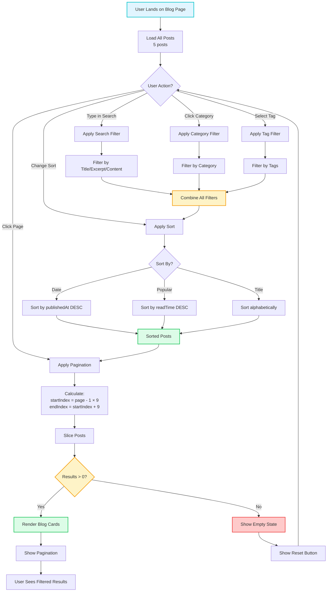
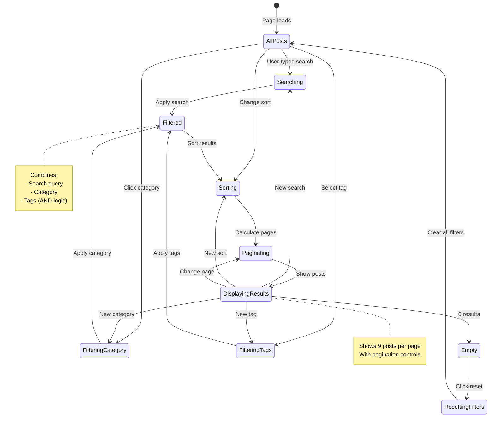
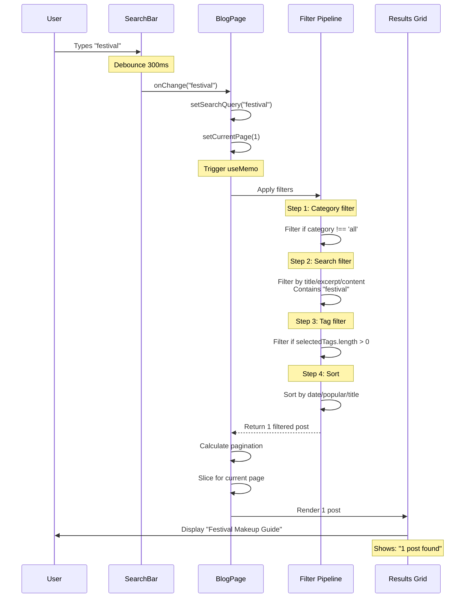

# Blog Filtering System Overview

**Version:** 4.0.0  
**Last Updated:** January 2025

Complete blog filtering, search, and pagination system for the Ash Shaw Portfolio.

## Purpose

Document the integrated filtering system that combines:
- Category filtering
- Text search
- Tag filtering
- Sorting options
- Pagination
- URL state management

---

## 🔍 Complete Blog Filtering Flow

```
┌─────────────────────────────────────────────────────────────────────┐
│                  BLOG PAGE FILTERING ARCHITECTURE                    │
└─────────────────────────────────────────────────────────────────────┘

┌────────────────────────────────────────────────────────────────────┐
│                      PAGE INITIALIZATION                            │
└────────────────────────────────────────────────────────────────────┘
                               │
                    ┌──────────▼──────────┐
                    │  BlogPage Component │
                    │  Mounts             │
                    │                     │
                    │  Initial State:     │
                    │  • searchQuery = '' │
                    │  • category = 'all' │
                    │  • selectedTags=[]  │
                    │  • sortBy = 'date'  │
                    │  • currentPage = 1  │
                    └──────────┬──────────┘
                               │
                    ┌──────────▼──────────┐
                    │  Load Mock Data     │
                    │  from /data/mock    │
                    │                     │
                    │  blogPosts (5)      │
                    │  blogCategories (6) │
                    │  blogTags (50+)     │
                    └──────────┬──────────┘
                               │
┌────────────────────────────────────────────────────────────────────┐
│                      FILTERING UI LAYOUT                            │
└────────────────────────────────────────────────────────────────────┘
                               │
                    ┌──────────▼──────────┐
                    │                     │
                    │  ┌───────────────┐  │
                    │  │  SearchBar    │  │ ← Text input
                    │  └───────────────┘  │
                    │                     │
                    │  ┌───────────────┐  │
                    │  │CategoryFilter │  │ ← Category pills
                    │  │ All | Tutorials│  │
                    │  │ Tips | Reviews │  │
                    │  └───────────────┘  │
                    │                     │
                    │  ┌───────────────┐  │
                    │  │  Tag Filter   │  │ ← Tag chips
                    │  │  #festival    │  │
                    │  │  #makeup      │  │
                    │  └───────────────┘  │
                    │                     │
                    │  ┌───────────────┐  │
                    │  │  Sort Options │  │ ← Dropdown
                    │  │ Date | Popular│  │
                    │  └───────────────┘  │
                    │                     │
                    │  Results: 5 posts   │
                    │                     │
                    │  ┌───────────────┐  │
                    │  │  BlogCard #1  │  │
                    │  ├───────────────┤  │
                    │  │  BlogCard #2  │  │
                    │  ├───────────────┤  │
                    │  │  BlogCard #3  │  │
                    │  └───────────────┘  │
                    │                     │
                    │  ┌───────────────┐  │
                    │  │  Pagination   │  │
                    │  │  ◀ 1 [2] 3 ▶  │  │
                    │  └───────────────┘  │
                    └─────────────────────┘

┌────────────────────────────────────────────────────────────────────┐
│                      FILTERING PIPELINE                             │
└────────────────────────────────────────────────────────────────────┘

User Input → State Update → Filter Chain → Display Results
                                │
                                ▼
┌──────────────────────────────────────────────────────────────────┐
│  Multi-Step Filtering Process                                   │
├──────────────────────────────────────────────────────────────────┤
│                                                                  │
│  STEP 1: Load All Posts                                         │
│  ─────────────────────────                                      │
│  blogPosts (5 total posts)                                      │
│  ↓                                                               │
│  [Post 1: Festival Makeup]                                      │
│  [Post 2: Bridal Guide]                                         │
│  [Post 3: Product Review]                                       │
│  [Post 4: Tips & Tricks]                                        │
│  [Post 5: Inspiration]                                          │
│                                                                  │
│  STEP 2: Category Filter                                        │
│  ─────────────────────────                                      │
│  If category !== 'all':                                         │
│    posts.filter(p => p.category === activeCategory)            │
│  ↓                                                               │
│  Example: category = 'tutorials'                                │
│  Result: 2 posts                                                │
│  [Post 1: Festival Makeup]                                      │
│  [Post 4: Tips & Tricks]                                        │
│                                                                  │
│  STEP 3: Search Filter                                          │
│  ─────────────────────────                                      │
│  If searchQuery !== '':                                         │
│    posts.filter(p =>                                            │
│      p.title.includes(query) ||                                 │
│      p.excerpt.includes(query) ||                               │
│      p.content.includes(query)                                  │
│    )                                                            │
│  ↓                                                               │
│  Example: searchQuery = 'festival'                              │
│  Result: 1 post                                                 │
│  [Post 1: Festival Makeup]                                      │
│                                                                  │
│  STEP 4: Tag Filter                                             │
│  ─────────────────────────                                      │
│  If selectedTags.length > 0:                                    │
│    posts.filter(p =>                                            │
│      selectedTags.every(tag =>                                  │
│        p.tags.includes(tag)                                     │
│      )                                                          │
│    )                                                            │
│  ↓                                                               │
│  Example: selectedTags = ['glitter']                            │
│  Result: 1 post (already filtered)                              │
│  [Post 1: Festival Makeup]                                      │
│                                                                  │
│  STEP 5: Sort                                                    │
│  ─────────────────────────                                      │
│  posts.sort((a, b) => {                                         │
│    if (sortBy === 'date') return b.date - a.date;              │
│    if (sortBy === 'popular') return b.views - a.views;         │
│  })                                                             │
│  ↓                                                               │
│  Result: 1 post (sorted)                                        │
│  [Post 1: Festival Makeup]                                      │
│                                                                  │
│  STEP 6: Paginate                                               │
│  ─────────────────────────                                      │
│  const startIndex = (currentPage - 1) * postsPerPage;          │
│  const endIndex = startIndex + postsPerPage;                   │
│  posts.slice(startIndex, endIndex)                             │
│  ↓                                                               │
│  Example: page 1, 9 posts per page                              │
│  Result: 1 post                                                 │
│  [Post 1: Festival Makeup]                                      │
│                                                                  │
│  STEP 7: Render Results                                         │
│  ─────────────────────────                                      │
│  {filteredPosts.map(post => (                                   │
│    <BlogCard key={post.id} post={post} />                      │
│  ))}                                                            │
│                                                                  │
└──────────────────────────────────────────────────────────────────┘

┌────────────────────────────────────────────────────────────────────┐
│                      USER INTERACTION FLOWS                         │
└────────────────────────────────────────────────────────────────────┘

Flow 1: SEARCH
──────────────

User types "festival" in search bar
      │
      ▼
┌──────────────────────┐
│ handleSearchChange   │
│ (debounced 300ms)    │
└──────────┬───────────┘
           │
           ▼
┌──────────────────────┐
│ setSearchQuery       │
│ ('festival')         │
└──────────┬───────────┘
           │
           ▼
┌──────────────────────┐
│ Filter pipeline runs │
│ All 5 steps execute  │
└──────────┬───────────┘
           │
           ▼
┌──────────────────────┐
│ Re-render with       │
│ filtered results     │
│ (1 post shown)       │
└──────────────────────┘

Flow 2: CATEGORY FILTER
────────────────────────

User clicks "Tutorials" category
      │
      ▼
┌──────────────────────┐
│ handleCategoryChange │
│ ('tutorials')        │
└──────────┬───────────┘
           │
           ▼
┌──────────────────────┐
│ setActiveCategory    │
│ setCurrentPage(1)    │ ← Reset to page 1
└──────────┬───────────┘
           │
           ▼
┌──────────────────────┐
│ Filter pipeline runs │
│ Category + Search +  │
│ Tags + Sort + Page   │
└──────────┬───────────┘
           │
           ▼
┌──────────────────────┐
│ Re-render with       │
│ category results     │
│ (2 posts shown)      │
└──────────────────────┘

Flow 3: TAG SELECTION
──────────────────────

User clicks tag "#festival"
      │
      ▼
┌──────────────────────┐
│ handleTagToggle      │
│ (tag)                │
└──────────┬───────────┘
           │
    ┌──────┼──────┐
    │ Already    │ Not selected
    │ selected   │
    ▼            ▼
┌─────────┐  ┌──────────┐
│ Remove  │  │   Add    │
│ from    │  │   to     │
│ array   │  │  array   │
└────┬────┘  └────┬─────┘
     │            │
     └──────┬─────┘
            ▼
┌──────────────────────┐
│ setSelectedTags      │
│ setCurrentPage(1)    │
└──────────┬───────────┘
           │
           ▼
┌──────────────────────┐
│ Filter pipeline runs │
│ Tags included        │
└──────────┬───────────┘
           │
           ▼
┌──────────────────────┐
│ Re-render with       │
│ tag results          │
└──────────────────────┘

Flow 4: PAGINATION
──────────────────

User clicks page 2
      │
      ▼
┌──────────────────────┐
│ handlePageChange     │
│ (2)                  │
└──────────┬───────────┘
           │
           ▼
┌──────────────────────┐
│ setCurrentPage(2)    │
│ scrollToTop()        │ ← Scroll to results
└──────────┬───────────┘
           │
           ▼
┌──────────────────────┐
│ Re-render with       │
│ page 2 results       │
│ (posts 10-18)        │
└──────────────────────┘

┌────────────────────────────────────────────────────────────────────┐
│                      STATE MANAGEMENT                               │
└────────────────────────────────────────────────────────────────────┘

BlogPage Component State:
┌──────────────────────────────────────────┐
│ searchQuery: string                      │
│ activeCategory: string                   │
│ selectedTags: string[]                   │
│ sortBy: 'date' | 'popular' | 'title'     │
│ currentPage: number                      │
│ postsPerPage: number (default: 9)       │
└──────────────────────────────────────────┘

Computed Values:
┌──────────────────────────────────────────┐
│ filteredPosts: BlogPost[]                │
│ totalPages: number                       │
│ paginatedPosts: BlogPost[]               │
│ resultCount: number                      │
└──────────────────────────────────────────┘

Filter Logic Flow:
┌─────────────┐
│ All Posts   │
│   (5)       │
└──────┬──────┘
       │
       ▼ applyFilters()
┌──────────────┐
│ Step 1:      │
│ Category     │ → filteredByCategory
└──────┬───────┘
       │
       ▼
┌──────────────┐
│ Step 2:      │
│ Search       │ → filteredBySearch
└──────┬───────┘
       │
       ▼
┌──────────────┐
│ Step 3:      │
│ Tags         │ → filteredByTags
└──────┬───────┘
       │
       ▼
┌──────────────┐
│ Step 4:      │
│ Sort         │ → sortedPosts
└──────┬───────┘
       │
       ▼
┌──────────────┐
│ Step 5:      │
│ Paginate     │ → paginatedPosts
└──────┬───────┘
       │
       ▼
┌──────────────┐
│ Render       │
│ BlogCards    │
└──────────────┘

┌────────────────────────────────────────────────────────────────────┐
│                      URL STATE SYNCHRONIZATION                      │
└────────────────────────────────────────────────────────────────────┘

URL Parameters ↔ Component State
─────────────────────────────────

URL Format:
/blog?category=tutorials&search=festival&tags=glitter,colorful&sort=date&page=1

State → URL:
────────────
useEffect(() => {
  const params = new URLSearchParams();
  
  if (activeCategory !== 'all') {
    params.set('category', activeCategory);
  }
  
  if (searchQuery) {
    params.set('search', searchQuery);
  }
  
  if (selectedTags.length > 0) {
    params.set('tags', selectedTags.join(','));
  }
  
  if (sortBy !== 'date') {
    params.set('sort', sortBy);
  }
  
  if (currentPage > 1) {
    params.set('page', currentPage.toString());
  }
  
  navigate(`?${params.toString()}`, { replace: true });
}, [activeCategory, searchQuery, selectedTags, sortBy, currentPage]);

URL → State:
────────────
useEffect(() => {
  const params = new URLSearchParams(location.search);
  
  const category = params.get('category') || 'all';
  const search = params.get('search') || '';
  const tags = params.get('tags')?.split(',') || [];
  const sort = params.get('sort') || 'date';
  const page = parseInt(params.get('page') || '1');
  
  setActiveCategory(category);
  setSearchQuery(search);
  setSelectedTags(tags);
  setSortBy(sort as SortOption);
  setCurrentPage(page);
}, [location.search]);

Benefits:
─────────
✅ Shareable URLs with filter state
✅ Browser back/forward navigation works
✅ Bookmark specific filter combinations
✅ Deep linking to filtered results

┌────────────────────────────────────────────────────────────────────┐
│                      EMPTY STATE HANDLING                           │
└────────────────────────────────────────────────────────────────────┘

No Results Found Flow:
──────────────────────

applyFilters() returns []
      │
      ▼
┌──────────────────────┐
│ Check result count   │
│ filteredPosts.length │
└──────────┬───────────┘
           │
      ┌────┼────┐
      │ > 0   = 0│
      ▼         ▼
┌──────────┐ ┌─────────────────┐
│ Show     │ │ Show Empty      │
│ Results  │ │ State Component │
└──────────┘ └────────┬────────┘
                      │
          ┌───────────┼───────────┐
          │           │           │
          ▼           ▼           ▼
    ┌─────────┐ ┌─────────┐ ┌──────────┐
    │ Message │ │ Reset   │ │ Suggest  │
    │ "No     │ │ Filters │ │ Related  │
    │ results"│ │ Button  │ │ Content  │
    └─────────┘ └─────────┘ └──────────┘

Empty State Component:
──────────────────────
<div className="text-center py-fluid-3xl">
  <p className="text-fluid-xl text-gray-600 mb-fluid-md">
    No posts found matching your criteria
  </p>
  
  <button 
    onClick={resetAllFilters}
    className="bg-gradient-pink-purple-blue text-white px-button py-button rounded-lg"
  >
    Clear All Filters
  </button>
  
  <div className="mt-fluid-xl">
    <h3 className="text-fluid-lg font-heading font-semibold mb-fluid-md">
      You might be interested in:
    </h3>
    <div className="grid grid-cols-1 md:grid-cols-3 gap-fluid-md">
      {/* Show popular posts */}
    </div>
  </div>
</div>
```

---

## Implementation Example

Complete BlogPage implementation with integrated filtering:

```typescript
import { useState, useEffect, useMemo } from 'react';
import { useSearchParams } from 'react-router-dom';
import { SearchBar } from '@/components/ui/SearchBar';
import { CategoryFilter } from '@/components/ui/CategoryFilter';
import { BlogCard } from '@/components/sections/BlogCard';
import { BlogPagination } from '@/components/ui/BlogPagination';
import { blogPosts, blogCategories, blogTags } from '@/data/mock';

export function BlogPage() {
  // URL state management
  const [searchParams, setSearchParams] = useSearchParams();
  
  // Filter state
  const [searchQuery, setSearchQuery] = useState(
    searchParams.get('search') || ''
  );
  const [activeCategory, setActiveCategory] = useState(
    searchParams.get('category') || 'all'
  );
  const [selectedTags, setSelectedTags] = useState<string[]>(
    searchParams.get('tags')?.split(',').filter(Boolean) || []
  );
  const [sortBy, setSortBy] = useState<'date' | 'popular' | 'title'>(
    (searchParams.get('sort') as any) || 'date'
  );
  const [currentPage, setCurrentPage] = useState(
    parseInt(searchParams.get('page') || '1')
  );
  
  const postsPerPage = 9;
  
  // Update URL when filters change
  useEffect(() => {
    const params = new URLSearchParams();
    
    if (activeCategory !== 'all') params.set('category', activeCategory);
    if (searchQuery) params.set('search', searchQuery);
    if (selectedTags.length > 0) params.set('tags', selectedTags.join(','));
    if (sortBy !== 'date') params.set('sort', sortBy);
    if (currentPage > 1) params.set('page', currentPage.toString());
    
    setSearchParams(params, { replace: true });
  }, [activeCategory, searchQuery, selectedTags, sortBy, currentPage]);
  
  // Apply all filters
  const filteredPosts = useMemo(() => {
    let posts = [...blogPosts];
    
    // Filter by category
    if (activeCategory !== 'all') {
      posts = posts.filter(post => post.category === activeCategory);
    }
    
    // Filter by search query
    if (searchQuery) {
      const query = searchQuery.toLowerCase();
      posts = posts.filter(post =>
        post.title.toLowerCase().includes(query) ||
        post.excerpt.toLowerCase().includes(query) ||
        post.content.toLowerCase().includes(query)
      );
    }
    
    // Filter by tags
    if (selectedTags.length > 0) {
      posts = posts.filter(post =>
        selectedTags.every(tag => post.tags.includes(tag))
      );
    }
    
    // Sort posts
    posts.sort((a, b) => {
      if (sortBy === 'date') {
        return new Date(b.date).getTime() - new Date(a.date).getTime();
      } else if (sortBy === 'popular') {
        return (b.readTime || 0) - (a.readTime || 0);
      } else {
        return a.title.localeCompare(b.title);
      }
    });
    
    return posts;
  }, [activeCategory, searchQuery, selectedTags, sortBy]);
  
  // Calculate pagination
  const totalPages = Math.ceil(filteredPosts.length / postsPerPage);
  const paginatedPosts = useMemo(() => {
    const startIndex = (currentPage - 1) * postsPerPage;
    return filteredPosts.slice(startIndex, startIndex + postsPerPage);
  }, [filteredPosts, currentPage]);
  
  // Reset to page 1 when filters change
  useEffect(() => {
    setCurrentPage(1);
  }, [activeCategory, searchQuery, selectedTags, sortBy]);
  
  // Handle filter changes
  const handleSearchChange = (query: string) => {
    setSearchQuery(query);
  };
  
  const handleCategoryChange = (category: string) => {
    setActiveCategory(category);
  };
  
  const handleTagToggle = (tag: string) => {
    setSelectedTags(prev =>
      prev.includes(tag)
        ? prev.filter(t => t !== tag)
        : [...prev, tag]
    );
  };
  
  const resetAllFilters = () => {
    setSearchQuery('');
    setActiveCategory('all');
    setSelectedTags([]);
    setSortBy('date');
    setCurrentPage(1);
  };
  
  return (
    <section className="py-section px-6">
      <div className="max-w-7xl mx-auto">
        {/* Search Bar */}
        <SearchBar 
          value={searchQuery}
          onChange={handleSearchChange}
          placeholder="Search blog posts..."
          className="mb-fluid-lg"
        />
        
        {/* Category Filter */}
        <CategoryFilter 
          categories={blogCategories}
          activeCategory={activeCategory}
          onCategoryChange={handleCategoryChange}
          showCount={true}
          className="mb-fluid-md"
        />
        
        {/* Results Count */}
        <div className="flex items-center justify-between mb-fluid-lg">
          <p className="text-fluid-sm text-gray-600">
            {filteredPosts.length} {filteredPosts.length === 1 ? 'post' : 'posts'} found
          </p>
          
          {/* Sort Dropdown */}
          <select
            value={sortBy}
            onChange={(e) => setSortBy(e.target.value as any)}
            className="px-4 py-2 rounded-lg border border-gray-300"
          >
            <option value="date">Latest First</option>
            <option value="popular">Most Popular</option>
            <option value="title">A-Z</option>
          </select>
        </div>
        
        {/* Results Grid */}
        {paginatedPosts.length > 0 ? (
          <>
            <div className="grid grid-cols-1 md:grid-cols-2 lg:grid-cols-3 gap-fluid-md">
              {paginatedPosts.map(post => (
                <BlogCard key={post.id} post={post} />
              ))}
            </div>
            
            {/* Pagination */}
            {totalPages > 1 && (
              <BlogPagination 
                currentPage={currentPage}
                totalPages={totalPages}
                onPageChange={setCurrentPage}
                className="mt-fluid-xl"
              />
            )}
          </>
        ) : (
          /* Empty State */
          <div className="text-center py-fluid-3xl">
            <p className="text-fluid-xl text-gray-600 mb-fluid-md">
              No posts found matching your criteria
            </p>
            
            <button 
              onClick={resetAllFilters}
              className="bg-gradient-pink-purple-blue text-white px-button py-button rounded-lg"
            >
              Clear All Filters
            </button>
          </div>
        )}
      </div>
    </section>
  );
}
```

---

## 🎨 Interactive Mermaid Diagrams

### Mermaid Flowchart (Complete Filtering Pipeline)



### Mermaid State Diagram (Filter States)



### Mermaid Sequence Diagram (Search Flow)



---

## Related Documentation

- **[CategoryFilter.md](./components/CategoryFilter.md)** - Category filtering component
- **[SearchBar.md](./components/SearchBar.md)** - Search functionality
- **[Pagination.md](./components/Pagination.md)** - Pagination component
- **[BlogCard.md](./components/BlogCard.md)** - Blog card display
- **[mock-data.md](./mock-data.md)** - Blog data structure

---

**Last Updated:** January 2025  
**Version:** 4.0.0