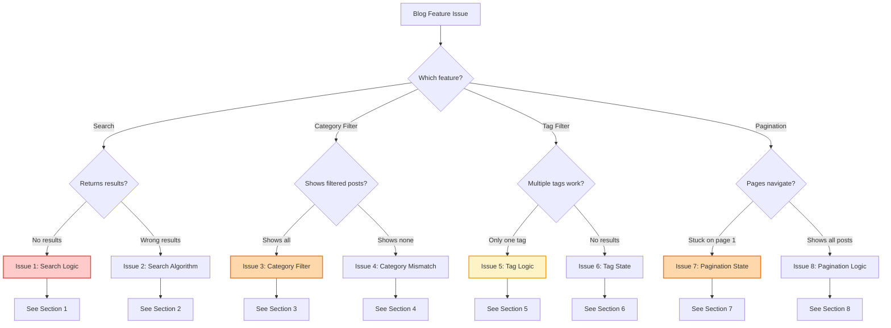
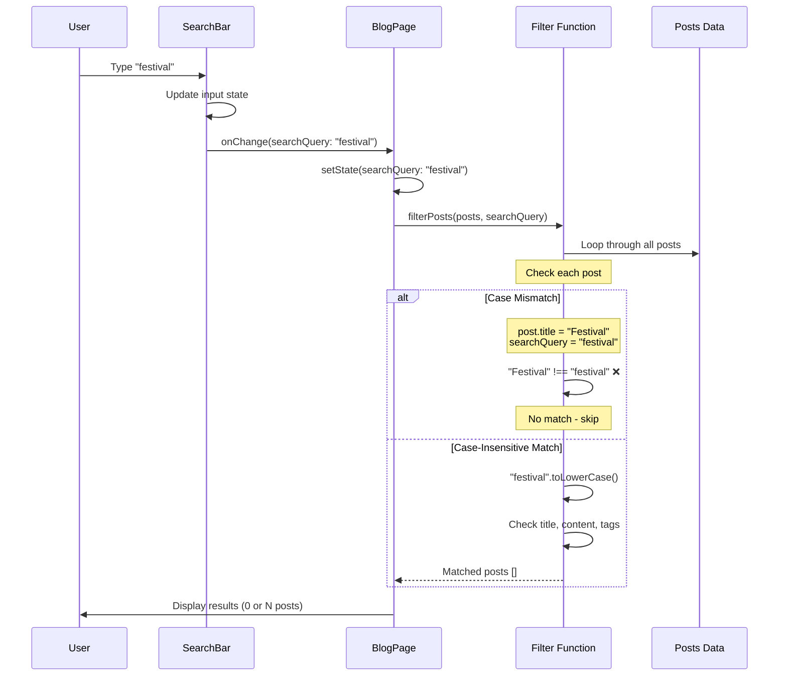
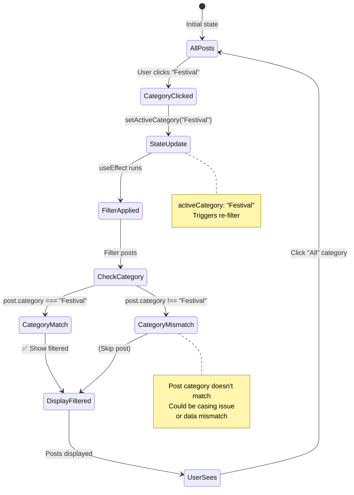
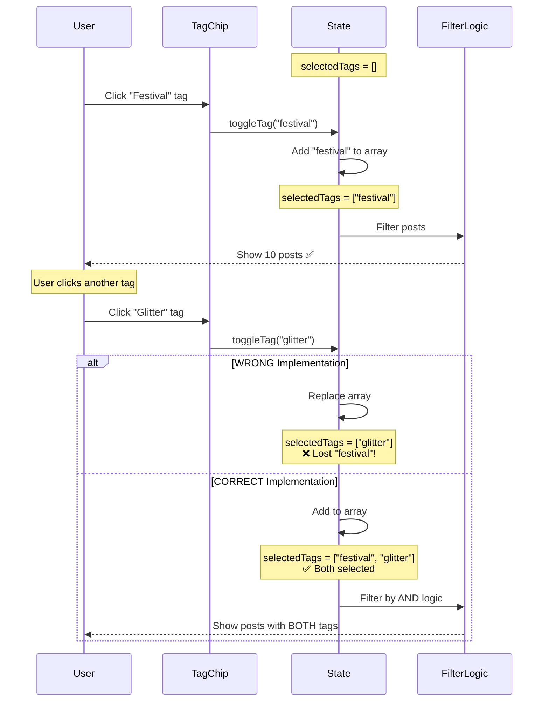
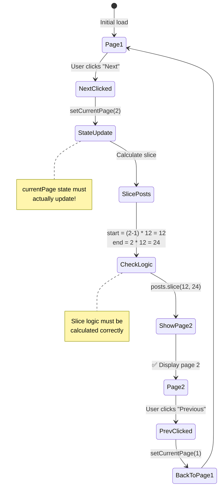
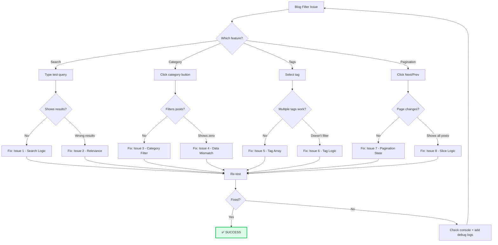

# Blog Search & Filtering Troubleshooting Guide

**Version:** 1.0.0  
**Last Updated:** January 2025

Comprehensive troubleshooting guide for blog search, filtering, and pagination issues.

---

## 🎯 Quick Problem Identifier

```
┌─────────────────────────────────────┐
│  Blog Filtering Not Working?        │
└──────────────┬──────────────────────┘
               │
               ▼
        ┌──────────────┐
        │ What feature? │
        └──────┬───────┘
               │
       ────────┴────────────────
       │          │            │
       ▼          ▼            ▼
   Search      Category     Tags
   Bar         Filter      Filter
       │          │            │
       ▼          ▼            ▼
   Issue 1    Issue 2      Issue 3
```

---

## 🔍 Diagnostic Flowchart (Mermaid)

### Problem Identification Flow



---

## 🚨 Issue 1: Search Returns No Results

### Symptoms
- User types in search bar
- No posts shown (even though they should match)
- "No results found" message appears

### Search Execution Flow



### Solutions

**Check 1: Case-Insensitive Search**

```tsx
// ❌ WRONG - Case sensitive
const filteredPosts = posts.filter(post =>
  post.title.includes(searchQuery)  // "Festival" !== "festival"
);

// ✅ CORRECT - Case insensitive
const filteredPosts = posts.filter(post => {
  const query = searchQuery.toLowerCase();
  const title = post.title.toLowerCase();
  const content = post.excerpt.toLowerCase();
  
  return title.includes(query) || content.includes(query);
});
```

**Check 2: Search Multiple Fields**

```tsx
// ✅ CORRECT - Search title, excerpt, content, and tags
const searchPosts = (posts: BlogPost[], query: string) => {
  if (!query.trim()) return posts;
  
  const lowerQuery = query.toLowerCase();
  
  return posts.filter(post => {
    // Search title
    if (post.title.toLowerCase().includes(lowerQuery)) return true;
    
    // Search excerpt
    if (post.excerpt.toLowerCase().includes(lowerQuery)) return true;
    
    // Search content
    if (post.content.toLowerCase().includes(lowerQuery)) return true;
    
    // Search tags
    if (post.tags.some(tag => tag.toLowerCase().includes(lowerQuery))) {
      return true;
    }
    
    // Search category
    if (post.category.toLowerCase().includes(lowerQuery)) return true;
    
    return false;
  });
};
```

**Check 3: Trim Whitespace**

```tsx
// ✅ CORRECT - Handle extra spaces
const searchQuery = userInput.trim().toLowerCase();

// Handle empty searches
if (!searchQuery) {
  return allPosts;  // Show all if search is empty
}
```

**Check 4: Debug Search**

```tsx
// Add console logs to debug
const searchPosts = (posts: BlogPost[], query: string) => {
  console.log('Search query:', query);
  console.log('Total posts:', posts.length);
  
  const results = posts.filter(post => {
    const matches = post.title.toLowerCase().includes(query.toLowerCase());
    if (matches) {
      console.log('Match found:', post.title);
    }
    return matches;
  });
  
  console.log('Results:', results.length);
  return results;
};
```

### Quick Fix Checklist

- [ ] Search is case-insensitive (`.toLowerCase()`)
- [ ] Search checks title, excerpt, content, and tags
- [ ] Trim whitespace from search query
- [ ] Return all posts if search is empty
- [ ] Add console logs to debug matching logic

---

## 🚨 Issue 2: Search Returns Wrong Results

### Symptoms
- Search works but returns irrelevant posts
- Expected posts not in results
- Search too broad or too narrow

### Solutions

**Check 1: Improve Search Relevance**

```tsx
// ✅ CORRECT - Weighted search (title matches rank higher)
const searchPosts = (posts: BlogPost[], query: string) => {
  const lowerQuery = query.toLowerCase();
  
  return posts
    .map(post => {
      let score = 0;
      
      // Title match = highest priority
      if (post.title.toLowerCase().includes(lowerQuery)) score += 10;
      
      // Tag match = medium priority
      if (post.tags.some(tag => tag.toLowerCase().includes(lowerQuery))) {
        score += 5;
      }
      
      // Content match = lower priority
      if (post.excerpt.toLowerCase().includes(lowerQuery)) score += 2;
      
      return { post, score };
    })
    .filter(({ score }) => score > 0)  // Only posts with matches
    .sort((a, b) => b.score - a.score)  // Sort by relevance
    .map(({ post }) => post);
};
```

**Check 2: Partial Word Matching**

```tsx
// ✅ CORRECT - Match partial words
const query = "fest";  // User types partial word

// Will match: "Festival", "Festive", "Manifesto"
const matches = post.title.toLowerCase().includes(query.toLowerCase());
```

**Check 3: Multi-Word Searches**

```tsx
// ✅ CORRECT - Handle "festival makeup"
const searchPosts = (posts: BlogPost[], query: string) => {
  const words = query.toLowerCase().split(' ').filter(w => w.length > 0);
  
  return posts.filter(post => {
    const searchText = `${post.title} ${post.excerpt} ${post.tags.join(' ')}`.toLowerCase();
    
    // All words must appear (AND logic)
    return words.every(word => searchText.includes(word));
    
    // OR use OR logic (any word matches):
    // return words.some(word => searchText.includes(word));
  });
};
```

### Quick Fix Checklist

- [ ] Implement relevance scoring
- [ ] Sort results by relevance
- [ ] Handle multi-word searches
- [ ] Support partial word matching
- [ ] Consider using OR vs AND logic

---

## 🚨 Issue 3: Category Filter Not Working

### Symptoms
- Clicking category doesn't filter posts
- All posts still shown
- URL updates but results don't change

### State Diagram



### Solutions

**Check 1: Category Filter Logic**

```tsx
// ✅ CORRECT - Filter by category
const [activeCategory, setActiveCategory] = useState('all');
const [filteredPosts, setFilteredPosts] = useState(allPosts);

useEffect(() => {
  if (activeCategory === 'all') {
    setFilteredPosts(allPosts);
  } else {
    const filtered = allPosts.filter(
      post => post.category.toLowerCase() === activeCategory.toLowerCase()
    );
    setFilteredPosts(filtered);
  }
}, [activeCategory, allPosts]);
```

**Check 2: Category Button State**

```tsx
// ✅ CORRECT - Show active category
<button
  onClick={() => setActiveCategory('festival')}
  className={`
    px-4 py-2 rounded-lg font-medium
    ${activeCategory === 'festival'
      ? 'bg-gradient-pink-purple-blue text-white'  // Active
      : 'bg-gray-200 text-gray-700'                // Inactive
    }
  `}
>
  Festival
</button>
```

**Check 3: Category Data Consistency**

```tsx
// Make sure category values match exactly

// In mock data:
export const blogPosts = [
  {
    id: 1,
    category: 'festival',  // lowercase
    title: 'Festival Makeup Tips'
  }
];

// In categories list:
export const categories = [
  { id: 'festival', name: 'Festival', count: 5 },  // lowercase id
];

// In filter:
const filtered = posts.filter(
  post => post.category === activeCategory  // Must match exactly
);
```

**Check 4: Reset Other Filters**

```tsx
// ✅ CORRECT - Clear search when filtering by category
const handleCategoryChange = (category: string) => {
  setActiveCategory(category);
  setSearchQuery('');  // Clear search
  setSelectedTags([]);  // Clear tags
  setCurrentPage(1);   // Reset pagination
};
```

### Quick Fix Checklist

- [ ] `useEffect` depends on `activeCategory`
- [ ] Category comparison is case-insensitive
- [ ] Active category button shows visual state
- [ ] Category values in data match filter values
- [ ] Clear other filters when category changes

---

## 🚨 Issue 4: Category Shows Zero Results

### Symptoms
- Filter by category
- "No posts found" message
- But posts exist in that category

### Solutions

**Check 1: Data Inspection**

```tsx
// Debug category data
useEffect(() => {
  console.log('Active category:', activeCategory);
  console.log('All posts:', allPosts.length);
  console.log('Posts in category:', 
    allPosts.filter(p => p.category === activeCategory).length
  );
  
  // Log all unique categories
  const categories = [...new Set(allPosts.map(p => p.category))];
  console.log('Available categories:', categories);
}, [activeCategory, allPosts]);
```

**Check 2: Category Name Mismatch**

```tsx
// ❌ WRONG - Mismatched category names
// Button uses: "Festival"
// Data has: "festival-makeup"

// ✅ CORRECT - Consistent naming
export const categories = [
  { id: 'festival', name: 'Festival' },
  { id: 'editorial', name: 'Editorial' },
];

export const blogPosts = [
  { id: 1, category: 'festival', title: '...' },  // Matches category id
  { id: 2, category: 'editorial', title: '...' },
];

// Filter using id, display using name
<button onClick={() => setActiveCategory(cat.id)}>
  {cat.name}
</button>
```

**Check 3: Case Sensitivity**

```tsx
// ✅ CORRECT - Handle case differences
const filtered = allPosts.filter(post => 
  post.category.toLowerCase() === activeCategory.toLowerCase()
);
```

### Quick Fix Checklist

- [ ] Log actual category values in data
- [ ] Ensure category names match between buttons and data
- [ ] Use case-insensitive comparison
- [ ] Check for extra spaces or special characters
- [ ] Verify posts actually have that category assigned

---

## 🚨 Issue 5: Tag Filtering Allows Only One Tag

### Symptoms
- Can select only one tag at a time
- Selecting second tag deselects first
- Multiple tag filtering doesn't work

### Tag Selection Flow



### Solutions

**Check 1: Multiple Tag State**

```tsx
// ✅ CORRECT - Array of selected tags
const [selectedTags, setSelectedTags] = useState<string[]>([]);

const toggleTag = (tag: string) => {
  setSelectedTags(prev => {
    if (prev.includes(tag)) {
      // Remove tag
      return prev.filter(t => t !== tag);
    } else {
      // Add tag
      return [...prev, tag];
    }
  });
};

// ❌ WRONG - Single tag only
const [selectedTag, setSelectedTag] = useState<string>('');
const selectTag = (tag: string) => setSelectedTag(tag);  // Replaces!
```

**Check 2: Tag Filter Logic**

```tsx
// ✅ CORRECT - Filter by multiple tags (AND logic)
const filterByTags = (posts: BlogPost[], tags: string[]) => {
  if (tags.length === 0) return posts;
  
  return posts.filter(post =>
    tags.every(tag => post.tags.includes(tag))  // Post must have ALL tags
  );
};

// OR logic alternative (post has ANY of the tags):
const filterByTagsOR = (posts: BlogPost[], tags: string[]) => {
  if (tags.length === 0) return posts;
  
  return posts.filter(post =>
    tags.some(tag => post.tags.includes(tag))  // Post has AT LEAST ONE tag
  );
};
```

**Check 3: Tag UI State**

```tsx
// ✅ CORRECT - Show which tags are selected
{allTags.map(tag => (
  <button
    key={tag}
    onClick={() => toggleTag(tag)}
    className={`
      px-3 py-1 rounded-full text-sm font-medium transition-colors
      ${selectedTags.includes(tag)
        ? 'bg-gradient-pink-purple-blue text-white'  // Selected
        : 'bg-gray-200 text-gray-700 hover:bg-gray-300'  // Unselected
      }
    `}
  >
    {tag}
    {selectedTags.includes(tag) && <X className="ml-1 w-3 h-3" />}
  </button>
))}
```

### Quick Fix Checklist

- [ ] Use array state for multiple tags
- [ ] Implement toggle (add/remove) logic
- [ ] Show visual state for selected tags
- [ ] Filter by ALL tags (AND) or ANY tag (OR)
- [ ] Allow clearing individual tags

---

## 🚨 Issue 6: Tags Don't Filter Posts

### Symptoms
- Tags selected but all posts still shown
- Filter doesn't apply
- Count doesn't update

### Solutions

**Check 1: Combine All Filters**

```tsx
// ✅ CORRECT - Apply all filters together
const getFilteredPosts = () => {
  let filtered = allPosts;
  
  // 1. Filter by category
  if (activeCategory !== 'all') {
    filtered = filtered.filter(
      post => post.category === activeCategory
    );
  }
  
  // 2. Filter by search query
  if (searchQuery) {
    const query = searchQuery.toLowerCase();
    filtered = filtered.filter(post =>
      post.title.toLowerCase().includes(query) ||
      post.excerpt.toLowerCase().includes(query)
    );
  }
  
  // 3. Filter by tags
  if (selectedTags.length > 0) {
    filtered = filtered.filter(post =>
      selectedTags.every(tag => post.tags.includes(tag))
    );
  }
  
  return filtered;
};

// Update whenever any filter changes
useEffect(() => {
  const results = getFilteredPosts();
  setFilteredPosts(results);
}, [activeCategory, searchQuery, selectedTags, allPosts]);
```

**Check 2: Tag Data Format**

```tsx
// Make sure tags are consistent

// ✅ CORRECT - Array of strings
export const blogPost = {
  id: 1,
  tags: ['festival', 'glitter', 'uv'],  // Array
  title: 'Festival Makeup'
};

// ❌ WRONG - String instead of array
export const blogPost = {
  tags: 'festival, glitter, uv',  // String - won't work with .includes()
};
```

### Quick Fix Checklist

- [ ] All filters combined in one function
- [ ] `useEffect` depends on all filter states
- [ ] Tags are stored as array in post data
- [ ] Tag comparison is exact match
- [ ] Console log filtered results to debug

---

## 🚨 Issue 7: Pagination Stuck on Page 1

### Symptoms
- "Next" button doesn't work
- Page number stays at 1
- All posts shown on one page

### Pagination State Flow



### Solutions

**Check 1: Pagination State**

```tsx
// ✅ CORRECT - State updates properly
const [currentPage, setCurrentPage] = useState(1);
const [postsPerPage] = useState(12);

const handleNextPage = () => {
  setCurrentPage(prev => prev + 1);
};

const handlePrevPage = () => {
  setCurrentPage(prev => Math.max(1, prev - 1));
};

// ❌ WRONG - Doesn't update state
const handleNextPage = () => {
  currentPage = currentPage + 1;  // Won't trigger re-render!
};
```

**Check 2: Slice Logic**

```tsx
// ✅ CORRECT - Calculate current page posts
const indexOfLastPost = currentPage * postsPerPage;
const indexOfFirstPost = indexOfLastPost - postsPerPage;
const currentPosts = filteredPosts.slice(indexOfFirstPost, indexOfLastPost);

// Example: Page 2, 12 per page
// indexOfLastPost = 2 * 12 = 24
// indexOfFirstPost = 24 - 12 = 12
// Posts 12-24 shown ✅
```

**Check 3: Total Pages**

```tsx
// ✅ CORRECT - Calculate total pages
const totalPages = Math.ceil(filteredPosts.length / postsPerPage);

// Disable Next button on last page
<button
  onClick={handleNextPage}
  disabled={currentPage >= totalPages}
  className={`
    px-4 py-2 rounded-lg
    ${currentPage >= totalPages
      ? 'bg-gray-300 cursor-not-allowed'  // Disabled
      : 'bg-gradient-pink-purple-blue text-white cursor-pointer'
    }
  `}
>
  Next
</button>
```

**Check 4: Reset on Filter Change**

```tsx
// ✅ CORRECT - Reset to page 1 when filtering
useEffect(() => {
  setCurrentPage(1);  // Go back to page 1
}, [activeCategory, searchQuery, selectedTags]);
```

### Quick Fix Checklist

- [ ] Use `setState` for currentPage (not direct assignment)
- [ ] Slice logic calculates correct indexes
- [ ] Total pages calculated with `Math.ceil`
- [ ] Disable buttons at boundaries (page 1, last page)
- [ ] Reset to page 1 when filters change

---

## 🚨 Issue 8: Pagination Shows All Posts

### Symptoms
- Pagination buttons render
- But all posts shown on page 1
- Page count is correct but slicing doesn't work

### Solutions

**Check 1: Render Current Posts**

```tsx
// ❌ WRONG - Renders all posts
{filteredPosts.map(post => (
  <BlogCard key={post.id} post={post} />
))}

// ✅ CORRECT - Renders only current page
{currentPosts.map(post => (
  <BlogCard key={post.id} post={post} />
))}
```

**Check 2: Complete Pagination Flow**

```tsx
function BlogPage() {
  const [currentPage, setCurrentPage] = useState(1);
  const [filteredPosts, setFilteredPosts] = useState(allPosts);
  const postsPerPage = 12;
  
  // 1. Calculate slice indexes
  const indexOfLastPost = currentPage * postsPerPage;
  const indexOfFirstPost = indexOfLastPost - postsPerPage;
  
  // 2. Slice posts for current page
  const currentPosts = filteredPosts.slice(indexOfFirstPost, indexOfLastPost);
  
  // 3. Render ONLY current posts
  return (
    <div>
      <div className="grid grid-cols-3 gap-6">
        {currentPosts.map(post => (
          <BlogCard key={post.id} post={post} />
        ))}
      </div>
      
      <Pagination
        currentPage={currentPage}
        totalPages={Math.ceil(filteredPosts.length / postsPerPage)}
        onPageChange={setCurrentPage}
      />
    </div>
  );
}
```

### Quick Fix Checklist

- [ ] Map over `currentPosts`, not `filteredPosts`
- [ ] `slice()` returns correct subset
- [ ] Console log `currentPosts.length` (should be 12 or less)
- [ ] Verify `indexOfFirstPost` and `indexOfLastPost` values

---

## 🎯 Complete Diagnostic Workflow



---

## 📋 Quick Reference: Filter State Management

```tsx
// ✅ COMPLETE - All blog filters
function BlogPage() {
  // State
  const [searchQuery, setSearchQuery] = useState('');
  const [activeCategory, setActiveCategory] = useState('all');
  const [selectedTags, setSelectedTags] = useState<string[]>([]);
  const [currentPage, setCurrentPage] = useState(1);
  const [filteredPosts, setFilteredPosts] = useState<BlogPost[]>([]);
  
  // Filter logic
  useEffect(() => {
    let results = allPosts;
    
    // Apply category filter
    if (activeCategory !== 'all') {
      results = results.filter(p => p.category === activeCategory);
    }
    
    // Apply search filter
    if (searchQuery) {
      const q = searchQuery.toLowerCase();
      results = results.filter(p =>
        p.title.toLowerCase().includes(q) ||
        p.excerpt.toLowerCase().includes(q)
      );
    }
    
    // Apply tag filter
    if (selectedTags.length > 0) {
      results = results.filter(p =>
        selectedTags.every(tag => p.tags.includes(tag))
      );
    }
    
    setFilteredPosts(results);
    setCurrentPage(1);  // Reset pagination
  }, [searchQuery, activeCategory, selectedTags]);
  
  // Pagination
  const postsPerPage = 12;
  const totalPages = Math.ceil(filteredPosts.length / postsPerPage);
  const currentPosts = filteredPosts.slice(
    (currentPage - 1) * postsPerPage,
    currentPage * postsPerPage
  );
  
  return (
    <>
      <SearchBar value={searchQuery} onChange={setSearchQuery} />
      <CategoryFilter active={activeCategory} onChange={setActiveCategory} />
      <TagFilter selected={selectedTags} onChange={setSelectedTags} />
      <BlogGrid posts={currentPosts} />
      <Pagination current={currentPage} total={totalPages} onChange={setCurrentPage} />
    </>
  );
}
```

---

## 🔗 Related Documentation

- **[Blog Filtering Overview](../overview-blog-filtering.md)** - Complete filter system
- **[SearchBar Component](../components/SearchBar.md)** - Search implementation
- **[Pagination Component](../components/Pagination.md)** - Pagination logic

---

**Pro Tip:** Always reset `currentPage` to 1 when filters change to avoid showing empty pages!
