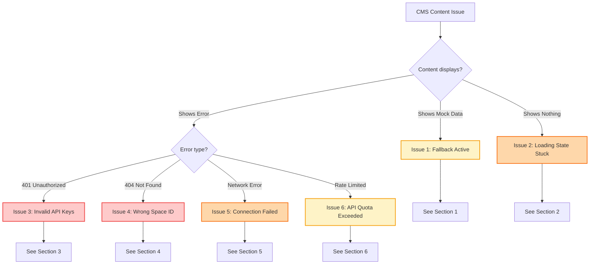
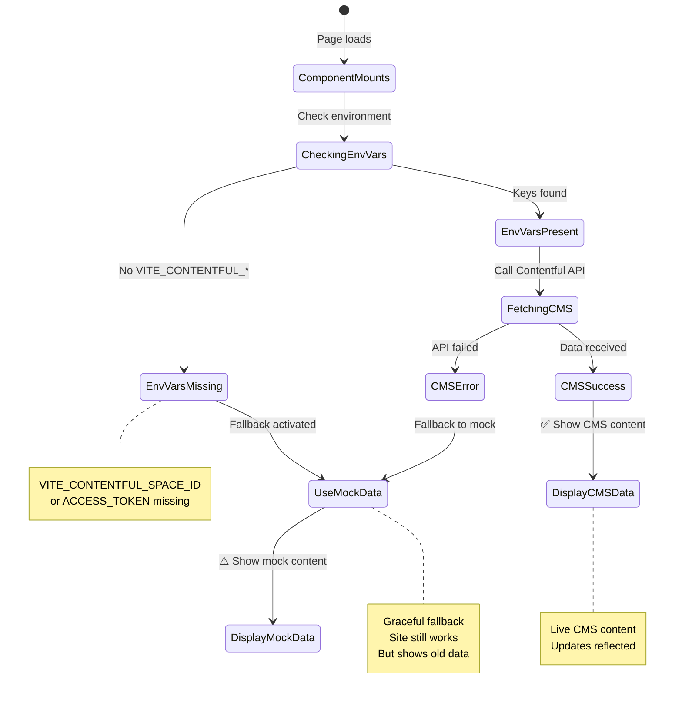
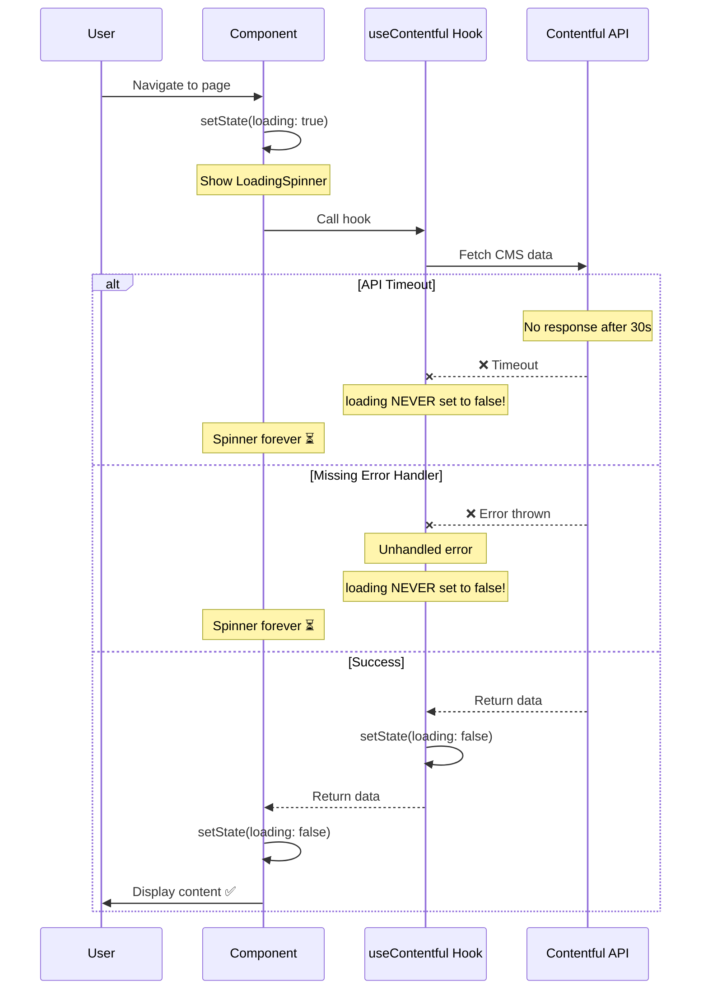
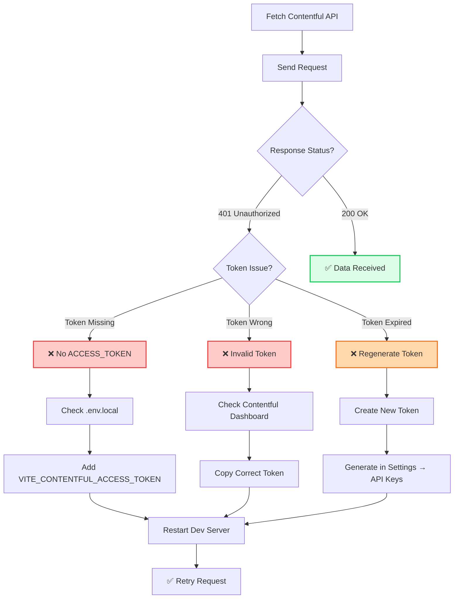
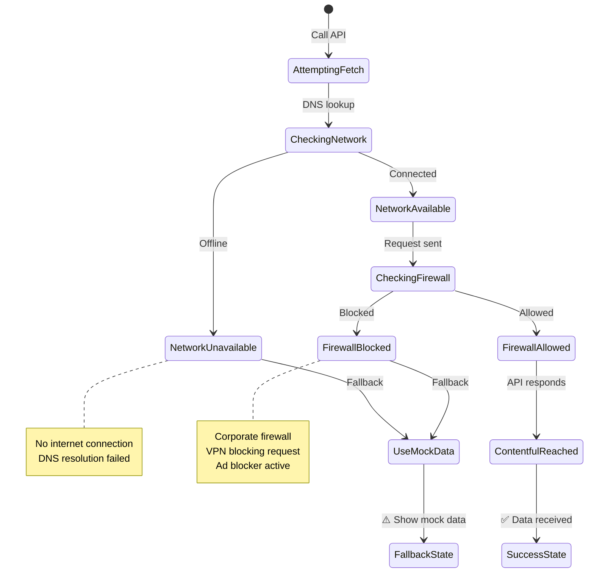
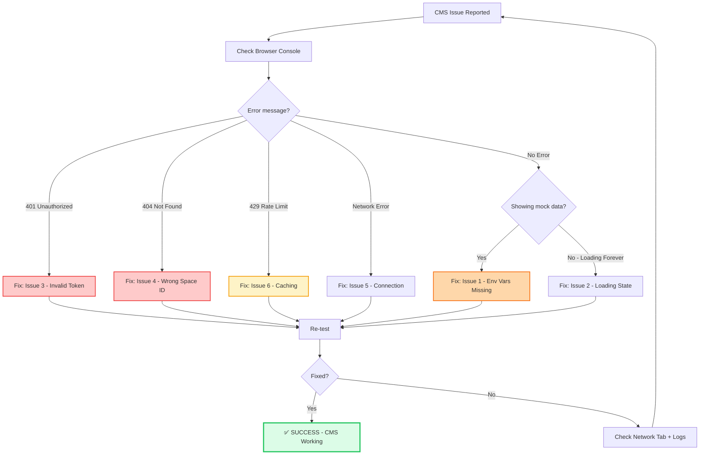

# Contentful CMS Integration Troubleshooting Guide

**Version:** 1.0.0  
**Last Updated:** January 2025

Comprehensive troubleshooting guide for Contentful CMS integration issues.

---

## 🎯 Quick Problem Identifier

```
┌─────────────────────────────────────┐
│   Content Not Loading?              │
└──────────────┬──────────────────────┘
               │
               ▼
        ┌──────────────┐
        │ What's wrong? │
        └──────┬───────┘
               │
       ────────┴────────────
       │                   │
       ▼                   ▼
  Shows Mock Data     Shows Loading
  (Not CMS Data)      Forever
       │                   │
       ▼                   ▼
    Issue 1             Issue 2
       │                   │
       │           ────────┴────────
       │           │               │
       │           ▼               ▼
       │      API Error        Network
       │       (Console)       Timeout
       │           │               │
       ▼           ▼               ▼
  Check API    Issue 3         Issue 4
  Credentials
```

---

## 🔍 Diagnostic Flowchart (Mermaid)

### Problem Identification Flow



---

## 🚨 Issue 1: Displaying Mock Data Instead of CMS

### Symptoms
- Page loads successfully
- Shows content, but it's the hardcoded mock data
- No API errors in console
- CMS changes don't appear on site

### State Diagram



### Solutions

**Check 1: Environment Variables**

```bash
# .env.local (MUST exist in project root)
VITE_CONTENTFUL_SPACE_ID=your_space_id_here
VITE_CONTENTFUL_ACCESS_TOKEN=your_access_token_here
```

**Verify they're loaded:**
```tsx
// In browser console or component
console.log('Space ID:', import.meta.env.VITE_CONTENTFUL_SPACE_ID);
console.log('Token:', import.meta.env.VITE_CONTENTFUL_ACCESS_TOKEN ? '✅ Set' : '❌ Missing');

// Should output:
// Space ID: abc123xyz
// Token: ✅ Set
```

**Common mistakes:**
```bash
# ❌ WRONG - File named incorrectly
.env          # Not loaded by Vite
.env.prod     # Only for production

# ✅ CORRECT - Must be .env.local for dev
.env.local
```

**Check 2: Restart Dev Server**

After adding/changing environment variables:

```bash
# Stop server (Ctrl+C)
# Restart
npm run dev

# Environment variables only load on server start!
```

**Check 3: Contentful Hook Logic**

```tsx
// In useContentful.ts or similar

// ✅ CORRECT - Proper fallback logic
export function useContentfulBlogPosts() {
  const [data, setData] = useState(null);
  const [loading, setLoading] = useState(true);
  
  useEffect(() => {
    const fetchData = async () => {
      // Check if Contentful is configured
      const spaceId = import.meta.env.VITE_CONTENTFUL_SPACE_ID;
      const accessToken = import.meta.env.VITE_CONTENTFUL_ACCESS_TOKEN;
      
      if (!spaceId || !accessToken) {
        console.warn('Contentful not configured - using mock data');
        setData(mockBlogPosts);  // Fallback
        setLoading(false);
        return;
      }
      
      try {
        const response = await fetchFromContentful();
        setData(response);
      } catch (error) {
        console.error('Contentful error - using mock data:', error);
        setData(mockBlogPosts);  // Fallback on error
      } finally {
        setLoading(false);
      }
    };
    
    fetchData();
  }, []);
  
  return { data, loading };
}
```

**Check 4: Network Tab**

Open DevTools → Network tab:

```
If using mock data, you should see:
- NO requests to "cdn.contentful.com"
- Console warning: "Contentful not configured"

If using CMS data, you should see:
- Request to "cdn.contentful.com/spaces/YOUR_SPACE_ID"
- Status: 200 OK
```

### Quick Fix Checklist

- [ ] `.env.local` file exists in project root
- [ ] `VITE_CONTENTFUL_SPACE_ID` is set correctly
- [ ] `VITE_CONTENTFUL_ACCESS_TOKEN` is set correctly
- [ ] Dev server restarted after adding env vars
- [ ] Check browser console for "using mock data" warning
- [ ] Check Network tab for Contentful API calls

---

## 🚨 Issue 2: Loading State Stuck Forever

### Symptoms
- Page shows loading spinner indefinitely
- Content never appears
- No error message shown

### Diagnostic Sequence



### Solutions

**Check 1: Error Handling**

```tsx
// ❌ WRONG - No finally block
try {
  const data = await fetchContentful();
  setData(data);
  setLoading(false);  // Only runs on success!
} catch (error) {
  console.error(error);
  // loading is NEVER set to false on error!
}

// ✅ CORRECT - Always set loading to false
try {
  const data = await fetchContentful();
  setData(data);
} catch (error) {
  console.error(error);
  setData(mockDataFallback);  // Use fallback
} finally {
  setLoading(false);  // ALWAYS runs
}
```

**Check 2: Timeout Implementation**

```tsx
// ✅ CORRECT - Add timeout to prevent infinite loading
const fetchWithTimeout = async (url: string, timeout = 10000) => {
  const controller = new AbortController();
  const timeoutId = setTimeout(() => controller.abort(), timeout);
  
  try {
    const response = await fetch(url, {
      signal: controller.signal
    });
    clearTimeout(timeoutId);
    return response;
  } catch (error) {
    if (error.name === 'AbortError') {
      throw new Error('Request timeout - using mock data');
    }
    throw error;
  }
};
```

**Check 3: Loading State Management**

```tsx
// ✅ CORRECT - Comprehensive state management
export function useContentfulData() {
  const [data, setData] = useState(null);
  const [loading, setLoading] = useState(true);
  const [error, setError] = useState(null);
  
  useEffect(() => {
    let mounted = true;  // Prevent state updates after unmount
    
    const fetchData = async () => {
      setLoading(true);
      setError(null);
      
      try {
        const response = await fetchWithTimeout(apiUrl, 10000);
        const json = await response.json();
        
        if (mounted) {
          setData(json);
        }
      } catch (err) {
        if (mounted) {
          setError(err.message);
          setData(mockDataFallback);  // Always have data
        }
      } finally {
        if (mounted) {
          setLoading(false);  // CRITICAL: Always set to false
        }
      }
    };
    
    fetchData();
    
    return () => {
      mounted = false;  // Cleanup
    };
  }, []);
  
  return { data, loading, error };
}
```

**Check 4: Component Usage**

```tsx
// ✅ CORRECT - Handle all states
function BlogPage() {
  const { data: posts, loading, error } = useContentfulBlogPosts();
  
  if (loading) {
    return <LoadingSpinner />;
  }
  
  if (error) {
    return (
      <div>
        <p>Error loading posts: {error}</p>
        <button onClick={() => window.location.reload()}>Retry</button>
      </div>
    );
  }
  
  if (!posts || posts.length === 0) {
    return <p>No blog posts found.</p>;
  }
  
  return <BlogList posts={posts} />;
}
```

### Quick Fix Checklist

- [ ] `finally` block sets `loading: false`
- [ ] Timeout implemented (10-30 seconds)
- [ ] Error state is handled
- [ ] Component checks `loading`, `error`, and `data`
- [ ] Mounted state prevents updates after unmount
- [ ] Console shows actual error message

---

## 🚨 Issue 3: Invalid API Credentials (401)

### Symptoms
- Console error: "401 Unauthorized"
- Network request fails
- Fallback mock data displayed

### Error Flow



### Solutions

**Check 1: Access Token Format**

```bash
# .env.local

# ✅ CORRECT - Content Delivery API token (read-only)
VITE_CONTENTFUL_ACCESS_TOKEN=abc123-your-delivery-token

# ❌ WRONG - Don't use Content Management API token
# (Those have write permissions and shouldn't be in frontend)
```

**Check 2: Get Valid Token**

1. Go to Contentful Dashboard
2. Navigate to: **Settings → API keys**
3. Select your API key (or create new one)
4. Copy **Content Delivery API - access token**
5. Paste into `.env.local`

```bash
# Should look like:
VITE_CONTENTFUL_ACCESS_TOKEN=a1b2c3d4e5f6g7h8i9j0
```

**Check 3: Token in Request**

```tsx
// ✅ CORRECT - Token in headers
const fetchContentful = async () => {
  const spaceId = import.meta.env.VITE_CONTENTFUL_SPACE_ID;
  const accessToken = import.meta.env.VITE_CONTENTFUL_ACCESS_TOKEN;
  
  const response = await fetch(
    `https://cdn.contentful.com/spaces/${spaceId}/entries`,
    {
      headers: {
        Authorization: `Bearer ${accessToken}`,  // CRITICAL!
      },
    }
  );
  
  if (!response.ok) {
    throw new Error(`Contentful API error: ${response.status}`);
  }
  
  return response.json();
};
```

**Check 4: Network Request**

Open DevTools → Network → Find Contentful request → Headers:

```
Request Headers:
  Authorization: Bearer abc123...  ✅ Should be present

Response:
  Status: 401 Unauthorized  ❌ Token invalid
  OR
  Status: 200 OK  ✅ Token valid
```

### Quick Fix Checklist

- [ ] Token copied from Contentful Dashboard → Settings → API keys
- [ ] Token is **Content Delivery API** (not Management API)
- [ ] Token pasted in `.env.local` as `VITE_CONTENTFUL_ACCESS_TOKEN`
- [ ] Dev server restarted
- [ ] Authorization header includes token in request
- [ ] No extra spaces or quotes around token

---

## 🚨 Issue 4: Wrong Space ID (404)

### Symptoms
- Console error: "404 Not Found"
- API request goes to wrong URL
- "Space not found" error

### Solutions

**Check 1: Space ID Location**

1. Go to Contentful Dashboard
2. Navigate to: **Settings → General settings**
3. Find: **Space ID**
4. Copy the exact ID

```bash
# Should look like:
Space ID: abc123xyz789
```

**Check 2: Environment Variable**

```bash
# .env.local

# ✅ CORRECT
VITE_CONTENTFUL_SPACE_ID=abc123xyz789

# ❌ WRONG - Common mistakes
VITE_CONTENTFUL_SPACE_ID="abc123xyz789"  # No quotes!
VITE_CONTENTFUL_SPACE_ID=<space_id>      # Not a placeholder!
```

**Check 3: API URL Construction**

```tsx
// ✅ CORRECT - Proper URL
const url = `https://cdn.contentful.com/spaces/${spaceId}/entries`;

// Check in console:
console.log('API URL:', url);
// Should output: https://cdn.contentful.com/spaces/abc123xyz789/entries

// ❌ WRONG - Common mistakes
const url = `https://contentful.com/spaces/${spaceId}`;  // Missing "cdn."
const url = `https://cdn.contentful.com/${spaceId}`;     // Missing "spaces/"
```

**Check 4: Network Tab**

```
Request URL should be:
https://cdn.contentful.com/spaces/YOUR_SPACE_ID/entries

If you see:
https://cdn.contentful.com/spaces/undefined/entries
  → Space ID not loaded

https://cdn.contentful.com/spaces/abc/entries
  → Wrong Space ID
```

### Quick Fix Checklist

- [ ] Space ID copied from Contentful Dashboard
- [ ] No quotes, spaces, or placeholders in `.env.local`
- [ ] Dev server restarted
- [ ] Check Network tab for correct URL
- [ ] Space ID matches Contentful Dashboard

---

## 🚨 Issue 5: Network Connection Failed

### Symptoms
- Console error: "Failed to fetch"
- Network tab shows "net::ERR_CONNECTION_REFUSED"
- Works on some networks, fails on others

### State Diagram



### Solutions

**Check 1: Internet Connection**

```bash
# Test basic connectivity
ping cdn.contentful.com

# Expected:
Reply from cdn.contentful.com: time=20ms  ✅

# Or in browser console:
fetch('https://cdn.contentful.com')
  .then(() => console.log('✅ Contentful reachable'))
  .catch(() => console.log('❌ Cannot reach Contentful'));
```

**Check 2: CORS / Network Policies**

```tsx
// Contentful API should allow CORS from any origin
// If blocked, check:

// 1. Browser extensions (ad blockers)
// 2. Corporate firewall
// 3. VPN settings
// 4. Antivirus software

// Test from different network
```

**Check 3: Implement Retry Logic**

```tsx
// ✅ CORRECT - Retry failed requests
const fetchWithRetry = async (url: string, retries = 3) => {
  for (let i = 0; i < retries; i++) {
    try {
      const response = await fetch(url);
      if (response.ok) return response;
    } catch (error) {
      if (i === retries - 1) throw error;
      // Wait before retry (exponential backoff)
      await new Promise(resolve => setTimeout(resolve, 1000 * (i + 1)));
    }
  }
};
```

**Check 4: Graceful Degradation**

```tsx
// ✅ CORRECT - Always have fallback
export function useContentfulData() {
  const [data, setData] = useState(mockData);  // Start with mock
  const [isUsingCMS, setIsUsingCMS] = useState(false);
  
  useEffect(() => {
    fetchContentful()
      .then(cmsData => {
        setData(cmsData);
        setIsUsingCMS(true);
        console.log('✅ Using CMS data');
      })
      .catch(error => {
        console.warn('⚠️ Using mock data:', error.message);
        // Keep using initial mock data
        setIsUsingCMS(false);
      });
  }, []);
  
  return { data, isUsingCMS };
}
```

### Quick Fix Checklist

- [ ] Internet connection working
- [ ] Can access `https://cdn.contentful.com` in browser
- [ ] Disable browser extensions (ad blockers)
- [ ] Try different network (mobile hotspot)
- [ ] Check corporate firewall settings
- [ ] Implement retry logic with fallback

---

## 🚨 Issue 6: Rate Limit Exceeded

### Symptoms
- Console error: "429 Too Many Requests"
- Works initially, then stops
- Error: "Rate limit exceeded"

### Solutions

**Check 1: API Usage**

Contentful free tier limits:
- **Delivery API:** 55 requests/second
- **Preview API:** 14 requests/second

**Check 2: Implement Caching**

```tsx
// ✅ CORRECT - Cache CMS data
const CACHE_DURATION = 5 * 60 * 1000;  // 5 minutes

export function useContentfulBlogPosts() {
  const [data, setData] = useState(null);
  const [loading, setLoading] = useState(true);
  
  useEffect(() => {
    const fetchData = async () => {
      // Check cache first
      const cached = localStorage.getItem('contentful_blog_posts');
      const cacheTime = localStorage.getItem('contentful_blog_posts_time');
      
      if (cached && cacheTime) {
        const age = Date.now() - parseInt(cacheTime);
        if (age < CACHE_DURATION) {
          console.log('✅ Using cached data');
          setData(JSON.parse(cached));
          setLoading(false);
          return;
        }
      }
      
      // Fetch fresh data
      try {
        const response = await fetchContentful();
        setData(response);
        
        // Update cache
        localStorage.setItem('contentful_blog_posts', JSON.stringify(response));
        localStorage.setItem('contentful_blog_posts_time', Date.now().toString());
      } catch (error) {
        setData(mockBlogPosts);
      } finally {
        setLoading(false);
      }
    };
    
    fetchData();
  }, []);
  
  return { data, loading };
}
```

**Check 3: Reduce API Calls**

```tsx
// ❌ WRONG - Fetches on every render
function BlogPage() {
  const [posts, setPosts] = useState([]);
  
  fetchContentful().then(setPosts);  // Re-fetches constantly!
  
  return <BlogList posts={posts} />;
}

// ✅ CORRECT - Fetch only once
function BlogPage() {
  const [posts, setPosts] = useState([]);
  
  useEffect(() => {
    fetchContentful().then(setPosts);
  }, []);  // Empty deps = run once
  
  return <BlogList posts={posts} />;
}
```

### Quick Fix Checklist

- [ ] Use `useEffect` with empty deps to fetch once
- [ ] Implement localStorage caching (5-10 min)
- [ ] Don't fetch on every component render
- [ ] Consider using React Query for caching
- [ ] Check Contentful Dashboard → Analytics for usage

---

## 🎯 Complete Diagnostic Workflow

### Full CMS Troubleshooting Sequence



---

## 📋 Quick Reference: Error Codes

| Error | Cause | Solution |
|-------|-------|----------|
| **Using mock data** | Env vars missing | Add to `.env.local` + restart server |
| **Loading forever** | No error handling | Add `finally` block to set loading false |
| **401 Unauthorized** | Invalid token | Check Contentful Dashboard → API keys |
| **404 Not Found** | Wrong Space ID | Check Contentful Dashboard → Settings |
| **429 Too Many Requests** | Rate limit hit | Implement caching + reduce calls |
| **Failed to fetch** | Network issue | Check internet + firewall + use fallback |
| **CORS error** | (Shouldn't happen) | Check browser extensions |

---

## 🔗 Related Documentation

- **[Contentful Integration Guide](../contentful-integration.md)** - Complete CMS setup
- **[Mock Data System](../mock-data.md)** - Fallback data structure
- **[useContentful Hook](../contentful-integration.md#react-hooks)** - Implementation details

---

**Need more help?** Check Contentful Dashboard → Analytics to see actual API calls and errors.
