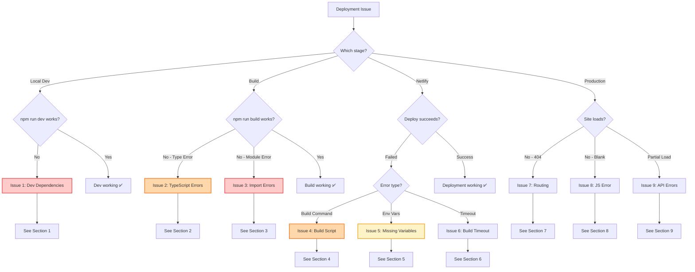
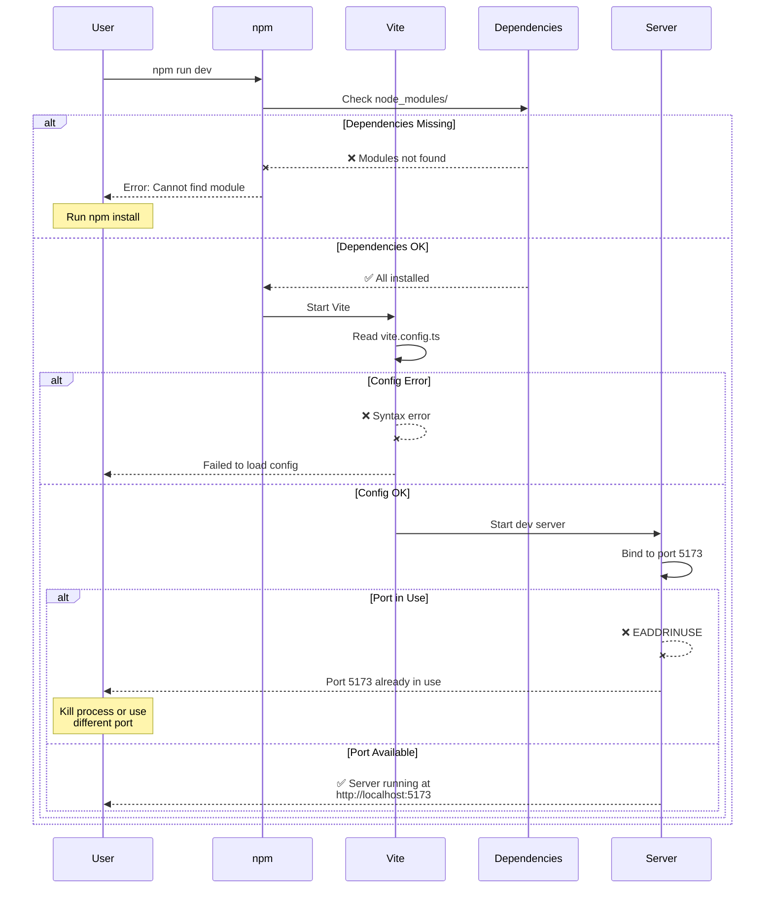
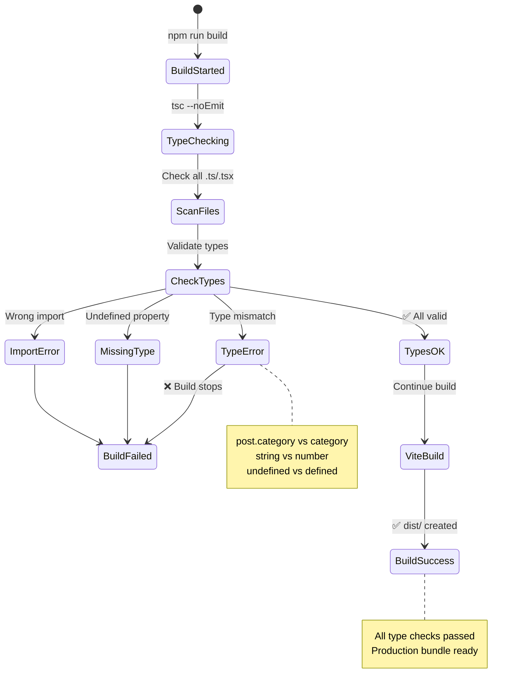
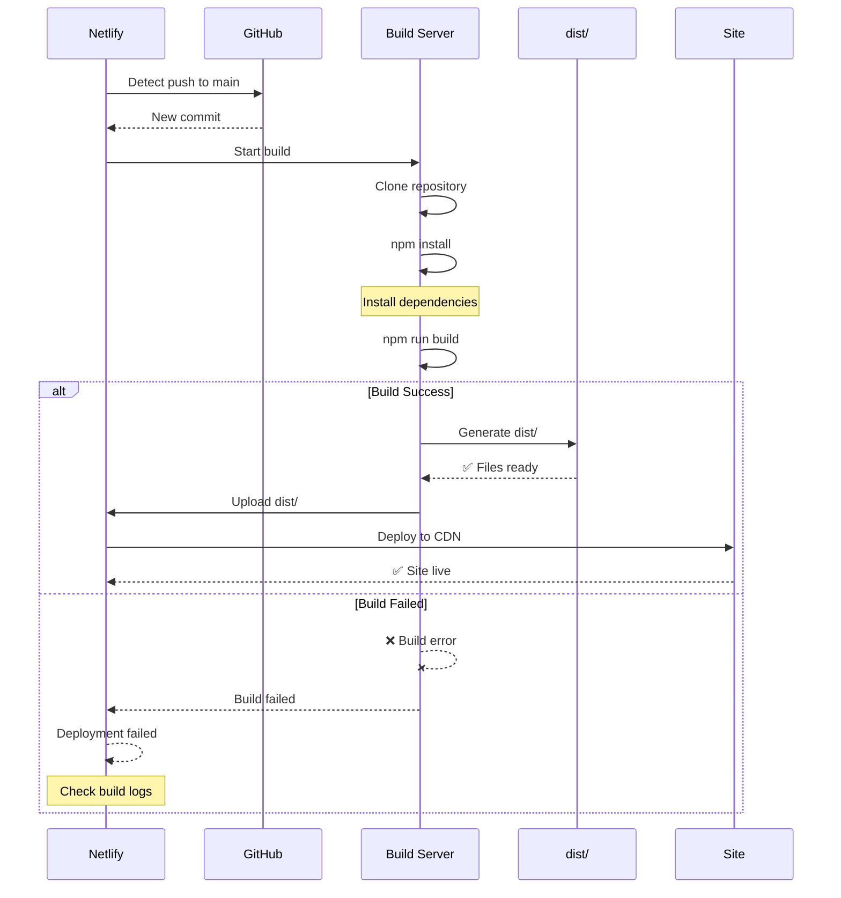
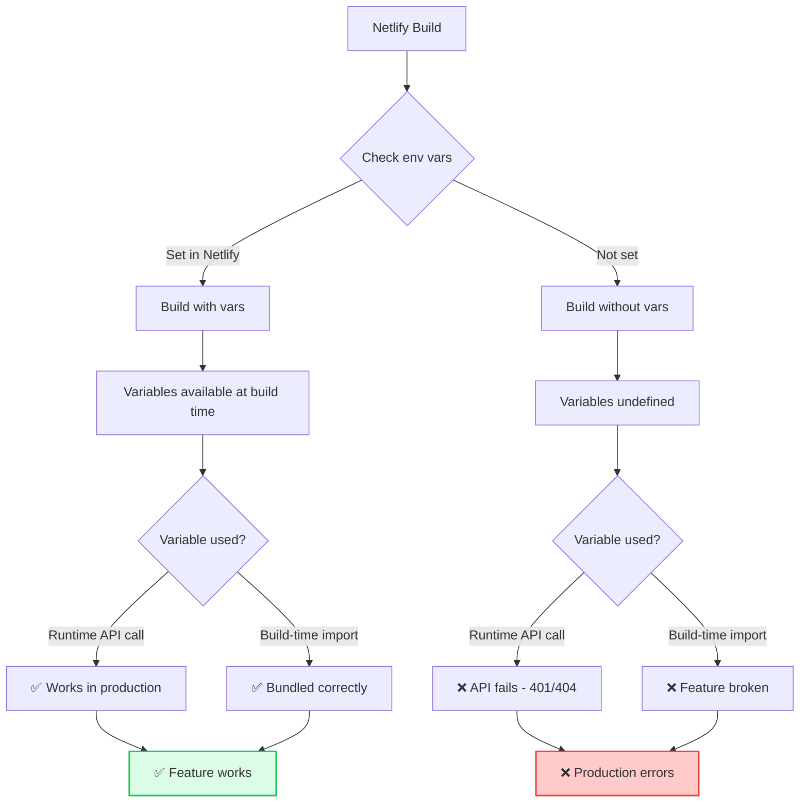
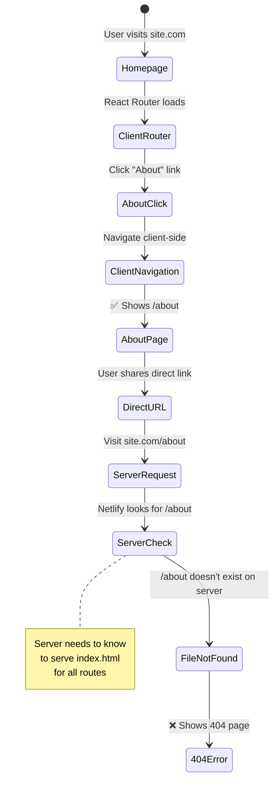
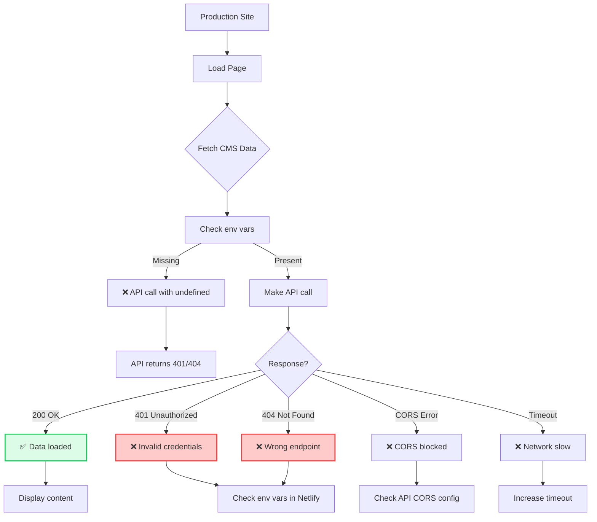

# Deployment & Build Troubleshooting Guide

**Version:** 1.0.0  
**Last Updated:** January 2025

Comprehensive troubleshooting guide for build failures, deployment issues, and production errors.

---

## 🎯 Quick Problem Identifier

```
┌─────────────────────────────────────┐
│   Deployment Failed?                │
└──────────────┬──────────────────────┘
               │
               ▼
        ┌──────────────┐
        │  What stage?  │
        └──────┬───────┘
               │
       ────────┴────────────────
       │          │            │
       ▼          ▼            ▼
  Local Build  Netlify      Production
    Fails      Build Fails   Runtime Error
       │          │            │
       ▼          ▼            ▼
   Issue 1-3   Issue 4-6    Issue 7-9
```

---

## 🔍 Diagnostic Flowchart (Mermaid)

### Deployment Pipeline Problems



---

## 🚨 Issue 1: Local Dev Server Won't Start

### Symptoms
- `npm run dev` fails
- Port already in use
- Dependencies not installed

### Dev Server Start Sequence



### Solutions

**Check 1: Install Dependencies**

```bash
# Install all dependencies
npm install

# If issues persist, clear cache
rm -rf node_modules package-lock.json
npm install

# Or use clean install
npm ci
```

**Check 2: Port Already in Use**

```bash
# Find process on port 5173
lsof -i :5173

# Kill the process
kill -9 <PID>

# Or use different port
npm run dev -- --port 3000
```

**Check 3: Node Version**

```bash
# Check Node version
node --version

# Should be: v18 or higher
# If not, update Node.js

# Using nvm:
nvm install 18
nvm use 18
```

**Check 4: Environment File**

```bash
# Make sure .env.local exists
ls -la .env.local

# Should contain:
VITE_CONTENTFUL_SPACE_ID=...
VITE_CONTENTFUL_ACCESS_TOKEN=...
VITE_SUPABASE_URL=...
VITE_SUPABASE_ANON_KEY=...
```

### Quick Fix Checklist

- [ ] Run `npm install`
- [ ] Check Node.js version (v18+)
- [ ] Kill process on port 5173
- [ ] Verify `.env.local` exists
- [ ] Check `vite.config.ts` for errors

---

## 🚨 Issue 2: TypeScript Build Errors

### Symptoms
- `npm run build` fails with TS errors
- "Property does not exist on type"
- "Type 'X' is not assignable to type 'Y'"

### Type Checking Flow



### Solutions

**Check 1: Common Type Errors**

```tsx
// ❌ WRONG - Property might not exist
const title = post.title;  // Error if post is undefined

// ✅ CORRECT - Optional chaining
const title = post?.title || 'Untitled';

// ❌ WRONG - Implicit any
const handleClick = (e) => {  // Error: Parameter 'e' implicitly has 'any' type
  console.log(e.target);
};

// ✅ CORRECT - Explicit type
const handleClick = (e: React.MouseEvent<HTMLButtonElement>) => {
  console.log(e.currentTarget);
};
```

**Check 2: Import Type Errors**

```tsx
// ❌ WRONG - Importing value as type
import { BlogPost } from '@/data/mock/blog';  // BlogPost is a variable
type Post = BlogPost;  // Error!

// ✅ CORRECT - Import type separately
import type { BlogPost } from '@/data/types/blog';  // Explicit type import

// Or use type-only import
import { type BlogPost } from '@/data/types/blog';
```

**Check 3: Strict Type Checking**

```typescript
// In tsconfig.json
{
  "compilerOptions": {
    "strict": true,
    "noImplicitAny": true,
    "strictNullChecks": true
  }
}

// Fix strict errors:

// ❌ WRONG
const name: string = null;  // Error with strictNullChecks

// ✅ CORRECT
const name: string | null = null;

// ❌ WRONG
function greet(name) {  // Error: implicit any
  return `Hello ${name}`;
}

// ✅ CORRECT
function greet(name: string): string {
  return `Hello ${name}`;
}
```

**Check 4: Skip Type Checking Temporarily**

```bash
# Build without type check (emergency fix only!)
npm run build -- --mode production

# Or add to vite.config.ts:
export default defineConfig({
  plugins: [
    react(),
    // Skip type checking in build
  ],
});

# ⚠️ NOT RECOMMENDED - Fix types properly instead!
```

### Quick Fix Checklist

- [ ] Add explicit types to function parameters
- [ ] Use optional chaining (`?.`) for nullable values
- [ ] Import types with `import type {}`
- [ ] Check `tsconfig.json` strict settings
- [ ] Run `npm run type-check` locally before deploying

---

## 🚨 Issue 3: Module Import Errors

### Symptoms
- "Cannot find module '@/...'"
- "Module not found: Error: Can't resolve '...'"
- Import paths work in dev but fail in build

### Solutions

**Check 1: Path Aliases**

```typescript
// In vite.config.ts
import { defineConfig } from 'vite';
import path from 'path';

export default defineConfig({
  resolve: {
    alias: {
      '@': path.resolve(__dirname, './src'),
    },
  },
});

// In tsconfig.json
{
  "compilerOptions": {
    "baseUrl": ".",
    "paths": {
      "@/*": ["./src/*"]
    }
  }
}
```

**Check 2: Relative vs Absolute Imports**

```tsx
// ✅ CORRECT - Absolute imports with @
import { BlogCard } from '@/components/BlogCard';
import { blogPosts } from '@/data/mock/blog';

// ✅ ALSO CORRECT - Relative imports
import { BlogCard } from './components/BlogCard';
import { blogPosts } from '../data/mock/blog';

// ❌ WRONG - Missing @ or incorrect path
import { BlogCard } from 'components/BlogCard';  // Won't work!
```

**Check 3: File Extensions**

```tsx
// ❌ WRONG - Including .tsx extension
import { BlogCard } from '@/components/BlogCard.tsx';

// ✅ CORRECT - Omit extension
import { BlogCard } from '@/components/BlogCard';

// Extensions are auto-resolved for: .ts, .tsx, .js, .jsx
```

**Check 4: Case Sensitivity**

```bash
# ❌ File is: BlogCard.tsx
import { BlogCard } from '@/components/blogcard';  # Won't work on Linux!

# ✅ Match exact casing
import { BlogCard } from '@/components/BlogCard';

# Linux is case-sensitive, macOS/Windows are not!
```

### Quick Fix Checklist

- [ ] Path alias `@` configured in both vite.config and tsconfig
- [ ] Import paths use correct casing
- [ ] No file extensions in imports
- [ ] Test build locally before deploying
- [ ] Check imports work in both dev and build

---

## 🚨 Issue 4: Netlify Build Script Error

### Symptoms
- Netlify build fails
- "Build script returned non-zero exit code"
- Works locally but fails on Netlify

### Netlify Build Sequence



### Solutions

**Check 1: Build Command**

In Netlify Dashboard → Site Settings → Build & Deploy:

```bash
# ✅ CORRECT
Build command: npm run build
Publish directory: dist

# ❌ WRONG
Build command: vite build  # Missing script
Build command: npm build   # Wrong command
Publish directory: build   # Wrong directory (Vite uses dist/)
```

**Check 2: Node Version**

```bash
# In netlify.toml (project root)
[build]
  command = "npm run build"
  publish = "dist"

[build.environment]
  NODE_VERSION = "18"  # Specify Node 18

# Or create .nvmrc file:
echo "18" > .nvmrc
```

**Check 3: Build Logs**

In Netlify Dashboard → Deploys → (Failed deploy) → Deploy log:

```
Look for actual error:
- ❌ "Module not found" → Import path issue
- ❌ "TypeScript error" → Type checking failed
- ❌ "Out of memory" → Build timeout/size issue
- ❌ "Command failed with exit code 1" → Script error
```

**Check 4: Local Build Test**

```bash
# Test exact Netlify build process locally
rm -rf dist node_modules
npm install
npm run build

# Should complete without errors
# Check dist/ folder is created
ls -la dist/

# Should contain:
# index.html
# assets/
# (and other built files)
```

### Quick Fix Checklist

- [ ] Build command is `npm run build`
- [ ] Publish directory is `dist`
- [ ] Node version set to 18
- [ ] Build succeeds locally
- [ ] Check Netlify build logs for specific error

---

## 🚨 Issue 5: Missing Environment Variables

### Symptoms
- Build succeeds but features don't work
- CMS content doesn't load
- Contact form fails
- Console errors about undefined variables

### Environment Variable Flow



### Solutions

**Check 1: Set Netlify Environment Variables**

In Netlify Dashboard → Site Settings → Environment Variables:

```bash
# Add these variables:
VITE_CONTENTFUL_SPACE_ID = abc123xyz
VITE_CONTENTFUL_ACCESS_TOKEN = your_token
VITE_SUPABASE_URL = https://xxx.supabase.co
VITE_SUPABASE_ANON_KEY = your_anon_key

# ⚠️ IMPORTANT: Must start with VITE_ to be accessible in client!
```

**Check 2: Variable Naming**

```tsx
// ✅ CORRECT - VITE_ prefix
const spaceId = import.meta.env.VITE_CONTENTFUL_SPACE_ID;

// ❌ WRONG - No VITE_ prefix (won't be exposed to client)
const spaceId = import.meta.env.CONTENTFUL_SPACE_ID;  // undefined!
```

**Check 3: Access in Code**

```tsx
// ✅ CORRECT - Check if defined
const spaceId = import.meta.env.VITE_CONTENTFUL_SPACE_ID;

if (!spaceId) {
  console.warn('Contentful not configured - using mock data');
  return mockData;
}

// Make API call with spaceId
```

**Check 4: Redeploy After Adding**

```bash
# After adding environment variables in Netlify:
# 1. Trigger redeploy (don't just save settings!)
# 2. Go to Deploys tab
# 3. Click "Trigger deploy" → "Clear cache and deploy"

# Variables are only loaded during build!
```

### Quick Fix Checklist

- [ ] All env vars set in Netlify Dashboard
- [ ] Variables have `VITE_` prefix
- [ ] Redeploy after adding variables
- [ ] Check code handles missing variables gracefully
- [ ] Test in production after deploy

---

## 🚨 Issue 6: Build Timeout

### Symptoms
- Netlify build runs for 15+ minutes
- "Build exceeded maximum allowed runtime"
- Build hangs or freezes

### Solutions

**Check 1: Optimize Dependencies**

```bash
# Check bundle size
npm run build

# Look for large chunks:
dist/assets/index-abc123.js  5000.00 kB  # ❌ Too large!

# Analyze bundle
npx vite-bundle-visualizer

# Remove unused dependencies
npm uninstall <unused-package>
```

**Check 2: Increase Netlify Timeout**

Free tier: 15 minutes  
Pro tier: 30 minutes

In `netlify.toml`:
```toml
[build]
  command = "npm run build"
  publish = "dist"

[build.processing]
  skip_processing = false
```

**Check 3: Optimize Build**

```typescript
// In vite.config.ts
export default defineConfig({
  build: {
    rollupOptions: {
      output: {
        manualChunks: {
          vendor: ['react', 'react-dom'],
          ui: ['lucide-react'],
        },
      },
    },
    chunkSizeWarningLimit: 1000,  // Increase if needed
  },
});
```

**Check 4: Check for Infinite Loops**

```tsx
// ❌ WRONG - Causes infinite build loop
useEffect(() => {
  setState(newValue);  // Triggers re-render
});  // No dependency array!

// ✅ CORRECT
useEffect(() => {
  setState(newValue);
}, [dependency]);  // Runs only when dependency changes
```

### Quick Fix Checklist

- [ ] Remove unused dependencies
- [ ] Check for infinite loops in useEffect
- [ ] Optimize bundle size with code splitting
- [ ] Verify build completes locally under 5 minutes
- [ ] Contact Netlify support if still timeout

---

## 🚨 Issue 7: Production 404 Errors

### Symptoms
- Homepage loads but other routes show 404
- Direct URL navigation fails
- Refresh on /about or /portfolio shows 404

### Routing Issue Flow



### Solutions

**Check 1: Add _redirects File**

Create `/public/_redirects`:

```
# Redirect all routes to index.html for client-side routing
/*    /index.html   200
```

**Check 2: OR Use netlify.toml**

Create `/netlify.toml`:

```toml
[[redirects]]
  from = "/*"
  to = "/index.html"
  status = 200
```

**Check 3: Verify React Router**

```tsx
// In App.tsx
import { BrowserRouter, Routes, Route } from 'react-router-dom';

function App() {
  return (
    <BrowserRouter>
      <Routes>
        <Route path="/" element={<HomePage />} />
        <Route path="/about" element={<AboutPage />} />
        <Route path="/portfolio" element={<PortfolioPage />} />
        <Route path="/blog" element={<BlogPage />} />
        <Route path="/blog/:slug" element={<BlogPostPage />} />
        <Route path="*" element={<NotFoundPage />} />  {/* Catch-all */}
      </Routes>
    </BrowserRouter>
  );
}
```

**Check 4: Test Routes**

```bash
# After deploying with _redirects:

# Test direct URLs:
https://yoursite.netlify.app/about       ✅ Should work
https://yoursite.netlify.app/portfolio   ✅ Should work
https://yoursite.netlify.app/blog/post   ✅ Should work

# All should load index.html and let React Router handle routing
```

### Quick Fix Checklist

- [ ] Add `_redirects` file to `/public/`
- [ ] OR add redirects to `netlify.toml`
- [ ] Verify file is in `dist/` after build
- [ ] Test direct URL navigation after deploy
- [ ] Check for 404 in Netlify function logs

---

## 🚨 Issue 8: Blank Page in Production

### Symptoms
- Site loads but shows blank white page
- No console errors (or errors about chunks)
- Works in dev, fails in production

### Solutions

**Check 1: Browser Console**

Open DevTools → Console:

```
Common errors:
- ❌ "Failed to load resource: 404" → Asset path wrong
- ❌ "Uncaught SyntaxError" → JS bundle corrupted
- ❌ "Loading chunk failed" → Network issue
- ❌ "Unexpected token '<'" → HTML served instead of JS
```

**Check 2: Base Path**

```typescript
// In vite.config.ts

// ❌ WRONG - If deploying to subdirectory
export default defineConfig({
  base: '/',  // Won't work at example.com/mysite/
});

// ✅ CORRECT - For subdirectory deployment
export default defineConfig({
  base: '/mysite/',  // Works at example.com/mysite/
});

// ✅ CORRECT - For root domain
export default defineConfig({
  base: '/',  // Works at ashshaw.makeup
});
```

**Check 3: Asset Paths**

```bash
# Check dist/index.html for asset paths:
cat dist/index.html

# Should see:
<script type="module" src="/assets/index-abc123.js"></script>

# ❌ WRONG:
<script src="assets/index.js"></script>  # Missing leading /
<script src="/app/assets/index.js"></script>  # Wrong base
```

**Check 4: Check Netlify Deploy Log**

```
Build succeeded:
✓ built in 45s
✓ 1234 modules transformed

# Should see:
dist/index.html                   5.23 kB
dist/assets/index-abc123.js     456.78 kB
dist/assets/vendor-def456.js    234.56 kB

# If assets missing → build failed silently
```

### Quick Fix Checklist

- [ ] Check browser console for errors
- [ ] Verify `base` path in vite.config.ts
- [ ] Check dist/index.html for correct asset paths
- [ ] Clear Netlify cache and redeploy
- [ ] Test in incognito mode (bypass cache)

---

## 🚨 Issue 9: API Errors in Production

### Symptoms
- Site loads but API calls fail
- CMS content doesn't load
- Contact form returns errors
- Works in dev, fails in production

### Production API Error Flow



### Solutions

**Check 1: Production Console Errors**

```javascript
// In production console:
console.log('Contentful Space ID:', import.meta.env.VITE_CONTENTFUL_SPACE_ID);
// Should output actual value, not 'undefined'

// If undefined → env vars not set in Netlify
```

**Check 2: CORS Issues**

```bash
# Contentful API should allow CORS from any origin
# If blocked, check:

# 1. Are you using correct API endpoint?
✅ https://cdn.contentful.com/spaces/...  # Content Delivery API
❌ https://api.contentful.com/spaces/...  # Management API (different CORS)

# 2. Check headers in Network tab:
Request Headers:
  Authorization: Bearer your-token  ✅

Response Headers:
  Access-Control-Allow-Origin: *  ✅
```

**Check 3: Fallback Handling**

```tsx
// ✅ CORRECT - Always have fallback
export function useContentfulData() {
  const [data, setData] = useState(mockData);  // Start with fallback
  const [error, setError] = useState(null);
  
  useEffect(() => {
    const fetchData = async () => {
      try {
        const response = await fetchContentful();
        setData(response);
      } catch (err) {
        console.error('Contentful error:', err);
        setError(err.message);
        // Keep using mockData fallback
      }
    };
    
    fetchData();
  }, []);
  
  return { data, error };
}
```

**Check 4: Network Tab**

Open DevTools → Network:

```
Filter by "Fetch/XHR"

Look for API calls:
✅ cdn.contentful.com → 200 OK
✅ supabase.co/functions → 200 OK

❌ cdn.contentful.com → 401 Unauthorized → Check token
❌ cdn.contentful.com → 404 Not Found → Check space ID
❌ (failed) net::ERR_BLOCKED_BY_CLIENT → Ad blocker
```

### Quick Fix Checklist

- [ ] Environment variables set in Netlify
- [ ] API calls use correct endpoints
- [ ] CORS headers allow origin
- [ ] Fallback data always available
- [ ] Check Network tab for actual error
- [ ] Test API calls in production console

---

## 🎯 Complete Deployment Checklist

### Pre-Deployment

```bash
# ✅ 1. Local build test
npm run build
npm run preview  # Test production build locally

# ✅ 2. Type check
npm run type-check  # Or: tsc --noEmit

# ✅ 3. Lint
npm run lint

# ✅ 4. Test all features
- [ ] All pages load
- [ ] Forms submit
- [ ] Images display
- [ ] Routing works
- [ ] Search/filters work
```

### Netlify Configuration

```toml
# netlify.toml
[build]
  command = "npm run build"
  publish = "dist"

[build.environment]
  NODE_VERSION = "18"

[[redirects]]
  from = "/*"
  to = "/index.html"
  status = 200
```

### Environment Variables

```bash
# Set in Netlify Dashboard:
VITE_CONTENTFUL_SPACE_ID
VITE_CONTENTFUL_ACCESS_TOKEN
VITE_SUPABASE_URL
VITE_SUPABASE_ANON_KEY

# ⚠️ Supabase secrets (for Edge Functions):
SENDGRID_API_KEY
TO_EMAIL
FROM_EMAIL
```

### Post-Deployment

```bash
# ✅ 1. Check build log
# Netlify → Deploys → Latest → Deploy log

# ✅ 2. Test production site
- [ ] Visit homepage
- [ ] Test all routes directly
- [ ] Test forms
- [ ] Check console for errors
- [ ] Test API calls (CMS, email)

# ✅ 3. Performance check
# Run Lighthouse audit:
- Performance: 95+
- Accessibility: 100
- Best Practices: 95+
- SEO: 100
```

---

## 📋 Quick Reference: Common Fixes

| Error | Cause | Solution |
|-------|-------|----------|
| **Port in use** | Dev server already running | `kill -9 $(lsof -ti:5173)` |
| **Type errors** | Missing types | Add explicit types to parameters |
| **Module not found** | Wrong import path | Check path alias in vite.config |
| **Build timeout** | Bundle too large | Optimize dependencies, code split |
| **404 on routes** | Missing redirects | Add `_redirects` to `/public/` |
| **Blank page** | Wrong base path | Check `base` in vite.config.ts |
| **API 401** | Missing env vars | Set in Netlify Dashboard + redeploy |
| **CORS error** | Wrong API endpoint | Use Content Delivery API |

---

## 🔗 Related Documentation

- **[Supabase Integration](../supabase-integration.md)** - Edge Functions deployment
- **[Contentful Integration](../contentful-integration.md)** - CMS setup
- **[Environment Variables Guide](../contentful-integration.md#environment-setup)** - Configuration

---

**Pro Tip:** Always test `npm run build` locally before pushing to avoid surprise deployment failures!
