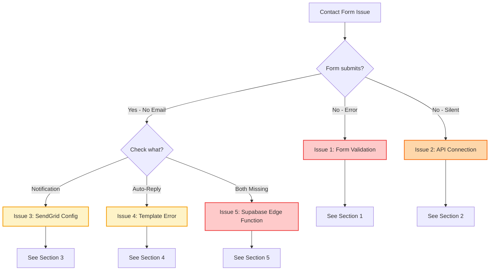
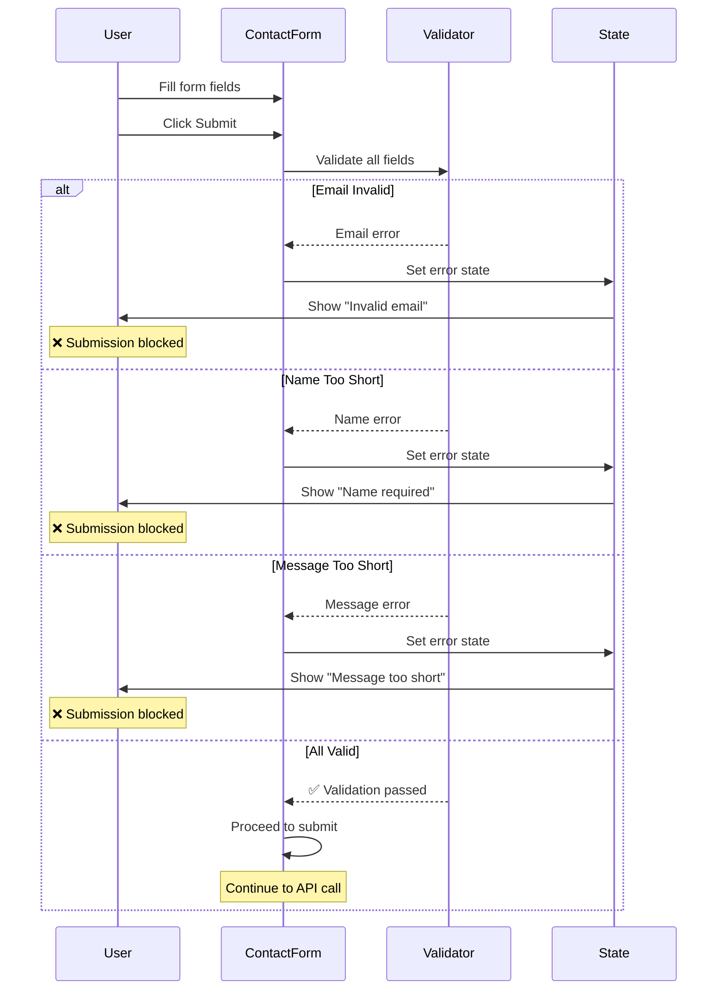
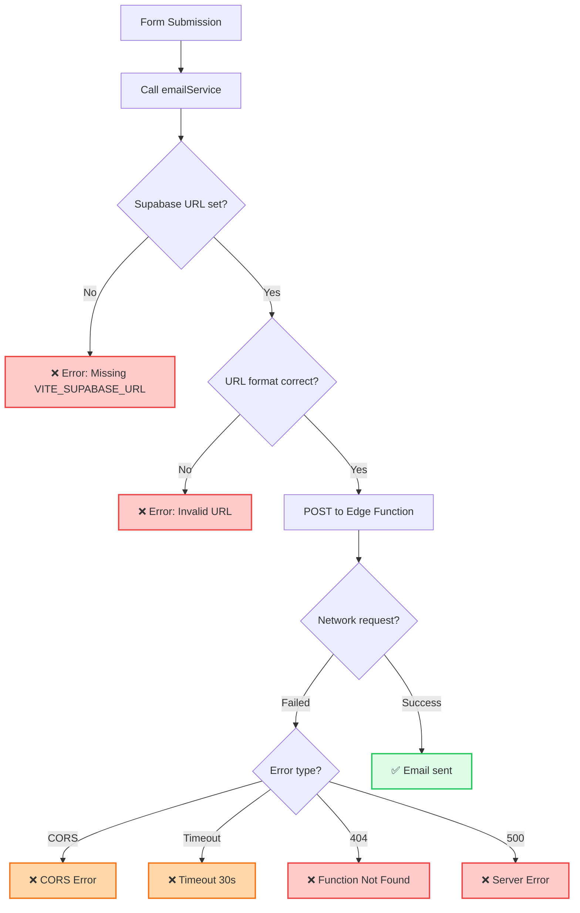
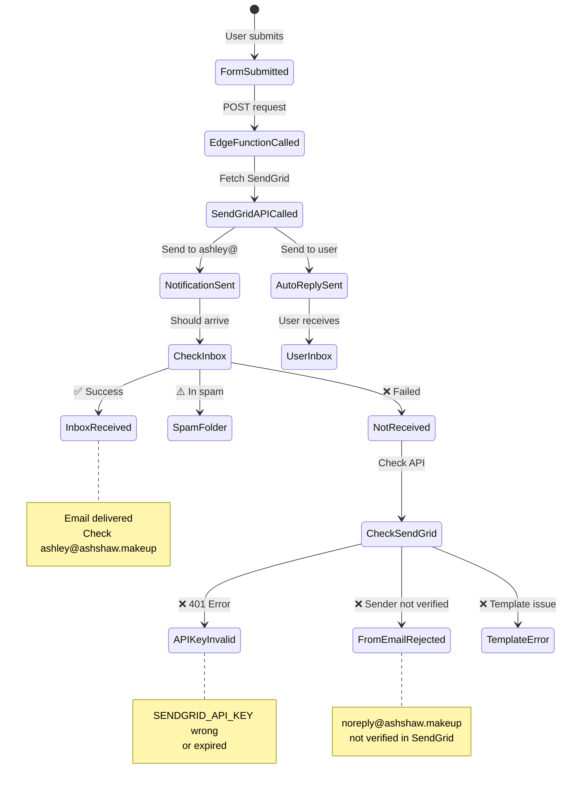
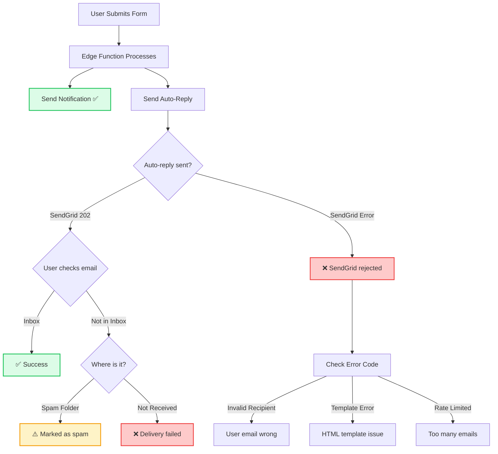
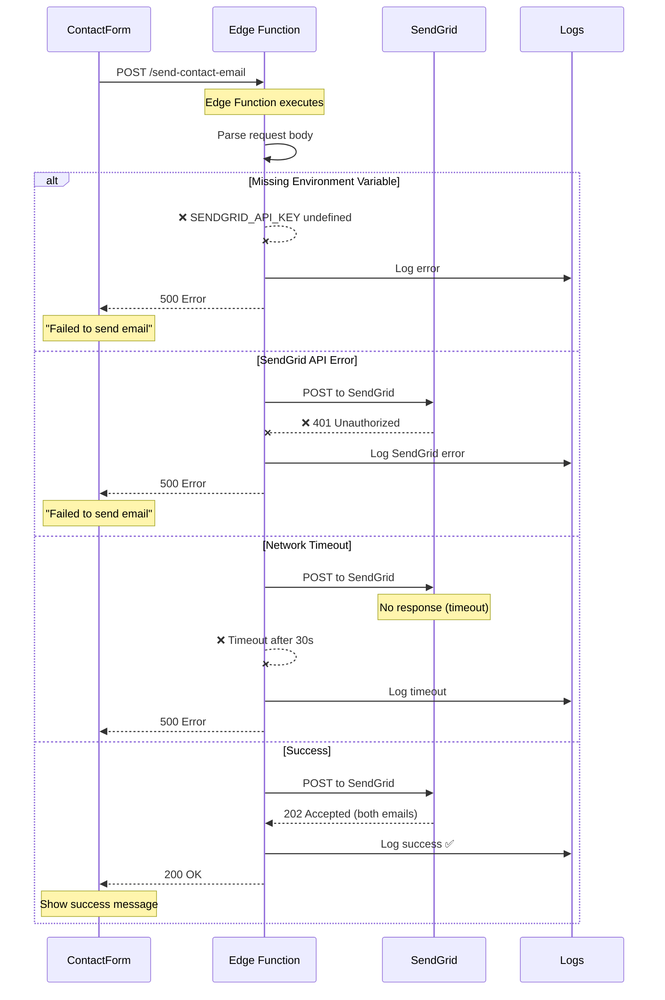
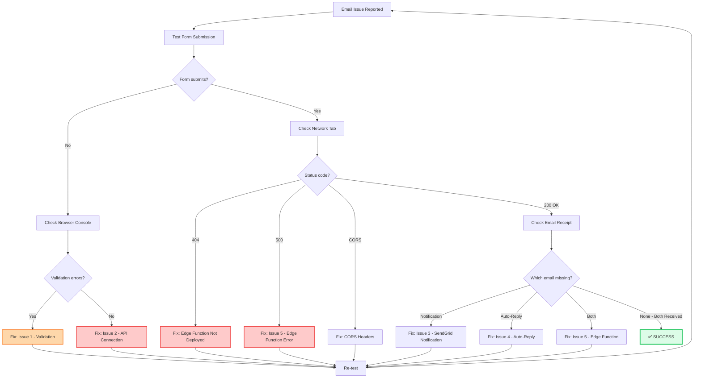

# Email & Contact Form Troubleshooting Guide

**Version:** 1.0.0  
**Last Updated:** January 2025

Comprehensive troubleshooting guide for SendGrid email integration and contact form issues.

---

## 🎯 Quick Problem Identifier

Use this flowchart to identify your specific issue:

```
┌─────────────────────────────────────┐
│   Contact Form Not Working?         │
└──────────────┬──────────────────────┘
               │
               ▼
        ┌──────────────┐
        │  What fails?  │
        └──────┬───────┘
               │
       ────────┴────────
       │               │
       ▼               ▼
  Form Submit     Email Not
  Button Fails    Received
       │               │
       │               ▼
       │         ┌───────────┐
       │         │ Which one? │
       │         └─────┬─────┘
       │               │
       │       ────────┴────────
       │       │               │
       │       ▼               ▼
       │   Notification    Auto-Reply
       │   Not Sent       Not Sent
       │       │               │
       ▼       ▼               ▼
    Issue 1  Issue 2        Issue 3
```

---

## 🔍 Diagnostic Flowchart (Mermaid)

### Problem Identification Flow



---

## 🚨 Issue 1: Form Validation Errors

### Symptoms
- Form won't submit when clicking "Send Message"
- Error messages appear under fields
- Submit button remains disabled

### Diagnostic Sequence



### Solutions

**Check 1: Email Validation**

```tsx
// ✅ CORRECT - Proper email regex
const emailRegex = /^[^\s@]+@[^\s@]+\.[^\s@]+$/;

if (!emailRegex.test(email)) {
  setErrors({ email: 'Please enter a valid email address' });
  return;
}
```

**Check 2: Required Fields**

```tsx
// ✅ CORRECT - Validate all required fields
const validateForm = () => {
  const newErrors: FormErrors = {};
  
  if (!formData.name.trim()) {
    newErrors.name = 'Name is required';
  }
  
  if (!formData.email.trim()) {
    newErrors.email = 'Email is required';
  } else if (!emailRegex.test(formData.email)) {
    newErrors.email = 'Invalid email format';
  }
  
  if (!formData.message.trim()) {
    newErrors.message = 'Message is required';
  } else if (formData.message.length < 10) {
    newErrors.message = 'Message must be at least 10 characters';
  }
  
  return newErrors;
};
```

**Check 3: Honeypot Field**

```tsx
// ✅ CORRECT - Check honeypot isn't filled by bots
if (formData.website) {
  // Likely a bot - reject silently
  console.log('Honeypot triggered');
  return;
}
```

### Quick Fix Checklist

- [ ] Email matches regex pattern
- [ ] Name field is not empty
- [ ] Message is at least 10 characters
- [ ] Honeypot field is empty (hidden from users)
- [ ] No console errors in browser DevTools

---

## 🚨 Issue 2: API Connection Failed

### Symptoms
- Form validates but nothing happens
- Console shows network errors
- No success or error message displayed

### Diagnostic Flowchart



### Solutions

**Check 1: Environment Variable**

```bash
# .env.local
VITE_SUPABASE_URL=https://your-project.supabase.co
VITE_SUPABASE_ANON_KEY=your-anon-key
```

**Verify in console:**
```tsx
console.log('Supabase URL:', import.meta.env.VITE_SUPABASE_URL);
// Should output: https://your-project.supabase.co
```

**Check 2: API Endpoint Path**

```tsx
// ✅ CORRECT - Proper endpoint path
const response = await fetch(
  `${supabaseUrl}/functions/v1/send-contact-email`,
  {
    method: 'POST',
    headers: {
      'Content-Type': 'application/json',
      'Authorization': `Bearer ${supabaseAnonKey}`
    },
    body: JSON.stringify(formData)
  }
);
```

**Common mistakes:**
```tsx
// ❌ WRONG - Missing /functions/v1/
const url = `${supabaseUrl}/send-contact-email`;

// ❌ WRONG - Wrong function name
const url = `${supabaseUrl}/functions/v1/contact-form`;

// ✅ CORRECT
const url = `${supabaseUrl}/functions/v1/send-contact-email`;
```

**Check 3: Network Tab**

Open DevTools → Network tab:

```
Status Code | What it means
------------|---------------
200 OK      | ✅ Email sent successfully
404         | ❌ Edge Function not deployed
500         | ❌ Server error (check SendGrid)
CORS error  | ❌ Missing authorization header
Timeout     | ❌ Function taking too long
```

### Quick Fix Checklist

- [ ] `VITE_SUPABASE_URL` is set in `.env.local`
- [ ] `VITE_SUPABASE_ANON_KEY` is set
- [ ] Restart dev server after changing `.env`
- [ ] Edge Function is deployed to Supabase
- [ ] Check Network tab for actual error
- [ ] Authorization header included in request

---

## 🚨 Issue 3: SendGrid Not Sending Notification

### Symptoms
- Form submits successfully (200 OK)
- Auto-reply received
- But notification to ashley@ashshaw.makeup NOT received

### State Diagram



### Solutions

**Check 1: SendGrid API Key**

```bash
# In Supabase Dashboard → Project Settings → Edge Functions → Secrets
SENDGRID_API_KEY=SG.your-actual-key-here

# Verify format: Should start with "SG."
```

**Test API key:**
```bash
curl -X POST https://api.sendgrid.com/v3/mail/send \
  -H "Authorization: Bearer YOUR_API_KEY" \
  -H "Content-Type: application/json" \
  -d '{
    "personalizations": [{"to": [{"email": "test@example.com"}]}],
    "from": {"email": "noreply@ashshaw.makeup"},
    "subject": "Test",
    "content": [{"type": "text/plain", "value": "Test"}]
  }'
```

Expected response: `202 Accepted`

**Check 2: Email Addresses**

```tsx
// ✅ CORRECT - Exact email addresses
const TO_EMAIL = 'ashley@ashshaw.makeup';  // Notification recipient
const FROM_EMAIL = 'noreply@ashshaw.makeup';  // Must be verified in SendGrid
```

**Verify in SendGrid Dashboard:**
1. Go to Settings → Sender Authentication
2. Verify `noreply@ashshaw.makeup` is verified
3. Or use verified domain: `noreply@ashshaw.makeup`

**Check 3: Edge Function Logs**

```bash
# In Supabase Dashboard → Edge Functions → send-contact-email → Logs

# Look for:
✅ "Sending notification email to ashley@ashshaw.makeup"
✅ "SendGrid response: 202"

# Or errors:
❌ "SendGrid error: 401 Unauthorized"
❌ "SendGrid error: 403 Forbidden"
```

**Check 4: Email Template**

```typescript
// In /supabase/functions/send-contact-email/index.ts

// ✅ CORRECT - Notification email structure
const notificationEmail = {
  personalizations: [
    {
      to: [{ email: TO_EMAIL }],  // ashley@ashshaw.makeup
    },
  ],
  from: {
    email: FROM_EMAIL,  // noreply@ashshaw.makeup
    name: 'Ash Shaw Portfolio',
  },
  subject: `New Contact Form: ${name}`,
  content: [
    {
      type: 'text/html',
      value: `
        <h2>New Contact Form Submission</h2>
        <p><strong>From:</strong> ${name}</p>
        <p><strong>Email:</strong> ${email}</p>
        <p><strong>Message:</strong></p>
        <p>${message}</p>
      `,
    },
  ],
};
```

### Quick Fix Checklist

- [ ] `SENDGRID_API_KEY` is set in Supabase secrets
- [ ] API key starts with `SG.` and is valid
- [ ] `FROM_EMAIL` (noreply@ashshaw.makeup) is verified in SendGrid
- [ ] `TO_EMAIL` (ashley@ashshaw.makeup) is correct
- [ ] Check Supabase Edge Function logs
- [ ] Check SendGrid Dashboard → Activity
- [ ] Check spam folder for ashley@ashshaw.makeup

---

## 🚨 Issue 4: Auto-Reply Not Received

### Symptoms
- Notification email received by Ashley
- But user doesn't receive auto-reply
- User email is valid

### Diagnostic Flowchart



### Solutions

**Check 1: User Email Validation**

```tsx
// Make sure email is valid before sending
const emailRegex = /^[^\s@]+@[^\s@]+\.[^\s@]+$/;

if (!emailRegex.test(email)) {
  // Don't send to invalid email
  throw new Error('Invalid email address');
}
```

**Check 2: Auto-Reply Template**

```typescript
// In /supabase/functions/send-contact-email/index.ts

// ✅ CORRECT - Auto-reply structure
const autoReplyEmail = {
  personalizations: [
    {
      to: [{ email: email }],  // User's email from form
    },
  ],
  from: {
    email: FROM_EMAIL,  // noreply@ashshaw.makeup
    name: 'Ash Shaw',
  },
  subject: 'Thanks for reaching out!',
  content: [
    {
      type: 'text/html',
      value: `
        <h2>Hi ${name}!</h2>
        <p>Thanks for your message. I'll get back to you soon!</p>
        <p><strong>Your message:</strong></p>
        <p>${message}</p>
        <hr>
        <p style="color: #888;">Ash Shaw | Makeup Artist</p>
      `,
    },
  ],
};
```

**Check 3: SendGrid Activity Feed**

1. Go to SendGrid Dashboard
2. Navigate to Activity Feed
3. Search for user's email
4. Check delivery status:

```
Status          | What it means
----------------|------------------
Delivered       | ✅ Email sent successfully
Deferred        | ⏳ Delayed, will retry
Bounce          | ❌ Invalid recipient email
Blocked         | ❌ Spam filter rejected
Dropped         | ❌ SendGrid blocked (unsubscribed)
```

**Check 4: Spam Score**

Auto-replies often trigger spam filters. Improve deliverability:

```html
<!-- ✅ GOOD - Professional auto-reply -->
<html>
<body>
  <h2>Thanks for reaching out, ${name}!</h2>
  <p>I received your message and will respond within 24-48 hours.</p>
  
  <p><strong>Your message:</strong></p>
  <blockquote>${message}</blockquote>
  
  <hr>
  <p>Best regards,<br>Ash Shaw<br>Makeup Artist</p>
  <p style="font-size: 12px; color: #888;">
    Brisbane, Australia | ashley@ashshaw.makeup
  </p>
</body>
</html>
```

**Avoid:**
```html
<!-- ❌ BAD - Triggers spam filters -->
<p>CLICK HERE NOW!!!</p>
<p>🎉🎉🎉 FREE MAKEUP 🎉🎉🎉</p>
```

### Quick Fix Checklist

- [ ] User's email passes regex validation
- [ ] Auto-reply template has proper HTML structure
- [ ] Check SendGrid Activity Feed for delivery status
- [ ] Ask user to check spam/junk folder
- [ ] FROM_EMAIL domain has SPF/DKIM configured
- [ ] Remove spam trigger words from template

---

## 🚨 Issue 5: Supabase Edge Function Error

### Symptoms
- 500 Internal Server Error from API
- Console shows "Failed to send email"
- Edge Function logs show errors

### Error Diagnosis Sequence



### Solutions

**Check 1: Edge Function Deployment**

```bash
# Deploy Edge Function
supabase functions deploy send-contact-email

# Expected output:
✅ Deployed function send-contact-email
```

**Verify it exists:**
```bash
# In Supabase Dashboard → Edge Functions
# Should see: send-contact-email (Active)
```

**Check 2: Environment Secrets**

```bash
# Set secrets in Supabase
supabase secrets set SENDGRID_API_KEY=SG.your-key
supabase secrets set TO_EMAIL=ashley@ashshaw.makeup
supabase secrets set FROM_EMAIL=noreply@ashshaw.makeup

# List secrets to verify
supabase secrets list
```

**In Edge Function code:**
```typescript
const SENDGRID_API_KEY = Deno.env.get('SENDGRID_API_KEY');
const TO_EMAIL = Deno.env.get('TO_EMAIL');
const FROM_EMAIL = Deno.env.get('FROM_EMAIL');

if (!SENDGRID_API_KEY) {
  throw new Error('Missing SENDGRID_API_KEY environment variable');
}
```

**Check 3: Edge Function Logs**

```bash
# View real-time logs
supabase functions logs send-contact-email --tail

# Look for errors:
❌ "Error: Missing SENDGRID_API_KEY"
❌ "SendGrid error: 401"
❌ "SendGrid error: 403"
❌ "TypeError: Cannot read property..."

# Success looks like:
✅ "Received contact form submission"
✅ "Sending notification email to ashley@ashshaw.makeup"
✅ "SendGrid response: 202"
```

**Check 4: CORS Configuration**

```typescript
// In /supabase/functions/send-contact-email/index.ts

// ✅ CORRECT - Handle CORS
const corsHeaders = {
  'Access-Control-Allow-Origin': '*',
  'Access-Control-Allow-Headers': 'authorization, x-client-info, apikey, content-type',
};

Deno.serve(async (req) => {
  // Handle CORS preflight
  if (req.method === 'OPTIONS') {
    return new Response('ok', { headers: corsHeaders });
  }
  
  try {
    // ... email sending logic
    
    return new Response(
      JSON.stringify({ success: true }),
      { 
        headers: { ...corsHeaders, 'Content-Type': 'application/json' },
        status: 200 
      }
    );
  } catch (error) {
    console.error('Error:', error.message);
    
    return new Response(
      JSON.stringify({ error: error.message }),
      { 
        headers: { ...corsHeaders, 'Content-Type': 'application/json' },
        status: 500 
      }
    );
  }
});
```

### Quick Fix Checklist

- [ ] Edge Function is deployed (`supabase functions deploy`)
- [ ] All environment secrets are set in Supabase
- [ ] Edge Function logs show no errors
- [ ] CORS headers are properly configured
- [ ] Edge Function returns proper JSON response
- [ ] Test with `curl` or Postman first

---

## 🎯 Complete Diagnostic Workflow

### Full Troubleshooting Sequence



---

## 📋 Quick Reference: Common Error Codes

| Error Code | Location | Cause | Solution |
|------------|----------|-------|----------|
| **Form won't submit** | Browser | Validation failed | Check Issue 1 |
| **No network request** | DevTools | Missing env vars | Check `.env.local` |
| **404 Not Found** | Network Tab | Edge Function not deployed | `supabase functions deploy` |
| **401 Unauthorized** | SendGrid | Invalid API key | Check `SENDGRID_API_KEY` |
| **403 Forbidden** | SendGrid | Sender not verified | Verify `FROM_EMAIL` in SendGrid |
| **500 Server Error** | Edge Function | Code error | Check Edge Function logs |
| **CORS Error** | Browser | Missing headers | Add CORS headers to Edge Function |
| **Timeout** | Network Tab | Function too slow | Optimize Edge Function code |

---

## 🔗 Related Documentation

- **[ContactForm Component](../components/ContactForm.md)** - Component implementation
- **[Supabase Integration](../supabase-integration.md)** - Edge Functions setup
- **[SendGrid Setup Guide](../supabase-integration.md#sendgrid-setup)** - Email configuration

---

**Need more help?** Check Edge Function logs in Supabase Dashboard → Functions → send-contact-email → Logs
