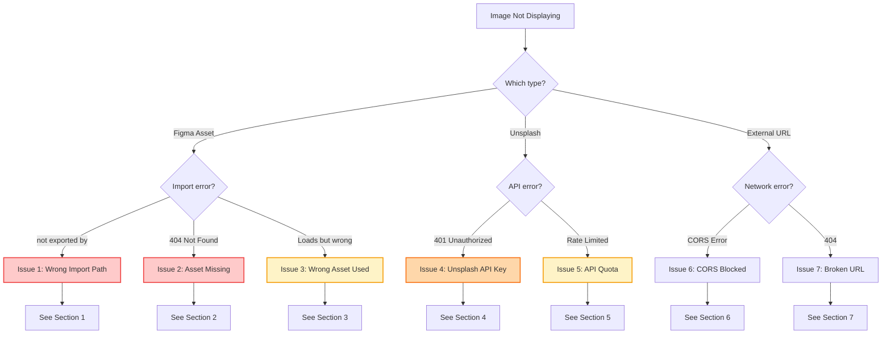
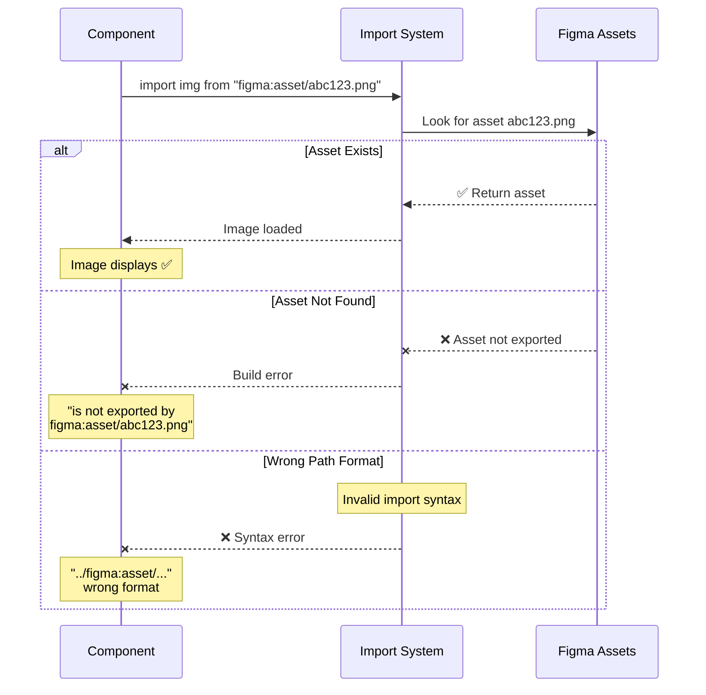
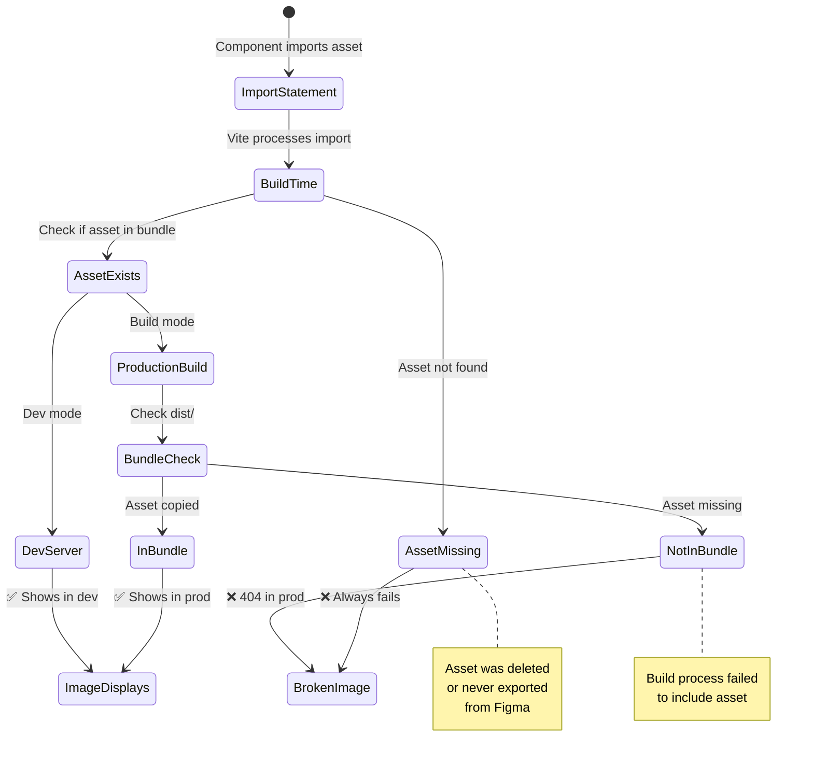
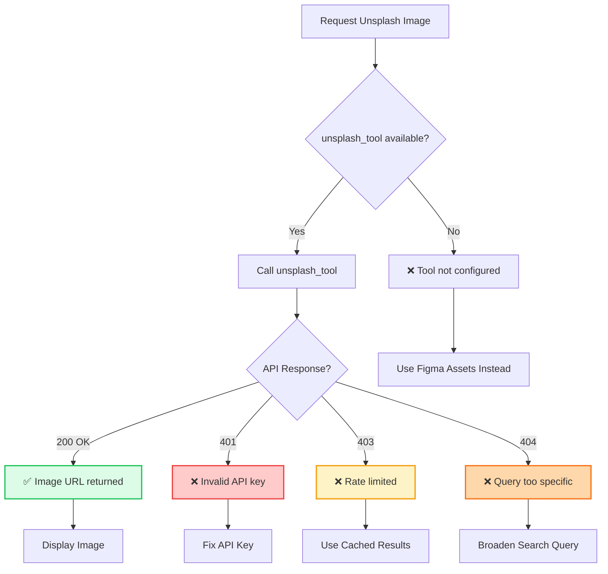
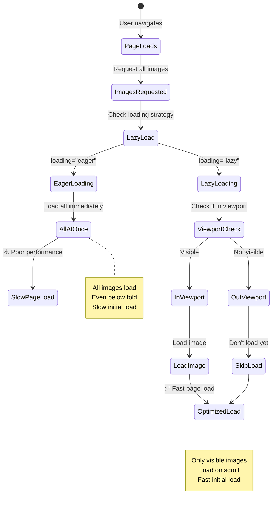
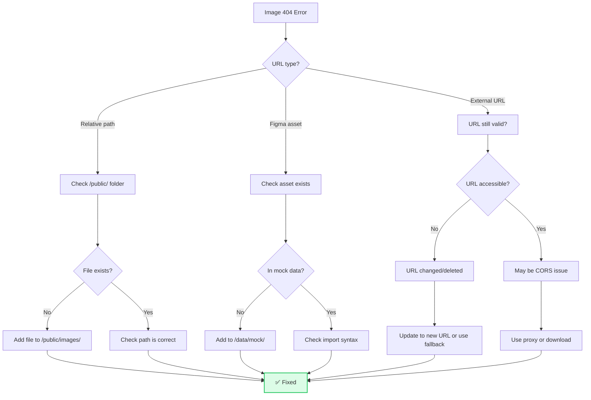
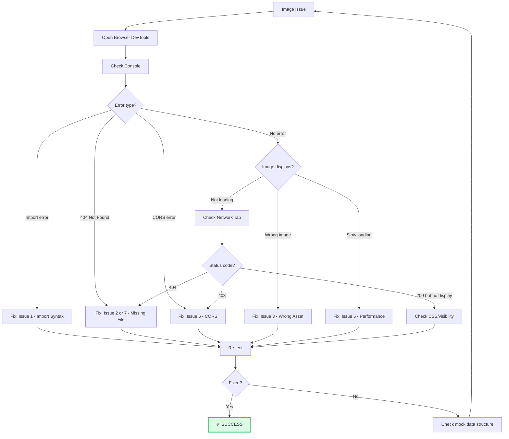

# Image Display & Loading Troubleshooting Guide

**Version:** 1.0.0  
**Last Updated:** January 2025

Comprehensive troubleshooting guide for image display and loading issues.

---

## 🎯 Quick Problem Identifier

```
┌─────────────────────────────────────┐
│   Images Not Displaying?            │
└──────────────┬──────────────────────┘
               │
               ▼
        ┌──────────────┐
        │ Which images? │
        └──────┬───────┘
               │
       ────────┴────────────────
       │                       │
       ▼                       ▼
  Figma Assets           Unsplash/External
  (Portfolio)                Images
       │                       │
       ▼                       ▼
    Issue 1-3              Issue 4-5
```

---

## 🔍 Diagnostic Flowchart (Mermaid)

### Image Loading Problem Identification



---

## 🚨 Issue 1: Figma Asset Import Error

### Symptoms
- Console error: "is not exported by 'figma:asset/...'"
- Image shows broken icon
- Build fails with import error

### Error Sequence



### Solutions

**Check 1: Import Syntax**

```tsx
// ✅ CORRECT - figma:asset is a virtual module
import heroImg from "figma:asset/abc123.png";

// ❌ WRONG - Don't add path prefixes
import heroImg from "./figma:asset/abc123.png";
import heroImg from "../imports/figma:asset/abc123.png";
import heroImg from "/public/figma:asset/abc123.png";

// figma:asset is NOT a file path - it's a special import scheme!
```

**Check 2: Asset ID**

```tsx
// Asset ID comes from Figma export
// Format: {hash}.{extension}

// ✅ CORRECT examples
import img1 from "figma:asset/76faf8f617b56e6f079c5a7ead8f927f5a5fee32.png";
import img2 from "figma:asset/f2dddff10fce8c5cc0468d3c13d16d6eeadcbdb7.jpg";

// ❌ WRONG - Made up IDs won't work
import img from "figma:asset/hero-image.png";
import img from "figma:asset/portfolio-1.jpg";
```

**Check 3: Check Mock Data**

All Figma assets should be defined in `/data/mock/`:

```tsx
// In /data/mock/portfolio/festivalGallery.ts

export const festivalGallery = [
  {
    id: 'festival-1',
    url: 'figma:asset/76faf8f617b56e6f079c5a7ead8f927f5a5fee32.png',  // ✅
    alt: 'Festival makeup with UV accents'
  },
  // ...
];

// Then import and use:
import { festivalGallery } from '@/data/mock/portfolio/festivalGallery';

function Portfolio() {
  return (
    <ImageGallery images={festivalGallery} />
  );
}
```

**Check 4: Available Assets**

Check which Figma assets exist:

```bash
# Search for all figma:asset imports in codebase
grep -r "figma:asset" data/mock/

# Should show all available assets like:
# figma:asset/76faf8f617b56e6f079c5a7ead8f927f5a5fee32.png
# figma:asset/f2dddff10fce8c5cc0468d3c13d16d6eeadcbdb7.png
# etc.
```

### Quick Fix Checklist

- [ ] Import uses `"figma:asset/..."` (no path prefix)
- [ ] Asset ID is exact hash from Figma export
- [ ] Asset exists in `/data/mock/` files
- [ ] No `./` or `../` before `figma:asset`
- [ ] Check console for exact error message

---

## 🚨 Issue 2: Figma Asset File Missing

### Symptoms
- Import works (no build error)
- But image shows 404 or broken icon
- Works in dev but fails in production

### State Diagram



### Solutions

**Check 1: Asset Actually Exists**

The `figma:asset` scheme should be backed by real assets. Check if:

1. Asset was properly exported from Figma
2. Asset is referenced in `/data/mock/` files
3. Build process includes it

**Check 2: Production Build**

```bash
# Build for production
npm run build

# Check if assets are in dist/
ls -la dist/assets/

# Should see image files like:
# abc123.png
# def456.jpg
```

**Check 3: Fallback Images**

Always use `ImageWithFallback` component:

```tsx
// ✅ CORRECT - Fallback for missing images
import { ImageWithFallback } from './components/figma/ImageWithFallback';

<ImageWithFallback
  src="figma:asset/abc123.png"
  alt="Portfolio image"
  fallbackSrc="/placeholder.jpg"  // Shows if figma asset fails
/>

// ❌ WRONG - No fallback

```

**Check 4: Use Mock Data**

```tsx
// ✅ CORRECT - Images from centralized data
import { festivalGallery } from '@/data/mock/portfolio/festivalGallery';

function Gallery() {
  return (
    <div>
      {festivalGallery.map((img) => (
        
      ))}
    </div>
  );
}

// ❌ WRONG - Hardcoded, brittle
function Gallery() {
  return (
    
  );
}
```

### Quick Fix Checklist

- [ ] Asset exists in Figma export
- [ ] Check `dist/assets/` after build
- [ ] Use `ImageWithFallback` component
- [ ] Import images from `/data/mock/`
- [ ] Test in production build, not just dev

---

## 🚨 Issue 3: Using Wrong Figma Asset

### Symptoms
- Image loads, but shows wrong content
- Portfolio image shows hero photo instead
- Assets mixed up between pages

### Solutions

**Check 1: Mock Data Organization**

```tsx
// ✅ CORRECT - Organized by category
/data/mock/
  images/
    homepageHero.ts      // Homepage images
    aboutHero.ts         // About page images
    portfolioHero.ts     // Portfolio page images
  portfolio/
    festivalGallery.ts   // Festival portfolio
    editorialGallery.ts  // Editorial portfolio
```

**Check 2: Import Correct Data**

```tsx
// ✅ CORRECT - Import right data for right page
import { homepageHero } from '@/data/mock/images/homepageHero';
import { aboutHero } from '@/data/mock/images/aboutHero';

function HomePage() {
  return <Hero images={homepageHero} />;  // ✅ Homepage images
}

function AboutPage() {
  return <Hero images={aboutHero} />;  // ✅ About images
}

// ❌ WRONG - Mixed up imports
function AboutPage() {
  return <Hero images={homepageHero} />;  // ❌ Wrong images!
}
```

**Check 3: Asset Naming**

Assets should have descriptive names in mock data:

```tsx
// ✅ CORRECT - Clear naming
export const festivalGallery = [
  {
    id: 'festival-uv-accents',
    url: 'figma:asset/76faf8f617b56e6f079c5a7ead8f927f5a5fee32.png',
    alt: 'Festival makeup with UV accents and glitter',
    category: 'festival'
  },
  {
    id: 'festival-rainbow-eyeshadow',
    url: 'figma:asset/f2dddff10fce8c5cc0468d3c13d16d6eeadcbdb7.png',
    alt: 'Rainbow eyeshadow with gems',
    category: 'festival'
  }
];

// ❌ WRONG - Generic naming
export const images = [
  { url: 'figma:asset/abc.png', alt: 'Image 1' },  // ❌ Unclear!
  { url: 'figma:asset/def.png', alt: 'Image 2' },
];
```

### Quick Fix Checklist

- [ ] Import data from correct mock file
- [ ] Check `id` and `alt` match expected content
- [ ] Organize assets by page/category
- [ ] Use descriptive names in mock data
- [ ] Verify in browser which asset is loading

---

## 🚨 Issue 4: Unsplash API Issues

### Symptoms
- Unsplash images don't load
- Console error: "Unsplash API error"
- Placeholder images show instead

### Diagnostic Flow



### Solutions

**Check 1: Use Figma Assets Instead**

Per guidelines, you should use `unsplash_tool` when creating new images:

```tsx
// ✅ CORRECT - Use existing Figma assets from mock data
import { festivalGallery } from '@/data/mock/portfolio/festivalGallery';

function Portfolio() {
  return <ImageGallery images={festivalGallery} />;
}

// ⚠️ ONLY use unsplash_tool when creating NEW content
// Not for existing portfolio images!
```

**Check 2: Search Query**

If you must use Unsplash, use simple queries:

```tsx
// ✅ CORRECT - Broad, simple queries
const img1 = await unsplash_tool({ query: "makeup artist" });
const img2 = await unsplash_tool({ query: "festival makeup" });
const img3 = await unsplash_tool({ query: "colorful eyeshadow" });

// ❌ WRONG - Too specific
const img = await unsplash_tool({ 
  query: "ash shaw professional festival makeup UV rainbow glitter" 
});
// Unsplash library isn't large enough for this!
```

**Check 3: Fallback**

Always have fallback images:

```tsx
// ✅ CORRECT - Fallback to Figma assets
const getHeroImage = async () => {
  try {
    const url = await unsplash_tool({ query: "makeup" });
    return url;
  } catch (error) {
    console.warn('Unsplash failed, using Figma asset');
    return homepageHero[0].url;  // Fallback to mock data
  }
};
```

### Quick Fix Checklist

- [ ] Prefer Figma assets from `/data/mock/`
- [ ] Only use Unsplash for NEW content
- [ ] Keep search queries simple (2-3 words)
- [ ] Always have fallback to Figma assets
- [ ] Cache Unsplash results to avoid rate limits

---

## 🚨 Issue 5: Image Loading Performance

### Symptoms
- Images load slowly
- Layout shifts as images load
- Poor Lighthouse score

### State Diagram



### Solutions

**Check 1: Lazy Loading**

```tsx
// ✅ CORRECT - Lazy load images below fold


// ❌ WRONG - Loads all images immediately

```

**Check 2: Explicit Dimensions**

Prevent layout shift:

```tsx
// ✅ CORRECT - Reserve space


// ❌ WRONG - No dimensions = layout shift

```

**Check 3: Responsive Images**

```tsx
// ✅ CORRECT - Serve appropriate size
<picture>
  <source 
    srcSet={`${image.url}?w=400 400w, ${image.url}?w=800 800w`}
    sizes="(max-width: 640px) 400px, 800px"
  />
  
</picture>

// Or use ImageWithFallback which handles this
<ImageWithFallback
  src={image.url}
  alt={image.alt}
  className="w-full"
/>
```

**Check 4: Preload Critical Images**

```tsx
// In <head> for hero images
<link
  rel="preload"
  as="image"
  href="figma:asset/hero-image.png"
/>

// Only for above-fold, critical images!
```

### Quick Fix Checklist

- [ ] Use `loading="lazy"` for below-fold images
- [ ] Set explicit `width` and `height` attributes
- [ ] Use responsive `srcSet` for different sizes
- [ ] Preload only critical hero images
- [ ] Test Lighthouse performance score

---

## 🚨 Issue 6: External Image CORS Error

### Symptoms
- External images blocked
- Console: "CORS policy: No 'Access-Control-Allow-Origin'"
- Images work in new tab, fail in app

### Solutions

**Check 1: Use Proxy or Download**

```tsx
// ❌ WRONG - Direct external URL may have CORS issues


// ✅ OPTION 1 - Download and add to /public/


// ✅ OPTION 2 - Use Unsplash API (has CORS headers)
const img = await unsplash_tool({ query: "makeup" });


// ✅ OPTION 3 - Use Figma assets

```

**Check 2: Contentful Assets**

Contentful assets have proper CORS headers:

```tsx
// ✅ CORRECT - Contentful images work

```

### Quick Fix Checklist

- [ ] Prefer Figma assets or Contentful images
- [ ] Download external images to `/public/`
- [ ] Use Unsplash API instead of direct URLs
- [ ] Check browser console for specific CORS error

---

## 🚨 Issue 7: Broken Image URLs

### Symptoms
- 404 error for images
- Broken link icon
- Image worked before, now fails

### Diagnostic Flow



### Solutions

**Check 1: Public Folder Structure**

```bash
/public/
  images/
    placeholder.jpg     # Fallback image
    logo.png           # Logo
  # Other static assets

# Reference in code:


# Note: /public/ files accessible from root /
```

**Check 2: Fix Broken Paths**

```tsx
// ❌ WRONG - Common path mistakes
        // Wrong in React
  // Wrong path
           // Missing /

// ✅ CORRECT - Absolute from public/

```

**Check 3: Update Mock Data**

If external URL is dead:

```tsx
// Before (broken):
export const galleryImages = [
  {
    url: 'https://oldsite.com/deleted-image.jpg',  // ❌ 404
    alt: 'Makeup photo'
  }
];

// After (fixed):
export const galleryImages = [
  {
    url: 'figma:asset/replacement-image.png',  // ✅ Local asset
    alt: 'Makeup photo'
  }
];
```

### Quick Fix Checklist

- [ ] Files in `/public/` use absolute paths (`/images/...`)
- [ ] Figma assets in `/data/mock/` with correct IDs
- [ ] External URLs still accessible
- [ ] Use fallback image for broken links
- [ ] Check Network tab for actual 404 URL

---

## 🎯 Complete Diagnostic Workflow

### Full Image Troubleshooting Sequence



---

## 📋 Quick Reference: Image Best Practices

| Scenario | Solution | Example |
|----------|----------|---------|
| **Portfolio images** | Use Figma assets from `/data/mock/` | `import { festivalGallery }` |
| **Hero images** | Use Figma assets from `/data/mock/images/` | `import { homepageHero }` |
| **New placeholder** | Add to `/public/images/` | `src="/images/placeholder.jpg"` |
| **Dynamic content** | Use Contentful CMS images | From API response |
| **Creating new images** | Use `unsplash_tool` | `unsplash_tool({ query: "makeup" })` |
| **Fallback needed** | Use `ImageWithFallback` component | `<ImageWithFallback />` |
| **Performance** | Add `loading="lazy"` | Below fold images |

---

## 🔗 Related Documentation

- **[Mock Data System](../mock-data.md)** - Image organization
- **[ImageGallery Component](../components/ImageGallery.md)** - Gallery implementation
- **[ImageWithFallback Component](../components/figma/ImageWithFallback.tsx)** - Fallback handling

---

**Pro Tip:** Always import images from `/data/mock/` - never hardcode Figma asset IDs directly in components!
